# PRD — MesenCE roadmap

Consolidated roadmap of the MesenCE fork. This single document unifies the
former two PRDs — `PRD-mesence-enhancement-ecosystem.md` (pack/core) and
`PRD-player-shell.md` (default GUI / chrome) — into two Parts of one file
(2026-08-30, per the project owner's decision). Each Part keeps its own
internal `§N` numbering verbatim; a `§N` reference always resolves within
the Part that uses it. The former ownership split still holds — pack/core
work lives in Part A, player-shell/chrome work lives in Part B — it is now
expressed as parts of one file instead of two files.

Part A is the pack/core roadmap: vision and legal principles, standards,
the shipped record, and the pending slices: Phase 14 (proof at scale; F14.8
is its only live row), Phase 12's open F12.11 row, Phase 7's P.8 (shaders on
macOS, ADR-0237), the ADR-0205 replay slices (Phase 13),
Phase 9's F9.18 human panel, the Phase 10 spike S10.b, and the
manual/hardware-gated residue of the shipped phases. Phase 11
consolidation is complete. Part B is the
default-GUI roadmap: player
chrome, Advanced GUI, pack identity (`pack_id`/`content_id`/version),
duplicates, the pack picker, and the quick-enhancements panel. The two
Parts intentionally do not duplicate each other's prose: each holds its own
header block, slice table, and ADR map.

---

## Part A — Enhancement ecosystem (pack/core)

**Status:** active (2026-09-23). Live work: **Phase 14** (proof at scale, opened 2026-09-23 with F14.1–F14.3 under a go-ahead, F14.1 and F14.3 delivered the same day, F14.2, F14.4 and F14.5 on 2026-09-24 (§3); ADR-0230 measured by F14.4, accepted and implemented by F14.9 on 2026-09-24; ADR-0229 superseded 2026-09-24; F14.10 measured and not merged, 2026-09-25; F14.11–F14.18 delivered 2026-09-25/26 under ADR-0236, ADR-0238 and ADR-0239; F14.19 delivered 2026-10-02 under ADR-0242, leaving **F14.8** and **F14.20** as the live Phase 14 rows), Phase 12's **F12.11** (stop condition (2) needs a person; (3) met by F14.1), **P.8** (Phase 7, ADR-0237, the only live Core/UI row; implemented under a go-ahead 2026-10-02, stop conditions (1)–(2) met headless, (3) needs a person), and **Phase 13** (ADR-0205; R.1 delivered 2026-10-01, R.2 delivered 2026-10-02, §3; no live row). Phase 12's F12.1, F12.3–F12.10 and F12.12–F12.19 are delivered (§3; F12.18/F12.19 on 2026-09-24, after the re-run cold read), and F12.2 is closed (evaluator row, 2026-09-19). Chronology lives in §3 and in each ADR's Status line, not here). **Open by the owner's decision (2026-10-05):** asked how to resolve the four human-only conditions (F9.18's panel, F14.8, F12.11 (2) and P.8 (3)), the owner chose *"Deixa pendente e documentado"*; none is evaluated, and leaving them open is a decision, not an omission — pack/core roadmap of this
fork. Player
chrome, pack identity (`pack_id`/`content_id`/version) and the in-GUI
picker live in Part B of this document (Phase 7).
Earlier plans (`PRD-ecossistema-enhancement-comunitario.md`,
`PRD-community-pack-mep-conversion.md`, `plano-execucao-F3.md`,
`plano-execucao-F5.md`, `plano-reducao-consoles.md`,
`plano-host-input-tester.md`) were consolidated here and deleted on
2026-08-27; their full text lives in git history. ·
**Author:** sbihaiko ·
**Scope:** MesenCE fork (`main`); nothing goes upstream ·
**Specs:** [MEP-v1](../specs/MEP-v1.md) · [MEI-v1](../specs/MEI-v1.md) · [ESP-v1](../specs/ESP-v1.md) · [MEP-recipe-v1](../specs/MEP-recipe-v1.md) · [hires-gbsms-v1 (draft)](../specs/hires-gbsms-v1-draft.md) ·
**Decisions:** `docs/adr/` — `accepted` ADRs are binding; §6 lists the ones this roadmap depends on ·
**Process:** one implementation task per **slice**, with its ADRs settled first. A slice is done when all applicable acceptance checks have evidence of the required class (structural, runtime or human), its live row is removed, and the delivery record and header are updated. A documentation review may reconcile the whole PRD without implementing its slices.

---

### 1. Vision and legal principles

MesenCE turns the emulator into a **platform for extracting, authoring and
consuming enhancement packs** (textures, replacement audio, synth presets),
with the community producing the content and the project staying legally
clean. The reference for the thesis is SUPER ZSNES's per-game curated
enhancements; the difference is that everything here is open (CC0 specs,
GitHub as backend, no server).

Principles that every phase below obeys:

1. **Distribute the tool, never the files.** Extractors and installers are
   ours; extracted MIDIs, tiles and third-party redrawn textures stay on the
   user's machine or in the hubs that already host them.
2. **The official channel carries only clean data:** specs, hash mappings,
   presets, catalogs (URLs + hashes + licenses), tools. Derivative content
   is *referenced*, never hosted or committed.
3. **The emulator is content-dumb:** no bundled derivative material, no P2P,
   no monetisation (*MGM v. Grokster*, Yuzu 2024).
4. **Hosts never execute pack content as code** (MEP-v1 §6). Patches and
   recipes are declarative data interpreted by a fixed vocabulary.
5. **No LLM in the client.** `Core/`, `UI/` and the installer never call
   a model, never carry a prompt and never ship a key. Models run in CI
   (the community-pack classify step) or in an external script under
   `scripts/` that the user starts. The client may keep a key **the user
   entered** in the OS credential store, and hand it to such a script only
   through the child process's environment — never on a command line, in
   `settings.json`, logs, `runs/` sidecars or crash reports the app
   writes. Whatever a
   model returns reaches the client only as data checked by deterministic
   code. What a script may send off the machine is governed by ADR-0154,
   not by this principle (see Phase 10). *(Reworded 2026-10-02 by
   ADR-0247.)*

Product consoles on `main`: **NES, GB/GBC/GBS, SMS/GG/SG-1000, GBA**. SNES
(incl. Super Game Boy), PC Engine, WonderSwan and ColecoVision were removed
on 2026-08-26 (`master` is the frozen full-console snapshot; never merge
`upstream/master` into `main`). SNES **gamepads** (`SnesController`) stay as
host/console input devices. MSU-1 left with the SNES core.

### 2. Standards

Rule: adopt an existing standard when one exists; write an open spec (CC0,
RFC 2119, semver, golden file, `scripts/validate-specs.py`) only for what
does not exist.

| Area | Standard | Status |
|---|---|---|
| ROM identification | No-Intro sha1 (iNES header-size normalization, ADR-0039/0044) | shipped |
| Textures | HDNes `hires.txt` (Mesen is the reference implementation) | shipped, NES/GB/SMS |
| NES replacement audio | OGG via HD pack `<bgm>/<sfx>` + APU fingerprint trigger (ADR-0047) | shipped |
| Patches | IPS/BPS in `patches[]` by sha1 (ADR-0044) | shipped |
| Audio log / score | VGM 1.71 + GD3, SMF type 1 + GM | shipped (F1) |
| **ESP v1** — Enhanced Synth Preset | `docs/specs/ESP-v1.md` | v1 |
| **MEP v1** — pack container | `docs/specs/MEP-v1.md` (§2.1 folder-form, sibling folder, `auto/` layer; §3 `pack.json` optional; §4 hash; §5 sections; §6 security) | v1.7 (v1.1 `patches[]` + folder-form/`auto/`; v1.2 `targets[].md5`; v1.3 rule-9/§6 as-code wording, ADR-0121/0138; v1.4 root `id`, ADR-0140; v1.5 `border`, ADR-0149; v1.6 root `generated`, ADR-0154; v1.7 informative §5.2 note on missing audio targets, ADR-0151/0144/0148; all additive or informative) |
| **MEI v1** — discovery index | `docs/specs/MEI-v1.md` (federated `manifest.json`) | v1.4 (Phase 6 made it real as v1.1; D3 v1.2 `rom.sha1s`, D13 v1.3 `pack_id`/`content_id`/`votes`, F6.8 v1.4 `errata` §2.6, all additive) |
| hires.txt extension GB/SMS (OGG on GB/SMS) | `docs/specs/hires-gbsms-v1-draft.md` | draft, frozen until a second implementer appears |
| **MEP Recipe v1** — re-packaging of split-distribution packs | `docs/specs/MEP-recipe-v1.md` | v1 |

### 3. Delivery record

Implementation records do not certify unperformed product acceptance. Detailed
chronology remains in git history and the cited ADRs; current debts belong in §4
or Part B §8. Dates below describe delivery, not a new validation run.

- **F1–F3** — MIDI/VGM export, GB/SMS HD builder and MEP host (ADR-0036–0042).
- **Console reduction** — NES, GB/GBC/GBS, SMS/GG/SG-1000 and GBA on `main` (2026-08-26).
- **F5.1–F5.3** — sibling/auto discovery, image and audio bootstrap, fingerprint replacement (ADR-0043/0044/0047/0049).
- **F5.4a–f** — backgrounds, palette cap, build/preview and sound-driver tooling; the original spatial grouper was replaced by Phase 9 (ADR-0050/0051/0132).
- **F5.4g / F5.5** — level-2 audio, loops, SFX masks, crossfade, UI and regression integration (ADR-0052/0133/0134/0135/0142); listening and installer SoundFont remain in §4.
- **F6.0–F6.3b** — community intake, MEP Recipe, catalog and deterministic gates (ADR-0121/0138).
- **F6.4a–c** — offline recipe interpreter, client download/install and shared discovery fixtures (ADR-0138).
- **F6.5–F6.8** — rollout, headless smoke, automatic loading and known-missing errata (ADR-0146/0151/0152); native picker and live CI validation remain in §4.
- **R.1** (2026-10-01/02, ADR-0205 §2–§6, §10; #564, #568) — the *Record and share* action (a save-state-free `.mmo` from power-on, settings restored on stop), `scripts/replay_lint.py` (§3), the `[Replay]` Issue Form and `replay-submitted.yml` (title rewrite, `replay:valid`/`replay:invalid`, triggered by the `[Replay] ` title and creating its own labels). Verified by unit tests and the doc checks; the workflow and the attachment path have **not** run against a real issue.
- **R.2** (2026-10-02, ADR-0205 §7–§9; user's go-ahead, verbatim: *"pode implementar em paralelo tudo que puder"* and *"acabe a implementação da nova GUI, garanta que tudo está na main, teste tudo que for possível"*) — shared replays, consume side: `scripts/generate_community_replay_catalog.py` writes `docs/community-replays.json` (committed empty, no live issue yet) from the open `replay:valid` issues, `replay:removed` honoured before the issue state (§9) so a reopen re-lists and the label keeps a row out whatever the state; each row is re-downloaded from its `github.com/user-attachments` URL and re-gated, keyed by issue, deduped by archive sha256, grouped by the movie's ROM SHA-1, most-👍-first, with `cheats[]`; `.github/workflows/community-replay-catalog.yml` regenerates it on close/reopen/label changes, after every `replay-submitted.yml` run, daily and by hand, through a `PROJECT_PAT` PR. `scripts/replay_lint.py` gains the §8 structural gate (settings parse, supported console, non-empty frame-aligned `Input.txt`, well-formed SHA-1) and `replay-submitted.yml` refuses a duplicate of a listed row; the ensure-labels script goes from 21 to 22 (`replay:removed`). The client fetches the catalog through `UI/Services/CommunityReplayCatalogFetcher.cs` (pack allow-list, ETag cache rule, no confirmation, the GET only) and W-P4 › Save states › *Shared replays…* lists the rows for the exact ROM SHA-1 and console (cheats badge, length, "👍 N ↗" opening the issue); *Watch* asks once in place, downloads through the embedded replay allow-list under the 8 MB cap, checks size and sha256, and plays (`RecordApi.MoviePlay`). Verified by the generator test over fixture issues (open listed, closed and `replay:removed` leave, reopen re-lists, a gone attachment drops its row, duplicates collapse, order and grouping), host-free tests (parse, exact match, other ROM empty, regenerated catalog drops the closed issue, verification) and headless tests of the sheet; neither workflow has run against a real issue, so the stop rule's GitHub half (a real close, then a catalog run) is not observed. Implementation choices are in ADR-0205's Status.
- **R.3** (2026-10-02, ADR-0248 §1, §3, §7; user's go-ahead, verbatim: *"sim, pode seguir. depois que tudo estiver no main, pode implementar usando paralelismo de tudo que puder"* and *"pode implementar em paralelo tudo que puder"*) — community cheats, publish side: the `[Cheat]` Issue Form `cheat-code.yml` (Game SHA-1 + name, Console, Code, Description) and `cheat-submitted.yml` (title rewrite `[Cheat] <game> — <description>`, `cheat:valid`/`cheat:invalid` plus the `console:*` label, one seeded 👍, `/revalidate`), gated by `scripts/cheat_submission.py` over the four fields only (SHA-1 shape, known game, console, every `+` part decodes, 80-character one-line description with no links, no duplicate of an earlier open `cheat:valid` issue or a bundled entry, compared on the decoded parts); `scripts/cheat_decoder.py` ports the Core's NES/GB/SMS decoders and `scripts/test_cheat_decoder_parity.py` holds it to the unmodified `CheatManager.cpp` (9 829/9 829 bundled entries, plus a 15 960-code sample over the seven types); the ensure-labels script goes from 18 to 21. Verified by unit tests over three hand-made issues (valid, malformed, duplicate: each verdict and the check its comment names) and the doc checks; the workflow has **not** run against a real issue, and the labels exist on GitHub only after `scripts/ensure_community_pack_labels.sh` (or the first run) creates them. Known gap: the repository has no No-Intro data for GB/SMS, so a GB/SMS submission fails `unknown-game` until such data is added.
- **R.4** (2026-10-02, ADR-0248 §2, §4–§6; user's go-ahead, verbatim: *"sim, pode seguir. depois que tudo estiver no main, pode implementar usando paralelismo de tudo que puder"*, *"pode implementar em paralelo tudo que puder"* and *"pode seguir com a segunda leva em paralelo"*) — community cheats, consume side: `scripts/generate_community_cheat_catalog.py` writes `docs/community-cheats.json` from the open `cheat:valid` issues (grouped by SHA-1, one row per issue with console/code/description/👍, most-👍-first, a row listed only if the §3 gate still accepts it, no date so an idle run commits nothing; committed empty, no live issue yet) and `.github/workflows/community-cheat-catalog.yml` regenerates it on a close/reopen, after every `cheat-submitted.yml` run (`workflow_run`), daily and by hand, landing it through a `PROJECT_PAT` PR like the pack catalog; the client fetches it through `UI/Services/CommunityCheatCatalogFetcher.cs` (pack allow-list, downloader and ETag cache rule, no confirmation, the GET only) and W-P11 lists the rows for the exact cheat SHA-1 and console below the bundled list ("from the community ·" plus a "👍 N ↗" button opening the issue), under the unchanged Remaster Game Genie rule, so GB/SMS gain a list and the "no list yet" line shows only when there is none; the user's own codes get *Share This Cheat ↗*, which opens the pre-filled `cheat-code.yml` form (`UI/Logic/CheatShare.cs`). Verified by the generator test over eight fixture issues (valid shows, closed and `cheat:invalid` leave, a malformed or duplicate row is dropped, ordering by 👍, grouping by SHA-1, a close drops the row on the next run), host-free tests (exact SHA-1 and console match, row order, recording rule, share URL) and headless tests of the sheet; neither workflow has run against a real issue, and the stop rule's GitHub half (a real issue closing, then a catalog run) is not observed.
- **F6.9** (2026-10-02, ADR-0240 Option 1) — installing a pack whose audio is redeemed by a wired bundled patch, with unresolved `<bgm>`/`<sfx>` refs, finishes as `Installed` with one non-fatal notice ("audio not generated: N of M tracks unresolved; supply the `.ogg` files", M = distinct referenced files) on the outcome, the log and a toast; `UI/Logic/PackAudioNotice.cs`, 10 unit tests and a headless install test on a fixture pack. Nothing is generated; the real Mega Man/Zelda II packs were not run (no matching ROM).
- **F6.10** (2026-10-02, ADR-0240 A4 spike, measurement only) — on Mega Man (USA) the trigger id the extract-audio tool fires on the unpatched ROM (`JSR $9003`, `A=id`) is the id the patched ROM turns into a `$4105` write, `track = 2*id + 1`, album 0, for 17 of 17 pack `<bgm>` lines; a per-pack name map is derivable from the patched run alone. The full A4 join is **not** derivable yet: `fingerprints.json` carries no trigger id and the recorder's emission order drifts (17 bgm tracks for 20 bgm ids). Castlevania inconclusive (the patch is keyed to SHA1s that are not the library ROM's), Metroid has no validated trigger, Zelda was not run. Report: `docs/validation/slices/f6.10-trigger-id-alignment-2026-10-02.md`; nothing else merged.
- **F12.20** (2026-10-02, ADR-0243) — a Remaster project is the ROM's enhancement folder. The bootstrap records into `auto/rec-NNN/` (one complete output per recording, ids never reused) and is started and stopped explicitly (`MepPackManager::StartRecording`/`StopRecording`, exported as `StartMepRecording`/`StopMepRecording`); `BootstrapEnhancementFolder` is off for new installs, a settings file without the key keeps `true`, and that upgrade shows one notice. The decline rule exempts the project's own `mep/` and earlier recordings and still refuses a foreign pack (`RemasterProject::PlanRecording`, core unit tests both ways). `project.json` is machine-written per recording (`id`, `recordedAt`, `source`, `durationSeconds`, `note`), absent = derived from folder names. `scripts/mep_project.py` is the one Python reader: `mep_build.py`, `mep_recorded.py`, `mep_carry.py`, the sheet tools and the library/sweep readers read the newest `auto/rec-NNN/` (the one the loader plays), and a bare `auto/textures/` reads as `rec-001` without moving; `mep_project.py kit` writes per-recording figure/scenery kits plus the union pattern pages (ADR-0194). Stop rule met on Castlevania with two 30 s recordings: the project kit equals the generators run directly, 486 files byte for byte (`diff -r` exit 0); the union pages take 29 tiles from rec-002 (73% to 76% complete). Stage maps are not part of `kit` (they need a per-stage grid dump); the GUI (W-R0–W-R2) is not part of this slice.
- **H1–H7 / D1–D13** — tests, doc gates, identity/spec reconciliation and ADR reference checks (ADR-0122–0131/0136/0137); explicit residual debts remain in §4.
- **H8** — `NES_ONLY`/`LessUI` declined after measurement; per-translation-unit test compilation retained (ADR-0158).
- **H9 / H10** — headless input tests and four-arm accuracy comparison (ADR-0127/0162); accuracy CI remains deferred.
- **I.0–I.3** — input tester and mapping feedback; physical-device checks remain hardware-gated.
- **P.0–P.7** — player shell, catalog identity and preference resolver (ADR-0139/0140/0141, 2026-08-28–09-01).
- **P.1-local** — the local-container `content_id` cache (ADR-0206, 2026-09-17):
  a stamp-less drop gets its ADR-0139 identity from
  `EnhancementPacks/.cache/content-ids.json`, read at load with a one-`stat`
  staleness check and maintained by a fingerprint-validated background refresh;
  a drop equal to a stamped container adopts that `pack_id`, so Part B §5's
  local/catalog merge collapses the pair. Bloco G in `scripts/core_unit_tests.cpp`
  plus `scripts/p1_local_identity_check.py` (cold/warm, nested edit, pruning,
  adoption, zip-with-prefix).
- **G.1** (2026-10-02, ADR-0241; Part B §13.2, §13.5.1) — the workspace shell: the active-profile button and switcher popover (Play, Remaster, Share; ⌘1/⌘2/⌘3, Ctrl elsewhere), Tools ⋯ rendering the `MainMenuAction` tree as one dropdown, a one-sentence read-only status line, the bar hidden while a Play game runs unpaused, `ShowClassicMenuBar` defaulting to `false` (fresh install and upgrade, §13.8 Q4) with a one-time "Your menus are under Tools ⋯" toast. Remaster and Share show a placeholder naming the next slice; switching keeps the game running. On macOS the bar is the window's title bar (client-area extension, room for the traffic lights, the classic bar under it); Windows/Linux keep the in-window strip. The P.4 UiMode Debug gate is retired so Tools ⋯ reaches every classic action in either `UiMode`. `UI/Logic/WorkspaceShell.cs` with unit tests; wiring in `UI.HeadlessTests/WorkspaceShellTests.cs`. The window was not opened by a person: the title-bar look, drag and double-click zoom, and full-speed emulation with the native renderer hidden under Remaster/Share are unchecked on a real display.
- **G.2** (2026-10-02, ADR-0241; Part B §13.5.2 W-P1–W-P4, rules 2, 8, 9, 10) — the Play home and the pause overlay, under the go-ahead *"sim, pode seguir. depois que tudo estiver no main, pode implementar usando paralelismo de tudo que puder"*, *"pode implementar em paralelo tudo que puder"* and *"pode seguir com a segunda leva em paralelo"* (2026-10-02). W-P1 (no recents: *Drop a game here or open one*, one control, *Open a ROM…*, focused, plus the orientation sentence only where the settings make it true) replaces the P.7 Welcome card; W-P2 is *Continue playing* (the newest game, "last played …", focused) + *Open a ROM…* + the Recent grid of the other games; W-P3 is unchanged (the bar hides while the game runs). W-P4 replaces P.4's overlay with seven controls — Resume, Save states, Pack, Enhancements, Cheats, Settings, Quit game — with row values (newest slot and age, current pack, "N on"); Save/Load merged into a *Save states* sheet that opens today's slot grids, *Advanced GUI* moved to Tools ⋯ › Settings › Preferences and quitting the app to Tools ⋯ › File › Exit, and *Quit game* powers the game off and lands on the home. Esc goes game → W-P4 → resume; the Save states sheet and its slot grid, Enhancements, Cheats (P.10's sheet, untouched) and a picker opened from the Pack row close back to W-P4. Stop rule met in tests: a first-run user reaches a playing game in ≤2 actions from W-P1 (*Open a ROM…* + the file pick, or one drop), W-P4 shows 7 controls with every former overlay action still reachable, the arrow keys reach every W-P4 control, and Esc order is game → W-P4 → resume. Rules in `UI/Logic/PlayHome.cs` and `UI/Logic/PlayPauseOverlay.cs` (`UI.Tests/Play`); wiring in `UI.HeadlessTests/PlayHomeViewTests.cs` and `PauseOverlayViewTests.cs` (real core, synthetic NROM). **Landed since**: the §13.5.2 recent-entry ROM-hash data slice itself — W-P2's 📦 badge on a recent tile, resolved by the remembered No-Intro SHA-1 (#746, `UI/Logic/RecentPackBadge.cs`), and the pack name in the Continue card's subtitle (#750, which also honours a *No pack* or disabled choice) — plus the Continue card's thumbnail (#725, `PlayHomeContinuePreview`). Not taken: a combined per-slot *Save here* / *Load* grid (the sheet offers today's two grids), and *Exit fullscreen* inside Settings (P.4's overlay never had it). The window was not opened by a person: the look against the PNGs and a real gamepad pass are unchecked on a real display.
- **G.3** (2026-10-02, ADR-0241, ADR-0243; Part B §13.5.3 W-R0–W-R3) — the Remaster workspace: project screen and recording. Deliverable: W-R0 (no project yet: Start Recording, or Open a ROM to Start when no game runs, plus Choose Folder…); W-R0b (the banner when painting cannot run here: no Python 3.10+, or no MesenAI tools, with Locate…/How to… and recording still enabled); W-R1 (the project's recordings from `project.json` and `auto/rec-NNN/`, newest first; *Record While I Play*; *Record from a TAS…* and *Let the AI Play…* disabled with their reasons — later version / not in this build, and ADR-0242 Q3's "still being tested"); W-R2 (the game fills the Remaster area under one strip with the elapsed time and an explicit Stop → `StopMepRecording`, also on Esc; switching profile keeps recording, with the red dot and the W-X3 status sentence); W-R3 (`scripts/mep_project.py kit <project> --rom <ROM>` as a child process after Stop and from *Prepare Figures*: steps, a progress bar, Stop, and a plain result line — success collapses after 5 s). Stop rule: Record While I Play writes `auto/rec-001/` and its `project.json` entry (source `play`) against the real core, survives a switch to Play, and lists "Recording 1" on W-R1 after Stop; a kit run shows its progress and stops on Stop. Host-free rules in `UI/Logic/RemasterProject.cs`, `RemasterFeasibility.cs`, `RemasterJob.cs` (the runner, with the process behind `IJobProcessLauncher`) and `RemasterScreen.cs`, tested in `UI.Tests/Remaster/`; wiring in `UI.HeadlessTests/RemasterWorkspaceTests.cs` (real core, synthetic NROM). Build & show in game (W-R4+), the tile browser, W-R8 and Share are later slices; Build & show stays disabled with "Coming in a later version". The window was not opened by a person: the W-R2 layout over the native renderer, Esc on a real keyboard and a kit run on a real game are unchecked on a display.
- **G.4** (2026-10-02, ADR-0241, ADR-0244 Decision 3; Part B §13.5.2 W-P5–W-P9) — the Play sheets, under the go-ahead *"pode cortar a próxima leva e implementar em paralelo"* (user, 2026-10-02). W-P5: the pack picker is one radio per pack (the stored choice, else the 👍-first row, starts selected; "by X · version · layers", *author unknown* for none; the ADR-0152 known-missing line kept with a ⚠), "Remembered for this game…", *Cancel* and *Use This Pack*. W-P6: W-P4's Pack row opens the picker for 2+ packs and otherwise the current-pack detail (title, byline, textures/audio/patch chips, the ADR-0240 missing-music line read from the pack folder when it opens, *Change pack…* disabled with its reason, *Show pack folder*, ADR-0147 *Restore* only for a catalog install with one in-place confirm, *Details ▸* for the ids, *Done*); Esc closes it back to W-P4. W-P7: the five switches edit a draft and one button names the biggest restart pending (*Done*, *Apply*, *Apply & Reload*, *Apply & Restart*), applied through the existing `ToggleLayer`/`ToggleWideScrn`/`ToggleOverclock` paths with one reload for several layer changes; `LayerChangeKeepsPlace` is where P.9 turns *Apply & Reload* into *Apply*. W-P8: Player Settings is its own strip, Display | Look | Audio | Controls, opened on Display (Fullscreen, Aspect ratio, Scale; a value set in Options stays the current item), with "Everything else: Tools ⋯ › Options" and *Done*; Esc keeps the changes, a non-strip tab (Look's *More in Options…*) expands to the full Options page, and closing returns to W-P4. W-P9: the auto-install raises started/finished events once a catalog row matches an artifact other than the installed one, and the pill's sentence (*Installing X…*, or the one failure sentence) rides the core HUD message, re-posted while it runs, and the status line. Stop rule met in tests: the Pack row reaches W-P5 or W-P6 by pack count, every sheet closes back to W-P4 on Esc, W-P7's label follows the draft, W-P8 shows its five elements, and the pill text reaches the status line. Rules in `UI/Logic/PlayPackSheets.cs`, `EnhancementsSheet.cs`, `PackInstallPill.cs` and `PlayerSettingsEssentials.cs` (`UI.Tests/Play`, `UI.Tests/Config`); wiring in `UI.HeadlessTests/PlaySheetsViewTests.cs`, `PlayerPackPickerTests.cs`, `PlayerSettingsTabsTests.cs` and `LookSettingsTabTests.cs`. Not taken then: W-P5's *No pack* row (needed a core "no pack" preference; shipped 2026-10-03, see W-P5 in §13.5.2) and a moving bar in the pill (the core HUD drew text only). **Landed since**: the moving bar — every Play wait over the game, the install pill included, draws a moving indicator (#754, "toda espera visível precisa de animação"). The window was not opened by a person: the sheets against the PNGs, the pill over a running game and a real gamepad pass are unchecked on a real display.
- **G.8** (2026-10-02, ADR-0241, ADR-0205, ADR-0154; Part B §13.5.4 W-H1–W-H4) — the Share workspace, under the user's go-ahead (*"pode cortar a próxima leva e implementar em paralelo"*, 2026-10-02). Deliverable: W-H1 home (Share a pack, Record and share a replay); W-H2 (`pack_link`, `rom_target`, `console` of `.github/ISSUE_TEMPLATE/community-pack.yml`, pre-filled from the running game, the link checked against the embedded `pack_host_allowlist.json`, Continue on GitHub ↗ disabled with its reason); W-H3 (`scripts/mep_build.py pack <project>/mep --out <project>/<slug>-mep.zip` as a child process, Show in Finder, *Open Google Drive ↗*, then the link step with Game/Console from the project; reached from *Package a Project…* or Remaster's `RequestShareProject` hook); W-H4 (`ShareRecordingSession` reused: a start sheet with the reason when recording cannot start, the game inside Share under one pill, Esc or Stop keeps the file, then Show in Finder / Continue on GitHub ↗). Tools ⋯ › Movies › Record and share is unchanged (§13.4). Host-free rules in `UI/Logic/PackShare.cs`, `ShareProjectPackage.cs` and `ShareScreen.cs`, tested in `UI.Tests/Share/`; wiring in `UI.HeadlessTests/ShareWorkspaceTests.cs` (real core, synthetic NROM). The window was not opened by a person: the look against the wireframes, the browser and Finder hand-offs, Esc on a real keyboard and a package run on a real project are unchecked on a display.
- **G.6** (2026-10-02, ADR-0241, ADR-0243, ADR-0244, ADR-0212; Part B §13.5.3 W-R1 zone ③/W-R3/W-R4, §13.5.5 W-X3) — Remaster Build & show, build problems and interruptions, under the go-ahead *"pode cortar a próxima leva e implementar em paralelo"* (user, 2026-10-02). `scripts/mep_project.py build` (`scripts/mep_project_build.py`) refuses a `mep/` it did not write (an installed pack, ADR-0147), stages the newest textured recording plus its kit sheets, screens and pattern pages (pages only when made for that recording), runs `mep_build build` → `mep_figure import` per figure → `mep_build build`, and on success syncs only changed files into `mep/` with a `.remaster-build.json` stamp, printing `show: images` or `show: reload`; a failure leaves the last good `mep/` untouched. The UI shows it on the project's running NES game through `RequestMepImageReload` (ADR-0212) or `LoadRomHelper.ApplyPackChange` (ADR-0244), with a game view and *Back to Project*/Esc; W-R4 rewrites `mep_build`/`mep_lint`/`mep_figure` errors against the kit's captions (`kit.json`) with *Open File*, counting untranslated lines for *Show Log*; W-X3 asks inline before quitting during a recording or job and before opening another game during a Remaster or classic-builder recording (Stop and Open keeps the recording and lands in Play). Zone ③ says how many kit files changed since the last build. Rules in `UI/Logic/RemasterBuild.cs`, `RemasterBuildProblems.cs`, `RemasterInterruptions.cs` (`UI.Tests/Remaster/`); wiring in `UI.HeadlessTests/RemasterBuildWorkspaceTests.cs` (real core for W-X3); the script in `scripts/test_mep_project_build.py`. Settled since: the live recorder in Tools ⋯ needed no ask — its session re-targets the running game instead of stopping (ADR-0169 §4, `UI/Utilities/LiveRecordingSession.cs`'s `OnGameLoaded`, `e652f83f2`), so opening another game loses nothing and W-X3's rule 7 ("only lost work asks") is met without a question; the ask that does exist covers Remaster's and the HD Pack Builder's recordings (`Interruptions.ForOpen`). The macOS app-menu Quit path asks too (#731): closing the window in Player mode raises the in-place `InterruptionBar` (`Interruptions.ForQuit`, asking once while a recording or a job runs; `Interruptions.ForQuitApp` for `ConfirmExitResetPower`) instead of `ConfirmExit`'s classic message box. The window was not opened by a person: the look against W-R4/W-X3, a real build shown on a running game, and Open File in a real paint program are unchecked on a display.
- **G.7** (2026-10-02, ADR-0241, ADR-0183, ADR-0194, ADR-0198, ADR-0165; Part B §13.5.3 W-R1 zone ②, W-R5–W-R7) — the Remaster tile browser, provenance, import and composition hand-off, under the go-ahead *"pode cortar a próxima leva e implementar em paralelo"* (2026-10-02). Zone ② reads `kit/rec-NNN/kit.json` and `kit/pages/kit.json` (never `kit-proposals.json`, ADR-0188) into a category strip and tiles with the generators' captions and phase/cell counts; a click opens the figure's composed view (else the sheet) with the OS default — the first user-configured launch ADR-0209 names. The W-R5 popover and tooltip say *seen*, *A of B cells seen / filled from the game's data / empty* (pages only, ADR-0219), the source recording (ADR-0194), and *painted* only when the picture differs from its `*.orig.png` twin upscaled nearest-neighbour (mep_build's `_EditedProbe`); pattern pages, scene captures and imported sheets have no pre-paint twin and say "cannot tell". A project whose manifests carry `<patch>` shows ADR-0198 §3's banner. W-R6: a finished pack (a `hires.txt` without `auto/`) picked from *Choose Folder…* asks once; *Make Editable* runs `mep_import.py import <pack> --out "<pack> (editable)"` (`--rom` only for a patched pack) and opens the result, or lists the refusal with its `hires.txt` line behind *Show Line*. W-R7: *Compose a Scene…* starts `compose_editor.py <newest textured recording>` as its own process, disabled with "Record again to get the layout data" without `adjacency.json`. `mep_import.py`, `mep_patch.py` and the three `compose_*` modules joined the tools zip. Host-free rules in `UI/Logic/RemasterKit.cs`, `RemasterPng.cs`, `RemasterProvenance.cs`, `RemasterTileFacts.cs` and `RemasterHandOff.cs`, tested in `UI.Tests/Remaster/`; wiring in `UI.HeadlessTests/RemasterTileBrowserTests.cs`. Measured on a real two-recording Contra kit: 18 figures, 49 scenery, 18 pages, 0 tiles falsely painted. The per-phase painted count was built afterwards (ADR-0252: the popover's "Painted: 2 of 6 phases" line and the "N cells painted" counts, the latter ending the shell status line in Remaster at rest). Not built: dimmed fill cells on a page thumbnail, and stage-map tiles (the kit writes none). The window was not opened by a person: thumbnails, the popover's placement and a real paint program opening are unchecked on a display.
- **G.5** (2026-10-02, ADR-0241; Part B §13.5.2 W-P12–W-P16, W-X1, W-X2) — the Play edge flows, under the go-ahead *"pode cortar a próxima leva e implementar em paralelo"* (user, 2026-10-02). W-P12 (**retired 2026-10-04, ADR-0256 Decision 8**): `SetupWizardWindow` redrawn as the first-run sheet (storage radios, one keyboard popup over `KeyPresets`, Start Playing; the two desktop checkboxes off macOS), both gamepad presets always applied, Esc and the close button apply the choice, an unwritable folder is an inline sentence. Nothing stands before `MainWindow` any more — the app boots on the default home folder and lands on W-P1's first-run home — and the storage and keyboard questions are Settings › System; the drawing in §13.5.2 is the record of what was delivered on 2026-10-02, not a spec. In Player mode, in Play: W-P13 replaces the `FirmwareNotFound` box and dialog loop with a sheet (drop zone, Cancel, Choose File…; a wrong size is an inline line, an unknown dump an in-place W-X1 confirm; Cancel leaves "<game> needs <BIOS>" on the status line); W-P14 keeps the home on screen while a file opens and shows one inline alert per cause (not a game, a zip without a game, damaged) until the next open or ✕; W-P15 shows the pill on the first press of a pad no port mapping uses (once per device per session), Start on it (or a second press of the same button) opens a pad-driven sheet (8/8/6/10 steps, 2 s hold skips, 10 s silence cancels) that writes port 1's first free mapping slot; W-P16 turns the pending-dep OSD line into a status sentence and a sheet that opens with the first pause overlay (once per notice), checks the file by sha256, copies it into the drop folder and reloads the ROM (*Add and Restart…* until P.9). Advanced keeps the classic dialogs and OSD lines. Stop rule met in tests: each sheet's control count (4/6, 3, 3, 2, 4), focus on open, Esc (BIOS and controller sheets cancel, the pack-file sheet returns to W-P4), the wrong-size and wrong-file sentences, the alert on the home for a `.txt`, and a full pad setup into the free slot. Rules in `UI/Logic/Play{FirstRun,BiosPrompt,LoadFailure,PackDepPrompt,ControllerSetup}.cs` (`UI.Tests/Play/EdgeFlowsTests.cs`, `ControllerSetupTests.cs`); wiring in `UI.HeadlessTests/PlayEdgeFlowsTests.cs` (real core, synthetic NROM). Not taken: W-P12 drawn over W-P1 (it stays its own first window, because the storage choice must precede `MainWindow` — moot since 2026-10-04: the choice moved inside the window, ADR-0256 Decision 8), the per-device first-key event (the W-P15 prerequisite), macOS pads without `extendedGamepad` (they send no keys, so the pill cannot fire), and the pad picture (a row of button chips stands in). **Amended 2026-10-06 (#913, PR #930):** the controller's own name is now taken — the pill ("New controller “<name>”…"), the sheet's title and the confirmation name the pad by the product name its backend reports, found by the key-code block its keys carry (`ControllerDevices.DeviceName` over `HostPad.From`); a pad with no product name (Windows XInput's synthetic "XInput Pad N" counts as none) keeps the generic pill sentence and the key-prefix title ("PadN"). Rules in `UI.Tests/Play/ControllerSetupTests.cs`, wiring in `UI.HeadlessTests/ControllerSetupNameTests.cs`. The window was not opened by a person: the look against the PNGs, a real drag-and-drop, a real BIOS and a real unknown pad are unchecked on a real display.
- **G.9** (2026-10-03, ADR-0250; Part B §13.5.1 W-S2, W-S3) — four doors and one place per door, under the user's go-ahead (*"implemente o que falta na GUI e corrija os bugs. mergeie tudo no main."*). The switcher lists Play ⌘1, Remaster ⌘2, Share ⌘3 and **Classic** ⌘4 (Ctrl off macOS; grey gear badge, "Every menu, debugger, Lua, HD Pack Builder."). Classic is the original GUI: `Workspace.Classic` owns `UiMode.Advanced` (entering it sets Advanced, a task door sets Player, the Preferences combo moves to the owning door), it shows the classic menu bar and the plain game screen with no shell bar and, on macOS, the plain title bar; an Advanced settings file opens in Classic, everything else in its saved task door or Play. Each task door's Tools ⋯ is its own short menu (Play: Reset, Power Cycle, the disk/coin/barcode/tape items the loaded game uses, Screenshot, Fullscreen; Remaster: Reload Pack Images, Record Music, Enhancement Packs, Log Window; Share: Play a Replay…, Record ▸ video/sound, Netplay ▸, Screenshot), ending with the shared tail — Help ▸ (Check for Updates, Command Line) on macOS, where About MesenAI and Settings… ⌘, are added to the system app menu and Quit is Avalonia's default ⌘Q; Settings…, Help ▸, About MesenAI, Quit MesenAI elsewhere. Settings… opens the W-P8 sheet in the door it was picked from (Esc closes it there). Classic loses only its duplicates: *Install HD Pack* (merged into Enhancement Packs, whose window installs a legacy zip), *Movies › Record and share* (Share's), the four Pause/Resume variants (one entry whose label follows the state), *Online Help* and *Report a bug*; on macOS About, Preferences and Exit leave its bar; the Super Game Boy viewers read "(Game Boy)"; a *Workspace* ▸ menu replaces the pill. `ShowClassicMenuBar`, `ClassicMenuNoticeShown` and the toast are removed. Rule in `UI/Logic/WorkspaceMenu.cs` (per-door Tools ⋯, app menu, Classic bar, every surface's placements) with the two guards — an entry no door places, a duplicate within a door — in `UI.Tests/Shell/WorkspaceMenuTests.cs`; wiring in `UI.HeadlessTests/WorkspaceShellTests.cs` and `ShareThemeRenderTests.cs`. Decision 3's "no task-door entry opens a classic window" was finished on 2026-10-03 (#759): Barcode input, Record Video, Command Line, Check for Updates and About open a Player sheet in the main window, and Enhancement Packs, Log Window and the Netplay dialogs keep their own window but open in the Player look in Player mode — `UI/Logic/DoorEntryOpens.cs` lists what each entry opens, and its guard (`UI.Tests/Shell/DoorEntryOpensTests`) fails if any entry is marked as opening a classic window (ADR-0250's Status line). The W-S2 render's footnote ("Disk, coin and tape items appear when the game uses them.") is not drawn, since Decision 4 deletes the disabled hint row. The window was not opened by a person: the macOS app menu (including the default Quit) and the title bar switching off in Classic are unchecked on a real display.
- **P.10** (2026-10-02, ADR-0245 §1–§3, §5; ADR-0184 §1) — Cheats in Play, phase 1, under the go-ahead *"sim, pode seguir. depois que tudo estiver no main, pode implementar usando paralelismo de tudo que puder"* and *"pode implementar em paralelo tudo que puder"*; the Remaster wiring under *"acabe a implementação da nova GUI, garanta que tudo está na main, teste tudo que for possível"* (user, 2026-10-02). W-P11 from W-P4 › Cheats: the bundled `CheatDb.Nes.json` entries for the loaded copy (`HashType.Sha1Cheat`) as toggles with a search, stored in the same `CheatCodes` the classic cheat list uses; the not-in-list line with a search by game name and the "made for another copy" mark; *Add a Code…*; GB/SMS manual entry only, with the reason. Rules host-free in `UI/Logic/CheatSheet`, `CheatRecordingRule` (RAM code = `NesCustom` with every address below `0x0800`, plus GB GameShark / SMS Pro Action Replay) and `CheatConsoleScope`, tested in `UI.Tests/Cheats/`; wiring in `UI.HeadlessTests/PlayerCheatsSheetTests`. Remaster (ADR-0245 §3): Remaster's game view has no overlay, so the recording-art context is Remaster active or a Remaster recording running (switching to Play does not stop it, Part B §13.6) — there W-P11 disables Game Genie rows with their reason and *Add a Code…* refuses them; *Record While I Play* refuses to start while a non-RAM cheat is on, naming it (ADR-0184 §1: refuse, not warn); while it records, `CheatCodes.ApplyCheats` holds back any non-RAM code turned on later (classic window included), the W-R2 strip names it, and Stop gives it back. Play without a Remaster recording is unrestricted. Rule in `UI.Tests/Cheats/CheatRecordingContextTests`, wiring in `UI.HeadlessTests/RemasterCheatsTests` (real core, synthetic NROM). **Amended 2026-10-03 (ADR-0245 Status):** in Play every cheat is switchable, also over Play's passive automatic recording; a non-RAM code stops that recording for the session (user's choice, verbatim: *"Liberar e pausar gravação (Recomendado)"*); the lock stays only in Remaster.
- **F8.1–F8.3** — pack border layer (ADR-0149); optional rendering/lint residue is F8.4.
- **F8.4 (lint part)** (2026-10-05) — `scripts/mep_lint.py` discovers a bare root `border.png` as the human layer of `border` with `path` `""` (MEP-v1 §5.4) instead of ignoring it, so the file is decoded and its `border.json` schema-checked like the `border/` probe; a declared or convention `border/` section and the ADR-0120 fallback discovery keep their precedence (resolved per section, `setdefault`). `scripts/test_mep_lint_border_root.py`, 8 checks. The reading behind it: MEP-v1 §5.4 says hosts **MAY** accept the bare root file, so a lint error on it would invent a rule the spec forbids — what the spec does require is that validators enforce the border schema, which is what the new branch does, on content. The letterbox part of F8.4 stays blocked by MEP-v1 §5.4's `viewport` MUST (an explicit `viewport` fills exactly), and `scale_mode` stays unapplied (ADR-0149's 2026-10-05 amendment).
- **F9.0–F9.5** — legible vocabulary, maps, sheets and sprite grouping (ADR-0153); delivered on spot checks, not a completed human panel.
- **F9.6** — external repaint scaffold and classical output (ADR-0154); ADR-0192 retires the unmeasured generative commitment.
- **F9.7–F9.13** — aliases, stitching evidence, static-screen routing, CHR separation and gameplay probe (ADR-0153/0156/0160).
- **F9.14–F9.17** — frame-counted input, capture, sprite vocabulary and adjacency (ADR-0157/0164/0166/0167).
- **Live recorder/viewer** — one-way, nonblocking publication (ADR-0169).
- **F9.18 implementation** — composition engine and GUI, then pose-based sprite selection (ADR-0165/0166/0171); human acceptance remains open.
- **F9.19** — pose sidecar (ADR-0170); membership is evidence, not proof of editor addressability.
- **S10.a** — original walk failed at 6.7%/10.5%; sidecar rerun found 25/25 Mega Man poses (2026-09-11); no claim of complete subject editing follows.
- **S10.c/S10.d** — `generated` survives packing; studio data stays outside the pack; sheet-key coverage check delivered and narrowed after #218. Visual correctness is a separate gate.
- **Recorder/build fixes** — CHR indices, screen-fixed sprites, sheet/pose joins, layout gaps, per-frame denominators, fusion and mirror provenance (ADR-0172–0178).
- **F9.20 / F9.21** — pose succession/cycles/variants delivered; rigid parts withdrawn on measurement (ADR-0179/0180).
- **F9.22 / F9.23** — per-state recording, two-port input and interruption-based driver attribution (ADR-0181/0182); Contra mechanisms covered through stage4-boss, not all stages.
- **F9.24** — four artist-kit surfaces, assembler and coverage tools (ADR-0183); portability exercised on Contra, Castlevania, Metroid and Zelda II.
- **F9.25 tooling and evidence** — RAM-cheat and navigation drivers (ADR-0184);
  the bounded second-pass matrix was recorded 2026-09-15: nine rows, each with a
  hash-identified clean control, four measured second passes, five named
  reasons, and a union rebuild that passes structural validation.
  [Log](../validation/slices/f925-contra-matrix-2026-09-15.md).
- **F9.26** — FM2 conversion and movie recording (ADR-0185); increased coverage measured, synchronization not established by key count (#201).
- **F9.27** — CDL analysis and recording (ADR-0186); measured cost approximately 1.9× on the logged Zelda run.
- **F9.28 / F9.29** — AI review as human-promoted proposal and emitted nearby conditions with fallback (ADR-0188/0189/0190).
- **Pack hosts** — Dropbox/MEGA support and cross-implementation allow-list drift check (ADR-0187).
- **C.1–C.3** — Linux compilation and all suites in the PR gate, register reconciliation, catalog/board hygiene (ADR-0191; 2026-09-14).
- **C.4** — `mesence-v0.1.0`, macOS Apple Silicon binary and guides (2026-09-14).
- **C.5 experiment completed** — two independent agent runs took 12/11 minutes and found visible edits, but required `hires.txt` diagnosis and exposed incomplete painting; product acceptance remains unproven. [Zelda log](../validation/process/c5-fable-artist-run-zelda-2026-09-14.md), [Mega Man 3 log](../validation/process/c5-fable-artist-run-mega-man-3-2026-09-14.md). Findings #253/#255/#256 require current-binary verification under F9.18-V, regardless of issue closure.
- **C.6** — second reference measured: Zelda II 165/874 tile shapes, 28/3301 exact keys, 670 emitted versus 4679 authored conditions, 3.78× palette inflation; lint success was not a runtime round-trip proof.
- **C.7/C.8** — file ceilings, dependency pins and ADR debts closed (ADR-0137/0192; 2026-09-15).
- **F9.18-V** (2026-09-15) — with a binary rebuilt at `main`
  `04d7fc63`, the structural gate and the paint-application gate pass on both
  golden games: Mega Man 3 (CHR ROM) diffs only inside the edit's bounding box,
  Contra (CHR RAM) shows every differing pixel magenta. #253 passes structurally
  and visually, #256 and #255 structurally; the runtime condition-miss and live
  mirrored-instance checks left open by the first re-run were closed the same day
  with a negative-control pack replayed on the same binary (no `Core/` change).
  [Log](../validation/slices/f918v-current-binary-painting-2026-09-15.md).
- **ADR-0193** — PR and main-push CI triggers retained; workflow details live in `.github/` and the ADR.
- **F12.1** (2026-09-17) — the Phase 12 scale reference is measured instead of
  assumed. `NesConsole::LoadHdPack` takes **412 ms** on the installed Metroid
  pack (431 ms on the loose `HdPacks/` twin, 295 ms on a synthetic 300 000-line
  file); 60 s headless runs at 200–260 fps with the pack against 508 without,
  peak RSS 2.2–3.0 GB against 24 MB; `mep_build.py build` 2.70 s and
  `mep_lint.py` 0.59 s on 300 000 lines. The pack's counts are stated with their
  definitions: 67 images, 150 199 tile rules (`Tiles.size()`), 8 401 keys as
  distinct `(tileData, palette)` — the artist-evidence definition — against
  9 197 in the loader's `TileByKey`, whose key carries two fields the pair does
  not. Numbers only, no optimization; the Core gains two `[MEP]` timing lines so
  the numbers are reproducible from a plain run. The finding that shapes F12.3:
  the 412 ms is the parse, while the bitmaps decode in a detached
  `HdPackData::LoadAsync` at **13.2–16.4 s for 271 images**.
  [Log](../validation/slices/f12.1-scale-and-load-2026-09-17.md).
- **F12.8** (2026-09-19) — the `unsorted` remainder sheet. `HdPackBuilder::BuildSheets`
  writes `unsorted.png`/`.orig.png`/`.json` last, carrying one 8x8 cell for every
  shape in the recorder's registry that no other sheet put on a canvas. Coverage
  of that registry is by construction: the builder
  accumulates the shapes each sheet claims as it writes them, and the remainder is
  what is left. Not alias-collapsed (the leftovers are unrelated by construction);
  a shape with no drawable art is left off rather than shipped as a hole; an empty
  remainder writes no file. ADR-0209 Q4 option (k). Measured on a 60 s Castlevania
  bootstrap recording: 457 shapes claimed by the existing sheets, **135 more on
  `unsorted`, overlap zero** — 12x12 grid, `unsorted.png` 436x436 against a 109x109
  `.orig.png` twin, so the `_EditedProbe` 1x contract holds. Zelda, 85 s played:
  187 -> **277**, also overlap zero. Donkey Kong's sheets cover everything and
  correctly write no file. **Scope, stated honestly:** this makes sheet coverage
  of the shape registry 100%, not of the pack — Zelda's `hires.txt` names 1 615
  distinct shapes against the registry's 277, because `ShapeIdFor` is only
  reached from the retained frame stream while `ProcessTile` emits rules for
  everything the PPU draws. Closing *that* gap is a decision about what the
  recorder retains; see ADR-0209, "What (k) actually closed".
- **F12.3** (2026-09-19) — the pack's repainted images come back without
  reopening the ROM. ADR-0212: the reload re-decodes, **in place**, only the
  images whose `(size, mtime)` fingerprint moved, and the `HdPackData` object
  never moves — so none of the three raw `HdPackData*` holders (`HdNesPpu`,
  `HdVideoFilter`, `HdNesPack`) needs coordinating, and the one that lives on
  `VideoDecoder`'s decode thread is handled by draining it with
  `WaitForAsyncFrameDecode()` at the frame boundary rather than by locking the
  per-pixel read path. Surfaces: the **Reload Repainted Images** menu action
  under HD Packs, the `RequestMepImageReload` interop entry point, and the
  headless `reload-at-frame=<n>` + `replace=<dst>=<src>` flags. Stop rule met:
  a run that repaints mid-play and reloads lands on the byte-identical final
  frame as a run that had the repaint from the start (`0xA8693E63`), both
  differing from the untouched control (`0xDBA93B36`). Cost **0 ms** for a no-op,
  **2 ms** for one sheet, **25 ms** for all 19 images of the test pack. A
  resized canvas is refused per image and the old pixels survive; a manifest
  edit still needs a reopen (ADR-0212 non-goal). The implementation found a
  second cache the ADR had missed — `HdPackTileInfo` memcpys its crop out of the
  bitmap — so the sweep also re-cuts the affected tile rules; ADR-0212 §1 is
  amended to say so.
  [Log](../validation/slices/f12.3-reload-repainted-images-2026-09-19.md).
- **F12.4** (2026-09-19) — the name a painting surface is written under is now
  a contract with the artist's paint program, not a convention. ADR-0213:
  `scripts/asset_names.py` holds the rules all three readers need — Photoshop's
  *Generate Image Assets* layer-name grammar (a comma splits one layer into two
  assets, a leading `2x ` resizes, `.png24` drops the alpha), a file system that
  may be Windows, and the kit's own manifest — and every generator checks
  against it where it writes. A name we compose raises; a name derived from
  outside input (`<stage>-NNN.png`, `pano-<map stem>.png`) is sanitized with the
  original recorded. Each `kit-part-*.json` entry gains `assetName`, the string
  an artist pastes as a layer name, and the assembler is the last gate — it also
  catches the rule that only exists between names, two surfaces in one folder
  differing by case. `ARTIST.md` and `docs/remastering-a-game.md` gain the
  **open, paint, save** step: one line per program, then *HD Packs > Reload
  Repainted Images*. Measured on 429 real surfaces across the Contra and Zelda
  kits — all valid, no case clashes — and end to end: a painted kit surface
  copied onto the pack **by `assetName` alone** renders byte-identically
  (`0xC4D2F4DD`) to the same paint applied before load, against a control of
  `0x55645B9C`. Photoshop's `-assets` output folder is not configurable, so that
  one path costs a copy; the docs say so rather than implying an in-place
  overwrite that does not happen. ADR-0209's Q3 was decided 2026-09-20 as option
  (i) — the return is whatever F12.4's template decides, with ADR-0209 adding
  only the launch and the reload trigger. Read against what this row shipped,
  (i) resolves to (h): the explicit re-import F12.3 delivered.
  [Log](../validation/slices/f12.4-asset-name-template-2026-09-19.md).
- **ADR-0209 Q1** (2026-09-22) — the Core infers a default `label` at record
  time and writes it beside `"labelSource": "inferred"` on every sheet cell,
  `sprNNN`/`objNNN` group sheet, pose and run (`Core/NES/HdPacks/SheetLabels.h`,
  host-free; counts and geometry only, never a subject — ADR-0183 §3/§5).
  Readers resolve `names.json` > sidecar label > id in one function
  (`compose_engine.caption`) and say which won; `mep_figure.py export`
  writes the label, `artist_kit.py` titles the grid with it. Go-ahead
  verbatim *"vai com o Q1 da ADR-0209 em paralelo também"*. 966/966 core
  unit tests, `scripts/test_sidecar_labels.py` (31 checks, in doc-checks),
  Contra 60 s route: 49/49 sidecars labelled, `mep_build` round-trip
  byte-identical. Sonnet verification pass: PASS, no subject noun in the
  label code, round-trip reproduced by the suite itself.
  [Log](../validation/adr/adr0209-q1-inferred-label-2026-09-22.md).
- **ADR-0209 Q2/Q3** (2026-09-22) — a figure is exported whole and comes back
  cell by cell. `scripts/mep_figure.py export <pack> sprNNN|objNNN|poseNNN`
  reassembles the figure through its pose/`evidence[]` offsets into one PNG at
  pack scale, a 1x `*.orig.png` twin and a sidecar mapping each cell rect back
  to `(sheet, cell index)`, on the F12.4 asset-name contract; `import` writes
  only the cells that differ from the twin into the source sheet PNG, refuses a
  resized canvas, and `--verify` is the ADR-0183 §4 round-trip. Measured on
  Contra `spr000`: 10 cells (8 on `spr000.json`, 2 on `sprites.json` — the
  ADR-0168 under-grouping made visible), unpainted import writes 0 cells, one
  painted cell writes exactly 1, keys 116 → 116, `mep_build` and `mep_lint`
  exit 0. New module because `mep_build.py` and `sheet_repaint.py` sit at their
  line ceilings. Not verified: the in-game F12.3 reload and a real paint
  program (the paint step was a programmatic fill). Q1 (Core-inferred `label`)
  shipped the same day (entry above).
  [Log](../validation/adr/adr0209-q2-q3-figure-export-2026-09-22.md).
- **F12.17** (2026-09-23) — a legacy pack keyed against an IPS-patched ROM is
  imported against the patched ROM (ADR-0198 §3, option (a); go-ahead
  *"Construir já, em paralelo (Recommended)"*). `mep_import.py import --rom
  <stock dump>` applies the IPS in memory (`scripts/mep_patch.py`, a mirror of
  `IpsPatcher.cpp`), writes the patched whole-file sha1 as `<supportedRom>`,
  carries the IPS and the `<patch>` lines, and prints what this does not buy:
  the project lives in the patched ROM's key namespace, and stock-ROM
  recordings do not land there. Castlevania #143: 7 400 keys, 0 missing /
  extra / differ, lint rc 0; Metroid #148: 148 715 keys, 0 differ (lint rc 1
  from the source pack's own 3 403 errors, partly the false positives of
  issue #382). Mega Man #138 fails `verify` on the plain path too (issue
  #381); Zelda, Zelda II and a Rev A Castlevania dump are refused per
  ADR-0145 (3). Side fix: `<ver>108` is no longer lowered to 103. 105 import
  tests; Sonnet verification PASS. Not exercised: a render in the emulator
  and the ADR-0211 installer path.
  [Log](../validation/adr/adr0198-s3-patched-rom-import-2026-09-22.md).
- **F12.13** (2026-09-22) — a variant may not add content the capture lacks
  (ADR-0221, option B), in `MesenSheets::SelectScreenAnchors` after the
  `kAnchorVariantAgree` test; go-ahead verbatim *"dispara as frentes 1, 2, 3 e
  4 em paralelo usando workflows"*. Stop condition (2) met — six unit cases on
  a synthetic `GridFrame` pair, 927/927. Stop condition (3) met — the 30-ROM
  bounded library re-recorded on both binaries, `tileAtPosition` gates and
  `<background>` lines byte-identical 30 of 30, so capture count and draw rate
  did not move; the kind test reclassified 5 091 frames as rivals across 15
  ROMs. Stop condition (1) **not met**: the Punch-Out!! sweep still reports
  437 erased cells on 12 of 36 frames, before and after, with the 30
  `<condition>` lines byte-identical — the recorder filed 228 frames as
  addition-rivals and could not act on any, because the only cell that
  separates the capture from a one-letter-later frame is flat on the capture
  side and ADR-0050 excludes flat cells from the anchor pool. The rule was not
  loosened to chase the number; the follow-up is ADR-0223 (`proposed`). Ships
  `scripts/measure_capture_draw_rate.py`. Sonnet verification pass: numbers
  reproduced from the artefacts, prototype code absent from the diff.
  [Log](../validation/slices/f12.13-variant-kind-rule-2026-09-22.md).
- **F12.16** (2026-09-22) — emptiness probes as a last anchor pass (ADR-0223,
  option A): flat runs stay in `CaptureScreen`'s candidate list with
  `Usage = UINT32_MAX` (`AppendFlatAnchorCells`, inline in `HdPackBuilder.h`
  because the `.cpp` sits on its ceiling), `SelectScreenAnchors` excludes them
  from the stable/wide pool and, only when rivals survive, runs one more
  greedy pass over the stable pool plus the flat cells no variant changes,
  kept only if it separates strictly more rivals; new counter "N screen(s)
  gated on an emptiness probe". Go-ahead verbatim *"faz o 2 usando o
  sonnet"*. Punch-Out!!: `screen003`–`screen006` each gained a probe on flat
  tile `FD`, the card's `erased background` went **374 -> 0** on all 36 sweep
  points, 10 -> 9 captures, draw rate 0.1200 -> 0.0865 — the ADR's prototype
  numbers, reproduced. Library (30 ROMs): captures 193 -> 219 (Ice Climber
  4 -> 23, Pac-Man 17 -> 25, verified as distinct screens), mean draw rate
  0.2454 -> 0.2316 (more captures, each firing on fewer frames), never-firing
  0 -> 0, 59 probes in 9 ROMs, 14 packs with a changed `<condition>` line.
  10 unit cases, 992/992. Codex review: one predicate for "empty"
  (`IsFlatTileData`) at both call sites; a capture still needs a non-flat
  anchor, recorded in ADR-0223's Consequences. Sonnet verification pass: every number reproduced.
  Closes issue #339's first cause; with F12.15 the issue's two causes are
  both addressed for packs recorded here.
  [Log](../validation/slices/f12.16-emptiness-probes-2026-09-22.md).
- **F12.15** (2026-09-22) — a recorded screen no longer hides a
  behind-background sprite over colour-0 canvas, opt-in per pack through the
  new hires.txt tag `<bgPreservesBehindBgSprites>` (ADR-0224), which the
  recorder writes right after `<options>`; `HdNesPack::GetPixels` re-applies
  the behind-background sprite pass after layer 2 where the rule holds
  (`HdBehindBgSpriteRule.h`, host-free); `scripts/measure_capture_overdraw.py
  --grid` splits `erased` into background / sprite (behind-bg from the `M`
  line's shadow OAM — the ADR-0222 dump carries no priority bit); spec draft
  rev. 2 §7, `remastering-a-game.md`, `ARTIST.md`, `mep_lint` accepts the tag.
  Go-ahead verbatim *"libera a F12.15, dispara as três partes em paralelo.
  mergea o PR assim que puder e garante que t  tudo na main."* Punch-Out!!
  re-recorded: with the tag the fight window reads **0 `erased sprite`**
  (18/18/27 without, 59 of 63 behind-bg), the card stays at 374 background
  (F12.16's job); without the tag 36/36 sweep frames and 9/9 library renders
  are byte-identical to the old dylib; cost 2.632 vs 2.639 ms/frame, no
  measurable difference. Stop conditions (1), (3), (4) met; **(2) partially**
  — no direct unit test of `GetPixels` (outside the unit-test link set), 16
  cases on the predicate, parse and writer. Sonnet verification pass: every
  number reproduced. The layer-3 edge is closed as a declared edge (ADR-0224 amendment, BlocoP4 model case), and the 30-ROM tag on/off sweep is measured — erased sprite 1 vs 369, erased background 6 vs 6, no measurable cost ([log](../validation/adr/adr0224-30rom-tag-sweep-2026-09-22.md)).
  [Log](../validation/slices/f12.15-behind-bg-sprites-2026-09-22.md).
- **F12.14** (2026-09-22) — the OAM stream dump is self-describing, so lint
  gives a verdict on every sprite and position condition. ADR-0222 option A:
  `MESEN_OAM_STREAM_DUMP` interns shapes and palettes with `K`/`P` lines like
  the grid dump and writes each sprite as `<shape>,<x>,<y>,<pal>`; `OamEntry`
  gains a palette id compared by `SameEntries`, so a recolour-only frame no
  longer collapses. `mep_conditions.py` gains `parse_oam_dump`; `spriteNearby`,
  `spriteAtPosition`, `positionCheckX/Y`, `originPositionCheckX/Y` and the
  two-address `memoryCheck` are evaluable; a pre-F12.14 dump reports `not
  evaluable: OAM stream carries no tile data`. Measured on the F12.6a Contra
  route: OAM 2 217 retained / 3 597 played, 166 `K` / 4 `P`, `oam.txt` 375 KB
  against 43.8 MB of grid; nine authored conditions all report verdicts —
  `nearThePlayer` never held 0/749, `playerBelow` always held 1221/1221 and
  its wrong-colour twin never held, `livesMatch`/`stageIsScreen` mixed.
  `core-unit-tests` 924/924, `test_mep_conditions` 43/43; dylib provenance
  proven by `nm` before recording. ADR-0169's wire was not changed (the raw
  attribute byte is already on it). Limits: mirrored offset sign not
  modelled; the grid↔OAM join is refused when played totals disagree; only
  Contra measured. Go-ahead verbatim: *"dispara as frentes 1, 2, 3 e 4 em
  paralelo usando workflows"*.
  [Log](../validation/slices/f12.14-oam-dump-self-describing-2026-09-22.md).
- **F12.6a** (2026-09-19) — a condition an artist writes by hand is now checked
  against what the game actually drew. ADR-0197 §1–§2: a sheet may carry a
  `conditions` block (`authored: true`, the emulator's own `<condition>` syntax),
  `mep_build.py` emits each definition once above the rules that cite it and
  gives every conditioned cell the ADR-0189 §3 bare twin behind it, and
  `mep_lint.py --routes` replays every authored condition over every retained
  frame of every recording. The shared rules live in `scripts/mep_conditions.py`,
  written from `HdPackConditions.h` so the report cannot quietly disagree with
  the emulator. Measured on the six F9.25 Contra routes — 22 772 retained frames
  standing for 85 429 played — with three hand-written conditions: **none held
  everywhere**, and `openToTheRight` fired 714 006 times on keys it was never
  attached to against 2 263 where it was, which is the `tileNearby` failure mode
  ADR-0197 §2 asks for by name. Two things the row did not anticipate are in the
  log: `spriteNearby` reports **`not evaluable`** (the OAM dump carries
  vocabulary indexes, not tile data — the log pointed at F12.6b, but that
  slice shipped ADR-0197 §3's *memory* plane only and `spriteNearby` is still
  `not evaluable`, so the OAM change waited on ADR-0222, accepted 2026-09-22 as F12.14), and
  the six routes share their opening, 249 of the first 300 retained frames
  identical cell for cell, so they are less independent evidence than six
  recordings sound. `not evaluable` is never counted as a pass.
  [Log](../validation/slices/f12.6a-lint-authored-conditions-2026-09-19.md).
- **F12.7** (2026-09-17, completed 2026-09-19) — an existing community pack
  becomes something this fork can edit. `scripts/mep_import.py` reads a plain
  legacy `hires.txt` pack — no `<patch>` — and writes a MEP project: sheets cut
  at the rules' own coordinates, the manifest carried verbatim as the `auto/`
  key source, `<background>`/audio along, unknown tags refused with the line
  cited rather than dropped (ADR-0198 §1). The 09-17 build round-tripped the
  rule set everywhere and the **pixels** only on packs that key each tile
  pattern at one crop; a legacy pack animates by keying one pattern at several
  crops, one per condition, which `mep_build.py` could not express — 914 keys
  differed on Contra80s and 1 467 on Super Mario Bros., and the log said so
  instead of claiming the row. F12.6a's per-cell condition (ADR-0197 §1) made
  it expressible, and on 2026-09-19 each of those rules got a cell of its own,
  pinned with `exactCondition` to the condition it carried, so no key is
  emitted twice and no precedence rule picks the crop. **0 differing keys** on
  all three packs measured (Ninja Gaiden 19 147, Contra80s 8 950, SMB 3 601),
  with `verify` comparing loader keys as sets and every crop as a sha256 over
  its RGBA block; the invented ADR-0189 §3 twins fell from 298 to 119 on SMB
  because a split pattern now emits the input's own rules and nothing else.
  Bomberman, the row's third bounded input, is not on this machine and was not
  downloaded — its 09-17 pass stands and is not restated as a new measurement.
  Five of the ten installed packs are refused for shipping a `<patch>`, naming
  ADR-0198 §2; their import shipped as F12.17 (2026-09-23, §3).
  [Log](../validation/slices/f12.7-legacy-pack-import-2026-09-19.md).
- **F12.6b** (2026-09-19) — the recorder now keeps the console's internal RAM,
  so a `memoryCheckConstant` is a verdict instead of a shrug. ADR-0197 §3
  option (b): every retained grid frame carries `$0000`–`$07FF` as an `M` line
  (4096 upper-case hex characters, the byte at address A at characters
  2A/2A+1), and `mep_lint.py --routes` reads it. Four **real** `Contra80s 1.1`
  conditions replayed over a 60 s Contra stage-1 route — 607 retained frames
  standing for 3 597 played — came back `always held` (`BaseDoorFix2`, `$30`
  == 0), `mixed` (`screen01`, `$64` == 1: 6 081 held / 13 697 failed) and
  `never held` (`stage5`, `deathstarblinkstart`); twelve hand checks over
  frames 0, 314 and 606 all matched, and frame 0's bytes match the minted save
  state read by `mss_ram.py`. The cost was **measured before it was written
  down**: +2 488 093 B of grid dump (+6.42 %, exactly 4 099 B × 607 frames) and
  wall clock inside run-to-run noise. All 486 `memoryCheckConstant` lines of
  `Contra80s 1.1` are inside the window. `spriteNearby` is **still** `not
  evaluable`, and so is `memoryCheck` — the slice widened the memory plane
  only.
  [Log](../validation/slices/f12.6b-recorder-retains-internal-ram-2026-09-19.md).
- **ADR-0211** (2026-09-19) — a pack that names a different ROM no longer gets
  stamped with the ROM in hand. The fix for issue #314, where
  `Bomberman/mep/` held the Contra 80s pack and rendered Contra's art for ten
  days: `BuildLegacyPackJson` wrote the **loaded** ROM's hash over the
  artifact's own `<supportedRom>`, manufacturing a pack that matched cleanly
  forever after. `InstallHdLegacy` now reads the extracted `hires.txt` before
  writing `pack.json` — a contradicting declaration refuses the install, leaves
  no `mep/` behind and logs both hashes; a matching one is written into
  `targets[0].sha1` in place of the loaded ROM's, so the stamp records the
  pack's own claim. Absent or malformed declarations still install unchanged:
  ADR-0145's optimism is about the *absence* of evidence, and this is about
  contrary evidence. Two amendments the measurement forced, both in the ADR:
  the No-Intro body hash counts as a match (the loader already accepts both
  forms for `<patch>`, and an installer stricter than the loader would refuse
  packs the loader then applies), and a declaration equal to the pack's own
  `<patch>` target is the **patched** ROM (ADR-0198 §2) — without it, Zelda
  Remastered, a pack issue #314 had cleared, would have been refused. The
  decision is host-free in `LegacyHdPackInstall` (16 tests), the whole-file
  hash reaches the installer through a new `GetMepRomFileSha1` export kept
  deliberately separate from the No-Intro one, and
  `verify_community_install_from_zero.py` mirrors the guard so the two cannot
  drift. Replayed against the six packs on disk: #314 refused, the same pack
  under Contra accepted, Zelda accepted as a patch target, Pac-Man refused as
  the intended trade.
  [Log](../validation/adr/adr-0211-supported-rom-guard-2026-09-19.md).
- **F12.10** (2026-09-19) — recording a folder of ROMs is a job, not an
  afternoon. `scripts/record_library.sh <roms-dir> <out-dir> [seconds=60]`
  resolves a driver per ROM — a declared route set, then a `.bk2` for that exact
  dump, then a lone entry script, then `static` — records, builds the kit with
  `artist_kit` / `artist_bg_kit` / `artist_chr_kit --also` / `artist_kit_assemble`,
  and writes `library-report.md`. `scripts/library_job.py` holds everything that
  decides what the job does, so it is unit-tested (22/22) rather than buried in
  shell. Measured on the row's three-ROM bounded input in **83 s**: Mega Man 3
  and Zelda `routes`, SMB `static`, all six kit `--verify` parts 0 errors, and
  Zelda's row showing precedence *observed* — a movie also matched and (a) won.
  Two assumptions in the row did not survive contact with a checkout, both in
  the log: **no `.mss` is versioned**, so the job now mints the states its
  routes need into its own scratch copy (before minting, Mega Man 3 kept **2**
  retained frames; after, **6 891**), and **a route set did not say which ROM it
  was authored against**, so a set now declares its dump in `stage-set.json` and
  an undeclared set never matches — folder-name matching was available and
  refused, because that is issue #314's shape. Only `mm3` and `zelda` are
  declared: the two this run verified. Path (d) resolves but produces nothing
  until F12.9 ships, and the SMB row says so.
  [Log](../validation/slices/f12.10-unattended-recording-job-2026-09-19.md).

- **F12.5** (2026-09-19) — the composition editor now emits `<addition>`, the
  one thing the format could do that this toolchain never wrote. An overflow
  layer on a pose reserves a blank sheet cell per cell the artist wants drawn
  outside the hardware silhouette, keys it with ADR-0196 §3's synthetic target
  and exports an `additions[]` record that `mep_build.py` turns into the tag,
  anchored on the pose's **root** cell (ADR-0189 §1's most-seen member, the
  opposite of `pose_anchor`). Every decision about that key lives in
  `scripts/mep_addition.py`, so the editor, the build and `mep_lint.py` read one
  rule. Measured on the row's bounded input: **Mega Man 3** (CHR ROM) target
  `2000` — the first index past its 8192 CHR tiles, asserted against the iNES
  header rather than the sidecar — and **Contra** (CHR RAM) target
  `00000000000000010000000000000000` / `0D0D0D0D`, the reserved pattern and the
  `$0D` palette, with §3's evidence check run over the recording's own
  vocabulary (`[]` on both). Both build and lint at exit 0. Pixel-exact on
  frame 1924 of each: against a control that differs only by the tag, the Mega
  Man 3 frame changes in exactly 800 pixels, one 32×32 block, all of them the
  synthetic cell's paint — and moving the offset by one cell translates that
  block by exactly 32 px and nothing else. Two things the row did not
  anticipate are in the log: the pose's most-seen member is usually a
  **transparent** OAM cell, so `pose_root` skips blanks or the overflow would
  fire off every blank sprite cell on screen; and `HdNesPack::ProcessAdditionalSprites`
  corrupts the screen's first pixel through a C++ reference assignment whenever
  a pack declares any `<addition>` — an upstream defect, visible in the Contra
  frame, reported rather than patched here.
  [Log](../validation/slices/f12.5-addition-overflow-layer-2026-09-19.md).

- **F12.9** (2026-09-20) — a kit now projects over the ROM alone, with no play
  session at all (ADR-0219, accepted and implemented in the same change).
  `artist_chr_kit.py --static` takes a **missing** pack folder and derives every
  page from `--rom`: one page per 4 KB CHR ROM bank, every cell `fill` /
  `seen: false`, and a manifest of its own that `mep_build.py build` reads as a
  **pages-only pack** — no `textures/sheets/`, nothing to slice, because the
  manifest already names the page each key is painted on and the crop inside it.
  Measured on the row's bounded input: **SMB** 2 pages / 512 rules in **0.51 s**
  and **Mega Man 3** 32 pages / 8 192 rules in **5.69 s**, every rule
  `defaultTile=Y`, `mep_build` 0 errors and `mep_lint` 0 errors / 0 warnings; one
  cell painted on SMB's bank 0 changes **exactly 1 024 pixels** of the title
  screen — one 32×32 block, all of them the painted colour. Two things the row
  did not anticipate are in the log: the first Mega Man 3 run took **10.13 s**
  and would have failed the row by 1.3 % on the blank canvas alone (16.7 M
  per-pixel writes that the ROM fill then overwrites; one buffer instead took it
  to 5.69 s), and a static pack matches **100 % of background tiles** on both
  games — ADR-0210's `defaultTile = Y` wildcard observed at run time rather than
  argued. What it does not give is organisation: no figure, no scenery, no map,
  and `ARTIST.md` says so in its first line. A CHR RAM game is refused, naming
  F12.12 as the only static source of shape for those 7. **F12.10's path (d)
  closes with it**: a ROM matching no route set, no `.bk2` and no entry script
  resolved to `static` and produced nothing; `record_library.sh` now projects the
  static kit there, and the SMB row of a one-ROM job reads `static kit from the
  ROM alone — nothing was seen in play`, `seen % 0.0`, `--verify 0`.
  [Log](../validation/slices/f12.9-static-kit-from-the-rom-2026-09-20.md).

- **F12.12 — shipped** (2026-09-20, PR #361; measured 2026-09-20).
  `mep_import.py index <their hires.txt> --pack <ours> --rom <dump>` implements
  ADR-0210 §3: a community pack's `hires.txt` read as facts about the ROM, never
  opening a PNG of it. On a CHR RAM game every 32-hex key the recording does not
  hold is rendered from its own 16 pattern bytes into `sheets/index.png` with
  provenance `index`, `seen: false`; on a CHR ROM game only palettes are taken,
  and only in range. The three mandatory filters each have a test, as do the two
  refusals (dump sha1 ≠ the recording's `<supportedRom>`; data-keyed and
  index-keyed packs never meet), and a trapped decoder proves no PNG of the input
  is opened. The bounded input ran on 2026-09-20, on the two catalog packs at
  the sha256 their rows declare, against the dumps their `<supportedRom>` names:
  **Contra80s → 2 583 cells rendered** from the pack's own pattern bytes
  (13 218 of their rules, 3 404 of their shapes, 3 735 rules we already had,
  6 166 keys, 131 palettes, 1 364 conditioned rules contributing a bare key and
  no condition, 0.93 s) — against ADR-0210's prospective +2 585, a difference of
  two shapes. **Ninja Gaiden → 0 shapes and 401 palettes**, 19 153 of 19 153
  rules in range, no sheet written, 0.16 s. The run also **retracted ADR-0210's
  Context item 2**: its "5 532 keys out of range" is a base-16 reading of a
  `<ver>`100 pack's decimal tokens, and read the loader's way — which is what
  the shipped code does — the pack's highest index is 8 190 against 8 192 tiles
  and nothing is dropped. The filter, the decision and the wrong-ROM case all
  stand; the example did not. ADR-0210 amended the same day.
  [Log](../validation/slices/f12.12-third-party-index-read-2026-09-20.md).

- **ADR-0217 / ADR-0218 — shipped** (2026-09-20, commit `186077d0`; measured
  2026-09-20). Both were accepted on 2026-09-20 and the recorder change landed
  the same day: the forced-rival set shared by ADR-0217 Option C and ADR-0218
  Option A, the write-time exact-key check against every already-committed
  capture (ADR-0217 Option A), and the post-hoc same-priority collision scan with
  its drop-and-log and build-time warning (ADR-0218 Option B). The key comparison
  is host-free in `ScreenStitcher.cpp` and unit-tested there. Re-recorded on
  2026-09-20 over the four worst games of the F12.2 sweep, same 60 s power-on
  route before and after, with the "before" run reproducing the sweep's gate
  definitions byte for byte as a control: **95 co-gated captures of 108 became
  0 of 61**. Extended the same day to the whole 30-ROM library: **193 captures,
  0 co-gated** — the absolute form of the claim, which needs no route matching.
  Five of the eight offending games lose no capture at all (Bomberman,
  Punch-Out!!, Tennis, Mario Bros., The Flintstones); the cost concentrates in
  three. **It does not close issue #339**: re-rendered on the post-change pack,
  the pre-fight card still loses the game's own `STARRING` / `LITTLE MAC` —
  7 808 text pixels drawn by the ROM, 0 in the render — because `screen003`,
  frozen at an earlier moment of the same card, draws over it. Its gate is
  unique in the pack (that is what these ADRs bought); it is simply not
  sufficient to identify the frame, since none of its three probes samples a
  cell that changed. Separating a capture from **frames** is a different
  decision; it was taken on 2026-09-22 — ADR-0221, option B, shipped the
  same day as **F12.13** (entry above). Punch-Out!! (issue #339's game) is the clean case — all ten
  captures kept, none skipped, and the five credits screens that shared one
  probe triple now carry five distinct ones, which is ADR-0217 Option C
  separating rather than discarding. The cost is Option A's refusals, and it is
  large on games whose screens barely differ: Ice Climber goes from 25 captures
  to 4. ADR-0218 Option B never fired (0 post-hoc drops on all four). The first
  attempt at this measurement read the stale dylib on disk and nearly reported
  "the change does nothing"; the binary must be proven to contain the change
  before it measures anything, and the F12.9 log's binary-provenance sentence is
  corrected for the same reason. The ceiling raise it cost is recorded as
  ADR-0137's tenth amendment.
  [Log](../validation/adr/adr0217-0218-anchor-gate-collisions-2026-09-20.md).

- **F14.1** (2026-09-23) — the painted round trip in the running game
  (go-ahead *"Sim, como recomendado (Recommended)"*). On the 2026-09-23 Contra
  re-record recipe (fresh mint, one proven binary, dylib sha256 `628d891f…`),
  one unconditional cell on screen at the compared frame 5470 (the standing
  player's torso, chosen from that frame, not guessed) reached the game by a
  reload at frame 3000 twice: (a) a 165-pixel stroke on the `paint` layer of
  the kit's `usr003.ora`, exported flat over `usr003.png`, and (b) the same
  stroke on a `mep_figure.py export spr013` figure, back through `import
  --verify` (172 → 172, 0 lost, 0 added). In both, the reload frame is
  byte-identical to the painted-from-start frame, and the unpainted control
  differs in exactly the 165 painted pixels. `hires.txt` is byte-identical
  painted vs unpainted, and `_EditedProbe` marks 1 cell edited, the rest
  dropped. Closes F12.11 (3) and ADR-0209 Q2/Q3's "in-game reload not
  verified". It found that a kit figure (`usrNNN-figure`, or a `poseNNN`
  export on the kit project) imports into `sprites.png`, re-points keys at
  build time and therefore needed a ROM reopen (#413, fixed 2026-09-24:
  `import` now writes paint into the crop that draws each key, so `hires.txt`
  is unchanged and the reload shows it;
  [log](../validation/issues/issue-413-kit-figure-reload-2026-09-24.md)).
  [Log](../validation/slices/f14.1-painted-round-trip-2026-09-23.md).

- **F14.3** (2026-09-23) — route sets for the four stage dirs that lacked one
  (go-ahead *"Sim, como recomendado (Recommended)"*; PR #410). `contra`,
  `metroid`, `zelda2` and `excitebike` gain a `stage-set.json` pinned by
  No-Intro SHA1 to the dump their routes were authored on, so
  `scripts/record_library.sh` resolves `routes` for all six games, every kit
  `--verify` is 0 lost / 0 added and `library-report.md` shows `seen %` per
  game. The run filed #407–#409 (routes started from the demo or the wrong
  state), fixed by #411: Contra now starts only what a checkout can produce,
  and ten Contra routes (`stage1-boss`, `stage2-base`, `stage3-*`,
  `stage4-*`) are skipped because nothing in the repo produces their start
  state — how to record them is an open decision.
  [Log](../validation/slices/f14.3-route-sets-2026-09-23.md),
  [start-state fix](../validation/issues/issue-407-409-library-job-starts-2026-09-23.md).

- **F14.2** (2026-09-24) — the 28-ROM cold read re-scored on current `main`
  (go-ahead *"Sim, como recomendado (Recommended)"*). Same 28 ROMs and
  briefing, packs re-recorded on one proven binary (`main` @ `f1749670`,
  dylib sha256 `a39b3a9d…`), a fresh Opus evaluator per game, and
  `f122_score_panel.py` on the pack each one left behind. **Criterion 3:
  20/28** (was 13/28). 11 games need only the path, 9 also retire a capture
  through #344, and 4 of the 20 could only pick a blank tile. Criterion 4 is
  27/27 and criterion 2 27/27. Criterion 1 is void (contaminated) on every
  run.
  - 11 rows went fail to pass, 9 of them on the capture defect.
  - 7 of the 8 failures share one cause: the copy resolves keys through the
    scanline trace left over from before a state load, so it emits
    wrong-bank indices or refuses the whole frame (P1; the GUI can hit it
    too).
  - The eighth, Zelda II, fails on two scan-harness defects: palettes are
    checked against the bootstrap `auto/` pack, and the walk covers
    nametable `$2000` only.
  - Filed: #419 (the P1 trace defect), #420 and #421 (the two scan-harness
    defects), and #422 (build's `(#338)` warning, from the passing runs).
  [Log](../validation/slices/f14.2-cold-read-rescore-2026-09-24.md).
  - **Re-scored after #419–#421** (2026-09-24, `main` @ `4d9f73e2`): the 12
    affected rows were re-recorded and re-dispatched. **Criterion 3 is now
    26/28, with 0 blank-tile passes.** All 4 blank-tile passes now pick a
    real shape, and 6 of the 8 failures pass. Gauntlet and Tetris 2 still
    fail on #431: the copy substitutes a recorded fade palette the frame
    never draws. Zelda passes only on a glyph, the same mechanism. Also
    filed: #432, where parallel native-core tests race the scan's hand-over.
    [Log](../validation/slices/f14.2-rescore-after-419-421-2026-09-24.md).
  - **Re-scored after #431** (2026-09-24, run 22:39–22:47, written up
    2026-09-25; #431 is closed): Gauntlet and Tetris 2 only. The fade-palette
    symptom is gone from both copy tables (0 lines carry `0F0F0F0F`).
    **Gauntlet passes** (13 184 magenta pixels against 0 on the baseline).
    **Tetris 2 fails as scored on disk**: the painted key is masked by
    captured screen `backgrounds/screen002.png` (#494, closed), and the
    painted and baseline screenshots are byte-identical. A Tetris 2 pass
    after removing one capture was reported, but **no artifact records it**.
    The binary is `351ee096`, which predates #449 onward, so nothing here
    measures later `main`; the copy tables came from a deleted worktree at an
    unknown SHA. Criterion 3 is **27/28 on disk** (the user's
    decision): the Tetris 2 pass was reported but is not recorded, so 28/28
    enters only once that pass is recorded
    [Log](../validation/slices/f14.2-rescore-after-431-gauntlet-tetris2-2026-09-24.md).

- **F14.5** (2026-09-24) — counter-locked cycles measured, nothing emitted
  (go-ahead *"Sim, como recomendado (Recommended)"*). Two recordings of each
  route from power-on on `main` @ `4d9f73e2`, the second behind idle frames
  (Metroid +37, Contra +92 at the stage load), read one frame at a time; a
  cycle is counter-locked when its anchor phase has one residue mod its turn
  length, against the PPU frame counter `frameRange` tests, across both
  recordings. The sprite cycles come from a re-implementation that
  reproduces the recorder's `poses.json` exactly.
  - Metroid Norfair, sprites: **0/6**. Three cycles land on another phase
    when the route shifts, and three drift even within one recording.
  - Metroid Norfair, background: **nothing to measure**. No background tile
    or palette changes in 2023 Norfair frames, so the reference pack's
    `NorfairFrame`/`NorfairLava` `frameRange` rules animate static art.
  - Contra stage 1: no sprite cycle on the route. The water palette
    shimmer (3 tracks, one 32-frame animation) is **3/3** between the two
    recordings; the menu and intro text blinks are 0/26, locked to Start
    and to the stage load.
  - A third Contra recording through a game over and continue moves the
    shimmer 2 frames (of 32) against the PPU counter. The game's own counter
    `$1A` stalls on loads, so the lock lasts only until the next load.
  - No issue filed.
  [Log](../validation/slices/f14.5-counter-locked-cycles-2026-09-24.md).

- **F14.9** (2026-09-24) — ADR-0230 implemented. Every palette a shape was
  drawn in now reaches a sheet. Go-ahead verbatim *"aceito sua sugestão.
  pode aplicar e rodar em paralelo"*.
  - The recorder queues its sheets and plans them in the host-free
    `Core/NES/HdPacks/SheetColourways.h`. A drawn palette whose single
    Brightness rebuilds the recorded pixels exactly becomes a `folds` entry
    on the cell's sidecar tile entry.
  - Every other drawn palette becomes a variant cell (`variantOf`) beneath
    its base cell. That covers colourways and least-squares folds that
    leave a residual (the #448 refinement).
  - `mep_build` emits one exact rule per fold, and `mep_lint` checks the
    list.
  - `compute_folds` (now `scripts/palette_folds.py`) measures drift against
    the cell.
  - Castlevania 60 s and Zelda 85 s runs:
    - drawn-key coverage is **100 %** (628/628, 574/574), with 0 unobserved
      keys;
    - variant cells: Castlevania +67 (61 colourway + 6 residual fold), Zelda
      +127 (45 colourway + 82 residual fold);
    - exact folds: 29 and 142;
    - 0 build errors and byte-identical second builds;
    - every emitted rule renders the recorded pixels. The only exceptions
      are colour-0 pixels, a pre-existing sheet convention.
  - The Contra kit, regenerated, builds clean, with 259 keys (was 172).
  - `HdPackBuilder.cpp`'s ceiling is amended 2428 → 2438 (ADR-0137, twelfth
    amendment).
  [Log](../validation/slices/f14.9-adr0230-implementation-2026-09-24.md).

- **F14.4** (2026-09-24) — ADR-0230's palette gap measured. F14.4 itself
  decided and shipped nothing; the user accepted ADR-0230's hybrid on the
  numbers the same day, and F14.9 implements it. The Castlevania 60 s and
  Zelda 85 s runs on `main` @ `90703652`, dylib provenance proven,
  reproduce ADR-0229's 96 / 312 missing drawn keys exactly.
  - Folds vs colourways, pairwise against the cell's palette with
    `artist_chr_kit`'s predicates: Castlevania 35 folds / **61 colourways**
    (58 sprites). Zelda 267 / **45**, or 184 / **128** under
    `compute_folds`' brightest-first grouping (79 shapes are a 4-step
    screen fade).
  - (b), prototyped in `mep_build` and served through the Core's loader:
    0/96 and 0/312 missing keys once `auto/` is merged under `textures/`
    (the exact `N` rules win), while taking over every unobserved palette.
  - (c), simulated in Python, and (d), prototyped: 100 % of drawn keys, 0
    unobserved keys, 0 errors, byte-identical second builds.
  - `sheets/` growth: (c) +96 / +312 cells, +1.3 % / +12.2 % bytes (+61 /
    +76 folded). (d) +1.6 / +5.0 KB of sidecar only, and byte-identical to
    today until painted.
  - No issue filed.
  [Log](../validation/slices/f14.4-adr0230-palette-gap-measurement-2026-09-24.md).

- **F14.10** (2026-09-25) — **measured, not merged.** ADR-0235 option 2: the
  recorder reads each probe at the pixel the run time reads, per row (issue
  #499). The read alone refused 97 of 219 library captures and did not close
  #499; it closed only with an extra "missing evidence is not separation" rule,
  at 219 → 87 captures. The branch `feat/f1410-probe-evidence` was pushed and
  not merged, the slice is dropped, and the owner picked option 3 (a render-time
  guard), which is F14.11 below (ADR-0236 supersedes ADR-0235).
  [Log](../validation/slices/f1410-probe-evidence-2026-09-25.md).

- **F14.11** (2026-09-25) — a capture draws only the cells it carries
  (ADR-0236, #499). The recorder writes, per capture, a positional 32×30 record
  of the key the run time reads at each cell origin, and a `<background>` with
  the record draws a cell only when the live key there matches. Ninja Gaiden's
  31 s frame no longer shows the stale `screen001` HUD, the 30-ROM library's
  stale frames fall 2 995 → 618 with 219/219 captures kept, and packs without
  the record are byte-identical. 1316/1316 core cases, 66 python tests,
  `make doc-checks` 0.
  [Log](../validation/slices/f1411-capture-cell-guard-2026-09-25.md).

- **F14.12** (2026-09-26) — a persistent step-mode session (ADR-0238 §1;
  go-ahead *"implemente usando o deepseek"*). `headless_record`'s `session` mode
  loads a ROM and a state once and serves one request per line
  (`input`/`run`/`ram`/`save`/`restore`/`drop`/`savefile`/`loadfile`/`frame`/
  `quit`), with `scripts/step_emu.py` as the client and
  `scripts/test_session_protocol.py` driving the real binary through the
  malformed-request cases. The transport was picked by measurement
  (`scripts/measure_step_emu.py`), not by argument, and the determinism check
  found a real bug on the way: `HeadlessSaveState`/`HeadlessLoadState` did not
  take the emulator lock, so 3 of 9 identical runs came back somewhere else.
  Issue #543 (a `ram` read advanced the emulated frame) was filed here and
  closed in F14.14.
  [Log](../validation/slices/f1412-step-mode-emulator-2026-09-26.md).

- **F14.13** (2026-09-26) — the Ninja Gaiden search fixed before Jev (ADR-0238
  §2; same go-ahead). The Left+A wall hop the x 987 pin needs is in the search's
  candidate set, `scripts/route_search.py` is ported onto the session (one
  process, the beam's states kept in it) and finds what the scratch driver
  found, and `scripts/stages/ninjagaiden/stage1-run.txt` is replaced: the route
  passes the pin, reaches a second section, and replays flat and
  deterministically — twice per checkpoint, all 2 048 RAM bytes equal. Jev has a
  Ninja Gaiden case, which is what the ADR's Consequences said would decide it.
  [Log](../validation/slices/f1413-ninjagaiden-search-2026-09-26.md).

- **F14.14** (2026-09-26) — Jev as the stall helper (ADR-0238 §3–§4; same
  go-ahead). `scripts/jev_harness.py` drives a run: a stall is no progress for N
  emulated seconds, the rewind ladder re-mints a state, and `typesafe/jev-1.13`
  (via `scripts/jev_client.py`; `OPENROUTER_API_KEY` or the gitignored `.env`,
  never printed or logged) proposes one of about seven fixed-duration macros.
  The artifact stays a plain `<n>f <buttons>` script plus `cheat=` codes and
  replays with no AI: the end-to-end run reaches the goal (abs x 991) in 78
  macros / 1 248 frames, 162.67 emulated s in 39.83 s wall = 4.08×,
  US$ 0.000068, `--verify` ok, with the flat replay and the chain agreeing on
  the goal flag for the first time. #543 was closed here; the session applies
  and reports cheats, and Mega Man 3's three codes were re-verified **by
  effect** (all three hold — the earlier "two do not" was a readback artifact,
  because a NES RAM cheat substitutes on read); and the run-level `stage` key
  closed the review's open problem 6.
  [Log](../validation/slices/f1414-jev-stall-helper-2026-09-26.md).

- **F14.15** (2026-09-26) — measured twice, and the verdict is **do not adopt
  Jev beyond the spike** (ADR-0238 §5; same go-ahead) — but now one clause
  short, not two. Two live stalls: Ninja Gaiden's section 1-2 death window (the
  committed route's own end) and Mega Man 3's Snake Man stall, which
  measurement moved — the briefed camera-187 point is passed by the search
  alone, and the real wall is on page 3 at camera 184 once the level's wrapping
  scroll byte is chained page by page. `--no-jev` is new (the search-alone arm,
  key-free, unit-tested): the search fails both stalls deterministically,
  4.09–4.26× real time. **The first pass is void**: its 0-of-8 result, every run
  ending on the loop guard at one repeated fingerprint, came from four harness
  defects, each fixed with a test that failed first (the rewind ladder's floor
  collapsed every rung onto one checkpoint; the loop guard fingerprinted
  rejected attempts; Mega Man 3's `abs_x` was a one-byte field that wrapped, so
  no tip's band reached the stall; the research worker pinned an unrecognized
  model id and parsed the wrong JSON envelope, so it never answered). **Second
  pass: Jev passed the Mega Man 3 stall in 5 of 5 arms, tips on and off, at
  3.57–3.62× real time** with bit-identical repeats, while the search alone
  stops there; the page counter is `$002D` (`camera_x = page·256 + scroll`,
  `abs_x = camera_x + (player − scroll) mod 256`, stall at 824) and every
  Mega Man 3 tip now fires in a band of its own. The Ninja Gaiden half is still
  0 of 4 — that stall has no legal candidate for the base search, so its rewind
  ring holds one checkpoint and eight questions come from one state — and the
  §5 control holds (search `no-jev`, Jev `goal` in 2 decisions at 4.03×). The
  gate's second clause still fails: the passing route bought the recorded kit
  **0 keys** the committed routes do not already record (9 MM3 packs + the
  Ninja Gaiden baseline, `runs/f1415/cells.py` and `scripts/artist_cover.py`;
  union 8 777 keys, all 394 unique ones in the two committed packs), because
  the game is CHR ROM and its bootstrap exports every bank index. The research
  path is live for the first time (one pass US$ 0.27, 58.7 s smoke test); the
  coverage pass with `00A2:9C` held its cheat and reached the same abs_x 906 in
  the same 208 frames. **Third pass (same day): the verdict stands on harder
  numbers.** The kit criterion was re-measured on a route that goes somewhere —
  78 px past §4's stall, to abs_x 984, the wall plain `R` stops at — against the
  same-length search-alone recording: 97 more cells and 22 more keys, 13 more
  than the two committed MM3 routes, and **still 0 keys no other pack here
  has**, so the second clause fails for a route that reaches new level, not for
  one that stopped short. Stall A's ladder now lands on four distinct
  checkpoints instead of one (the 20-second pre-roll the brief asked for was
  measured and rejected: those 20 s are on the *previous* screen, where the
  camera resets and `abs_x` drops by 2 800, so the base search stalls at 2859
  and never reaches the wall) and Jev still does not pass it; the extended
  route replays deterministically at three RAM checkpoints twice and is **not
  published** — one mint generator short, §9.2's reason unchanged. The worker
  is now restricted by `--tools`, a 23-name deny-list and `--safe-mode`, with
  the CLI's own init event read back into every run's log, and
  `--max-research-passes` closes §9.3 on both roads into the worker.
  [Log](../validation/slices/f1415-jev-adoption-2026-09-26.md) §11.

- **F14.16** (2026-09-26) — coverage past the first stage, delivered (ADR-0239;
  same go-ahead as the ADR's Status line quotes). Five profiles carry the five
  deep-measured games past stage 1: Excitebike reaches all five tracks and
  both design modes through its own menu (rung 1, 13 sessions), Punch-Out!!
  five fights through its PASS KEY screen and nine more through three pinned
  RAM bytes (14), Castlevania 17 stages through `$0028` (17), Ninja Gaiden 21
  through `$006D` (21), SMB3 eight worlds through `$0727` (8). **73 sessions,
  120 emulated seconds each, none `did-not-warp`**, and the union of each
  game's stage-1 route with its sessions moves ROM CHR coverage from 67.8 % to
  95.8 % (Excitebike), 13.4 % to 67.1 % (Punch-Out!!), 7.3 % to 17.1 % (SMB3),
  8.6 % to 42.6 % (Ninja Gaiden) and, by reference pack on the CHR RAM game,
  27.0 % to 31.8 % (Castlevania). No lives pin: §3 allows one, but the inert
  control failed on both games it was tried on. **Two defects in the slice's
  own metric were filed and fixed the same day, each with a test that failed
  first**: #545 scored `--reference` by the raw `tileData` string, which two
  packs write at different `<ver>` bases, so it printed a constant non-zero
  figure that §5.3's refusal could not catch — it now compares by CHR pattern
  identity; #546 attached the ramCheck caveat only to the selector's own
  address, which a `kind: "input"` profile never has, and worded it as if no
  pinned byte could ever be a verdict — it now covers every address the
  session pins and states what the CPU read bus actually does. Also amended
  the same day: §4's `new` counts drawn keys, not `unique` (leave-one-out
  drops two tracks that share a tileset). Stage-clear transitions are still
  never recorded, and the bosses and mid-stage rooms no selector reaches stay
  §1 rung 3 work.
  [Log](../validation/slices/f1416-coverage-sweep-2026-09-26.md).

- **F14.17** (2026-09-26) — coverage past the first stage, wave two, delivered
  (ADR-0239; same go-ahead as the ADR's Status line quotes). Eight more
  profiles take eight more games past stage 1, seven of them on rung 1: Mega
  Man's STAGE SELECT — a ring of six portraits, not the 3×2 grid it draws —
  (6 sessions), its sequel's own stage select (8), Dr. Mario's VIRUS LEVEL row
  (21), Ice Climber's MOUNTAIN row (31, rung 2 available and not needed),
  Lemmings' ACCESS CODE screen typed from the ROM's own 100-entry table (16),
  Tetris' A-TYPE level and B-TYPE height selects (18), Metroid's password
  screen (11, nothing pinned anywhere in the chain), and Super Mario Bros.
  world 1–8 through a published RAM selector (8, the one rung-2 profile — the
  game has no stage select at all). **119 sessions of 120 emulated seconds,
  none `did-not-warp` except the identity value of four games**, and the union
  with each game's stage-1 route moves ROM CHR coverage from 58.2 % to 60.1 %
  (Dr. Mario), 58.0 % to 67.6 % (Ice Climber), 21.1 % to 43.9 % (Lemmings) and
  26.3 % to 47.4 % (SMB1); the three CHR RAM games have no §5.2 denominator.
  **Two of the eight rows are the finding**: Dr. Mario's twenty-one virus
  levels buy +45 keys, 23 of them the clipboard's own digits, and Tetris' eighteen
  level/height combinations buy +425 keys and **+4** tile data — what a level
  select adds to those games is palette and counters, not tile, which only a
  tile-data column can say. Metroid measured §4's converse failing: a published
  password whose checksum does not reconcile never left the password screen and
  still scored 143 `new` keys, so a non-zero `new` is not by itself proof of a
  warp and the `ramCheck` is; 138 of that game's +856 keys are the selector's
  own art. **Three defects found**: #548 (`--dry-run` wrote, and destroyed a
  real sweep's record — three write sites, plus `--rescore` ignoring the flag
  entirely) and #549 (the §5 log called every game a CHR RAM one) were filed
  and fixed in PR #550 with tests that failed first; #551 (`--rom` unvalidated:
  a non-iNES file crashes after the §4 table, a directory passes `exists()`, a
  truncated iNES is read as CHR RAM) was filed from that verification and fixed
  in PR #553. Evidence: SMB1's dump is the hack
  *Super Mario Bros. Revisited*, not retail, so its row is real for that file
  and not comparable with a retail-keyed pack; and the Core dylib was rebuilt
  at 12:55 by a sibling session mid-wave, which split Mega Man 2's baseline
  from its sessions — re-recorded on the current binary, and the correction is
  kept beside the first reading.
  [Log](../validation/slices/f1417-coverage-expansion-2026-09-26.md).

- **F14.18** (2026-09-26) — coverage past the first stage, wave three, delivered
  (ADR-0239; same go-ahead as the ADR's Status line quotes). Four games that had
  no set now have one and a fifth gets the profile it was missing: Bubble
  Bobble's own password field (16 sessions, rung 1 — the field is
  cursor-addressed and its three GameFAQs `H` codes are measured, rejected and
  recorded), The Flintstones' hidden fourteen-press debug level select (37, rung
  1, the number-to-room map measured because it is published nowhere), Life
  Force's `$0030` (5, rung 2), Double Dragon's `$003D` (4, rung 2) and Zelda
  II's `$0748` (36, rung 2, on the set that already existed). **98 sessions of
  120 emulated seconds, none `did-not-warp` except the identity value of two
  games**, and the union with each game's stage-1 route moves ROM CHR coverage
  from 27.9 % to 46.1 % (Bubble Bobble), 11.5 % to 22.8 % (Double Dragon),
  7.2 % to 44.4 % (The Flintstones) and 11.5 % to 36.5 % (Zelda II); Life Force
  is CHR RAM and has no §5.2 denominator. One §5.3 reference line in the wave:
  Zelda II's artist pack, 222 of 566 patterns (39.2 %) against a 20.1 %
  baseline. **Three findings, all measured**: `new` is a threshold and not a
  measure — Zelda II recorded twice on one binary held identical final RAM in
  34 of 36 sessions but an identical `new` in only 4 — so a Core change is
  quoted from the `ramCheck` or the pattern set; a pinned byte cannot always be
  its own check (Double Dragon's `$003D` reads `04` where the counter ran past
  its table, so the check is `$0018`); and The Flintstones' five rooms whose id
  the final state no longer holds were re-recorded with a body that stands still
  and still departed, so the rooms end on their own inside the 120 s and the
  five are **reported, not tuned away** (32 of 37 values rest on the check).
  Unchanged: no stage-clear transition is recorded, bosses and unlisted
  mid-stage rooms stay §1 rung 3 work, and the sweep drives port 1 only.
  [Log](../validation/slices/f1418-coverage-wave-three-2026-09-26.md).

- **F14.19** (2026-10-02) — RAM maps for golden games without a route,
  delivered (ADR-0242 Q2). Go-ahead (user, 2026-10-02): *"sim, pode seguir.
  depois que tudo estiver no main, pode implementar usando paralelismo de tudo
  que puder"* and *"pode implementar em paralelo tudo que puder"*. All 21
  golden sets were classified. Contra, Mega Man 3 and Ninja Gaiden already
  have routes past their stalls, and five puzzle, fight or single-screen games
  have no x progress. Two games whose only committed route is a blind body
  that dies at its first stall are mapped:
  - **Castlevania** (`scripts/stages/castlevania/ram-map.json`): lives `$002A`,
    HP `$0045`, room `$0028`, camera `$002E/$002F`, abs x `$0040/$0041`. Its
    progress is `room * 4096 + abs_x`, because abs x restarts at the castle
    door.
  - **Mega Man 2** (`scripts/stages/megaman2/ram-map.json`): lives `$00A8`,
    HP `$06C0`, stage `$002A`, camera `$0020·256+$001F`, abs x
    `$0440·256+$0460`. `room` stays open because no ladder transition was
    measured.

  Each field is verified on the pinned dump at two checkpoints at least,
  with one relation among them. The proof is that each field moves as named:
  Simon's HP 64 → 56 on a zombie hit, room 0 → 1 at the door, lives 4 → 3;
  Mega Man's lives 3 → 2 in the first pit, HP 28 → 24 on Wood Man's stage,
  stage 3 vs 2 across two mints. `scripts/test_ram_maps.py` checks every
  map's shape. With the ROM present it replays the checkpoints through
  `step_emu` and `RamMap.read`: 333 ok, exit 0. A wrong-address negative
  control fails (exit 1), and a missing ROM skips with its reason.
  `jev_harness.py --no-jev` runs on both maps and stops at their first stalls:
  Castlevania's courtyard wall at abs x 751, and Mega Man 2's first pit at
  abs x 325. US$ 0, no model called. The W-R8 button stays disabled: ADR-0242
  Q3's adoption measurement (ADR-0238 §5, both clauses) on these two games
  is F14.20's.
  [Log](../validation/slices/f1419-ram-maps-2026-10-02.md).

- **F12.18** (2026-09-24) — a pose keeps its pixel offsets (ADR-0225; pick
  *"px/py por tile"*, go-ahead *"pode implementar as duas ADRs em
  paralelo"*, PR #395). The recorder writes per-tile `px`/`py` (and `z` on
  overlap) beside `dx`/`dy`. The composed views (`mep_figure.py`, the kit's
  Figures rows, the compose editor) place tiles at pixel precision.
  - (1) Every tile carries `px`/`py`, with 0 violations of
    `dx == ToCells(px)` or the `dy` twin.
  - (2) All 11 run-cycle poses export 0 px off their OAM frame (they were
    2–4 px off before).
  - (4) A painted overlapping pose round-trips with 172 → 172 keys.
  - (5) The Contra kit was regenerated from one re-record carrying both
    ADRs.
  - (3) was reopened by the first cold read (five columns for a six-phase
    loop, no order; #400). It was met on 2026-09-24: on a fresh re-record
    on `main` @ `89acdc10`, each cycle's caption and `playsColumns` state
    "plays columns 1 2 3 1 4 5", and a fresh Sonnet cold reader read it
    unprompted.
  [Logs](../validation/slices/f1218-pose-pixel-offsets-2026-09-23.md),
  [re-record](../validation/slices/f1218-f1219-contra-rerecord-2026-09-23.md),
  [re-run cold read](../validation/slices/f1219-contra-kit-coldread-rerun-2026-09-24.md).

- **F12.19** (2026-09-24) — the pose-track linker tolerates one missing
  retained frame (ADR-0226; pick *"Tolerar 1 frame"*, same go-ahead, PR
  #394).
  - (1) The ADR-0226 §4 unit tests pass.
  - (2) On Contra stage 1, single-frame tracks in the flicker window fell
    from 61 to 0, and the cycles went from 26/24/3 to 26/26/3.
  - (3) `sequences[]` is empty.
  - (4) The first cold read (2026-09-23) read "no" and filed #399, #400 and
    #401. After those fixes and #413 merged, the kit was regenerated on
    `main` @ `89acdc10` (27 poses, 6 fused per ADR-0228, 3 period-6 cycles,
    every part `--verify` 0 lost / 0 added). The same briefing then went to
    a fresh Sonnet evaluator, who returned *"Run cycle identifiable and
    paintable unaided: yes"* with 0 stops. The phase order, a rest grid of
    Bill alone and the figure import all check out mechanically.
  - The one residue, #435, is fixed. The recipe imported figures before
    any build, and the first build rewrites the recorder's mirrored
    `usr*` crops in place, so the import re-pointed rules. The recipe now
    builds once before the imports, and `mep_figure.py import` refuses
    (exit 2, nothing written) when a build would still rewrite the pack's
    sheets. On Contra the painted `hires.txt` is byte-identical to the
    unpainted control
    ([log](../validation/issues/issue-435-kit-recipe-order-2026-09-24.md)).
  [Log](../validation/slices/f12.19-flicker-tolerant-tracks-2026-09-23.md),
  [re-run cold read](../validation/slices/f1219-contra-kit-coldread-rerun-2026-09-24.md).

- **F12.2** (2026-09-19) — *Copy as MEP sheet cell* in the Tile, Tilemap and
  Sprite viewers (ADR-0215/0216), closed by its evaluator row (ADR-0214). Two
  fresh Fable sessions, one game each (Zelda 1, Contra), both PASS: 0 hard
  stops, neither opened a `hires.txt`, magenta on screen in about 2 and 4 min
  ([log](../validation/slices/f12.2-fable-panel-2026-09-19.md)). The same protocol on
  all 28 ROMs with Opus as the standing evaluator: criterion 1 28/28,
  criterion 4 27/28, criterion 3 13/28 on the path as dispatched
  ([log](../validation/slices/f12.2-opus-sweep-2026-09-19.md); re-scored by F14.2
  above). A mechanical replay of the panel setup and steps
  (`scripts/replay_f122_panel.py`, `UI.HeadlessTests/CopyAsMepSheetCellTests.cs`)
  is green on both games
  ([log](../validation/slices/f12.2-mechanical-replay-2026-09-19.md)). Pointer-level
  discoverability stays not evaluated.


### 4. Roadmap — pending work, by slice

#### Phase 6 — Community pack auto-install (MEP Recipe v1)

**Shipped** — F6.0–F6.8, 2026-08-28 → 2026-09-04 (ADR-0138, 0143, 0144,
0146, 0148, 0151, 0152); record in §3. It realized the former Phase 4 (pack
browser + official index): the catalog JSON is the MEI, the Issue Form is the
contribution path, install/update happens in the client.

| Pending | State |
|---|---|
| F6.5 native OS file-picker step of the user-supplied-audio install | manual; no live row can raise the prompt today (all rows `hd-legacy`); every other step of that pass is unit-tested |
| CI live validation (`LIVE_VALIDATION_ENABLED` → `'true'`, also arms the autofix-PR step) | **no longer the owner's call, 2026-10-05.** A two-lens panel (Codex + Grok 4.6, blind, unanimous `KEEP-BOTH-OFF`) read the flag's own flip-back condition — *"once that path is solid again"* — and found it unmet: three steps the header comment promises are continue-on-error carried none of it (`Install SDL2 dev headers`, `Cache Mesen core build`, `Detect drift…`), the `PROJECT_PAT`-in-URL workaround **preceded** the deferral rather than following it, and the ~7 min per submission was unchanged. The three conditions are written in the workflow beside the flag, and the header and the flag's own comment now state per condition exactly what is guaranteed and what is not; all three are required to flip. **State of the three, 2026-10-05 (re-checked against the file):** the first is **cleared and held by code** — the three named steps carry `continue-on-error: true` (as do the other two cross-check steps), `scripts/checks/community_pack_validate/live_validation.py` fails the structural check if any of them loses it, and the header comment names what is *not* covered: the autofix chain past the drift check carries none, so a hard failure there still skips the verdict. The second is **cleared where it is code, open where it is an observation**: the push no longer embeds `PROJECT_PAT` in the origin URL and goes through a per-command credential helper, held by `check_autofix_push_keeps_credential_out_of_the_remote`, but a successful authenticated autofix push has still not been seen end to end on a runner, and no workstation can produce that observation. The third is **not cleared**: the recorded "~7+ min" has never been re-measured, and the parallel build in the live path does not by itself take the enabled path below it — the only recorded figure for that compile is `checks.yml:136`'s "The 5 minute compile of Core/", for the very same target *already* built with `-j$(nproc)` and ccache, so a cache-miss submission still pays ~6 min for the enabled path. The workflow now carries that estimate and its basis, labelled as an estimate, instead of implying the parallel build settled it. So the flag stays `'false'`, and the smallest change that would clear the last condition is priming the `capture-tool-<os>-<hash>` cache from `main` (a default-branch cache entry is readable by every submission run, so no submission pays the Core/ compile), after which one armed run supplies the measurement that replaces "~7+ min" and a drift-reaching run settles the second. |

No Phase 6 slice is open. F6.10, the ADR-0240 A4 spike, ran on 2026-10-02 and is
recorded in §3; its follow-up (the extract-audio tool logging the trigger id per
fingerprinted track) is not a slice. **Decided 2026-10-05 (owner's goal to clear
the pending items that depended on him): do it.** It is ordinary work now, taken
off the owner's plate: the tool logs the trigger id beside each fingerprinted
track, so a later reader can tell which trigger produced a track without
re-deriving it. No decision is outstanding.

Non-goals (unchanged): hosting or committing third-party content; scraping
Google Drive/MEGA confirm flows (the user supplies those files); fabricating
missing assets; adjudicating patch licenses. Edge cases the pipeline must
keep handling, all covered by `mep_lint.py`: nested zip-in-zip, whole-repo
archive wrapper, bare root, named subfolder ≠ ROM, several `hires.txt` after
acceptance (fail closed, list candidates), Google Drive large-file
interstitial (out of automatic scope).

#### Phase 5 — bootstrap

**Shipped** — F5.1–F5.5, 2026-08-25 → 2026-08-29; record in §3. Success
criterion unchanged: *playing for 5 minutes generates, next to the ROM, an
enhanced game (image level 2, sound level 2/3) with no configuration; from
it an artist reaches a publishable pack in < 1 h editing only PNG/OGG*.
Phase 9's validation protocol is where that criterion is now measured.

Pending: the audible end-to-end of Blocks B–D (real game, real ears —
subjective, stays manual); the bundled SoundFont waits on the installer's
first release.

#### Repo hygiene and tests

**Shipped or closed** — H1–H10; record in §3. Open: the accuracy suite as a CI
gate — **corrected 2026-10-05: this row cited ADR-0162, which is itself
`superseded` by ADR-0157** (`docs/adr/recorder/0157-*`, "Folded into ADR-0157"),
so the decision lives there, where it is recorded as *not in CI* and run locally.
The same two-lens panel that ruled on the live-validation flag (`KEEP-BOTH-OFF`,
unanimous) re-affirmed it: the suite's missing-ROM cases skip green, its coverage
is limited, and `checks.yml` already builds `capture-tool`, so the honest fix is a
pinned ROM with `--require-rom` (so CI cannot pass by skipping) before it is ever
gated. **Half of it shipped 2026-10-05**: `--require-rom` exists and refuses
*both* ways the suite could compare nothing — no ROM at all, and a ROM that is
not the pinned build (the quieter defect: the checkpoints are frame numbers read
off that exact sha1, so another build puts them on other screens and the arms are
still "compared", at the wrong ones, with nothing to tell that from a pass).
ADR-0157 §5 was amended with the flag and with what a gate would still need.
**What is still open is not the flag but the ROM**: `tests/accuracy/AccuracyCoin.nes`
is not in the repo and CI has none, so a gated run would exit 2 on every machine
until that build is vendored or fetched and checked against `SUITE_FILE_SHA1` —
and vendoring a 40 KB binary still needs the maintenance story `docs/AGENTS.md`
asks for (derivative game content out). That is a decision nobody has made yet,
so **no owner decision is outstanding for the flag, and one is for the vendoring.** The `CheatTypeDetector`
GB/SMS product decision (H7) **needs the owner's ratification, 2026-10-05.** The
row pointed at ADR-0128, which is **superseded by ADR-0122** and carries only a
stub, so the deferral's reasoning is no longer readable at its own home; and the
decision has since been overtaken — ADR-0248 §3 (2026-10-02) shipped GB/SMS cheat
*decoders* for the submission workflow and ADR-0245 §5 gives GB/SMS a cheats sheet
with manual entry. Whether the `CheatTypeDetector` deferral is still wanted, or is
now stale prose, is a product-surface call, and the record no longer holds enough to
reconstruct the original intent. Left as a `needs-ratification` item rather than
guessed at (see the 2026-10-05 clearing report).

#### Documentation and normative integrity

**Shipped** — D1–D13, audit of 2026-09-01; record in §3. Open: ADR-0120 §3
(optional ROM-name parameter in `MepZipValidator`), deferred with a dated
note in the ADR — pick it up with a per-ROM install caller. **Re-affirmed
2026-10-05:** the deferral's own condition is substantive, not a schedule —
the parameter is wanted *with* a per-ROM install caller, and no such caller
exists in the tree. Implementing it now would put a parameter in front of the
call it was meant to serve, so it stays deferred. Nothing here waits on the
owner any more: it is gated on the caller appearing, and whoever adds that
caller picks this up in the same change.

#### Host input tester (host UX, not a pack feature)

**Shipped** — I.0–I.3, 2026-08-29; record in §3. Pending, hardware-gated:
the physical-pad pass (live highlight, ring, rumble), MBC7/GBA tilt UI,
Linux `UpdateDevices()`, macOS pads without `extendedGamepad`. Out: preset
redesign, HUD overlay, special devices (Zapper, Power Pad, Phaser),
automatic remapping, browser Gamepad API, stats collection.

#### Deferred / optional

- OGG replacement audio on GB/SMS (`hires-gbsms-v1-draft`) — frozen until a
  second implementer exists (ADR-0041).
- ML-model upscale as an alternative to xBRZ in `scripts/` — later.
- Automatic IPS relocation across ROM revisions — no.
- Offline AI tools (ESRGAN batch upscale, LLM-assisted preset tuning) —
  optional external tools on top of the bootstrap, never in the emulator.
  The LLM-assisted *skin* tool is under feasibility spikes in Phase 10 and
  returns here if they fail.
- Pack browser UI beyond auto-install (search, ranking by GitHub signals,
  user-configurable extra MEI URLs with explicit confirmation, MEI §3.4) —
  after Phase 6, if the catalog grows past what a list can show. The
  player-shell picker (one ROM, 2+ `pack_id`s) is **not** that browser;
  it lives in Part B §5. **Amended 2026-10-02 (ADR-0205 §7, R.2):** shared
  replays are the declared trigger — the first catalog whose rows are
  alternatives rather than one winner — so the Shared replays list (the
  loaded ROM's rows, exact SHA-1, most-👍-first) is this deferred item's
  first entry. Search, a whole-catalog browser and extra MEI URLs stay
  non-goals.

#### Phase 7 — Player shell (minimal GUI)

**Delivered** — P.0–P.7, 2026-08-28 → 2026-09-01, and P.1-local on 2026-09-17
(ADR-0206). Two slices are open: P.8 (ADR-0237) and P.9 (ADR-0244), below. Record in §3, normative
text and slice list in Part B (do not duplicate that prose here). Pack
identity is the pair `pack_id` (product) + `content_id` (revision); the
catalog keeps one live slot per `pack_id`. The letterbox fit, once the last
manual item, was closed 2026-09-05 (`0f8535c4`); the only manual residue is
the native file picker (F6.5).

| Slice | Deliverable | Decision |
|---|---|---|
| P.8 | **Shaders on macOS (ADR-0237).** A native `MacOSMetalRenderer` presents into a `CAMetalLayer` and runs the librashader Metal filter chain when a shader is set; a `librashader.dylib` for arm64 is bundled and signed in the `.app` (sha256-pinned prebuilt SourMesen CI artifact, mirrored as an asset of this repo's release `librashader-macos-arm64-01febce6`, `scripts/fetch_librashader_macos.sh`; ADR-0237 §3 is amended to say so and accepted, 2026-10-02; the mirror release exists and `fetch_librashader_macos.sh --source mirror` resolves it). Stop conditions: (1) with a shader set, the presented frame differs from the unfiltered one, and with none set it matches the software path; (2) every `headless_record` output is byte-identical with and without a shader configured; (3) a person on a real display sees the Video settings shader group, a CRT preset applied, and no stutter at native resolution. First risk to confirm: the viewer handle can back a `CAMetalLayer`. Progress 2026-10-02: implemented; (1) is asserted by `make metal-presenter-tests` (40 checks, a mutation per path killed) and (2) by `scripts/check_headless_shader_invariance.sh` (Castlevania gameplay, four modes, 199 files, determinism control and negative control); the first risk is confirmed against Avalonia 12.1.1's `NativeControlHost` view shape in that test, not in a live window. **Open by the owner's decision (2026-10-05):** asked how to resolve the human-only acceptance, the owner chose *"Deixa pendente e documentado"* — stop condition (3) is not evaluated, and leaving it open is a decision, not an omission. | ADR-0237 |
| P.9 | **Pack change in place (ADR-0244).** First step, before any GUI change: a headless exactness test on a committed NES state — play N frames, save to memory, swap the pack (none → pack, pack → none, pack A → pack B, audio-only pack on/off), restore, play M frames — against the same M frames from a fresh load of the target pack with the state loaded the ordinary way; pass = CPU/RAM/PPU registers byte-identical and frames pixel-identical, per transition, then GB/SMS through `HdTileVideoFilter`. Only the transitions that pass get the in-place path (`ToggleLayer`/picker: save state → `ReloadRom` → load state, fallback to a fresh load with a notice); a ROM-patch pack, a movie/shared-replay recording or netplay keep the restart with the reason shown. Inputs: one committed state per console, the existing packs under test fixtures; stop rule: any mismatch is recorded and that transition keeps the restart. | ADR-0244 (accepted 2026-10-02); go-ahead given verbatim 2026-10-02: *"sim, pode seguir. depois que tudo estiver no main, pode implementar usando paralelismo de tudo que puder"* and *"pode implementar em paralelo tudo que puder"*. Measured 2026-10-02: every transition run passes 3/3 on NES (textures on/off, A → B, audio-only on/off, border on/off), SMS, GB and GBC (textures on/off, A → B; GB/GBC on synthetic ROMs), negative control fails as it must, ROM-patch swaps answer `patch-restarted`; reload pause 32–86 ms (`python3 scripts/test_pack_swap_exactness.py`, table in ADR-0244 "Measurements"). In-place path implemented for all of them (`LoadRomHelper.ApplyPackChange`, `UI/Logic/PackChangePolicy.cs`), pending review and a GUI run; not measured: the bootstrap on a swap, the PPU-swap alternative; W-P7's *Apply* uses it since G.4 (`MainWindowViewModel.LayerChangeKeepsPlace`), and W-P5's *Use This Pack* applies through it |
| P.11 | **Cheats, phase 2 — search by intent (ADR-0245 §4).** An external script (ADR-0247) matches a typed intent against *this game's* database descriptions as a closed Choice (Jev, a tool-free model, or local Ollama); an answer outside the list is discarded. | Accepted only on its own numbers: the share of intents answered with a correct entry on a fixed intent set. Prerequisite: P.10 and principle 5 edited per ADR-0247. **Script and measurement done 2026-10-02; adoption awaits the user's decision** (no UI wiring, no key custody). Go-ahead, verbatim: *"sim, pode seguir. depois que tudo estiver no main, pode implementar usando paralelismo de tudo que puder"*, *"pode implementar em paralelo tudo que puder"* and *"pode seguir com a segunda leva em paralelo"*. `scripts/cheat_intent.py` (Ollama on loopback, JSON-schema enum; or Jev via `jev_client.py`; an answer that is not an offered `E<index>`/`NONE` is discarded) and `scripts/cheat_intent_eval.py`, tested in `scripts/test_cheat_intent.py` (fake backends, key kept off argv/body/stdout/stderr/log). On the 65-case set `tests/fixtures/cheat-intent/intents.json` (11 games, 10 `NONE` cases): Jev `jev-1.13-20260917` 64/65 (98.5 %), 0 wrong entries, 0 discarded, median 0.84 s, US$ 0.00305 per run, identical over two runs; `qwen2.5:7b-instruct` on Ollama 55/65 (84.6 %), 7 wrong entries, 0 discarded (loose JSON: 54/65, 1 discarded), median 1.15 s warm. Log: `docs/validation/measurements/p11-cheat-intent-measurement-2026-10-02.md`, which proposes (not decides) a threshold: ≥ 90 % correct and ≤ 5 % wrong entries per backend. |
| P.12 | **Cheats, phase 3 — checked web lookup (ADR-0245 §4).** An external script proposes codes for a game not in the database from public lists; each is evidence-free (ADR-0188) until a headless check confirms it: `scripts/step_emu.py` on the user's loaded ROM (by path, never uploaded) from a `.mss` minted from the current game, N frames off and N on from the same state, passing when the target address holds the promised value in every "on" frame and the "off" run differs there; a code with no RAM target cannot pass. Only checked codes are offered, labelled "found online, checked on your copy". | Accepted only on its own numbers: the share of web proposals that pass the check. The slice fixes N and records it. Prerequisite: P.11. |
| P.13 | **The picture's three layers (ADR-0246).** Settings › Look (W-P10): Art / Pixels / Screen in the order they apply; Pixels (`VideoConfig.VideoFilter`) disabled over pack art with "Off while a pack draws the art" — Look never overrides it, Tools ⋯ › Options still can (§3); NTSC labelled "Not applied while a pack draws the art"; the "shows in screenshots" / "only on your display" mark per choice; 2–3 bundled named looks with license, source and sha256 recorded per file; *Hold to Compare*; unavailable shaders shown with their reason; *Hi-res filter* leaves the quick panel and the shader selector leaves Video settings. | ADR-0246 accepted 2026-10-02. Needs G.1's Settings sheet. Before the compare: measure the shader swap and bypass the chain for held frames if it stutters (§5). Rules in `UI/Logic/` tested host-free. Stop when every Look choice shows where its result goes, Pixels reads disabled with its reason over pack art on NES, GB and SMS, and a value set in Options that is not in Look's list shows as the current item without being overwritten. **Implemented 2026-10-02** on the user's go-ahead, verbatim: *"sim, pode seguir. depois que tudo estiver no main, pode implementar usando paralelismo de tudo que puder"*, *"pode implementar em paralelo tudo que puder"* and *"pode seguir com a segunda leva em paralelo"*. G.1 shipped only the shell, so Look is a tab of today's ConfigWindow (after Video), which the overlay's Settings opens. Rules host-free in `UI/Logic/LookLayers` and `NamedLookManifest` (`UI.Tests/Look/`); wiring in `UI.HeadlessTests/LookSettingsTabTests`; the core signal `IsDrawingPackArt()` (the condition each console's `GetVideoFilter` uses) checked on NES, GB and SMS by `scripts/check_look_pack_art.py`. Named looks *CRT TV* (crt-geom) and *Handheld LCD* (zfast-lcd), files listed with license, source and sha256 in `UI/Dependencies/Shaders/Looks/looks.json`. The swap was measured first (`make metal-presenter-tests`: crt-geom `SetShader` 67.6 ms on a first run and 17.6 ms on a later one, both over a 16.7 ms frame; zfast-lcd 9.4 / 3.5 ms), so Hold to Compare bypasses the chain in `MetalPresenter` and drops the CPU filters in `VideoDecoder`. **The Windows and Linux renderers were taught the same on 2026-10-05** (`Windows/Renderer.cpp`, `Linux/LinuxOglRenderer.cpp`: while `IsLookCompare()`, present unfiltered with the chain kept), which is the change and not a sighting: **neither has been seen to do it**. There is no Windows or Linux host here, no renderer harness for either, and `build.yml` builds them only for a pull request into `prod` or a manual dispatch, so a normal pull request does not even compile them. What holds them is `scripts/checks/verify_hold_compare_bypass.py`, a presence guard that says so itself; macOS keeps the only renderer-level harness (`make metal-presenter-tests`). Not evaluated: a person on a display (marks, compare without stutter). |

#### Phase 8 — Enhancement pack border layer

**Shipped** — F8.1–F8.3, ADR-0149, 2026-09-02; record in §3. Optional and
unscheduled **F8.4**: apply `scale_mode`, honor the console aspect in the
default viewport, letterbox inside the viewport, lint the bare root
`border.png`. Core/pack-format work, so it stays in Part A.

*Re-read against the spec, 2026-10-05* (ADR-0149's amendment carries the
ruling): of F8.4's four parts, only the letterbox is blocked, and it is
blocked by a MUST in a published document rather than by an open question —
MEP-v1 §5.4's `viewport` row has the host fill the rectangle exactly and
not letterbox inside it, so that part is a question about MEP v1.6, not a
border slice. The console aspect in the default viewport needs no work: the
4:3 default is scoped to a `border.json` whose `viewport` is absent or
invalid, and any other layout is expressed by the pack's own explicit
`viewport`. `scale_mode` needed the decision ADR-0149's 2026-09-06
amendment asked for, and has it — it stays unapplied, because MEP-v1 §5.4
tells authors they MUST NOT rely on `"stretch"` yet. The lint of a bare
root `border.png` is **shipped** (2026-10-05, §3): the lint discovers the
bare root probe and validates it, because MEP-v1 §5.4 says hosts MAY accept
it — an error on it would invent a rule the spec forbids — while the same
section requires validators to enforce the border schema, which they did
not do for that file while it was ignored. F8.4 has no unblocked part left:
the letterbox is a MEP v1.6 question, `scale_mode` is decided, the console
aspect needed no work.

#### Phase 9 — Artist-legible texture sheets (bootstrap output redesign)

**Status.** Implementation through F9.29 is recorded in §3, with F9.21
withdrawn. Open work: F9.18 (independent human panel). F9.18-V landed
2026-09-15 on both golden games — structural and paint-application gates pass
with pixel-exact runtime evidence, and the two runtime checks of its first
re-run were closed the same day (§3) — and F9.25's bounded second-pass matrix
was recorded the same day (§3). C.5 was
an independent agent experiment; it neither satisfies the human panel nor
proves the promise of a publishable pack in under one hour.

**Original problem (2026-09-04 baseline).** The bootstrap `auto/` pack emitted `Chr_N.png` sheets in CHR
order: thousands of 8×8 fragments with no neighbourhood — half a logo,
one corner of a rock, a run of font glyphs. An artist opening `mep/` of a
hand-made pack (Zelda 1 reference) sees whole bushes, trees, a stitched
overworld; opening `auto/` sees noise. F5.4e was meant to bridge this
(objects from spatial co-occurrence) but its global union-find over
"≥2 sightings" edges collapses any contiguous scene into one component,
so `textures/sheets/object*.png` was **never** emitted on real games.
Spike 2026-09-04 (`scripts/spike_tile_sheets.py`, env-gated grid dump in
`HdPackBuilder::OnFrameEnd`, evidence under `runs/spike-sheets/`, not
versioned): Zelda 1 — 59/59 shapes in one component (F5.4e), versus 62
aligned 16×16 metatiles (bush, tree, rock, sand, forest edge) and 5
screens stitched into one map with the metatile/PMI approach; Excitebike —
132/132 in one component, versus a 23 712 px continuous strip with ramps.

**Goal.** The bootstrap writes, next to the ROM, sheets an artist can read
cold and paint over: a **metatile vocabulary** (one cell per in-game
building block, aligned to the game's grid), **stitched maps** (screens
assembled as the player sees them) and **object sheets** (multi-block
figures that always appear together), each round-tripping through
`mep_build.py` back into `hires.txt`. Success criterion is Phase 5's
("publishable pack in < 1 h editing only PNG/OGG") made concrete by the
validation protocol below.

**Principles.**
- Presentation is for humans: transparent background, 1-cell gutters,
  labels in a sidecar JSON (never baked into the PNG), sheets split by
  context (HUD / font / scene) so a rupee counter never sits between two
  trees.
- Grouping is by **mutual predictability**, not raw counts: A and B join
  when P(B east of A) and P(A west of B) both clear a threshold with a
  minimum count — sand next to everything is not an object; a 2×2 boss
  door is.
- The unit is the game's grid: 16×16 aligned to the attribute grid when
  the game uses one, 8×8 only when the recording is too thin in aligned
  placements to justify 16. Detection is automatic and reported; the artist
  never picks. *Measured 2026-09-05: both golden games select unit 16 — the
  spike's "Excitebike falls back to 8×8" claim did not survive the amended
  criterion; what separates them is `hasGrid` (Zelda 0.34, Excitebike 0.03).*
- Nothing inferred can break rendering (F5.4e rule kept): sheets add art
  for tiles already keyed by `hires.txt`; wrong grouping only costs
  legibility, never a missing tile.
- Vanilla-looking output stays in `auto/`; community art is never masked
  (ADR-0049/0050/0147).

**Non-goals.** A tile-map editor; a game-specific level format; changing
`hires.txt` semantics (MEP textures stay an envelope over HD Pack per
ADR-0005); AI generation inside the emulator (stays an external script —
F9.6 and Phase 10).

| Slice | Deliverable | Decision |
|---|---|---|
| F9.18 | Human acceptance of the composition editor over ADR-0170/0171 pose data, with ADR-0165/0166 background sources and exports. | Engine/GUI implemented; waiting for F9.18-V, then a person who did not build the feature. Log tests 1–7 where applicable on the golden set; missing evidence is not a pass. Include native window interaction. Test 2 also records ADR-0194's kit-selection observation (below). **Open by the owner's decision (2026-10-05):** asked how to resolve the human-only acceptance, the owner chose *"Deixa pendente e documentado"* — the human panel is not evaluated, and leaving it open is a decision, not an omission. |

**F9.25 scope and stop rule.** Inventory the nine existing Contra states:
`stage1-run`, `stage1-water`, `stage1-2p`, `stage1-boss`, `stage2-base`,
`stage3-waterfall`, `stage3-boss`, `stage4-base`, `stage4-boss`. Use
`scripts/stages/contra/` and its `navigation.json`; stages 5–8 are not new
save-state objectives (ADR-0182). Navigation entries already in that profile
may be measured without extending the stage-playing objective.

For each state, log the clean control and either a second pass or a justified
not-applicable result (the clean pass reached its route boundary, or no
admissible cheat is known). For each second pass record ROM/state/script and
binary hashes, duration, exact cheat, mode, output hashes, gained/lost keys,
map extent and contaminated surfaces. Coverage cheats donate only scenery/map
and pattern pages; navigation may donate all four surfaces only with the
ADR-0184 clean-control evidence. Reuse existing evidence only when these inputs
are identifiable. Missing archived states are blocked rows, never successes.
Stop when every row has evidence or an explicit not-applicable reason and the
union rebuild passes structural validation. A zero-gain run is a valid measured
result; do not keep searching for a higher percentage without a new scoped task.

**Recorded 2026-09-15** ([log](../validation/slices/f925-contra-matrix-2026-09-15.md)):
the inventory, the four measured second passes, the five named reasons, the
panorama extents per session and the union validation. Two results there are
worth reading before re-deriving anything: at 300 s of effective input the
coverage cheat buys no map extent (all three stage-1 variants stitch the
identical 2512×240), and the navigation passes are one screen deep because the
sweep's body script is the stage-1 route. One question the run raised and did
not settle is ADR-0194 (accepted 2026-09-22): a kit's cross-recording union is the
pattern pages, so this row's figures and scenery were verified nine times per
recording rather than merged once.

**Validation — qualitative and intuitive.** The deliverable is legibility,
which no pixel metric captures, so each slice is judged by a fixed panel
of tasks run by a person who did **not** build the feature (the artist
persona — a developer may stand in but must not have seen the sheets
before). Golden games: Zelda 1 (16×16 grid, screen scrolling), Excitebike
(no grid, continuous scrolling), Mega Man 3 (CHR ROM), Contra (CHR RAM);
GB/SMS follow once NES passes. Each run records the `auto/` folder, the
answers and elapsed times in a text summary under `docs/validation/`, with
local artifact hashes and one delivery-record line after acceptance passes.

1. **Cold-read test** (F9.1, F9.3, F9.5). Open `sheets/*.png` for the first
   time, 60 s per sheet, name aloud what each cell is. Pass: ≥ 80 % of
   scene metatiles / objects named correctly ("bush", "tree", "Link"); HUD
   and font sheets recognised as such at a glance; no cell described as
   "half of something".
2. **Side-by-side with the artist pack** (F9.1–F9.3). A golden game's
   `auto/` sheets next to a community `mep/` pack's: every subject the
   artist drew as one figure is **addressable as one unit** in `auto/`.
   Freeze the reference subjects and recorded route before evaluating.
   Pass: every reference subject observed on that route is reachable as a unit;
   list failures and separately list subjects the recording never reached.
   If no compatible reference is available, mark this test not evaluated.

   **The unit is the pose, not the sheet cell** (amended 2026-09-12, on
   ADR-0171, which made the pose the unit of the sprite layer and the
   `sprNNN` figure the fallback). The criterion as first written judged
   sheet cells, and by 2026-09-12 it had become impossible to pass by
   construction: the grouper deliberately cuts a shared sub-figure out to
   its own sheet — a pair of legs worn by two torsos is stored once — so a
   whole character is *always* split across `sprNNN` cells, on every pack,
   for a reason the architecture is not going to give up. A sprite subject
   passes only when its pose is present, selectable, exportable and paintable
   as a complete unit. Record a count and named exceptions for each step;
   a `poses[]` link alone does not prove selection. The historical 62/223
   addressable poses versus 25/25 recorded main-character poses measured
   different populations and cannot substitute for this check. A background subject still
   passes on the cell/object surface, where nothing forces a split, and a
   screen-resident cell passes on its `backgrounds/screenNNN.png`
   (ADR-0156, ADR-0166) — a captured screen **is** a painting surface, and
   the 2026-09-12 audit failed to count it as one.

   Zelda 1 was the nominated game and is not usable: its artist pack is
   distributed only via Google Drive, which this project does not fetch
   (Phase 6 non-goals). Contra is the substitute — the artist pack is on
   an allow-listed host.

   **One observation this test also records** (ADR-0194, accepted 2026-09-22; this is its reopen trigger): kit
   selection across recordings. When a subject the reference pack shows exists
   only in a second recording of the same stage — the panorama a coverage pass
   extends, a pose only the boss state holds — note whether the artist found
   it, how long it took, and whether they could say which recording feeds which
   surface without reading a manifest. This is an observation, not a pass
   condition: it is the evidence ADR-0194 names as the trigger for reopening
   the cross-recording merge it rejected.
3. **Find-and-edit test** (F9.4). Task card: "make every bush purple",
   "put a face on the rock", "draw a road marking on the ramp". From
   opening the folder to seeing the change in the emulator: pass when
   < 10 min with no editor other than an image editor and
   `mep_build.py`, and the person never had to open `hires.txt`.
4. **Seam test** (F9.2, F9.4). Paint a continuous diagonal stripe and a
   checkerboard across `map-NNN.png`, rebuild, play the stitched region.
   Pass: the stripe is continuous across every metatile boundary and
   every screen transition; no doubled or missing column at the seams
   (headless screenshots along the route, eyeballed, plus a diff against
   the untouched-sheet run to prove only the paint changed).
5. **Map recognizability** (F9.2). Show `map-NNN.png` alone. Pass: the
   person points to where the game starts and traces the route they
   would take; for Excitebike, identifies the ramps and the finish line.
6. **Three independent correctness gates** (all).
   - **Structural:** `mep_lint.py`, kit `--verify`, and `check-coverage`
     compare supported sheet-derived keys against a copy of the post-build,
     pre-paint manifest. Report the key counts and excluded CHR/background
     coverage; this does not prove visual correctness.
   - **Untouched identity:** replay the same ROM/state/input/frame sequence
     with the original pack and an unpainted rebuild, on the same binary and
     rendering settings. Compare every sampled game frame pixel-exactly;
     record frame numbers and hashes. A missing baseline is not a pass.
   - **Paint application:** apply a known asymmetric edit, rebuild and replay.
     Check every tile of the selected figure, including shared-key ownership,
     mirrored orientations and a nonmatching condition's fallback. Compare
     expected edited regions and require pixels outside the declared affected
     key instances to remain unchanged. No source or `hires.txt` diagnosis is
     allowed in the successful user path; a workaround is a failed trial.
   Existing key checks cover only the first gate. Runtime evidence for the
   other two was required by F9.18-V and is recorded in §3; this PRD does not
   claim that an automated implementation of the complete protocol already
   exists.

7. **Noise budget** (F9.1, F9.3). Count cells with count = 1 or flagged
   "unaligned"; pass when they sit in a separate `misc` sheet and make
   up < 15 % of scene cells (Zelda spike: count-1 cells were GAME OVER
   text — correct to isolate, wrong to interleave).
8. **Optional classical A/B** (F9.6, ADR-0192). Compare `classical` with
   `passthrough` on five identical source screens at the same display size,
   with labels hidden from three reviewers. Record each vote; a screen is
   preferred/tied when at least two reviewers rate it that way. Positive
   result: classical preferred/tied on at least two screens, no seam failure
   and no alpha loss. A negative result is reported, not a release blocker.
   This does not evaluate AI generation. Reopening diffusion requires the
   measured run and new/amended ADR specified by ADR-0192.

**Evidence and completion.** Structural suites, independent agent workflow
runs and human usability panels are three different evidence classes. Every
result names its class, binary commit/hash, input hashes, commands, sampled
frames, duration, exceptions and pass/fail/not-evaluated verdict per criterion.
Text summaries belong in `docs/validation/`; ROM-derived assets stay local in
`runs/`, with hashes in the summary. Tests 3/4/6 have automatable portions;
a green suite is not a claim that the cold-read ran. C.5 remains a completed
proxy experiment of the one-hour record→kit→paint path. **Phase 12 cold-reads
are a fresh Opus session** (ADR-0214, amended 2026-09-19), scored on the
briefing, with criterion 4 (`hires.txt` never opened) as a gate that C.5 lacked. F9.18 still
requires a human who did not build the feature; ADR-0214 does not amend it.
A real external-user repeat of C.5 remains out of scope. The under-one-hour
publishable-pack promise remains unvalidated until the complete documented
path, including packaging/lint and on-screen paint verification, succeeds
without undocumented repairs.

#### Phase 10 — LLM-assisted skin studio (feasibility spikes first)

**Status:** drafted 2026-09-09 as a nine-slice product plan; **rewritten
the same day after review** into the feasibility spikes below. **No product
slice exists**; only the spikes ran. Only one thing in this section is a decision:
the entry point, i.e. how the player chooses a subject, which ADR-0227 fixed on
2026-09-23 (named from the artist kit). No module layout, sidecar format, tool
contract, storage location or provider is fixed here. **S10.c/S10.d shipped 2026-09-09; S10.a ran the same day and
failed** — its premise ("every pose the recorder saw") was not reachable from
the sidecars available then. The user took that decision on 2026-09-11: **ADR-0170 is
accepted and shipped as F9.19** (§3) — the recorder now writes pose
membership — and **S10.a was re-measured the same day and passes at 100 %**
(25 of 25 of a character's poses, against >= 80 %; §3). ADR-0170 was
accepted on its Phase 9 value rather than as a commitment to this phase, and
one link is still unmeasured: **S10.b**, the layout fidelity of a hosted
image model, which needs the user's key and hand. It does not depend on
poses — Contra80s' `BillRizer.png` is already a contact sheet of one
character's poses, and it is public third-party art, so running the spike on
it sends no ROM-derived art anywhere and leaves ADR-0154 §2 untouched. Every
decision the spikes feed (module layout, sidecar, provider, egress) is an
ADR, written by hand after the spike that tests its premise (`docs/roadmap/AGENTS.md`: decisions are not made in a
PRD). The first draft had it backwards — it specified the architecture and
reserved "ADR-A/B/C" to ratify it; that draft is in git history, not here.

**Problem.** A hand-made restyle is an artist's year. The reference pack,
Contra80s (`tastichacks/contra80s`, `docs/community-packs.json`), is 233
files and a 21 179-line `hires.txt`: 11 854 `<tile>` entries, 864
`<condition>` lines, one PNG per subject — `BillRizer.png` is a 512×432
sheet at `<scale>2` holding every pose of one character. Phase 9 made the
machine's output legible (metatile vocabulary, `sprites.png`, `sprNNN`
figures, stitched maps); F9.18 lets a human *compose* a scene; F9.6
repaints a sheet at a higher resolution but keeps the drawing. None of them
lets a player who cannot draw say "make Bill look like a chrome knight,
keep the gun" and play the result.

**Idea under test.** The player names a subject from the artist kit
(ADR-0227), describes a restyle, and an external tool driven by a hosted
image model under the player's own key produces a candidate skin for the
**whole subject** (every pose the player named, ADR-0227 §3) that the unchanged
`mep_build.py` slices into a pack. Whether any link of that chain holds is
what the spikes measure.

*Entry point amended 2026-09-23 by ADR-0227 (user's decision, verbatim:
"Pelo nome, no kit"); it used to start from the live viewer.* The live
viewer is a developer tool since ADR-0169 §4's 2026-09-23 amendment, so the
player does not point at the subject there: they **name** it from the artist kit, and the subject is the set of
kit ids they name: pose ids from a grid's `kit.json` record, with a `usrNNN`
grid as a shorthand for its poses. Whole-grid selection waits until the kit
records the grid's kind (cycle, sequence or rest; ADR-0227 §2). The kit has no notion of a character — one grid per
cycle, and "rest" grids binned by box size — so "the whole subject" above
means every pose the player named; the toolchain infers no membership, and
automatic grouping is left open (ADR-0227 §4). The
kit's figures are pixel-faithful since F12.18 (ADR-0225) and its cycle rows
survive sprite flicker since F12.19 (ADR-0226). S10.b is unaffected: it
measures layout fidelity on a contact sheet and does not depend on how the
subject is chosen.

**Constraints that hold regardless of outcome.**
- Part A §1 principle 5 (as reworded by ADR-0247): no model call or
  prompt in `Core/`, `UI/` or the installer; the client may only keep a
  user-entered key and hand it to an external script. If a studio exists it is an external
  script in `scripts/`, like the viewer and the composition editor
  (ADR-0165, ADR-0169).
- ADR-0192 supersedes ADR-0154 §2 Option A: generative repaint is not a
  project commitment until a measured run reopens it. ADR-0154 §4 and the
  remaining contract still stand: no tool in this repo sends ROM-derived art
  off the machine (`sheet_repaint.py` refuses a non-loopback endpoint), and
  generated output lands in `auto/`, never `mep/`. Sending crops to a hosted
  model remains a decision that needs spike results and an ADR — not a premise
  of this phase.
- The model never writes the format. Deterministic code validates every
  byte that reaches a pack; Phase 9's rule — nothing generated can break
  rendering — is kept verbatim.
- Provenance is disclosure, not a gate (ADR-0154 §3, MEP v1.6 `generated`).
- GB/SMS only after NES passes.

**Remaining feasibility questions.** Pose membership exists (S10.a), but
complete subject selection/export/painting must be measured separately under
Phase 9. S10.c preserves `generated`; studio data stays outside the pack tree.
S10.d provides structural sheet-key coverage, not visual acceptance. Hosted
layout fidelity is S10.b. A reverse channel is still a new decision under
ADR-0169, justified only if headless preview is insufficient.

Provider/model identifiers, prices, authentication and data handling must be
verified against the provider's current official documentation immediately
before S10.b and recorded with the experiment. They are not durable PRD
requirements.


| Spike | Question | Pass / fail | Feeds |
|---|---|---|---|
| S10.b | **Does a hosted image model preserve a contact sheet?** One subject sheet on a chroma backdrop, 1K and 2K, three prompts; measure per-cell displacement, gutter ink, whether alpha comes back, silhouette growth, cost, latency. **Run by hand, by the user, from their own account**, with the files to be sent listed before sending; nothing in the repo automates it | cells within ±1 px at 1x and gutters clean on ≥ 2 of 3 runs — else per-cell or per-row generation is the only path and the cost model changes | the BYOK/egress ADR (amends ADR-0154 §2/§4, or declines to) |

**After the spikes.** S10.a is complete. If S10.b passes, record Phase 9
selection/export/paint evidence before promising a whole-subject studio, then write the ADRs — one
decision each, by hand, via `/adr`: (i) whether and how a player's own key
may send ROM-derived crops to a hosted model (amending ADR-0154 §2/§4, or
not); (ii) where studio data lives (outside `mep/`) — how a subject is
chosen is already ADR-0227, and only automatic grouping (ADR-0227 §4) would
be a new subject-model decision;
(iii) the tool contract and the validator as the gate; (iv) a reverse
channel amending ADR-0169, only if a live preview is worth more than
headless screenshots. Then slice the product work, one slice per task. If
either spike fails, the phase closes with the measured reason in §3 and the
LLM-assisted skin tool returns to "Deferred / optional".

**Risks (this phase).**

| Risk | Mitigation |
|---|---|
| ROM-derived art leaves the machine in S10.b | run by hand by the user from their own account; the sent files are listed first; nothing in the repo automates a hosted call until an ADR allows it; `sheet_repaint.py` stays loopback-only |
| Spike results read as a plan | this section names no modules, formats or slices beyond the four spikes; the ADRs come after the numbers |
| Model ids and pricing churn | recorded above as configuration with a read date; re-read before S10.b |
| Safety filter refuses franchise art | prompts describe shape and style, never franchise names; a refusal is a measured outcome, not retried automatically |

#### Prior art from the fork network (survey 2026-09-05)

**Method and headline.** All 70 forks of `nesdev-org/MesenCE` were compared
against upstream `master`; every branch that was genuinely ahead had its
changed-file list read. Twenty-one are empty mirrors, and a large share of the
remaining "ahead" branches are mirrors of upstream's own `Sour*` topic
branches rather than fork work. The load-bearing finding is a negative one:
**nobody in the fork network works on HD packs, MEP, or audio replacement** —
every `Core/NES/HdPacks/` hit traces back to a mirrored upstream branch. That
ground is ours alone, and this table exists so the survey is not repeated.

What the network *does* have is emulator automation: six people independently
built MCP / REST / JSON-RPC control surfaces over Mesen. That is our headless
harness problem, solved several ways, in readable code.

| Source | What it is | Value, and why | Where it lands |
|---|---|---|---|
| `zerkz/MesenCE` · `master` · `Core/Shared/InputOverrideProvider.{h,cpp}` (108 lines) | An `IInputProvider` that resolves buttons by name (`GetKeyNameAssociations()`), expires each override after N frames (`EndFrame = GetFrameCount() + durationFrames`), overlays instead of replacing physical input (`SetInput` returns `false`), walks `IControllerHub` sub-ports, and re-registers on `ConsoleNotificationType::GameLoaded` | **High.** It already implements two of the three properties ADR-0157 decided, in one self-contained file. Its `GameLoaded` re-registration — "a new console (and control manager) is created on every game load" — is the structural explanation of our own documented `input=` no-op trap | **F9.14** (read before designing) |
| `lusid/MesenCE` · `feature/mcp-*` (37 / 32 / 17 ahead, nothing merged upstream) · `Core/Shared/Video/BaseVideoFilter.cpp`, `Core/Shared/Emulator.h`, `UI.Tests/Mcp/` | In-memory frame capture; a packed `atomic<uint64_t>` carrying a **boundary epoch** plus per-owner-thread debug-request accounting (`873730e5`, `03f99a40`), so an external caller can tell "the emulator stopped for *my* request" from "it stopped for someone else's"; and ~7k lines of xUnit against a fake core | **High.** The capture and the test model are direct slices below. The epoch scheme addresses an ambiguity our harness has but has never named — worth reading before we extend stop/resume handling | **F9.15**, **H9**; epoch scheme = reference |
| `ky12138/MesenCE` · `master` (36 ahead) · `Core/Debugger/MappingTracker.{cpp,h}` (`fdc6b156`), `AddressPage.h` | Tracks NES PRG/CHR bank mapping **over time**, with cache persistence | **Medium, reference only.** ADR-0153 / F9.7 already names "CHR bank swaps, CHR-RAM re-uploads" as the source of the duplicate vocabulary entries the alias pass collapses *by pixels*. Bank-aware identity would attack that at the source. No slice opened: we do not yet know whether the ink-share alias budget leaves residual error this would fix | F9.7 follow-up (no slice) |
| `ky12138/MesenCE` · `adc1a6a2`, `42e0ee27` | `NES_ONLY` / `LessUI` compile-time build modes | **None, on measurement.** Both commits are C#-only — they exclude `UI/` files from the csproj and never touch `Core/`, so no core was ever compiled out. Against this tree the removable surface is 4 Netplay window files; the rest is product (GB/GBA/SMS UI, the HD Pack builder, the recorder) or already deleted by the console reduction | **H8** — declined and closed, **ADR-0158** (accepted 2026-09-05) |
| `mmg-media/MesenCE-debug` · `master` (43 ahead) · `Core/SNES/Debugger/SnesDebugLog.{h,cpp}`, `c8cc701a`, `76af74d5` | An always-on ring buffer of ROM reads plus DMA/transfer capture, then a reverse search for which ROM addresses produced the tiles/palette currently on screen | **Medium, reference only.** Tile provenance is adjacent to ADR-0043 (static ROM tile export) and to metatile identity, but this is SNES-implemented: a technique to port, not code to lift. The fork also deletes all CI workflows and mixes in a trainer — quarry, not a branch to merge | Reference |
| `Hoshiruna/MesenGM` · `develop` · `MCPServer/`, `Core/Shared/Video/TrueTypeFont.{cpp,h}` | An *out-of-process* MCP server (the alternative shape to lusid's in-process one), and TTF/embedded-bitmap fonts wired into `DebugHud` | **Low.** Recorded for the architectural contrast; the TTF work only matters if we ever want legible labels burned into captures or sheets | Reference |
| `michaelcmartin/MesenCE` · `tms-magshift` · `2cc3ea1b` | One line in `SmsVdp::ShiftSpriteSg` clipping magnified sprites under Early Clock | **Low.** Verified absent from our tree, but `ShiftSpriteSg` is the SG-1000 / ColecoVision TMS9918 path, not the SMS path our product consoles use | Not planned |
| `Schaltfehler/MesenCE` · `feature/lua-debugger-surfaces` (16 ahead) | 1382 lines exposing access counters, CDL, trace, callstack and profiler to Lua | **Low.** A scripting alternative to a socket/automation surface; Lua-in-emulator is a worse fit for our harness than an in-process provider | Not planned |
| `NovaSquirrel/Mesen2` · `gb-link-cable`; `eclectic-sh/MesenCE` · `SourTestUpdate`; `HeeminTV` · `mmc5_pcm_irq` | GB dual-console plumbing; `RecordedRomTest` MD5→SHA1 / `MRT`→`MT2`; MMC5 PCM IRQ | **None — already ours.** Each verified present in our tree (e.g. `MT2` and `SHA1::GetHash` in `Core/Shared/RecordedRomTest.cpp`). Listed so they are not re-reported as new | Already merged upstream |
| 21 empty mirrors; ~6 mutually redundant localisation forks; WonderSwan / GBA / SNES / Mega Drive / packaging forks | — | **None.** Off-product consoles or no content | Not planned |


#### Phase 11 — Consolidation

**Status:** C.1–C.8 completed 2026-09-14/15; results in §3. C.5 completion
means the independent-agent experiment ran and its defects were recorded,
not that human usability or the full painting promise passed.

The two preserved C.5 logs are the experiment's evidence. Both skipped reference
coverage measurement; both found a visible edit within one hour, but the
painting workflow required manifest diagnosis and exposed incomplete output.
Their original verdicts remain historical observations. F9.18-V owned current-
binary verification of those findings and closed 2026-09-15 (§3); F9.18 owns
human acceptance.
No completed C.* execution plan remains here; its briefing and history are
available in git and the logs.

#### Phase 12 — Paint loop and hand-authored conditions

**Status:** opened 2026-09-16 from `docs/hd-pack-toolchain-comparison.md`
("Gaps this table names"). Delivered (§3): F12.1, F12.3–F12.10 and
F12.12–F12.19 (2026-09-17 to 2026-09-24), plus ADR-0209 Q1–Q3; F12.2 is
delivered 2026-09-19 (§3; its row is removed), and F12.20 (ADR-0243) on 2026-10-02 (§3). **Open row: F12.11.** F12.11: ADR-0220 was
accepted and its code landed on 2026-09-22; stop condition (3) (the paint
round trip through F12.3) was met by Phase 14's F14.1 on 2026-09-23 (§3),
and (2) (GIMP and Krita, logged by a person) moves into F14.8. F12.1's scale reference moved F12.3's
premise — the load an artist waits for is a 13–16 s decode, not the 0.4 s
parse — and F12.3 answered it with ADR-0212's per-image, in-place reload: a
repainted sheet is back in the running game in 2 ms, without reopening the ROM.

**Why this phase.** The comparison table names seven rows where the
inherited upstream toolchain still serves an author better than the layer
built here. Read as a scoreboard it points at the wrong target: the Core,
the format and the builder are upstream's, and the competitor the artist
evidence measured is a spreadsheet, not another emulator
(`docs/validation/measurements/metroid-artist-workflow-evidence.md` §3). This phase takes
the rows that map onto two of the three criteria of the project's goal —
**faster on day one** and **discovery** — and originally left the third,
**recording coverage**, where it already lives (ADR-0182/0184/0185, F9.25).
The day-one block added on 2026-09-19 changes that in one respect only:
F12.10 turns the shipped drivers into an unattended job, so coverage becomes a
property of the pipeline rather than of the artist's session. It does not
claim recording is solved: Contra's clean routes cover 64.6 % and the F9.25
matrix records that more input buys no map extent at 300 s; F12.10 keeps that
budget.

**Goal.** An artist opens the kit in the paint program they already use,
paints on layers, saves, and sees the change in the running game without
reopening the ROM; picks a single tile's key from the emulator's own viewers
as a sheet cell; expands a pose beyond its hardware box from the composition
editor; writes a condition by hand and learns from lint where the recorded
routes agree with it; and brings an existing plain pack into the same
toolchain. Success is measured per row of the comparison table, re-measured
in `docs/validation/` when a slice closes.

**Principles.**
- Measure before optimizing: the pack Metroid (USA) installed on this
  machine is the scale reference — 67 images, 150 199 tile rules
  (`Tiles.size()`), 8 401 keys as distinct `(tileData, palette)` — and no Core
  or generator optimization lands before its number is recorded. F12.1's log
  carries every definition beside its value
  ([2026-09-17](../validation/slices/f12.1-scale-and-load-2026-09-17.md)); quote the
  definition with the number, they are not interchangeable.
- Nothing here emits a key the recording did not observe (ADR-0183 §3),
  with two confined exceptions: the `<addition>` target key, synthetic and
  marked by ADR-0196 §3; and the **static fill** — a key whose shape comes
  from the ROM's own CHR or from a third-party index read as facts
  (ADR-0210), always `seen: false` with its provenance recorded per cell and
  never the source of a pose, a scenery group or a map. The recorder already
  does the CHR ROM half of this: `HdPackBuilder::AddRomTiles` emits every
  CHR ROM tile with `Y`, which is why ADR-0210 counts 88 576 such rules in
  the library. F12.9 and F12.12 extend that exception, they do not open a
  new one.
- The toolchain stays external and stdlib (ADR-0165): no `psd-tools`, no
  C# rewrite of the generators. The paint program exports PNGs; we name
  them and reload them.
- The sheets stay the source of truth; a `.psd`, `.aseprite` or `.kra` is
  the artist's input, never the pack's.
- A slice that changes what the artist sees is not shipped until a **fresh
  Opus session** (ADR-0214) logs the cold-read rows from the slice's
  briefing, not the dispatcher script; the F9.18 panel is a separate
  decision and is not covered by this phase. Pointer-level discoverability
  stays not evaluated until a pointer harness exists.

**Non-goals.** Runtime dual-namespace lookup in the Core; relaxing IPS
matching (ADR-0145); automatic emission of `frameRange`,
`tileAtPosition` or `memoryCheckConstant` (ADR-0189 §4); any tool that picks
a memory address for the author; automatic anti-flicker via `<addition>`;
tile normalization by similarity; embedding the Python toolchain in the UI.

**Added 2026-09-23 (F12.18, F12.19).** Two decisions from the Contra pose
investigation (`docs/validation/measurements/contra-pose-offsets-and-flicker-2026-09-23.md`):
ADR-0225 keeps a pose's pixel offsets and ADR-0226 lets the track linker
survive one missing frame. Both are accepted with the go-ahead *"pode
implementar as duas ADRs em paralelo"* (2026-09-23); their implementations landed (PRs #394, #395) and both slices were delivered on 2026-09-24 once the re-run cold read met F12.18 (3) and F12.19 (4) (§3); F12.17 (the patched-ROM import) shipped separately. Order: F12.19 first (it changes what
the recorder links, and its re-record is the input F12.18 measures on), then
F12.18; one Contra re-record serves both, and the regenerated kit is a
surface change under this phase's cold-read rule.

**Day-one material without a human at the controller (added 2026-09-19).**
The slices above all assume a recorded `auto/` exists. The artist evidence
says the bottleneck is the recording itself
(`docs/validation/measurements/metroid-artist-workflow-evidence.md`), and ADR-0210's
measurement splits the bounded library in two: for the **23 CHR ROM games**
every shape is in the file and `defaultTile=Y` already wildcards the
palette, so the *shape* half of the kit needs no play at all; for the **7 CHR
RAM games** the only static source of shape is a third-party key index read
as facts (ADR-0210 §3). What no static source gives, for either kind, is
**organisation** — figures, cycles, named scenery and stage maps come from
OAM co-occurrence, adjacency and scroll that were *observed*. So "no
recording" has two honest readings, and the four slices below take both:
material that exists before any recording (F12.9, F12.12), and a recording
that happens without the artist pressing a button (F12.10). F12.11 then
puts each surface into one layered file the artist's own program opens with
the reference, the guides and the paint layer already stacked.

Constraints carried over: ADR-0209's three ("simple", "feedback in the
game", "return to the same moment"), ADR-0183 §3 (inference is marked, never
confused with evidence), the stdlib-only toolchain (ADR-0165), and "the
sheets stay the source of truth" above — a `.ora` is written by us and read
by the paint program; **nothing in the pack is ever read out of it**.

| Slice | Deliverable | Decision |
|---|---|---|
| F12.11 | **Layered surface for the paint program (OpenRaster).** Beside every surface PNG the kit writes `<name>.ora` — a zip with `stack.xml`, `mergedimage.png`, `Thumbnails/thumbnail.png` and one PNG per layer, written with `zipfile` + `xml.etree` and the PNG writer the generators already have. Layers, bottom to top — **five on a recorded surface, four on an F12.9 static page**: `orig` (the `*.orig.png` twin, `edit-locked`), `context` (the 1x stitched-map crop around a figure at 50 % opacity — only when a recording exists, absent on F12.9 pages), `paint` (fully transparent, the **selected** layer, the only one the artist touches), `guides` (cell grid, pose / cycle captions from `names.json` or the sidecar ids, hatch over `seen: false` cells — drawn in one sentinel colour outside every NES palette, `visibility="hidden"` for export), `palettes` (a swatch strip of the palettes recorded for that sheet, hidden). GIMP, Krita and MyPaint open `.ora` natively; Photoshop and Aseprite do not and stay on F12.4's per-layer asset names — **no `.psd` or `.aseprite` writer**, stated in `docs/remastering-a-game.md`. F12.11 is a second path beside F12.4, not its replacement: the artist evidence measured so far (Metroid, a spreadsheet user) does not show a GIMP/Krita population, so F12.4 stays the default path and this one is measured against it. **The return path does not change:** the artist exports a flat PNG over the F12.4 name; `sheet_repaint` keeps only cells that differ from `orig`, and `mep_lint.py` fails a cell that contains the sentinel colour (the guides layer was left visible) naming the cell. | **ADR-0220 accepted 2026-09-22 (*"aceito o F12.11. nao implemente ainda."*); code landed 2026-09-22 (`scripts/ora_writer.py`, `scripts/mep_sentinel.py`, 16 unit tests; build go-ahead *"dispara as frentes 1, 2, 3 e 4 em paralelo usando workflows"*), stop conditions (1) and (4) met by the automated pass; **(3) — a stroke on `paint`, exported flat, reaching the game through F12.3 — has no recorded run** (no test or log exercises that path yet), and **(2) — GIMP and Krita, logged by a person — is open**, so the row stays live. **2026-09-23 follow-up:** a person opened one four-layer sheet in GIMP 2.10 and Krita 5.3.4 — every layer named, but both readers open with `orig` active and no stack order fixes both, so by the user's option (b) the order stays and `ARTIST.md` / `docs/remastering-a-game.md` say "select `paint` before painting" (ADR-0220 amended); captions are fitted to the canvas and the `palettes` band follows first use; (2) still needs a person's log on the regenerated files including a five-layer surface, and (3) is still unevaluated (`docs/validation/slices/f12.11-stop3-and-gimp-findings-2026-09-23.md`).** **(3) met 2026-09-23 by F14.1** (§3): a stroke on `paint` of the kit's `usr003.ora`, exported flat, is pixel-exact in the running game after the reload, and the unchanged cells are dropped (`docs/validation/slices/f14.1-painted-round-trip-2026-09-23.md`); only (2) keeps the row live. The ADR was needed before start because it adds a fifth file kind to ADR-0183 §2's surfaces and fixes the layer contract; it must also state that `.ora` is **write-only** for the toolchain (reading `paint` out of it is stdlib-trivial and is refused on purpose, or the sheet stops being the source of truth). Prerequisite chain, in full: F12.3 (the reload that shows it) → F12.4 (the name the flat export lands on) → F12.11; the SMB bounded input additionally needs F12.9. Bounded input: one Contra figure sheet (recorded, five layers) and one SMB static page from F12.9 (four layers). Stop when (1) `stack.xml` validates against the OpenRaster 0.0.5 schema shape the three programs read and each `.ora` round-trips through `zipfile` unchanged; (2) GIMP and Krita open both files with every layer named (five and four respectively) and `paint` selected — this row is logged by a person, per this phase's cold-read rule; (3) a stroke on `paint`, exported flat, reaches the game pixel-exact via F12.3 with the unchanged cells dropped; (4) the same export with `guides` left visible is refused by lint with the offending cell named. What we measure is ours: file validity, layer order, refusal, pixel-exact result. Re-measures "Painting, end to end" and the **"simple"** constraint: open one file, paint, export, look at the game. **Open by the owner's decision (2026-10-05):** asked how to resolve the human-only acceptance, the owner chose *"Deixa pendente e documentado"* — stop condition (2) is not evaluated, and leaving it open is a decision, not an omission. |

**Order.** Of this block, F12.9, F12.10 and F12.12 are delivered (§3);
F12.10 shipped first, and F12.9 completed its path (d), so a ROM matching no
route set yields a static kit. F12.11's chain F12.3 → F12.4 → ADR-0220 →
F12.11 is complete up to stop condition (2), carried by F14.8; (3) was met
by F14.1 (2026-09-23). F12.6b made `memoryCheckConstant` a verdict, and F12.14
(ADR-0222, shipped 2026-09-22) made `spriteNearby` and `memoryCheck`
evaluable. A slice that changes what the artist sees is not shipped until its
cold-read row is logged (principles above).

#### Phase 13 — Shared replays (ADR-0205)

**Shipped** — R.1 (publish), 2026-10-01/02 (#564, #568; ADR-0205 §2–§6 and §10); record in §3. R.3 (community cheats, publish), 2026-10-02 (ADR-0248 §1, §3, §7); record in §3. R.4 (community cheats, consume), 2026-10-02 (ADR-0248 §2, §4–§6); record in §3. R.2 (consume), 2026-10-02 (ADR-0205 §7–§9); record in §3, its seven implementation choices in the ADR's Status. R.1's three implementation choices (verdict labels, a separate CI allow-list, the interim `<game>` rule) were ratified on 2026-10-02 and are in the ADR's Status. No Phase 13 workflow has run on a real issue.

**Status:** ADR-0205 accepted 2026-09-17; R.1 delivered 2026-10-01/02, R.2 delivered 2026-10-02; no live row. ADR-0248 accepted 2026-10-02; R.3 and R.4 delivered 2026-10-02. Added to this
roadmap 2026-09-19 — the ADR names the two slices and the PRD had none, which
is the "accepted and invisible" state the Phase 11 C.2 check was built to
refuse. Scope, format and trust model are the ADR's; the rows below only
sequence and bound the work.

No live rows: both ADR-0205 slices and both ADR-0248 slices are delivered (§3).

#### Phase 14 — Proof at scale

**Status:** opened 2026-09-23 from the Phase 12 review of the same day. The
user's decision on that review, verbatim: *"Sim, como recomendado
(Recommended)"* — the numbering (Phase 13 is replays), the go-ahead for
F14.1–F14.3, ADR-0229 opened `proposed` for F14.4, F14.5 as a measurement
only, and the order in §5 item 6. **F14.1 and F14.3 are delivered** (2026-09-23, §3;
their rows are removed): the painted round trip reached the running game
pixel-exact through both paths, which closes F12.11 (3) and ADR-0209 Q2/Q3's
"in-game reload not verified". The kit-figure reload gap F14.1 found (#413) was fixed 2026-09-24.
**F14.2 is delivered** (2026-09-24, §3; its row is removed): criterion 3
re-scored at 20/28, then 26/28 after #419–#421 (0 blank-tile passes), then
re-scored again after #431 (closed): Gauntlet passes and Tetris 2 fails on disk
because capture `screen002` covers the frame (#494, closed); a Tetris 2 pass
was reported but is not recorded, and that log measures `351ee096`, which
predates #449 onward
(`docs/validation/slices/f14.2-rescore-after-431-gauntlet-tetris2-2026-09-24.md`):
27/28 on disk (the user's decision); 28/28 enters only once the
unrecorded Tetris 2 pass is recorded. **F14.5 is delivered** (2026-09-24, §3; its row is
removed): 0/6 Metroid sprite cycles and 3/3 Contra water tracks
counter-locked, the latter only until the next load. **ADR-0229 is
superseded** (2026-09-24): its option (i), measured on a prototype, gained
nothing, and the user's decision, verbatim *"Reenquadrar (Recommended)"*,
closed it as option (iii) and reframed F14.4 as the measurement for
ADR-0230 (`proposed`). **F14.4 is delivered** (2026-09-24, §3; its row is
removed). Colourways are a real share of the missing drawn keys (61/96 on
Castlevania, 45–128/312 on Zelda). (b) serves none of them in a layered
pack. (c) (simulated) and (d) (prototyped) both reach 100 % of drawn keys.
ADR-0230 was accepted the same day as a hybrid, user's decision verbatim
*"aceito sua sugestão. pode aplicar e rodar em paralelo"*: colourways get
their own cell, folds ride on the cell with a Brightness, and the fold test
measures against the cell. **F14.9 is delivered** (2026-09-24, §3; its row
is removed): 100 % of drawn keys reach a sheet on both games, through exact
folds and variant cells. **F14.10 was measured and not merged** (2026-09-25,
ADR-0235 superseded by ADR-0236; §3). **F14.11–F14.18 are delivered**
(2026-09-25/26, §3; ADR-0236 for F14.11, ADR-0238 for F14.12–F14.15, ADR-0239
for F14.16–F14.18), and their rows are removed. **F14.19 is delivered**
(2026-10-02, §3; ADR-0242 Q2; its row is removed). **F14.8** (not started)
and **F14.20** (ADR-0242; part 1, the adoption verdict and the key custody interface, delivered 2026-10-02 — the W-R8 button waits for G.3 and stays disabled) are
the live Phase 14 rows; Phase 7's P.8 (ADR-0237) is the only live
Core/UI row in this Part.
Two questions the review raised are already decided in PR #397 (merged 2026-09-24) and are
not slices here: lint keeps not weighing `<tile>` conditions when it decides
an `<addition>` anchor is keyed (*"Manter como está"*, recorded as an
ADR-0196 §4 refinement), and Phase 10 names its subject from the kit (*"Pelo
nome, no kit"*, the Phase 10 entry-point ADR in PR #397). The review
numbered those two F14.6 and F14.7, so F14.8 keeps its number.

**Why this phase.** Phase 12 built the artist surfaces one cause at a time,
and each fix was measured against its own cause. Three things were never
measured end to end: a painted cell reaching the running game through a
paint-program export or a figure import, the 28-ROM cold read after every
capture fix (criterion 3 was 13/28 in
`docs/validation/slices/f12.2-opus-sweep-2026-09-19.md`; F14.2 re-scored it at
20/28, `docs/validation/slices/f14.2-cold-read-rescore-2026-09-24.md`, and 26/28
after #419–#421, `docs/validation/slices/f14.2-rescore-after-419-421-2026-09-24.md`), and how much of a pack the
organised sheets can reach at all — 19.2 % (Castlevania) and 17.2 % (Zelda)
of pack keys (ADR-0209, "What (k) actually closed"). This phase closes the
first two with bounded runs and measures the third before deciding it. The
measurement (ADR-0229, 2026-09-23) moved the third question. The sheets
already reach every shape the recording drew. Most of the rest are tiles the
recording never drew (the bootstrap's `defaultTile=Y` export), which stay on
the CHR pattern pages (ADR-0229 closed as (iii)). What is still open is that
a sheet cell carries one palette: 84.7 % (Castlevania) and 45.6 % (Zelda) of
the *drawn* keys reach a sheet (ADR-0230). F14.9 closed that: 100 % on both
since 2026-09-24.

**Prerequisite for the whole phase.** Issues #399, #400 and #401 — the three
kit defects the 2026-09-23 Contra kit cold read found (painted figures never
routed back into the pack, no phase order on a folded cycle, composites in
the rest grid; PR #398 (merged 2026-09-24) carries the log) — merge first. The Contra
re-record and that cold read are done (F12.18 (5) met, F12.19 (4) logged,
verdict "no"), so F14.1 no longer re-records. All three merged, and the
re-run cold read of 2026-09-24 read "yes" (`docs/validation/slices/f1219-contra-kit-coldread-rerun-2026-09-24.md`).

| Slice | Deliverable | Decision |
|---|---|---|
| F14.8 | **Human session bundle.** One scripted sitting: F12.11 (2) (GIMP and Krita on the regenerated four- and five-layer files, every layer named, `paint` selected), F12.5's hand-added overflow cell, and a timed attempt at Phase 5's "< 1 h to a publishable pack" on one game. F9.18 stays its own panel. | Needs a person; no agent can close it. Stop when each of the three rows has a person's log in `docs/validation/`. **Open by the owner's decision (2026-10-05):** asked how to resolve the human-only acceptance, the owner chose *"Deixa pendente e documentado"* — the sitting is not run, and leaving it open is a decision, not an omission. |
| F14.20 | **AI recorder in Remaster (ADR-0242).** *Let the AI Play…* (W-R8) runs `jev_harness.py` as a W-R3 job under the user's own OpenRouter key: the key is kept in the OS credential store and passed to the child through its environment only; the job sits behind the W-R0b Python gate; the produced script is replayed by the ordinary recorder into the project (ADR-0243 `auto/rec-NNN/`, `source: ai`). The button is enabled only after the adoption measurement passes ADR-0238 §5 — **both** clauses, including new kit keys — on the F14.19 games (Castlevania and Mega Man 2); until then it is disabled with its reason. Prerequisites: F14.19 (delivered 2026-10-02, §3), F12.20, and the Remaster workspace (ADR-0241, accepted; slice G.1 first). | ADR-0242 (accepted 2026-10-02). Go-ahead (user, 2026-10-02): *"sim, pode seguir. depois que tudo estiver no main, pode implementar usando paralelismo de tudo que puder"*, *"pode implementar em paralelo tudo que puder"* and *"pode seguir com a segunda leva em paralelo"*. **Part 1 delivered 2026-10-02: adoption measurement verdict + custody interface; the W-R8 button waits for G.3.** Verdict ([log](../validation/slices/f1420-ai-recorder-adoption-2026-10-02.md)): Mega Man 2 passes both clauses — Jev passes the stalls at abs x 460 and 594 that the search alone stops at, 2 of 2 identical repeats, replay verified, and the AI recording adds 30 keys no pack or committed route has (0 new tile patterns), but only with 30-frame macros and a 4 s settle; Castlevania passes neither (0 of 6 arms, 0 new keys; its `progress_x` cannot reward the hall's staircase). So the button **stays disabled** with its reason ("passed on Mega Man 2, not on Castlevania"); whether one game is enough is the user's call. Custody: `UI/Logic/ByokKeyStore*.cs` (macOS Keychain through Security.framework, Windows Credential Manager through advapi32, Linux unsupported with its reason, an in-memory fake) and `ByokJobLauncher` (key in the child's environment only, redacted output), with the sink tests; `headless_record recording-source=ai`; `scripts/kit_new_keys.py`. Spend US$ 0.005. |

### 5. Order of execution

1. **F9.18:** F9.18-V closed on 2026-09-15 — current-binary correctness of the
   documented painting path is established on CHR RAM and CHR ROM, with
   pixel-exact evidence on both, including the runtime condition-miss and
   mirrored-instance checks (§3). The independent human panel now runs and
   records all applicable criteria. C.5's agent runs cannot satisfy this gate.
   Should a defect reproduce instead, fix it in a separately scoped task before
   rerunning the affected criterion, and do not reopen fixed issues on the
   strength of the old C.5 logs alone.
2. **Part B P.1-local:** shipped 2026-09-17 (ADR-0206) — the local identity
   cache, its nested-file invalidation and the local/catalog deduplication
   acceptance are in §3 and Part B §8.
3. **S10.b:** the user runs the scoped hosted-model experiment; its results feed
   an egress/provider ADR or a recorded decision to defer. Whole-subject product
   work additionally depends on Phase 9 selection/export/paint evidence.
4. **Manual/hardware residue:** native picker, audio listening, physical input
   and optional classical A/B when their prerequisites are available.
5. **Phase 12:** F12.1, F12.3–F12.10 and F12.12–F12.19 are delivered (§3).
   F12.2's evaluator row is **closed** — two fresh Fable sessions, both PASS
   (`docs/validation/slices/f12.2-fable-panel-2026-09-19.md`), then the same protocol
   on all 28 ROMs with Opus as the standing evaluator
   (`docs/validation/slices/f12.2-opus-sweep-2026-09-19.md`: criterion 1 28/28,
   criterion 4 27/28, criterion 3 13/28 on the path as dispatched; F14.2
   re-scored criterion 3 at 20/28 on 2026-09-24,
   `docs/validation/slices/f14.2-cold-read-rescore-2026-09-24.md`, then 26/28 after
   #419–#421, `docs/validation/slices/f14.2-rescore-after-419-421-2026-09-24.md`, and
   27/28 on disk after #431, `docs/validation/slices/f14.2-rescore-after-431-gauntlet-tetris2-2026-09-24.md`). F12.5 still owes a hand-added overflow cell and F12.11 its
   stop condition (2); both are carried by Phase 14's F14.8. F12.11 (3) was
   met by F14.1 (2026-09-23, §3).
6. **Phase 14, then Phase 13** (user's decision, verbatim: *"Sim, como
   recomendado (Recommended)"*, 2026-09-23): #399–#401 → F14.1 ∥ F14.3 (both delivered
   2026-09-23, §3) →
   F14.2 (delivered 2026-09-24, §3) → F14.4/F14.5 (measure before deciding: ADR-0229's figures were
   measured 2026-09-23 and it closed as (iii) on 2026-09-24, so F14.4
   measured for ADR-0230; both delivered 2026-09-24, §3; ADR-0230 accepted
   2026-09-24) → F14.9 (delivered 2026-09-24, §3) →
   Phase 13 R.1/R.2. F14.10 was measured and not merged (2026-09-25, §3:
   ADR-0235 superseded by ADR-0236); F14.11 (delivered 2026-09-25, §3)
   implements ADR-0236; F14.16–F14.18 (delivered 2026-09-26, §3) implement
   ADR-0239; and F14.12–F14.15 (delivered 2026-09-26, §3) close
   ADR-0238: F14.15 is the measurement its adoption gate is read from, and it
   returned **do not adopt Jev beyond the spike** — one clause short, since the
   second pass passed the stall the search could not and the kit still gained
   nothing, and the third pass re-measured that clause on a route 78 px further
   in (+97 cells, +22 keys against the same-length search-alone recording) and
   still found 0 keys no other pack here has. F14.19 (delivered 2026-10-02,
   §3) gives ADR-0242's recorder its first two games without a route, and
   F14.20 part 1 (2026-10-02) measured them: both clauses pass on Mega Man 2
   and neither on Castlevania, so the W-R8 button stays disabled. F14.8
   runs whenever a person is available.
   **P.8** (Phase 7, shaders on macOS, ADR-0237) is implemented under a
   go-ahead (2026-10-02); stop conditions (1) and (2) are met headless and (3),
   the person on a real display, is not evaluated. **Open by the owner's
   decision (2026-10-05):** asked how to resolve the human-only conditions this
   order carries — F9.18's panel (item 1), F12.11 (2) (item 5), F14.8 and P.8 (3)
   (item 6) — the owner chose *"Deixa pendente e documentado"*; none is
   evaluated, and leaving each open is a decision, not an omission.

One implementation slice per task; architecture changes still require their
ADR. This documentation update records work and acceptance, not completed runs.

### 6. ADR map

One line per decision. Chronology, amendments and evidence live in the ADR
files and in §3.

| ADR | Status | Meaning for this roadmap |
|---|---|---|
| 0040/0044/0047/0049/0050/0052/0120/0121 | accepted | shipped foundations — storage, permissive targets, fingerprints, sibling convention, `<background>` capture, level-2 audio, zip discovery fallbacks; do not diverge without amending |
| 0122/0126/0127/0129/0130 | accepted | unit-test and CI wiring (`UI.Tests`, `core_unit_tests`, extracted-helper pattern) |
| 0123/0124/0125/0128/0131/0136/0137 | accepted | H-series hygiene: firewall parity, fixture format, test helpers, ThrowsAny, CI contract, `mep_compare` dispatch, `make doc-checks` |
| 0051/0132/0133/0134/0135/0142 | accepted (0134 = Option A) | Phase 5 audio: sound-driver discovery, variant cap, mute mask, loop point, Extract Audio contract, crossfade |
| 0138 | accepted, amended in place (D5) | Phase 6 design; F6.0–F6.8 shipped |
| 0139/0140/0141 | accepted | Part B identity: `content_id`, `pack_id`, one slot per `pack_id` with the `content_id` update trigger (amends 0138 §37) |
| 0143/0144/0145/0146/0147/0148 | accepted | one slot per game; audio via bundled patch; optimistic matching; auto-load every accepted pack (supersedes 0138's consent clauses); `auto/` + `mep/` siblings; self-contained catalog rows |
| 0149 | accepted | Phase 8 border layer (MEP v1.5) |
| 0150 | accepted | Avalonia.Headless XAML-wiring tests (`UI.HeadlessTests/`) |
| 0151/0152 | accepted | unresolvable `<background>` is a lint error; known-missing errata (F6.8) |
| 0153/0156/0159/0160/0164/0166 | accepted (0153 amended by F9.12/F9.16) | Phase 9 sheets: vocabulary + grouping + maps; screen residency; save-time anchors; `textures/chr/`; adjacency sidecar; screen ownership of nodes |
| 0154 | accepted; §2 Option A superseded by ADR-0192 | F9.6 external repaint remains loopback-only and `generated` remains disclosure, not a gate; generative diffusion is retired until the measured run required by ADR-0192 |
| 0155/0157/0158/0163/0167 | accepted | `-MMD -MP`; frame-counted headless input; no `NES_ONLY`/`LessUI`; fork–upstream coexistence; HUD-only capture |
| 0161 | accepted (2026-09-06) | positional palette-variant correspondence (F9.6 §5) |
| 0162 | accepted (2026-09-06) | accuracy suite as a regression gate (H10); not in CI by decision |
| 0165 | accepted | F9.18 composition editor: external stdlib tkinter tool over a host-free engine |
| 0176 | accepted (2026-09-12) | sprite grouping counts both sides of its ratio per frame (`SpriteGrouping.cpp`); the denominator fix behind F9.20's pose tracks |
| 0168 | **superseded** (2026-09-11) by ADR-0171 | figure (`sprNNN` group) as the unit — S10.a measured the walk at 6.7 % / 10.5 %, so the answer was retired and the principle kept; §2/§3 stay readable as the specification of the fallback path for a pack recorded before ADR-0170 |
| 0171 | accepted (2026-09-11) | the sprite layer's unit is the **pose** (ADR-0170's `poses.json`), the `sprNNN` figure is the fallback and the bare node the degenerate case; fixes the ranking denominator ADR-0168 left open and accepts contact-merged poses. Implementing slice: F9.18's sprite layer |
| 0169 | accepted | recorder publishes frames one way; the live viewer never blocks the run |
| 0170 | accepted (2026-09-11) | the recorder writes `sheets/poses.json` from the OAM stream it already holds; shipped as F9.19, and the prerequisite S10.a named |
| 0179 | accepted (2026-09-12) | `poses.json` gains succession (`next[]`/`hold`), `cycles[]`/`sequences[]` found on the track sequence, and `variantOf` for figure + projectile; the editor lays poses out by cycle. Shipped as F9.20 (2026-09-12) |
| 0180 | superseded (2026-09-12) by ADR-0179 §4 | a pose decomposes into rigid `parts[]`; the kit measurement (`runs/golden-20260912/spike-pose-parts.md`) found the cover to be the whole figure inside its variant on 21–43 % of poses and genuine limb parts on Contra only, so `variantOf` is the part story the data supports. F9.21 withdrawn; reopens as a measurement only |
| 0181 | accepted (2026-09-12); §1–§3 shipped | the retained frame keeps the controller state of both ports and `poses.json` reports what the run exercised (`input.held`, `input.never`); §3 attributes a cycle's `driver` by interruption (a release on the port stops it within 12 f on >= 2/3 of >= 4 windows), shipped as F9.23 (2026-09-13) with per-game probe scripts |
| 0182 | accepted (2026-09-13) | per-stage recording coverage is judged by the mechanisms the states exercise, not by stages played; Contra stops at `stage4-boss`, F9.22 closed, a further stage needs a measurement that names it |
| 0183 | accepted (2026-09-13) | a recording produces an **artist kit** of four surfaces (figure grids, named scenery, stage maps, completed pattern pages), generated as a projection over the recorded pack, reading order included; evidence and inference are never confused (`seen: false`), and a surface counts as delivered only when the pack rebuilds with the same `(tileData, palette)` key set |
| 0184 | accepted (2026-09-13) | a recording may carry a cheat only as a **RAM-address** code (`NesCustom`, address below `$0800`), never a PRG patch — a Game Genie code is PRG-space by construction and a CHR RAM game unpacks its tiles out of PRG; coverage cheats feed only stage maps/pattern pages; the amended navigation mode may feed all four surfaces when its clean-control evidence passes |
| 0185 | accepted (2026-09-14); shipped | a **published TAS movie** is an admissible recording driver when it matches our ROM byte for byte: it is input, never evidence, so a movie-driven run is a *clean* run for all four kit surfaces. `.fm2` is converted outside the Core by `scripts/fm2_to_bk2.py` (the Core keeps `.bk2`/`.mmo` and has no `.fm2` reader); the harness refuses a movie the Core silently dropped; more keys demonstrate coverage gain only. Synchronization remains unverified without independent route checkpoints (frame plus expected scene/state) through the claimed segment; a divergent checkpoint invalidates that segment even if coverage grows. Contra is the one game it does not help — every modern publication runs the Japanese VRC2 cartridge. |
| 0186 | accepted (2026-09-14) | a recording also yields a **code/data map**, and the only ROM we disassemble is the part we executed. The CPU performs the code/data separation and the offset is absolute, so two of static analysis's three walls fall by construction; the third, naming, stays human. Coverage accumulates by union and a run that logs nothing fails loudly. §4 is the load-bearing clause: access is not meaning, so a large untouched-by-code data run is reported as a *candidate* with offset and bank and never with a name. Amended the same day: the art-coverage justification is withdrawn; this is program analysis. |
| 0187 | accepted (2026-09-14); shipped | Dropbox and MEGA are allow-listed pack hosts, each with its own fetch kind (amends 0138 §41); five-way mirror drift check shipped as Phase 11 C.8 (`verify_pack_host_allowlist_drift.py`) |
| 0192 | accepted (2026-09-15); shipped | Generative repaint backend retired until measured (supersedes 0154 §2 Option A; Phase 11 C.8) |
| 0188 | accepted (2026-09-14); shipped as F9.28 | an AI judges a rendered surface; its judgement is a **proposal** that becomes evidence only through a human `promote` — the judging half of AI in this project; ADR-0154/0192 govern the repaint half |
| 0189 | accepted (2026-09-14); implemented in the same change | a sprite-group edge is serialized as a `spriteNearby` condition and a conditioned tile always keeps a bare twin; defers `frameRange`, `tileAtPosition`, `memoryCheckConstant` |
| 0190 | accepted (2026-09-14); implemented in the same change | `tileNearby` auto-attached from a directed co-occurrence table gated on both-ways frame support; removes `tileNearby` from 0189 §4's deferrals |
| 0191 | accepted (2026-09-14); implemented in the same change | CI compiles **Linux only**: `tests.yml` (Windows MSBuild + `PGOHelper citests`, not reproducible on Linux) deleted, `unit-tests.yml` folded into `checks.yml` as `ui-tests`/`headless-ui-tests` and deleted, `build.yml` trimmed to its Linux/AppImage legs. The macOS Apple Silicon binary is built locally by `make release-macos` (C.4) and Windows is retired from CI, so MSVC-only breakage is caught only when it returns. Amends ADR-0131 (the unit-test contract moves to `checks.yml`) and drops C.1's "Windows `tests.yml` job" from the required checks. **Amended by 0203/0204 (2026-09-16/17): Windows and macOS Apple Silicon are built again on the existing triggers, and the download channel is the rolling `ci-latest` pre-release — the "Linux only" clause above no longer holds** |
| 0194 | **accepted 2026-09-22** (*"Aceitar (Recommended)"*); nothing to implement — proposed 2026-09-15 | the kit's cross-recording union is the pattern pages, "judged as a union" means the `--also` donation and no generator gains a merge; F9.25's text cites it |
| 0195 | accepted (2026-09-16); implemented in the same change | the recorder always asks for `automaticFallbackTiles` on a CHR ROM game |
| 0199 | accepted (2026-09-16); implemented in the same change | the community-pack classify step is a direct, tool-free Gemini API call, not the Claude Code action |
| 0200/0203/0204 | accepted (2026-09-16/17); shipped | a PR against `prod` builds the binaries; CI builds Windows and macOS Apple Silicon again on the existing triggers; the download channel is a rolling `ci-latest` pre-release with a link check — together they supersede 0191's "Linux only" |
| 0201/0202 | accepted (2026-09-16); shipped | the runtime surface (window title, data folder, adopt-never-move) and the release artifacts are named MesenAI; tag, tools, catalog and env vars keep `mesence` on purpose — this file's title is deliberate for the same reason |
| 0205 | accepted (2026-09-17), R.1 and R.2 delivered (2026-10-01/02, §3) | a shared replay is a `.mmo` from a single *Record and share* action, attached to its submission issue, listed by ROM and ranked by votes; the git tree carries no replay bytes. Phase 13 above |
| 0206 | accepted (2026-09-17); shipped as Part B P.1-local | the local-container `content_id` cache is a stat-manifest fingerprint validated off the ROM load path |
| 0207/0208 | accepted (2026-09-17); implemented | `core_unit_tests.cpp` loses its line ceiling (the ratchet guards the rest); the core log keeps a 1 000-entry ring plus an uncapped `mesen.log` with truncation marked |
| 0211 | accepted (2026-09-19); shipped the same day | a declared `<supportedRom>` that contradicts the loaded ROM refuses the install — the guard for #314 (Bomberman rendered with Contra's art). Amended on acceptance: the loaded ROM's No-Intro body hash also counts as a match (the loader already accepts both forms for `<patch>`), and a declaration equal to the pack's own `<patch>` target is the patched ROM (ADR-0198 §2), not a contradiction |
| 0193 | accepted (2026-09-15); documented in the same change | `checks.yml` keeps **both** triggers, and the `push` on `main` is not an optimization to be cut: `pull_request` reports the five required checks before merge, and `push` is the only gate for the paths that bypass the ruleset — a direct push (admin `bypass_actors`, which is how `community-pack-catalog.yml` and a hand fix land) and a merge-commit/rebase tree the PR never tested (`strict_required_status_checks_policy: false`). Measured over the last 60 commits on `main`: 49 squash-merges, 7 merge-commit/rebase PRs, 4 with no PR at all. Reopening conditions in §5; the verifier asserts the `pull_request` + dispatch half and deliberately not the `push` one |
| 0196 | accepted (2026-09-16), shipped as F12.5 (2026-09-19) | `<addition>` is a compose-editor export anchored on a pose's observed root cell; its target key is synthetic by construction and provably unmatched (CHR ROM: index past CHR; CHR RAM: reserved pattern + `$0D` palette, evidence check on the palette). Slice F12.5 |
| 0197 | accepted (2026-09-16), §1–§2 shipped as F12.6a (2026-09-19), §3 shipped as F12.6b (2026-09-19); amends 0189 §4's scope to emission only | hand-authored conditions are admitted in sheets and `mep_lint.py --routes` evaluates them on every retained frame of every recording; the three refusals of 0189 §4 stand; the recorder retains `$0000`–`$07FF` per retained frame so `memoryCheckConstant` in that window is evaluable (§3). `spriteNearby` is still `not evaluable` — F12.6b widened the memory plane, not the sprite stream |
| 0198 | accepted (2026-09-16), §1 shipped as F12.7 (2026-09-17, completed 2026-09-19); §3 shipped as F12.17 (2026-09-23) | a legacy plain `hires.txt` pack is imported into a MEP project by an external stdlib tool in the stock-ROM namespace — round-trip proven with 0 differing keys on Ninja Gaiden, Contra80s and Super Mario Bros.; a pack keyed against an IPS-patched ROM imports against the patched ROM as a second namespace that the recording loop does not reach (§3, F12.17) |
| 0209 | Q4 accepted and shipped as F12.8 (2026-09-19); Q1–Q3 accepted 2026-09-20 — (b), (e), (i); **Q2/Q3 shipped 2026-09-22** as `scripts/mep_figure.py export`/`import` ([log](../validation/adr/adr0209-q2-q3-figure-export-2026-09-22.md): Contra `spr000`, 10 cells, keys 116 → 116, 0 lost / 0 added; the in-game F12.3 reload verified 2026-09-23 by F14.1 for a `sprNNN` figure whose sheet owns its key); **Q1 shipped 2026-09-22** as option (b) ([log](../validation/adr/adr0209-q1-inferred-label-2026-09-22.md): `Core/NES/HdPacks/SheetLabels.h`, Contra 49/49 sidecars labelled, `mep_build` round-trip byte-identical), go-ahead verbatim *"vai com o Q1 da ADR-0209 em paralelo também"* | MesenAI owns **selection** and **return**, painting is delegated to the artist's own program; the `unsorted` remainder sheet gives every recorded shape a cell. Q1–Q3 answered the label author (the Core infers it at record time, the artist renames), the export unit (the `sprNNN` figure reassembled through its `evidence[]` offsets, not the cell) and the return path (F12.4's template, with this ADR adding only the launch and the reload trigger). Slices F12.9–F12.12 are bounded by its three constraints |
| 0229 | **superseded 2026-09-24** by ADR-0230, closed as option (iii); user's pick verbatim *"Reenquadrar (Recommended)"*. Option (i), measured on a prototype 2026-09-23 ([log](../validation/slices/f14.4-adr0229-option-i-measurement-2026-09-23.md)), gained nothing: 19.9 → 19.9 % of shapes (Castlevania), 16.0 → 16.0 % (Zelda) | the sheets already reach every drawn shape; the rest of the pack is the bootstrap's `defaultTile=Y` export of tiles the recording never drew, reachable on the CHR pattern pages (ADR-0194) and documented in `docs/remastering-a-game.md`. Answered the question ADR-0209 "What (k) actually closed" left open; placed beside 0209 for that reason
| 0230 | **accepted 2026-09-24** (hybrid: colourway cells, folds with Brightness on the cell, fold test against the cell; user's pick verbatim *"aceito sua sugestão. pode aplicar e rodar em paralelo"*); **implemented by F14.9** 2026-09-24 ([log](../validation/slices/f14.9-adr0230-implementation-2026-09-24.md): 100 % of drawn keys, +67 / +127 variant cells incl. 6 / 82 residual folds); measured by F14.4 2026-09-24 ([log](../validation/slices/f14.4-adr0230-palette-gap-measurement-2026-09-24.md)): colourways 61/96 (Castlevania) and 45–128/312 (Zelda); (b) serves 0 missing keys under `auto/`; (c) (simulated) and (d) reach 100 % of drawn keys | a sheet cell reaches every palette its shape was drawn in: (a) leave it, the other palettes stay on the pattern pages; (b) emit the painted cell as `defaultTile=Y`; (c) one cell per drawn palette; (d) a palette list on the cell's sidecar entry. Decided by the fold/colourway split of the missing drawn keys (84.7 % / 45.6 % reached today), sheet size and the round trip. Placed beside 0229, which it supersedes
| 0233/0235/0236 | **0236 accepted and implemented 2026-09-25 (slice F14.11)**; it supersedes 0235 (option 2, implemented as F14.10, measured and not merged), which superseded 0233 (option A measured, not shipped; its premise that the wrongly-gated frames were never retained was falsified). Option 2 cost 219 → 87 library captures. Picks verbatim *"Não mergear A; medir retenção (Recommended)"*, *"Opção 2: corrigir o gravador (Recommended)"*, then *"Opção 3: guarda no render (Recommended)"* and *"Manter opção 3 (Recommended)"* | a recorded capture carries a positional per-cell key record; at run time it draws a cell only where the live key matches the record; a `<background>` without the record draws as before |
| 0237 | **accepted 2026-09-26, slice P.8 implemented 2026-10-02 except stop condition (3)**; user's pick verbatim *"escreva o ADR utilizando o natinvo no Metal"*; §3's library source needs an amendment (see its Status line) | macOS gets shader support through a native Metal renderer running the librashader Metal filter chain; the software-path readback and waiting for upstream were rejected; shaders never touch recording or measurement |
| 0238 | **accepted 2026-09-26, implemented — F14.12–F14.15 delivered (§3)**; F14.15's first pass is void (four harness defects, fixed with tests that failed first), its second pass measured two live stalls — **Jev passed the Mega Man 3 stall in 5 of 5 arms at 3.57–3.62×** and the Ninja Gaiden stall in 0 of 4 — and its third pass re-measured the kit clause on a route 78 px further in (+97 cells, +22 keys over the same-length search-alone recording) and still found **0 keys** no other pack here has: §5's first clause is met (the pin, the page-3 wall, and a 2859 wall Jev passed in 3 decisions), the second is not, so the verdict is *do not adopt beyond the spike*; §1–§4 stand ([log](../validation/slices/f1415-jev-adoption-2026-09-26.md)). User's picks verbatim *"vamos usar o jev pelo ope router"* and *"pode escrever"*, go-ahead to implement verbatim *"implemente usando o deepseek"* | Jev via OpenRouter is a stall-point input generator behind a persistent step-mode emulator, never the default player (measured: Jev every 15 frames is 0.6× real time, ≈ 0.38 s per warm call); the search is fixed first; a route stays a plain input script replayed without AI |
| 0215/0216 | accepted (2026-09-19); implemented in the same turn (PR #348; 0215 amended 2026-09-24 for `NoRule`) | a copied tile key is resolved through the CHR mapping that drew the frame, never the one the paused emulator holds (0215); the clipboard carries the cell and the script places it, with the four answers of 0216 (§3, F12.2) |
| 0232 | **accepted 2026-09-25 — implemented the same turn** (#467); pick verbatim *"(a) via (c1) (Recommended)"*, go-ahead verbatim *"em paralelo corrija os bugs, mande pro main e limpe os WTs"* | a CHR RAM bank id names the CHR state a tile was drawn from, or stays a layout constant; unit tests in `scripts/core_unit_tests.cpp` and `scripts/test_artist_chr_kit.py` |
| 0234 | **accepted 2026-09-25, option A — implemented in the same change** (#505); go-ahead verbatim *"siga com a opção A no #505"*, amended four times the same day | an appearance the background hid is a mask: the recorder carries each OAM entry's priority bit and visible and hidden pixel counts, and the pose clusters drop the hidden appearances |
| 0239 | **accepted 2026-09-26 — F14.16–F14.18 delivered (§3)** (PRs #547, #552, #555); the user's go-ahead is quoted verbatim in the ADR's Status line | coverage past the first stage comes from a selector swept per game and is measured as a union against the ROM's own tiles |
| 0210 | accepted (2026-09-20); §3 shipped as **F12.12** (2026-09-20, PR #361), bounded input measured 2026-09-20 ([log](../validation/slices/f12.12-third-party-index-read-2026-09-20.md)); §2 is what F12.9 stands on. **Amended 2026-09-20** — Context item 2 retracted against that measurement (its "5 532 keys out of range" is a base-16 reading of a `<ver>`100 pack's decimal tokens) and the Consequences bullet that prescribed that reading corrected; the Decision is unchanged. **Amended 2026-09-24** and implemented the same turn, go-ahead verbatim *"em paralelo, rode a emenda da ADR-0210"*: filter 2 is per key — a 32-hex key of a `<patch>` pack is admitted only when its 16 bytes are verbatim in the stock dump, index-keyed `<patch>` packs stay refused; measured +550 shapes (Castlevania 249, Mega Man 257, Zelda 44), 0 admitted absent from stock ([log](../validation/adr/adr0210-patch-verbatim-guard-2026-09-24.md)) | coverage has three sources in order — recording (`seen: true`), the ROM's own CHR (23 CHR ROM games, shape complete by construction, `defaultTile=Y` is the palette wildcard), a third-party key index as facts (palettes always, art only for the 7 CHR RAM games, conditions never). Acceptance unblocked F12.12 and, with an ADR-0183 §1 amendment, F12.9 |
| 0214 | accepted (2026-09-19), amended the same day (Opus replaces Fable); protocol in use — the two-game Fable panel and the 28-ROM Opus sweep both ran 2026-09-19 | a fresh Opus session is the evaluator for a Phase 12 artist-surface cold read; the briefing is the goal, not the path; the menu's identity is the visible label; `hires.txt` is a fail gate; P15 is an observation. Does not amend F9.18 or ADR-0188 §5 |
| 0217 | accepted (2026-09-20), implemented the same day (`186077d0`), re-recorded and **measured 2026-09-20** — 95 co-gated captures of 108 became 0 of 61 across four games, and the sweep extended the same day to the whole bounded library — **30 packs, 193 captures, 0 co-gated**, with the "before" run reproducing the F12.2 sweep's gate definitions byte for byte as a control; Punch-Out!! (issue #339's game) keeps all ten captures and skips none — Option C separates rather than discards ([log](../validation/adr/adr0217-0218-anchor-gate-collisions-2026-09-20.md)) | a captured screen draws only where its gate separates it from every other capture of the recording; Options A (refuse a capture whose gate an earlier one already satisfies) and C (every other capture is a rival) ship, D/E do not. Issues #339, #344
| 0218 | accepted (2026-09-20), implemented the same day (`186077d0`), re-recorded and **measured 2026-09-20** — 95 co-gated captures of 108 became 0 of 61 across four games, and the sweep extended the same day to the whole bounded library — **30 packs, 193 captures, 0 co-gated**, with the "before" run reproducing the F12.2 sweep's gate definitions byte for byte as a control; Option B never fired (0 post-hoc drops on all four); the cost lands as Option A refusals, and it is large — Ice Climber goes from 25 captures to 4 ([log](../validation/adr/adr0217-0218-anchor-gate-collisions-2026-09-20.md)) | a capture's anchors are chosen against every other capture already decided in the same recording; Option A is the avoidance pass, Option B the post-hoc drop with a build-time warning. Coordinated with ADR-0217, one change. Issue #349
| 0219 | accepted (2026-09-20), shipped as F12.9 the same day | a kit may project over the ROM alone — every cell `fill`, `seen: false`, no play session — amending ADR-0183 §1 by reference. CHR ROM only; CHR RAM refused, pointing at ADR-0210 §3. Recording always wins, the recorder is untouched, and the ROM-SHA-1 pin is disabled by construction on that path. Slice F12.9
| 0220 | **accepted 2026-09-22 — code landed the same day as F12.11; stop condition (2) (GIMP/Krita, a person's log) not evaluated; (3) (paint round-trip through F12.3) met 2026-09-23 by F14.1.** Proposed 2026-09-20 and left so by user decision the same day; accepted with *"aceito o F12.11. nao implemente ainda."* | a layered `.ora` beside every surface, write-only for the toolchain, five layers with `paint` topmost visible, the flat PNG over F12.4's name the only return path. Blocks F12.11, which does not start until this is accepted; the deferral's reason is that no GIMP/Krita artist population is measured and its stop condition (2) needs a person with both programs
| 0221 | **accepted 2026-09-22, option B — shipped the same day as F12.13** ([log](../validation/slices/f12.13-variant-kind-rule-2026-09-22.md)), stop condition (1) not met, follow-up ADR-0223. Opened `proposed` 2026-09-20 from the ADR-0217/0218 measurement, which reproduced issue #339 on the post-change pack, with five options (A raise `kAnchorVariantAgree`, B classify a variant by the kind of difference, C require one discriminating probe, D refuse at draw time, E accept and surface it to the artist). B alone was picked: ADR-0159 §1 narrowed (a variant may not add content the capture lacks), ADR-0156 not amended, E ruled out because ADR-0146 auto-loads every accepted pack | a capture's gate must separate it from the **frames** it must not draw on, not only from the other captures. Root cause measured: the pre-fight frame agrees with `screen003` on 919 of 960 cells (0.9573) against `kAnchorVariantAgree` 0.90, so it is a *variant*, and ADR-0159 §1 deliberately excludes the cells a variant changes from the anchor pool — the gate is built to match it. Acceptance test exists: the ROM draws 7 808 `STARRING`/`LITTLE MAC` pixels, the render has 0 |
| 0222 | **accepted 2026-09-22, option A — shipped the same day as F12.14** ([log](../validation/slices/f12.14-oam-dump-self-describing-2026-09-22.md)); go-ahead verbatim *"dispara as frentes 1, 2, 3 e 4 em paralelo usando workflows"*. Opened `proposed` the same day from the F12.6a/F12.6b logs' open item; three options for the sprite side (A self-describing OAM dump with `K`/`P` lines and a palette id per entry, B write the `ShapeId` and resolve against the grid dump of the same recording, C leave sprite conditions `not evaluable` and say so to the artist) plus `memoryCheck` from the existing `M` plane under any of them; four questions for a human | the retained OAM stream must let lint resolve a sprite to its `(tileData, palette)`, so `spriteNearby`, `spriteAtPosition`, `positionCheck*` and `memoryCheck` stop reporting `not evaluable` |
| 0223 | **accepted 2026-09-22, option A — shipped the same day as F12.16** ([log](../validation/slices/f12.16-emptiness-probes-2026-09-22.md)), after F12.15. Picks verbatim *"A: probes como ultimo passo (Recommended)"*, *"Depois da F12.15 (Recommended)"*; the fight-screen half went to ADR-0224. Opened `proposed` the same day. Opened from the F12.13 log, which measured that ADR-0221's option B fires (228 Punch-Out!! frames, 5 091 across the library) and changes no gate, because ADR-0050 excludes flat cells from the anchor pool and a one-letter-later frame differs from its capture only on a flat cell. Three options: A last-pass "emptiness probes" (prototype: 437 → 141 erased cells), B rank flat cells with everything else, C leave it. The fight-screen 41–45 s residue was traced the same day: every erased cell there is a behind-background sprite overpainted by the priority-20 layer in `HdNesPack::GetPixels`, so no gate rule reaches it and #339 has two causes; the render-path question is recorded as open | a flat cell may be an anchor when it is the only thing that separates a capture from an addition-rival — the human picks which option, and whether a flat probe may be emitted at all |
| 0224 | **accepted 2026-09-22 — shipped the same day as F12.15** ([log](../validation/slices/f12.15-behind-bg-sprites-2026-09-22.md)); stop condition (2) partially met. Opened and accepted from the F12.13 fight-screen trace through four structured questions (scope opt-in per pack, tool split in the same slice, ADR only at first, opt-in as a new hires.txt tag rather than an `<options>` token, which upstream loaders reject); build go-ahead *"libera a F12.15, dispara as três partes em paralelo. mergea o PR assim que puder e garante que t  tudo na main."* | a recorded screen must not hide a behind-background sprite where the ROM's background is colour 0; `<bgPreservesBehindBgSprites>` opts a pack in, the recorder writes it, community packs keep today's render; the overdraw tool must split background loss from sprite loss before pricing any gate rule |
| 0225 | **accepted 2026-09-23 — implemented by F12.18, delivered 2026-09-24 (condition 3 met by the re-run cold read, [log](../validation/slices/f1219-contra-kit-coldread-rerun-2026-09-24.md))**; pick verbatim *"px/py por tile"*, go-ahead verbatim *"pode implementar as duas ADRs em paralelo"* | a pose keeps its pixel offsets: per-tile `px`/`py` (and `z` on overlap) beside the tile-unit `dx`/`dy`, which stay; sheets keep ADR-0153's cells and gutter, composed views (`mep_figure.py`, kit figure rows, compose editor) place at pixel precision with no intra-figure gutter; amends 0170 §1 ([measurement](../validation/measurements/contra-pose-offsets-and-flicker-2026-09-23.md)) |
| 0226 | **accepted 2026-09-23 — implemented by F12.19, delivered 2026-09-24 (condition 4 met: the re-run cold read after #399–#401 read "yes", [log](../validation/slices/f1219-contra-kit-coldread-rerun-2026-09-24.md))**; pick verbatim *"Tolerar 1 frame"*, go-ahead verbatim *"pode implementar as duas ADRs em paralelo"* | the pose-track linker bridges one missing retained frame (`kPoseTrackMaxGap = 1`, skipped frame `RepeatCount <= 2`), so respawn flicker does not shatter a track into single-frame tracks and the sequence fallback stops promoting the recording driver's period; the Contra kit is regenerated from a fresh recording; amends 0179 §1 |
| 0227 | **accepted 2026-09-23 — reflected in Phase 10 "Idea under test" (no slice yet)**; decision verbatim *"Pelo nome, no kit"* | a Phase 10 subject is named from the artist kit as the set of kit ids the player names (`usrNNN` grids or the pose ids their `kit.json` records list); a rest grid counts only as the poses named from it; the toolchain infers no character membership, automatic grouping left open; amends Phase 10's viewer entry point |
| 0228 | **accepted 2026-09-23 — implemented the same day** (issue #401, [log](../validation/issues/issue-401-rest-grid-composites-2026-09-23.md)); pick verbatim *"Tratar como fundida (Recommended)"*, go-ahead verbatim *"pode corrigir o #400 e o #401 em paralelo também"* | a kept pose plus a remainder of `kPoseMinTiles` or more tiles is a fusion even when the remainder never stood alone, labelled with the one kept part (`"fusionOf": ["poseNNN"]`); a two-part ADR-0177 split still wins, and with ADR-0179 §4 every containment is either a variant or a fusion. Contra stage 1: fusions 2 → 6, the rest sheet loses its four Bill-plus-soldier composites, kit `--verify` 0 lost / 0 added. Amends ADR-0177 §1/§3/§4 |
| 0231 | **accepted 2026-09-24 — implemented the same turn** (issue #447, [log](../validation/issues/issue-447-untouched-cell-keeps-recorded-rule-2026-09-24.md)); pick verbatim *"Célula intocada = regra gravada (Recommended)"*, go-ahead verbatim *"resolva em paralelo o bug 447"* | an untouched sheet cell (equal to its `.orig.png` twin) keeps the recorded rule byte for byte, pointing at the recorded xBRZ page, and only a painted cell points at its nearest-neighbour crop. The recording is read from `textures/hires.recorded.txt` (a snapshot the first build writes), else `auto/textures/hires.txt`, else the unbuilt key source. Fallbacks to the crop are counted. Castlevania unpainted rebuild: 764 of 782 rules differed from the recording before the fix and 0 after; screenshots are identical and the key set is unchanged. The first paint of a cell now needs a rebuild and a ROM reopen. Amends ADR-0183 §4 and ADR-0153 §4 |

### 7. Risks

| Risk | Mitigation |
|---|---|
| Project framed as a distributor of derivative content | catalog holds URLs + hashes + licenses only; client never scrapes third-party hosts; user supplies unlicensed audio |
| Recipe vocabulary grows into a scripting language | new op = new `recipe` major + new ADR; clients skip unknown versions |
| Two agents implementing the same ADR in parallel | one task per slice; accepting an ADR is a request for work, so say which agent owns it before implementing — no background runner claims `accepted` ADRs any more (the dev-squad plugin was removed on 2026-09-03) |
| Upstream pack drift after acceptance | sha256 in the catalog + drift check; client reinstalls when the slot's `content_id` changes (ADR-0141) — a wrapper-only sha256 change does not reinstall |
| Catalog-shaping decisions recorded only in issue comments or commit messages (the 2026-08-31 audio-only NEA removal) | every such decision gets an ADR or a PRD line the same day (ADR-0148 backfilled the one already made) |
| ADR files deleted by an unrelated commit go unnoticed (0130/0131/0136/0137, 2026-08-28) | restored (D1); `scripts/checks/verify_adr_refs.py` in `make doc-checks` fails on a dangling `ADR-NNNN` reference |
| Scope explosion | phases independent; GitHub is the only backend; no telemetry |
| Phase 10 sends ROM-derived art to a hosted model | only S10.b does, by hand, by the user, from their own account, with the files listed first; no tool in the repo automates a hosted call until an ADR reopens ADR-0192 and amends ADR-0154's remaining local-only contract |
| Phase 10 spikes read as a product plan | the section names no modules, formats or product slices; ADRs that depend on spike results (egress, studio storage, tool contract, reverse channel) are written after S10.a/S10.b report numbers. ADR-0227 is the deliberate exception: it fixes only how a subject is chosen, which no spike measures |
| Phase 9 judged by pixel metrics instead of legibility (F5.4e "shipped" green while emitting no sheet on any real game) | the human validation panel in Phase 9 is the acceptance gate. *Honest record:* F9.0–F9.17 shipped on spot checks, and every panel since has been a proxy or a builder — the "two golden games logged" rule has never been met once. For F9.18 it is still a person who did not build the feature. Phase 12 cold-reads are a fresh Fable session (ADR-0214), with `hires.txt` as a fail gate; that is not F9.18 and does not certify taste or return |
| The PR gate regresses and stops compiling the Core or running the Python suite | Phase 11 C.1 shipped both as jobs in `.github/workflows/checks.yml`; its verifier protects the workflow contract, while local runs remain required when CI is unavailable |
| The roadmap and the ADR Status lines drift behind `main` (three shipped rows in a live table, four "not yet in code" ADRs for shipped code, ADR ids missing from §6 — all found 2026-09-14) | Phase 11 C.2: a `doc-checks` script fails on a `shipped` row in a live table; ADR Status-line edits listed per PR; this file's header date is part of "done" (§ Process) |
| An ADR is accepted and implemented in the same turn (ADR-0189, ADR-0190) | Rule relaxed by the user on 2026-09-14 and written into `CLAUDE.md`: same-turn implementation is allowed when the change ships with unit tests covering the decision and the go-ahead is quoted in the ADR Status line **and** the PR body; otherwise accepting stays a request for work |
| The project has no external user (1 star, 0 forks, 100 % of issues and PRs by the maintainer; every panel a proxy) so "the best tool for the artist" is unmeasured | Phase 11 C.4 shipped a binary and C.5 ran the one-hour protocol on two games. **Trade-off taken 2026-09-14 and named 2026-09-19 (ADR-0214):** Phase 12 cold-reads are a fresh Fable session, not a person — faster, repeatable, and still a proxy for taste, fatigue, and whether a human would return. P15 is an observation. A real external-user C.5 rerun remains out of scope until reopened; this does not waive F9.18's separately required human panel |
| Everything is tuned to one reference pack (Contra80s: 864 conditions, one author's habits) | Phase 11 C.6: a second hand-made pack measured with the same four numbers before any grouping or condition rule is tightened again |
| A layered file (`.ora`, later `.psd`) quietly becomes a second source of truth: a tool reads `paint` out of it and the sheet PNG stops being what `mep_build` sees | F12.11's ADR states the file is write-only for the toolchain; the return path is a flat PNG diffed against `*.orig.png`; lint refuses the guides sentinel colour so a wrong export fails loudly instead of shipping grid lines |
| A static kit (F12.9) or an index import (F12.12) is read as evidence that a tile was seen | every such cell is `seen: false` with provenance `fill` / `index` (ADR-0183 §3, ADR-0210 "Provenance is recorded per cell"); `ARTIST.md` says so in its first line; no `poses.json`, scenery or map is ever synthesised from a static source |
| Parallel sessions on one machine: a checkout falls behind `origin/main` and re-does merged work (this checkout was 22 commits behind with a stale duplicate of three merged PRs on 2026-09-14) | check `origin/main` before dispatching or editing; the memory note `feedback_check_main_before_dispatch` is the standing rule; a stale dirty tree is stashed, never committed |

### 8. References

- SUPER ZSNES — https://www.zsnes.com/ · VGMusic · romhack.ing · Zeldix (MSU-1, other hosts)
- No-Intro DATs — https://no-intro.org/ · rcheevos `rhash` · vgmrips (VGM/GD3) · beat/BPS spec
- Precedents: *MGM v. Grokster* (2005); Yuzu/Nintendo settlement (2024)

---

## Part B — Player shell and task-oriented GUI

**GUI redesign proposal (2026-10-02):** [§13 — Play, Remaster, Share](#13-gui-redesign-proposal--play-remaster-share) translates the README's three entrances into specialized workspaces. ADR-0241 is **accepted** (2026-10-02); G.1, the shell, G.2, the Play home and pause overlay, and G.3, the Remaster project screen and recording, shipped 2026-10-02 (Part A §3) — Share is a placeholder until its slice is cut in Part B §8. Sections §1–§12 retain the Phase 7 baseline, amended where G.1 and G.2 changed it (§6 menu bar, home, playing and debugger rows; §6.2).

**Phase 7 baseline status:** **Phase 7 delivered, P.1-local included** (2026-08-28 → 2026-09-01;
P.1-local 2026-09-17, ADR-0206; record in Part A §3). Product text of §3–§6
accepted by the user 2026-08-28. No implementation debt remains (§8). One
accepted slice is open: **P.8**, shaders on macOS (ADR-0237; slice row in Part A §4, Phase 7). Manual
residue: the native file picker (F6.5) — the letterbox fit was closed
2026-09-05 (`RendererViewportFit`, `UI.HeadlessTests/RendererLetterboxTests.cs`);
the cards, the Player Settings tabs and the picker's arrow navigation are
asserted by `UI.HeadlessTests/` (ADR-0150) and the aspect-ratio math by
`core_unit_tests` Bloco N ·
**Author:** sbihaiko ·
**Scope:** MesenCE fork (`main`); nothing goes upstream ·
**Parent roadmap:** Part A of this document (Phase 7 entry). Pack/core work
stays there; this Part owns chrome, pack identity, duplicates, and the
player-facing choice between packs ·
**Specs:** [MEP-v1](../specs/MEP-v1.md) · [MEI-v1](../specs/MEI-v1.md) ·
[MEP-recipe-v1](../specs/MEP-recipe-v1.md) ·
**Decisions:** identity model (§3) and one-slot rule (§3.6) are accepted
product requirements, specified by ADR-0139 (`content_id`), ADR-0140
(`pack_id`, catalog uniqueness) and ADR-0141 (one slot, client update
trigger — amends ADR-0138 §37). Chrome (§6) is a product requirement;
`UiMode` has no ADR and needs one only if a trade-off beyond §6 appears ·
**Process:** one task per **slice** (P.1, P.2, …). Settle the slice's ADRs
first. A slice is done when its acceptance checks pass and this header plus
Part A's Phase 7 entry are updated.

---

### 1. Vision

The fork's thesis is *faithful, then enhanced, on by default*. The current
GUI is still classic Mesen: File / Game / Options / Tools / Debug / Help,
plus debugger, HD Pack Builder, netplay, movies, Lua. That chrome is
correct for authors and for anyone who already lives in Mesen. It is the
wrong first screen for a player who should drop a ROM and already hear and
see the enhanced game.

Default chrome becomes a **player shell**: recent games, drop a ROM, the
game fills the window, packs apply themselves, a thin overlay for pause /
save / pack / settings. **Advanced GUI** restores the classic Mesen menus
and tools unchanged.

This is one Avalonia process and one window, not a second binary. Player
and Advanced are chrome modes over the same ViewModels.

The legal principles of Part A §1 still apply: the official
channel carries URLs + hashes + licenses, never third-party assets; hosts
never execute pack content as code; no LLM in the client (a Phase 10 skin
tool, if its spikes pass, would be an external tool like the live viewer;
the shell contributes nothing until an ADR says otherwise).

Product consoles stay NES, GB/GBC/GBS, SMS/GG/SG-1000, GBA
(`docs/roadmap/AGENTS.md`). SNES gamepads stay as input.

### 2. Problem

Three pack-identity problems and one chrome problem.

**Identity**

1. **The zip the catalog hashes is not the pack.** Community submissions
   are GitHub `/archive/` trees, release zips, nested folders, whole
   repos. After ADR-0120/0121 discovery (and a MEP Recipe, when there is
   one) the host loads a *subset* of that zip. Two wrappers of the same
   tree look like two packs if identity is the source sha256. One primary
   zip plus two different recipes is two packs even when the source
   sha256 matches. Today's "Pack Hash" (mep-meta `source_sha256`, MEI
   `sha256`) is the download, not the pack.
2. **A content hash alone cannot version a pack.** Contra80s 1.0 and 1.2
   are the same product and two artifacts. If the unique id is the
   resolved-tree hash, they look like two competing packs for the same
   ROM and the player is asked to choose. Updates need a stable lineage
   id; integrity and duplicate-bytes detection need the content hash.
3. **Several real packs can target the same ROM.** That is not a
   duplicate. The player has to pick one, and the choice has to stick
   per ROM. Today the host applies the first lexicographic container
   (ADR-0040) and hides the rest behind Tools → Enhancement Packs (MEP)….

**Chrome**

4. **The GUI fights the product.** Enhanced Audio is already on by
   default (`AudioConfig.EnableEnhancedAudio = true`); bootstrap already
   writes `<Game>/auto/` beside the ROM; F6.4b will auto-install from the
   catalog. None of that reads as a player product while Debug and HD
   Pack Builder sit in the menu bar.

### 3. Pack identity — two ids, not one

A pack is a *product* that has *revisions*. Treating the content hash as
"the" unique id makes versions look like different packs. Treating the
source-zip sha256 as "the" unique id makes wrappers look like different
packs. Neither is sufficient alone.

#### 3.1 Four names, four jobs

| Name | What it identifies | Changes when | Already exists? |
|---|---|---|---|
| **`pack_id`** | the product (lineage). "This is Contra80s by Tastic." Shared by every revision | never, unless it is a different product | no — new (§3.3) |
| **`content_id`** | one revision: the canonical resolved pack tree the host will load | any loaded file changes | no — new (§3.2) |
| **`version`** | human/semver label of that revision | the author bumps it (can lie; `content_id` is the truth) | yes — `pack.json` `version` (MEP-v1 §3.1, MUST); absent on `hd-legacy` |
| **`source_sha256`** | the downloaded bytes (the wrapper) | the zip wrapper changes, even if the inner tree does not | yes — board "Pack Hash", mep-meta `source_sha256`, MEI `sha256`, `.mep-install.json` `source.sha256` |

Also **not** a pack id:

- **ROM No-Intro sha1** — the game. Many packs share one; one pack may
  list several `targets[]`.
- **GitHub issue number** — the submission. A second issue can be the
  same `pack_id` (duplicate submit) or a different one (competing pack).
  Useful as catalog provenance (`issue`, already in MEI v1.1 §2.2), not
  as the product id.
- **Container file name** — the local discovery key (ADR-0040/0049). It
  is the fallback `pack_id` for a folder the user dropped (§3.3), never a
  catalog id.

#### 3.2 `content_id` — identity of a revision

Computed **on the tree the host would actually load**, not on the zip
bytes: discovery first (MEP-v1 §2.1 rules 5–9, ADR-0120/0121), then the
recipe when one exists.

- **No recipe:** unzip → find the pack root → hash that tree. A GitHub
  archive whose pack lives in `HdPacks/Contra (U) [!]/` hashes only that
  subfolder. `__MACOSX/`, `.DS_Store`, README, screenshots outside the
  root do not enter the id.
- **With a recipe:** `content_id` is a function of (hash of the resolved
  *primary* tree, `recipe_hash`, the declared dep sha256s). CI can compute
  it without fetching `user_supplied` deps (it has the primary zip and the
  recipe's declared digests). Two recipes on the same primary zip are two
  revisions. The same recipe plus the same deps is the same revision even
  if CI never saw the dep bytes. The client computes the same function
  **at install time**, when `MepRecipeInstaller` still holds the primary
  bytes, and stores the result in `.mep-install.json` (§4); it does not
  re-derive it from the installed output tree.

Exact canonicalization (path order, which files, newline folding, zip
entry metadata ignored, whether `pack.json` `version` is part of the
payload) is the P.0 ADR. The product constraint is: **for tree-form identity, equal canonical payloads produce equal ids and
wrapper-only changes do not change the id. Recipe identity also includes the
recipe and declared dependency digests; it is not byte equality of installed
output (ADR-0139).** Recommendation for the ADR:
hash payload files, not the `version` string, so a label-only bump is not
a new revision.

`content_id` answers whether two canonical trees, or two recipe-input
composites, are equal under ADR-0139. It does **not** answer: *is this Contra80s 1.2 or a
different Contra pack?*

The algorithm has **two implementations, one normative reference**, like
the recipe interpreter (ADR-0138 §39): `scripts/` (CI, normative) and the
Core (client). A parity fixture keeps them equal.

#### 3.3 `pack_id` — identity of the product

Stable across revisions. Source, first match wins:

1. An explicit `id` field in `pack.json` (slug, lowercase, unique in the
   official catalog). This is a MEP minor bump and part of the P.0 ADR.
   Best long-term id; authors already have `name`/`version`/`author`.
2. Else, for a `github.com` / `codeload.github.com` pack URL:
   `owner/repo` (the origin, not the tag or release filename).
   `/archive/v1.2.zip` and `/releases/download/v1.2/pack.zip` of the same
   repo are the same product.
   **Amended by ADR-0143 (2026-08-29):** the `pack_id` is `owner/repo:<game-slug>`
   — origin × game, the slug taken from `targets[].name` in `pack.json`,
   else from the legacy HD pack's game subfolder — so one origin hosting
   N games yields N slots, and a multi-game zip is expanded by the
   pipeline into N sibling issues carrying `pack:split`. This is what the
   catalog emits today (e.g. `liquidzgit/hdnes:ice-climber`).
3. Else, catalog fallback: `issue-{n}` of the accepted submission. This
   is the only option for gists, `raw.githubusercontent.com` and Google
   Drive links (`scripts/pack_host_allowlist.json`) when the pack has no
   `id` — so for those hosts **product-level deduplication does not
   exist**; only byte-level (`content_id`) does.
4. **Local drops** (a folder or zip the user put in `EnhancementPacks/`,
   `HdPacks/<Game>/` or beside the ROM) with no `id`: `pack_id` is
   `local:<container-name>` (the ADR-0040/0049 discovery key). Two local
   containers with the same `content_id` are one pack (§5). A local
   container whose `content_id` equals a catalog entry's is that catalog
   `pack_id`, not a second choice. The required local `content_id` cache (**shipped 2026-09-17; P.1-local,
   ADR-0206**) computes it **once** and caches it under
   `EnhancementPacks/.cache/content-ids.json` keyed by the container's
   path plus a stat-manifest fingerprint of its tree — the container's own
   mtime alone cannot see a nested file change (§8) — and it is never
   computed on the synchronous ROM-load path: the load only reads the file,
   and a background refresh re-hashes what moved. Until the cache is warm
   the container is treated as `local:<container-name>`; the catalog merge
   happens on the next load. HD trees run to hundreds of MB — hashing them
   at every boot is not acceptable.

**Catalog uniqueness** (product requirement; enforcement is the P.0 ADR).
The catalog holds **one live row per `pack_id`** (§3.6) — never two
revisions of the same product.

**Origin binding (anti-hijack).** A `pack_id` is bound to the **origin**
of its first accepted submission: the `owner/repo` of the pack URL, or,
for hosts without one (gist, raw, Drive), the GitHub login that opened the
issue. A later submission that claims an existing `pack_id` (via `id` in
`pack.json` or via the same `owner/repo`) but comes from a **different
origin** is *not* a revision: it does not compete for the slot, is not
listed, and gets a comment + the `pack:needs-review` label for human
triage — a maintainer may re-bind the origin (author moved repos) or
treat it as a competing pack. Without this rule anyone could publish
`id: contra80s`, `version: 99.0.0` and have §3.6 push it to every
client. The catalog stores the bound origin in mep-meta
(`pack_origin`). Amends ADR-0140/0141 (recorded in both, 2026-08-28).

Actions when the incoming submission is from the **same** origin:

| Incoming vs existing | Meaning | Action |
|---|---|---|
| same `content_id` | byte-duplicate, even if `pack_id`/`version`/`source_sha256` differ | not a second pack; comment "duplicate of #N"; do not list twice |
| same `pack_id`, new `content_id` | new revision of that product | occupies the single slot if it wins §3.6's order; never a picker choice. Triage warns when `version` did not bump |
| different `pack_id`, different `content_id`, same ROM sha1 | competing packs | both listed; the player chooses (§5) |
| different `pack_id`, same `content_id` | same files under two names | byte-duplicate; the existing row wins |

`/revalidate` on the same issue rewrites that issue's **provenance**
(mep-meta: `source_sha256`, recomputed `content_id`, `version`,
`validated_at`) in place. Whether the revalidated revision **occupies the
slot** follows §3.6 — a revalidation that republishes a lower semver does
not displace a higher one already in the slot.

#### 3.4 `version`

Keep `pack.json` `version` (semver, MUST for MEP). It is a **label**, not
an id. On its own it is not sufficient to know "newest" (authors forget to
bump, or bump without changing files) — but it is the best available
*ordering* signal, which is why §3.6 uses it first and `content_id`
(unordered) never.

- `hd-legacy` has no `version`; the catalog and picker show the
  validation date and a short `content_id` prefix instead.
- `version` bumps, `content_id` does not → the revision did not change
  (wrapper-only, or a label bump). The client does not re-download.
- `content_id` changes, `version` does not → still a new revision of that
  `pack_id`. Triage warns; §3.6 still applies.

Do not order competing *products* by `version`.

#### 3.5 Why not one id

| Candidate as "the" unique id | Breaks |
|---|---|
| `source_sha256` (Pack Hash) | wrappers; pack is a subset; two recipes on one zip |
| `content_id` alone | every revision is a new pack; the player is asked to choose between 1.0 and 1.2 |
| `pack_id` alone | cannot tell duplicate bytes from an update; cannot verify an install |
| `version` alone | not unique; authors forget to bump; two products can both be "1.0" |
| ROM sha1 | many packs per game |
| issue number | second submit of the same product; local drops have no issue |

The pair **`pack_id` + `content_id`** is the split npm (`name` + integrity
hash), git (ref + commit) and Docker (`name:tag` + digest) already use. A
single-id scheme is not proposed.

#### 3.6 Current revision — one catalog slot

**`content_id` is equality/integrity only.** The official catalog has
**one live slot per `pack_id`**; whatever occupies that slot *is* current.
The player never sees 1.0 vs 1.2 of the same pack.

When two candidates compete for the same slot, the first rule that
decides wins:

1. **semver** of `pack.json` `version`, when both have a comparable
   version — higher wins. The catalog knowingly accepts that an inflated
   `version` can win **from the same origin** (§3.3 origin binding);
   triage warns, it does not block. `mep_lint` already rejects any
   non-`x.y.z` `version` (error), so "comparable" only fails for
   `hd-legacy`, which has none.
2. Else **`validated_at`** — later wins.
3. Else **issue number** — higher wins (later submission).

History may live in mep-meta / git; it is not a second catalog row and
not a player choice.

**Client**

- Compare the installed `content_id` (from `.mep-install.json`) to the
  catalog slot of the chosen `pack_id`. Different → reinstall, power
  cycle, toast ("Updated …"). Wrapper-only change (`source_sha256`
  changed, `content_id` did not) → do not reinstall. **This amends
  ADR-0138 §37**, whose trigger is `source.sha256`; the P.0 ADR records
  the amendment.
- **No automatic downgrade.** If the installed revision's semver is
  *greater* than the slot's (yank, rollback, author republished an older
  label), keep the install; Advanced may offer "use catalog revision" with
  confirmation. `hd-legacy` (no semver): a `content_id` difference against
  the slot still updates — there is no version number to protect.
- **Pack removed from the catalog** (no slot for that `pack_id` any
  more): keep the install, keep the per-ROM choice, no toast. It stays
  visible in Advanced; the player is not interrupted by a catalog
  decision.
- Reinstall preserves the user's per-container state (`DisabledPacks`,
  per-section flags — both keyed by container name today), since the
  container name does not change on an update.
- Sibling folder still always wins. No catalog write, no update, no
  picker while it is present.

Old trees may remain under `EnhancementPacks/.cache/`; they are not
listed in the picker and are not applied.

### 4. Applying a pack to a ROM

Already shipped, and this GUI must not bypass it:

1. Load ROM → No-Intro sha1 (ADR-0039).
2. `MepPackManager::LoadForRom` scans **sibling folder →
   `HdPacks/<Game>/` → `EnhancementPacks/`** (ADR-0049/0040/0120/0121).
3. A container matches when any `targets[].sha1` equals the ROM, or when
   it is a convention pack named like the ROM (MEP-v1 §2.1 rule 5).
4. Per section, the first pack in lexicographic container order wins,
   unless the user disabled that container. The sibling folder beats
   everything, in every section.
5. `patches[]` apply in place before the console reads the ROM
   (ADR-0044). Missing patch for this sha1 → skip the patch with a log
   line and a UI notice, still load the other sections.
6. Per-section toggles and enable/disable apply on the **next load /
   power cycle**, not live. Pack switch in the player stays a power
   cycle. Do not invent live texture/patch swap in this phase.

F6.4b (Part A, Phase 6) adds: fetch official MEI, match ROM
sha1, download within the host allow-list, sha256-verify the *source*, run
`MepRecipeInstaller`, write into the `<sibling>/mep` folder with a central
fallback (ADR-0147), then the scan above applies it. The
`AutoInstallCommunityPacks` toggle stays in F6.4b; the first-run consent it
once carried was removed by F6.7 (ADR-0146).

This PRD adds, on top of that scan:

- At install time, record `pack_id` + `content_id` in `.mep-install.json`
  next to `recipe_hash`, `source.sha256`, `deps`, `installed_at` (all
  already written by `MepRecipeInstaller::WriteInstallStamp`).
- On the next load of that ROM sha1, follow §3.6: new `content_id` on the
  chosen `pack_id`'s catalog slot → update (unless it would be a semver
  downgrade).
- Sibling folder still always wins. No catalog auto-install, no picker,
  while a sibling pack is present (artist at work).

### 5. Choosing among packs for the same ROM

Not a duplicate. Two `pack_id`s with the same ROM sha1 and different
`content_id`s are competing products (Contra80s vs another Contra HD
pack).

**Player mode**

- 0 catalog/local matches → play with Enhanced Audio + bootstrap only.
  If F6.4b is on and the catalog later gains a match, offer install as a
  toast; never stall the first frame.
- 1 `pack_id` (any number of revisions on disk or in history) → apply
  the catalog slot (§3.6). No picker. Never ask 1.0 vs 1.2.
- 2+ `pack_id`s and no stored choice for this ROM sha1 → the game starts
  **un-enhanced** (Enhanced Audio + bootstrap only) and the picker opens
  over it, once. Picking applies on the power cycle the picker triggers;
  dismissing plays un-enhanced this session and asks again next launch.
  The picker shows name, `author` (from `pack.json`; `hd-legacy` shows
  the submission title), `version` (or validation date + short
  `content_id` for `hd-legacy`), layers (textures / audio / synth /
  patch), license (or "not declared"), and catalog 👍 as **sort key**, not
  as auto-pick. The choice is remembered **per ROM sha1** — the No-Intro
  sha1 of the ROM as loaded, **before** any `patches[]` apply (§4 step 1
  precedes step 5) — a pack with three `targets[]` is chosen up to three
  times, once per ROM.
- Changing the choice later: overlay → current pack chip → picker.
  Applies on power cycle.
- Mixing section A from pack 1 with section B from pack 2 is **Advanced
  only** (today's Enhancement Packs window and per-section toggles).
  Player picks a whole pack.

**Advanced mode** keeps Tools → Enhancement Packs (MEP)… as it is: list
of matching containers, per-pack enable, per-section flags, lexicographic
default when nothing is chosen. When a per-ROM choice exists (P.3), it
overrides the lexicographic default in Advanced too, and the window shows
which container is the chosen one.

**Local + catalog.** A user-dropped container in `EnhancementPacks/`
whose `content_id` equals the pack already chosen for this ROM is the same
pack, not a second choice. A local container with a different
`content_id` and no `id` joins the picker as `local:<container-name>`
(§3.3 rule 4). The merge requires a populated identity: since P.1-local
(ADR-0206, 2026-09-17) a stamp-less local drop gets one from the identity
cache, and a drop that matches a stamped catalog container adopts its
`pack_id` — so the pair collapses into one choice instead of two. The merge only works for packs whose `content_id` is a
tree hash: the *output* folder of a recipe install copied elsewhere
without its `.mep-install.json` cannot be re-associated with the catalog
row (§3.2 — the recipe composite is never derived from the output tree);
it shows up as a `local:` entry. Documented non-goal (§7).

**Where 👍 comes from.** The client has no GitHub access. P.2 adds an
additive MEI field (`votes`, integer, MAY, non-normative like `issue`)
written by the catalog generator from the submission issue's 👍 count.
Clients ignore it for install decisions; the picker uses it only to sort.

### 6. Player chrome and Advanced GUI

One process. `PreferencesConfig.UiMode`: `Player` | `Advanced`.

| | Player (default on a fresh install) | Advanced |
|---|---|---|
| Menu bar | since G.9 (ADR-0250) none: each task door has its own short Tools ⋯ in the shell bar, which on macOS is the window's title bar (user's choice *"Integrar agora"*, 2026-10-02); `ShowClassicMenuBar` and its toast are gone | the Classic door: the classic menu bar (without its duplicates, plus *Workspace* ▸), no shell bar |
| Home (no ROM) | since G.2 the Play home (§13.5.2): W-P1 when there is no recent game (*Open a ROM…*, replacing the P.7 welcome card) and W-P2 otherwise (*Continue playing* the newest game + *Open a ROM…* + the Recent grid of the others, from `RecentGamesViewModel`); drop a ROM anywhere | same grid, as today (`GameSelectionScreenMode` keeps its current meaning: what happens when a recent game is clicked; `Disabled` still hides the grid) |
| Playing | game fills the window; since G.2 the overlay shortcut opens the W-P4 pause overlay (§13.5.2): Resume, Save states (one row; its sheet opens the save/load slot grids), Pack (picker if 2+ `pack_id`s, else the pack window), Enhancements (the P.7 panel), Cheats (P.10), Settings (video / audio / input essentials), Quit game (powers the game off, lands on the home). *Advanced GUI* and quitting the app moved to Tools ⋯ (Settings › Preferences; File › Exit), in the bar the overlay reveals. Esc order: game → overlay → resume; a sheet opened from the overlay closes back to it | current menus and windows |
| Overlay shortcut | a new configurable `EmulatorShortcut` (default Esc on keyboard; `KeyCombination` already accepts controller buttons, so a gamepad binding is a config choice, no new code). Default rule in Player: while a ROM runs, Esc opens the overlay and never leaves fullscreen; "Exit fullscreen" is an overlay item. P.4 implements that precedence inside the shortcut config, not by hard-coding | n/a |
| Gamepad navigation | the overlay and the pack picker are fully operable with D-pad/A/B (Avalonia focus navigation; no pointer required). Acceptance of P.4/P.5 includes a keyboard-arrows pass as proxy | n/a |
| Pack feedback | OSD toast on apply/update ("Applied Contra 80s — textures"); pack name on the overlay chip | Enhancement Packs window |
| Debugger, HD Pack Builder, Lua, netplay, movies, cheats, Record Music | not in the overlay; reachable from Tools ⋯ — G.1 retired the P.4 rule that gated Debug on Advanced (user's choice *"Aceitar (Recomendado)"*, 2026-10-02). ADR-0241's "`UiMode` values must not be silently reinterpreted" still holds: `UiMode` keeps its meaning and no longer gates Debug by that explicit decision, not silently | unchanged |
| Existing `AutoHideMenu` | ignored in Player (no menu bar); left in Advanced preferences | unchanged |

Switching modes is instant and persisted. **Default rule:** when the
settings file already exists at startup and has no `UiMode` key, the
value is `Advanced`, so a current Mesen user is not stripped of Debug on
upgrade. When no settings file exists (fresh unzip), `UiMode` is `Player`.
The key is always written on first save, so the rule only ever runs once.

Do not fork ViewModels. Player hides chrome and routes a small overlay at
windows that already exist (open-ROM dialog, save slots, a reduced
settings page, the pack picker). Advanced is the current `MainMenuView`.

#### 6.1 Enhancements quick-toggle panel (P.7)

A new "Enhancements" entry sits next to Pack/Settings in the overlay,
opening a checkbox grid over existing config — same D-pad/A/B
accessibility bar as P.4/P.5. It does not add its own Save/Load buttons;
the overlay's existing Save/Load slot row already covers that.

| Toggle | Underlying config | Console coverage | Applies |
|---|---|---|---|
| Texture | `EnhancementPackConfig.EnableTextures` | all | needs ROM reload |
| Audio | `EnhancementPackConfig.EnableAudio` | all | needs ROM reload |
| WideScrn | `VideoConfig.AspectRatio`'s existing on/off switch; with it on, the core picks the mode automatically — Reveal (the console draws extra side columns from its own background map), else the pack's widescreen art; when the game supports neither, the switch is disabled with a reason. No stretch (ADR-0253, supersedes the 16:9 stretch) | all | immediate (renderer-only) |
| HiRes | `VideoConfig.VideoFilterType` toggled between one curated hi-res preset (candidate `HQ4x`) and the value it had before — same restore-not-clobber rule as WideScrn, so a filter already chosen in Advanced is never silently discarded | all | immediate (renderer-only) |
| Overclock | NES: `NesConfig.PpuExtraScanlinesBeforeNmi`/`PpuExtraScanlinesAfterNmi` (extra vblank scanlines, `Core/NES/NesPpu.cpp:188-190`); GB/GBA: `GameboyConfig`/`GbaConfig.OverclockScanlineCount`; all three toggled between `0` and one curated preset value. **SMS has no overclock knob today** — the toggle stays visible but disabled on SMS so the panel layout doesn't shift per console | NES, GB, GBA (not SMS) | needs reset |

Both enum-backed toggles (WideScrn, HiRes) store the pre-toggle value the
first time they are switched on, so switching off restores exactly what
the player (or Advanced GUI) had configured — never a hardcoded default.
This keeps the panel from drifting out of sync with Advanced's own
settings pages (§6 non-goal: do not fork settings state).

A **Border** toggle (a pack-declared decorative frame around the game
area) is the seventh entry here (implemented in Phase 8 F8.2, commit `6dc13f9e`,
gated by `EnhancementPackConfig.EnableBorder` and backed by `border.png` + optional
`border.json`). It lives beside the other enhancement toggles in `PlayerEnhancementsPanel`.

#### 6.2 Welcome card and "Continue" (P.7)

Since G.2 (§13.5.2) the Play home's W-P1 replaces the Welcome card — it is
what the home shows whenever there is no recent game — and W-P2's *Continue
playing* card replaces the "Continue" entry below. The P.7 text is kept as
the baseline it amends.

Two distinct, independent affordances — not one dialog wearing two hats:

- **Welcome card**: shown once, on the very first Player-mode boot (the
  same "settings file missing the `UiMode` key" signal `UiModeDefaultRule`
  already uses, §6). At that point recents are necessarily empty, so its
  only CTA is **"Load ROM"** plus one short line of orientation text. It
  never reappears once dismissed.
- **Continue card**: a persistent, always-shown-when-applicable entry on
  the Player home whenever `RecentGamesViewModel.GameEntries` is
  non-empty — **"Continue: \<most recent game's title\>"**, resuming that
  game. This is not gated on first-run; it is simply what the home shows
  once there is a game to return to, exactly like the rest of the recent-
  games grid it sits alongside.

### 7. Non-goals

- A second executable or a rewrite off Avalonia.
- Live swap of textures/patches without power cycle.
- Auto-picking the 👍 leader when two `pack_id`s match; 👍 only sorts
  the picker.
- A full pack browser (search, extra MEI URLs). Part A defers
  that until the catalog outgrows a list.
- Replacing F6.4b. This PRD consumes it.
- Hosting or committing pack bytes.
- Changing discovery precedence (sibling still wins).
- Product-level deduplication for packs without `id` hosted outside
  GitHub (§3.3 rule 3).
- Re-associating a recipe *output* folder copied without its
  `.mep-install.json` with its catalog row (§5).
- SNES / PCE / WonderSwan / ColecoVision chrome.
- The welcome card reappearing on every boot, or blocking the recent-
  games grid underneath it.

### 8. Slices

P.8 (ADR-0237), P.9 (ADR-0244), P.11–P.12 (ADR-0245) and P.13 (ADR-0246) are tracked in Part A §4, Phase 7; P.10 (ADR-0245 phase 1) shipped 2026-10-02 (Part A §3). The GUI redesign (ADR-0241, §13) is cut here, one slice at a time. G.1 (the shell), G.2 (the Play home W-P1–W-P3 and the W-P4 pause overlay) and G.3 (the Remaster project screen and recording, W-R0–W-R3) shipped 2026-10-02 (Part A §3).

**W.1–W.7 — widescreen that reveals the playfield (ADR-0253).** Go-ahead: *"sim, aceito a ADR. começa pela fatia 1"* (user, 2026-10-03). W.1: the frame-width contract (a console may emit a `RenderedFrame` 2N px wider, standard output bit-identical, ADR-0162) plus NES Reveal with the black fallback. W.2: GB/GBC/GG Reveal. W.3: the fallback chain (pack art, then border layer — ADR-0253 §3's order — plus the MEP `<widescreen>` spec bump to v1.8 §5.5). W.4 (**shipped 2026-10-03**): the NES HD pack path in the extra columns. W.5: per-game support measurement and memory, and the switch's disabled state with its reason. W.6: NTSC filters, recorder and capture tools. W.7: GBA text BGs. Stop rule for W.1: with WideScrn on, a vertically mirrored horizontal scroller shows real nametable content beside the 256-px picture, standard frames are unchanged in the accuracy suite, and the extra columns never trigger mapper VRAM hooks — all in tests. **W.1 shipped 2026-10-03**: N = 64 (384×240). A unit test fails if the extra columns ever call `ReadVram` instead of `DebugReadVram`, and the SMB3 MMC3 status bar keeps its checksum. **W.6 shipped 2026-10-03**: both NES NTSC filters are width-driven and accept an extended frame - the blargg filter's blit plane and HUD scale come from the frame (896×240 and 896/384 against 602×240 and 602/256), the Bisqwit filter's row length and row stride do too (3072 samples, not 2048), and its per-row colour phase advances by the whole 341-cycle scanline instead of the 256 px it assumed it had drawn. The recorder's behaviour needed no change (`VideoRenderer::ProcessAviRecording` already opens it at the frame's size), but the HUD canvas it lays out on is now the shared `RecorderHudCanvas` (448×240 for a Reveal recording, 301×240 standard), and the width it is opened at is the filter's own `BlitVisibleWidth`. The capture tools take an extended capture's centre through the one function the tests assert, which refuses a standard capture. At 256 px the same functions reproduce the constants the filters hardcoded, so the switch-off path is unchanged (ADR-0162). **W.4 shipped 2026-10-03**: with Reveal on and an HD pack loaded, `HdNesPpu` captures each row's basis and the sides are drawn through the pack's own per-pixel pipeline at the pack's scale; the widened low-res frame's own side pixels come from those same tiles, and a test cross-checks them against W.1's renderer for every column, both sides, all 8 fine-X and all 8 fine-Y offsets. The pack's `ScreenTiles` keep the picture's 256×240 coordinates, so no existing pack rule or ADR-0236 cell mask moves. **W.7 shipped 2026-10-03**: N = 22 (284×160, the GBA's square pixels put 16:9 at 284.4 px). `GbaPpu` draws the extra columns from the text BGs' own tilemaps — tile, palette bank, flips, both scroll axes, the map's own page wrapping, mosaic blocks and the row's BLDCNT/BLDALPHA/BLDY effect — through side-effect-free VRAM and palette reads; only the BGs the mode draws as text are revealed (BG mode 0's four; BG mode 1's BG0/BG1, its affine BG2 being the overlay case and its BG3 never drawn), an affine BG on the row, a bitmap mode and a map column the window already shows (a 256-wide map wrapping) fall back to black, and a forced-blank row stays white. `GbaDefaultVideoFilter` reads the frame's own width, so the extended frame goes through whole (except the NTSC filters, W.6). A skipped frame holds the last extended one only while the Reveal is on, so turning the switch off mid-turbo returns to the standard width, and a row's sides belong to its first render of the frame, so a mid-line scroll or BLDCNT write cannot rewrite them from state the row never used. **On-screen validation: not evaluated.** No GBA ROM was available in the work environment, so the visible result — the 22 extra columns on a real game, and the black fallback for an affine BG or a bitmap mode — was never seen; the evidence is the host-free unit tests plus a Core build, and this stays "not evaluated" until a human runs a ROM. W.7 evidence is in ADR-0253's Status line, including the wiring mutation pass: removing the filters' `AcceptsExtendedFrame` declaration - the thing that stops the decoder cropping a Reveal frame - turns the suite red, so the wiring is under test and not just the arithmetic. **W.5 shipped 2026-10-03**: the core measures the first 300 frames that actually drew the background (`NesWidescreenSupport::Probe`, sticky on the first frame with side content, exposed as `EmuApi.GetWidescreenSupportVerdict`), the app remembers the answer per ROM (`PlayerEnhancementsConfig.RomWidescreenSupport`) and the Enhancements sheet's Widescreen switch comes up disabled with its one-line reason, plus §4's toast once per session; a console with no side map (SMS/SG-1000) is disabled before the game ever runs, a later run that finds content clears the record, the record is written as the measurement window closes (not when a sheet opens) and a game settled as unsupported is not widened at all, so a disabled switch never leaves Reveal/black columns behind and the saved preference survives for the next game. Unit-tested in `scripts/core_unit_tests.cpp` ("W253:" probe cases) and `UI.Tests/Play/WidescreenSupportRuleTests.cs`, wired end to end in `UI.HeadlessTests/PlaySheetsViewTests.cs`; evidence is in ADR-0253's Status line. **W.3 shipped 2026-10-03**: the PPU publishes a per-row side-fill map with the extended frame (`RenderedFrame::ExtendedSideFill`), the renderer resolves the chain per side and per row — the console's own Reveal content, else the MEP `widescreen` section's art (decoded once per pack change, copied 1:1), else the border layer composited onto the extended frame, else black — the order the two stages run in lives in `WidescreenFallback::ApplyChain` (the one function `VideoRenderer::UpdateFrame` calls, so a swapped chain fails a test), and `WidescreenFallback::SupportsWidescreen` keeps a border or black alone from ever counting as "supported" (ADR-0253 §3; since the W.3 × W.5 seam below, the switch reads this predicate too). Tests: `W253C: the pack art runs before the border composite (ADR-0253 §3)`, `W253C: the art is already on the frame when the border composite runs`, `W253C: the pack art reaches the canvas beside the viewport`, `W253C: compositing before the art loses it, which is why the order is pinned`, `W253C: with nothing to reveal, the pack's widescreen art comes first (ADR-0253 §3)`, `W253C: without pack art, the border layer fills the sides`, `W253C: with no art and no border, the sides stay black`, `W253C: a border or black alone never makes a game supported (ADR-0253 §3)`, `W253C: the right side skips the rows the game filled`, `W253C: a left-filled row draws the left run beside the viewport`, `W253C: widescreen/widescreen.json is the widescreen section`, `W253C: the synth switch does not gate the widescreen art` (`MepPackManager::SectionSwitchEnabled`); the MEP section rules are enforced by `scripts/mep_lint.py` and `scripts/test_mep_lint_widescreen.py`. Per-screen art selection (`screens[]`) is parsed and unit-tested but the renderer uses the default pair for every frame until the HD pack path supplies a screen id (W.4). **W.2 shipped 2026-10-03**: the GB/GBC reveal N = 48 into a 256×144 frame (16:9 exactly at square pixels) from the wrapping 256×256 BG map around SCX/SCY — window included, CGB attributes/flips/palettes honoured, the emulator's own BG toggle flattening the row, black only for rows the frame never drew — with the side columns fetched solely through `GbPpu::LcdReadVram`; the Game Gear reveals the 96 px its own 160-px viewport crops, which is the VDP's line it already drew, so the frame keeps `Width = 256` and only `ExtendedColumns` is set (see ADR-0253's Status line for that deviation and its reasoning). Stop rule for W.2 met: with WideScrn on, both consoles show real map content beside the standard picture, the switch-off output is bit-identical, and the extra columns never touch a CPU-visible read — all in tests. Evidence is in ADR-0253's Status line. **The W.3 × W.5 seam closed 2026-10-03**: a game the measurement settled as unsupported is now widened when the loaded pack ships the `widescreen` section — `MepPackManager::HasWidescreenSection` answers for the winning pack, the core's `NesWidescreenSupport::Reveals` takes it as §3's pack-art mode, and the app reads the same answer through the new `EmuApi.HasWidescreenPackArt` for `WidescreenSupportRule.SwitchForLoadedGame`, which keeps the Enhancements switch enabled for that game and silences §4's "no widescreen mode" toast (the sheet reads that answer through the VM's `ReadWidescreenPackArt` seam, covered by `A_pack_shipping_widescreen_art_keeps_the_switch_enabled_for_a_recorded_game` in `UI.HeadlessTests/PlaySheetsViewTests.cs`); evidence is in ADR-0253's Status line. **HD-pack parity shipped 2026-10-03**: with an HD pack loaded `HdNesPpu` drives the same `NesWidescreenPpu::State` as `DefaultNesPpu` — one shared latch and measurement — so its frames carry the per-row side-fill map and `NesConsole::GetWidescreenSupportVerdict` answers for whichever PPU is live, the map reaching the renderer through `BaseVideoFilter::GetOutputFrameExtension` restated in the HD frame's own coordinates (`HdVideoFilter`, `HdWidescreenColumns::ScaleSideFill`), and the conforming per-console canvas (MEP-v1 §5.5: 64×240 on the NES) is what it draws from on both paths — `VideoRenderer::ApplyWidescreenFallback` scales that image up to the frame's own side run, nearest-neighbour by the pack's integer scale (`WidescreenFallback::ScaleSideArt`), so one conforming pack works with and without an HD pack loaded, while an image that is neither the frame's canvas nor a whole-number multiple of it is still refused and the chain falls to the border layer.

**W-P17–W-P18 — the Controller sheet, and the Play GUI operable from a pad alone (ADR-0255, ADR-0256).** Go-ahead: *"espera a review e mergeia os três. depois que estiver no main pode implementar tudo em paralelo usando workflows"* (user, 2026-10-04). Deliverable: W-P17 is ADR-0255's five slices - the Controller sheet replacing what Play › Settings › Controls › *More in Options…* lands on today (the classic `ConfigWindow`'s Input page) with the live pad and its values reuse of `GamepadTesterViewModel` and the `ControllerPadLayout` drawing (slice 1); PLAYERS read off the ports, with assignment as a move of a device's keys from one port's slots to another's and no second table of "who is P1" (slice 2); remapping as a mode of the same sheet, each row carrying the two lights - what the pad sends and what the port receives (slice 3); the `ShortcutKeyInfo` extra-button slot, with an axis allowed to carry a digital action past a player-set threshold, and the navigation controls excluded from it (slice 4); and the reconnect repair, moving a pad's keys when its VID:PID returns at another device index (slice 5). W-P18 is ADR-0256's eight decisions - the pad is the console's while a game runs unpaused, and the GUI's while W-P4 is up or with no game loaded; one focusable control at a time with the focus drawn; navigation not rebindable; the W-P4 gesture belonging to a button rather than device 0; on-screen text naming the control in the player's hand; a held D-pad repeating; and the first run in scope - implemented with **no per-view navigation code**: one place next to `ShortcutHandler` owns it, and the mechanism is the one named below, decided after this paragraph was first written (an earlier draft of this line described translating pad events into keyboard navigation events, which ADR-0256's amended Decision rejects). Stop rule: with no keyboard and no pointer, every Play path in ADR-0249's Esc order is reachable and reversible from a pad alone, the focus ring is visible on every control the pad can land on, and the sheet's port assignment writes through the same `ConfigManager` path and `ApplyConfig()` call the classic Input page uses - all in tests. W-P18 also carries, decided with the user on 2026-10-04 after the work started (ADR-0256 Decisions 3, 7 and 8): the focus moves by calling the focus engine with a `NavigationMethod` rather than by synthesising keyboard events (no app code has ever set one, and a synthesised `KeyEventArgs` is not provably able to drive Avalonia 12's focus navigation, which is the wrong bet for the one path a keyboard-less cabinet depends on); "one focusable control at a time" means **one** place decides who receives the focus when a surface opens — replacing the four-plus sites that decide it today and fight each other — with the ring painted by `:focus-visible`; a held D-pad **repeats** (first step on the press, then a repeat after a short delay) instead of stepping once per press, because the Core's shortcut thread only re-emits on a change; and **the first run is in scope** — storage choice, keyboard preset and the ROM picker are the state a cabinet actually boots into, so they are a slice of this work rather than a later ADR. Put to the user again on 2026-10-04, later the same day, once the three surfaces were mapped and one of them turned out not to be a gap: the pick is *"Tirar o wizard do caminho"* — the pre-core `SetupWizardWindow` leaves the startup path (the app boots into the main window on the default folder and lands on the first-run home) and the storage choice and the keyboard preset move into Settings, which the bridge already drives. The reasoning, and what the retired screen was the only one doing (`DependencyHelper.ExtractNativeDependencies`), are in ADR-0256 Decision 8. That pick also said the ROM picker "needed nothing", and **that part was wrong**: the home's *Open a ROM…* button was drivable from the pad and activated, but what it opened was a native OS file dialog (`FileDialogHelper` → Avalonia's `StorageProvider`), which owns the screen once it is up and which the focus engine cannot drive — so the last first-run surface still needed a keyboard. Filed as #845 and answered by **ADR-0256 Decision 9** (decided 2026-10-05, under the standing autonomy instruction, with Grok 4.6 as the proxy whose pick is quoted verbatim in the ADR): the picker is a Play sheet that opens over the home — a path line and one row per entry, folders first then ROM-extension files, Confirm descends or loads, Back ascends and dismisses — walking the roots the ADR names (the configured game folder, the app's own `Roms` folder, each mounted volume) and handing the chosen path to the same `LoadRomHelper.LoadFile` the native dialog's result took. Every other file choice in the app, and Advanced's own Open, stay native. **D9 amended 2026-10-05** under the standing autonomy grant for the hours the user was away, from his own requirement, verbatim: *"poder mudar o diretorio onde estao as ROMs nao e opcional"*, his pick that the control lives in the picker sheet itself, his pick of a root at `/`, and *"acho que sobre a roms, que tal buscar e sugerir, na pasta do mesen, na pasta do usuario, essas com padrao? e permitir indicar/alterar o diretorio de roms?"*. The sheet keeps every refusal it had — no BIOS, pack, save-state, movie, wave, shader or palette choice, and no general-purpose folder picker — and gains exactly one folder it may write, the games folder it already offered as a root: a **bounded scan** of the standard places (the user's home and the Mesen home to depth 5, each mounted volume to depth 3, off the UI thread under a folder and wall-clock budget) adding up to five discovered libraries to the roots list, ranked by how many ROMs each holds and deduped against each other and against the specific roots; an **action row**, *Make this my games folder*, first in the list inside any folder that is not already the games folder, writing `Preferences.GameFolder` and `Preferences.OverrideGameFolder = true` through `ConfigManager.Config.Save()` — the two properties the classic Advanced Options row already writes, so no new setting exists — and re-rooting in place; and a root at **`/`**, supplied by the host like the volumes and deliberately outside the exclusion set the scan dedupes against, so it cannot discard every suggestion. The depth is measured, not chosen: depth 4 costs 0.31 s and misses the requesting machine's own library, which sits at depth 5; depth 5 costs 0.86 s and its top five hits are exactly his five emulator libraries; depth 6 costs 1.24 s and adds only noise. Because the action row leads the list, the picker's first-row focus target skips it whenever the folder has content and sends the ring to Back when it has none, so an empty folder cannot silently repoint *Your games*; a headless case pins that.

Stop rule unchanged, and it now covers the first run end to end **and #804**: a pad that enumerates as a Windows DirectInput joystick has no default chord to seed (that family has no semantic button names), so its way in is Decision 2 plus slice 4 - with no game loaded it drives the GUI, reaches the sheet and binds its own menu button. A pad-only, keyboard-only-first-run machine is the acceptance case for all of it. **Landed 2026-10-04**, in the ADRs' own terms: ADR-0256's chord rule on any pad (#800/#802, `Core/Shared/ShortcutKeyRules.h`), its host-free navigation rules (`UI/Logic/PlayPadNavigation.cs`, `PadNavControls.cs`, `PadInHand.cs`, pinned by `UI.Tests/Play/PadNavigationTests.cs`), and ADR-0256 Decision 6's footer vocabulary; ADR-0255 slice 4's storage and its read/core-push wiring (`UI/Config/Shortcuts/PadShortcutBinding.cs`, `UI/Logic/PadAxisAction.cs`, `ShortcutKeyInfo.PadBinding`), and "the keyboard case" (`Configuration.RestoreKeyboardPresetIfNothingIsBound`, `UI.HeadlessTests/KeyboardPresetRecoveryTests.cs`). **Landed since, 2026-10-04**: the Controller sheet itself with slices 1 and 2 (#811, with its three defects and five review findings - among them the pad's per-backend `GamepadState.Buttons` order carried for the core by `Core/Shared/GamepadButtonOrder.h` - fixed in #825, then the PLAYERS surface in #826: the live pad drawn through `ControllerPadLayout`, and PLAYERS read off the ports with assignment as a move of a device's keys), the wiring that connects these rules to the app (#827 - the rules above reach the window, every surface it registers holds a focus claim on the predicate it stands for, the pad's authority is the named-surface predicate, and the slot grid reads the pad's own preset; the grid's `TimerInput_Tick` loop is folded in, which is now one branch reading the preset inside the Play door and the console mappings outside it), and the corrections those slices needed (#834 - the sheet's own focus claim, the tool sheet's claim widened from the barcode kind to every kind it shows, the device moves' two write-side defects, and the guard on that per-backend order, `scripts/checks/verify_pad_button_tables.py`), and slice 3 (#839 - remapping as a mode of the same sheet: the console's own controls as rows, each with the two lights the user kept, a capture the pad belongs to while it is armed through the bridge's one authority predicate, Esc cancelling as one more state of `PlayEsc`, and a capture that dies with the sheet), and slice 4 (#844 - the *Extra buttons* section, `ControllerSheetViewModel.Extra` writing `ShortcutKeyInfo.PadBinding`, and the player-set axis threshold carried to the core through `ConfigApi.SetPadAxisThresholds`, which needed a third key set in the core to hold it), and slice 5 (#822 - the reconnect repair: a pad's keys move when its VID:PID returns at another device index, on the two backends that report one, with `GamepadInfo.Slot` becoming the device index the key codes carry). **Landed**: the `XYFocus.NavigationModes="Enabled"` mechanism the bridge coexists with rather than replaces (in place since G.2, `bdd2c6f9c`, and widened with P.10, `1baf41993`) - it is set on the Play sheets, the pause overlay's control rows and the home's tiles (19 view files). **Not landed**: the pad-light half of ADR-0255's player colour, which no slice owns and which `GamepadInfo` cannot currently carry.

**G.4 — Play sheets (W-P5–W-P9).** Go-ahead: *"pode cortar a próxima leva e implementar em paralelo"* (user, 2026-10-02). Deliverable: the pack picker as radios with *Use This Pack* (W-P5), the current-pack detail the Pack row opens when there is no choice to make (W-P6), the Enhancements draft with one button that names the restart (W-P7, ADR-0244 Decision 3), the Display | Look | Audio | Controls Settings strip (W-P8) and the install HUD pill (W-P9), built on the P.5 picker, P.7 panel, P.13 Look and `PlayerSettingsEssentials`. Stop rule: the Pack row opens W-P5 for 2+ packs and W-P6 otherwise, each sheet closes back to W-P4 on Esc, W-P7's label follows the draft, W-P8 shows five elements, and the pill text reaches the status line, all in tests. Shipped 2026-10-02 (Part A §3).

**G.8 — the Share workspace (W-H1–W-H4, §13.5.4).** Cut 2026-10-02 under the user's go-ahead (*"pode cortar a próxima leva e implementar em paralelo"*). Deliverable: W-H1 (two cards replacing G.1's Share placeholder), W-H2 (three fields mapping onto `community-pack.yml`'s `pack_link`, `rom_target`, `console`, with the ADR-0138 §41 host allow-list checked in place and *Package a Project…* staying inside Share), W-H3 (`mep_build.py pack` as a job, the user's own upload with *Open Google Drive ↗*, then W-H2 pre-filled from the project) and W-H4 (ADR-0205's replay recording moved into Share: a before sheet, the game inside Share under one pill, an after sheet with *Show in Finder* / *Continue on GitHub ↗*). Share holds no credential and uploads nothing (ADR-0154): every submission is a pre-filled issue URL opened in the browser. Stop rule: a W-H2 Continue opens exactly the three form fields; a W-H3 package run writes `<slug>-mep.zip` and its Continue carries the project's game and console; a W-H4 recording against the real core survives a switch to Play and keeps the `.mmo` after Stop. Shipped 2026-10-02 (Part A §3).

**G.6 — Remaster Build & show, build problems, interruptions** (§13.5.3 W-R1 zone ③, W-R3, W-R4; §13.5.5 W-X3 in the W-X1 shape; go-ahead *"pode cortar a próxima leva e implementar em paralelo"* (user, 2026-10-02)). Deliverable: W-R1's *Build & Show in Game* runs `scripts/mep_project.py build <project> --rom <ROM>` on the W-R3 card (copy → build → figures → check), rebuilding the project's `mep/` from the newest textured recording plus its kit through a staging copy, and shows the result on the project's running game (ADR-0212's image reload when only images changed, else P.9's `LoadRomHelper.ApplyPackChange`); a failed build replaces the card with W-R4's problems, each named after the painted surface with *Open File*, plus *Show Log* and *Try Again*; quitting while a recording or job runs, and opening another game while a Remaster or HD Pack Builder (classic) recording runs, ask once inline. Stop rule: Build & show is enabled only with a kit, a clean build shows in game, a resized figure or a guide marker reads as a sentence about its caption, and closing the window or opening a game mid-recording asks instead of cutting the recording — shipped 2026-10-02 (Part A §3).
**G.5 — Play edge flows** (W-P12–W-P16, with the W-X1/W-X2 shapes they need), cut 2026-10-02 under the go-ahead *"pode cortar a próxima leva e implementar em paralelo"* (user, 2026-10-02). Deliverable: the first-run sheet replacing the setup wizard (the screen as delivered is the pre-core `SetupWizardWindow`, retired 2026-10-04 by ADR-0256 Decision 8), and in Player mode the BIOS sheet, the load-failure alert on the home, the unknown-controller pill and pad-driven setup, and the pack-file sheet; Advanced keeps the classic dialogs. Stop rule: each surface meets its §13.5.2 control count, Esc and focus rules in headless tests against the real core, with the rules unit-tested in `UI/Logic/`. Shipped 2026-10-02 (Part A §3).

**G.7 — Remaster tile browser, provenance, import and composition hand-off** (ADR-0241, ADR-0183, ADR-0194, ADR-0198, ADR-0165; wireframes W-R1 zone ②, W-R5, W-R6, W-R7), cut under the go-ahead *"pode cortar a próxima leva e implementar em paralelo"* (2026-10-02). Deliverable: zone ② lists the kit `mep_project.py kit` wrote — Figures, Scenery, Stage maps, Pattern pages (and, for an imported project, the sheets cut from the pack) — with the generators' captions and counts; a click opens the PNG with the OS default; hover or ▸ shows the W-R5 popover (seen / cells filled from the game's data / painted, or an explicit "cannot tell"), and the patched-ROM banner; W-R0 *Choose Folder…* on a finished pack asks once to make it editable and runs `mep_import.py` as a job, listing a refusal with *Show line*; *Compose a Scene…* starts `compose_editor.py` in its own window when `adjacency.json` exists. Stop rule: every badge is read from a file a script wrote or says it cannot tell; a fresh real kit shows no tile as painted; the import and the composer start with the argv the tools take. Shipped 2026-10-02 (Part A §3).

G.1–G.9 are implemented (records in Part A §3; G.9 is ADR-0250's four doors and per-door menus); W-R8 has its *Let the AI Play…* button on W-R1, disabled with its reason — and, as of 2026-10-05, **no longer waiting on the user**: ADR-0242 Q3 fixes the adoption criterion in advance (ADR-0238 §5 clause 2 included) and ADR-0238's own F14.15 measurement answers it — 0 keys no other pack here has — so the verdict is *not adopted* and the button keeps its disabled state by the criterion, not by a pending decision. P.0–P.7 implementation history is in Part A §3, and
P.1-local (the local-container identity requirement of §3.3 and ADR-0139/0140)
shipped 2026-09-17 with ADR-0206:

`EnhancementPacks/.cache/content-ids.json` holds one ADR-0139 `content_id` per
local container. The load reads it with a one-`stat` staleness check and never
walks or hashes a tree; a background refresh, off the load path, re-hashes only
the containers whose stat-manifest fingerprint moved. Acceptance met: identical
stamp-less folders/zips — including a zip whose pack root sits in a subfolder —
collapse onto one `content_id`; a container equal to a stamped one adopts its
`pack_id`; a changed nested payload invalidates that container alone and it
stays distinct. Evidence: Bloco G in `scripts/core_unit_tests.cpp` (cold/warm,
missing/corrupt cache, pruning, adoption) and
`scripts/p1_local_identity_check.py` against the built library. The
recipe-output-without-stamp non-goal remains (§7).

The nested-file question this section used to raise is answered in ADR-0206 §2
(a stat-manifest fingerprint, not the container's mtime), and its cache
trade-off is settled there rather than here. The per-ROM persisted choice
needed no change: it keys off `pack_id`, which the adoption step now supplies
for a local drop.

### 9. ADR map

| Topic | Status | Meaning |
|---|---|---|
| ADR-0139 — `content_id` algorithm (tree canonicalization, recipe composite, excluded files, `version` string excluded, two implementations + parity) | **accepted** (2026-08-28) | P.1 was built on it |
| ADR-0140 — `pack_id` (MEP `id` field; `owner/repo`; `issue-n`; `local:<container>`) + catalog uniqueness + origin binding (amended 2026-08-28) | **accepted** (2026-08-28) | P.2/P.3 were built on it. §3.6 is accepted product text — the ADR specifies enforcement |
| ADR-0141 — one live slot per `pack_id`; amends ADR-0138 §37 (client update trigger `source.sha256` → `content_id`); no auto-downgrade; removed slot keeps install | **accepted** (2026-08-28) | P.6 shipped 2026-08-29 on this trigger; ADR-0138 §37 now carries the in-place note pointing here (Part A §3, D5) |
| ADR-0143 — one slot per **game**: `pack_id` = origin × game; multi-game zip → N packs + N `pack:split` sibling issues | **accepted** (2026-08-29) | amends §3.3 rule 2 above and ADR-0140 source 2; eight of the nine LiQuiDz siblings were later removed from the catalog as audio-only NEA (Part A §3, D4 / ADR-0148) |
| Player chrome (`UiMode`, overlay contents, overlay shortcut, upgrade default Advanced) | not needed — P.4 shipped within what §6 states | P.4 |
| Enhancements quick-toggle panel + welcome/Continue cards (§6.1, §6.2) | not needed — UI over config that already exists | P.7 |
| ADR-0039/0040/0044/0049/0120/0121 | accepted | precedence and ROM hash-matching do not change |
| ADR-0138 (except §37 as above) | accepted | F6.4b is the network installer this shell consumes |
| ADR-0244 — a pack change applies in place through an in-memory save state and a reload; ROM-patch packs, movies, shared replays and netplay keep the restart | **accepted** (2026-10-02) | Slice P.9 (Part A §4, Phase 7): exactness measured and the in-place path implemented 2026-10-02, pending review (ADR-0244 "Measurements").

### 10. Risks

| Risk | Mitigation |
|---|---|
| `content_id` treated as the pack id | §3.5–§3.6; picker and preference key off `pack_id`; `content_id` is equality/integrity only |
| Catalog yank / republished older semver | no auto-downgrade (§3.6); Advanced confirms |
| Authors omit `id` / `version` (`hd-legacy`) | fallbacks in §3.3/§3.4; keyed by origin repo or issue; picker shows date + hash prefix |
| Two issues, same product, different `pack_id` fallbacks (non-GitHub hosts) | `content_id` still collapses byte-duplicates; remaining cases open the picker (safe default); documented non-goal until `id` is common |
| Inflated `version` wins the slot | accepted trade-off (§3.6 rule 1) **within one origin**; triage warns; no auto-downgrade protects installs |
| Third party claims an existing `pack_id` (`id` or `owner/repo` spoof) with a high `version` | origin binding (§3.3): different origin never occupies the slot; `pack:needs-review` for a human |
| Hashing local HD trees stalls the ROM load | Delivered by P.1-local (ADR-0206): the load reads `EnhancementPacks/.cache/content-ids.json` and does one `stat` per local container, never a walk or a hash; the background refresh pays the byte-reading cost and invalidates on a nested-file change (§3.3 rule 4) |
| Overlay unusable from the couch | overlay shortcut bindable to a controller button; overlay/picker navigable by D-pad (§6) |
| Recipe identity without dep bytes | composite in §3.2; computed at install time from the primary bytes, stored, not re-derived |
| `scripts/` and Core hashers drift | parity fixture in P.1, same pattern as ADR-0138 §39 |
| Local-pack identity ambiguous | `local:<container>` rule (§3.3 rule 4); `content_id` merges local ↔ catalog |
| Player chrome accidentally ships a second UI stack | P.4 acceptance: no new debugger/settings rewrite; hide and overlay only |
| Esc collides with existing shortcuts | configurable `EmulatorShortcut`; P.4 resolves in shortcut config |
| Scope collision with F6.4b | P.6 waits; P.3–P.5 work on local packs |

### 11. Open questions

None for P.0 — the four questions this section held (tree-hash
canonicalization; MEP `id` field now; duplicate-submit policy; silent
`local:` → catalog `pack_id` migration) were closed by ADR-0139/0140/0141
on 2026-08-28 (hash: ADR-0139; `id` as MEP v1.4 SHOULD, comment + close
the newer duplicate issue, silent migration: ADR-0140). New questions go
here only when a slice surfaces a trade-off §3–§6 do not settle.

### 12. References

- Parent roadmap: Part A (this document)
- Discovery / precedence: ADR-0040, ADR-0049, ADR-0120, ADR-0121
- ROM hash: ADR-0039, MEP-v1 §4
- Catalog / recipe / auto-install: ADR-0138 (§37–§39), MEI-v1 §2.2,
  MEP-recipe-v1
- Host allow-list: `scripts/pack_host_allowlist.json`
- Install stamp: `Core/Shared/EnhancementPacks/MepRecipeInstaller.cpp`
  (`WriteInstallStamp`)
- Current pack UI: `UI/ViewModels/EnhancementPacksViewModel.cs`,
  `UI/Config/EnhancementPackConfig.cs`
- Current chrome: `UI/Views/MainMenuView.axaml`,
  `UI/Windows/MainWindow.axaml`, `UI/ViewModels/RecentGamesViewModel.cs`

---

### 13. GUI redesign proposal — Play, Remaster, Share

**Status:** design reference (2026-10-02). Architecture decision: ADR-0241,
accepted 2026-10-02. Nothing in this section is implemented. The section
stays as the design reference; the work is cut into bounded slices in §8,
one at a time, each with its own acceptance and its own go-ahead. A
wireframe here is a target, not a shipped capability.

#### 13.1 Why the GUI changes

The README offers three doors: *I want to play*, *I want to remaster a game*,
*I made (or found) a pack*. The GUI answers a different question — how much
of Mesen to show (`UiMode` Player/Advanced, §6). The result, measured against
the three doors on 2026-10-02:

| Door | What exists in the GUI today | Where the rest lives |
|---|---|---|
| Play | Player home (Welcome/Continue cards, recents grid), Esc overlay (Resume, Save/Load slot, Pack chip, Enhancements, Settings, Advanced GUI, Quit), auto-install, pack picker, toasts | — complete, but the Pack chip falls back to the Advanced `EnhancementPacksWindow` (dense table, SHA1 field) |
| Remaster | Advanced only, scattered: Tools › HD Packs › {Install, HD Pack Builder, Reload Repainted Images, Enhancement Packs}, Tools › Live Recorder, debugger viewers' *Copy as MEP sheet cell*. The HD Packs menu is hidden until a NES/GB/SMS ROM is loaded | **every other stage is a terminal script**: `headless_record` and its drivers, `artist_cover.py`, `artist_kit*.py`, `mep_figure.py`, `compose_editor.py`, `mep_build.py`, `mep_lint.py`, `mep_build.py pack` (`docs/remastering-a-game.md`) |
| Share | nothing for packs. Replays only: Tools › Movies › *Record and share* (Advanced only, `ShareRecordingSession`, `ReplayShare.BuildIssueUrl`) | the browser Issue Form `.github/ISSUE_TEMPLATE/community-pack.yml` (three fields: `pack_link`, `rom_target`, `console`) |

Two problems, then. The artist's door opens onto a terminal, and the
contributor's door does not exist in the app. The Player/Advanced axis cannot
fix either, because it sorts by expertise, and an artist is not an emulator
expert.

**The second constraint is ergonomics.** The current GUI, including the parts
built in Phase 7, is complicated to operate: nested menus that appear and
disappear with the loaded console, windows that close on every game load
(`HdPackBuilderWindow`), a pack window that asks for a SHA1, five Esc states
that replace one another. The redesign is judged first on simplicity. The
rules it must satisfy are in §13.3, and a wireframe that breaks one is wrong
even if it is complete.

#### 13.2 The model — three task workspaces, one app

```
   ● ● ●   [▶ Play ⌄]                                                    [⋯]
            └─ the active profile only; click to switch (W-S3)        └─ Tools
```

**One profile at a time.** The window shows exactly one profile: its name in
the title bar, its screens below. The other two are not tabs, not icons, not
sidebar entries — they exist only inside the switcher popover (W-S3), one
click away. A player never sees a Record button; an artist painting never
sees the pause menu's Quit; a contributor never sees the recents grid.
Showing all three at once was the first draft of this proposal and was
rejected on review (2026-10-02): three always-visible destinations make every
screen ask "which of these am I?", which is the complexity the redesign
exists to remove.

- **Play**: the game. Open a ROM, continue, pause, pack choice, essentials.
- **Remaster**: one *project* (a game folder with `auto/` and `mep/`, ADR-0147)
  and the loop **Record → Paint → See it**. The unit is a figure, a scenery
  element, a stage map or a pattern page (ADR-0183) — never a tile key.
- **Share**: a link or a built pack, three fields, the browser form. Also the
  existing *Record and share* for replays (ADR-0205), as a separate card.
- **Classic** (the fourth door, ADR-0250): the original Mesen GUI — the
  in-window classic menu bar, the classic styles, debugger, Lua, netplay,
  HD Pack Builder. This is where today's Advanced mode goes: entering Classic
  sets `UiMode.Advanced`.
- **Tools ⋯** (top right of the three task doors, never a profile): a short
  menu of what the door's own screens don't hold (W-S2). Every action has one
  place per door (ADR-0250 Decision 1).

Switching workspaces changes what the window shows; it never stops the game,
rewrites settings, picks a pack, deletes a file or publishes anything. Each
workspace remembers where it was. The game keeps running under Remaster (that
is the point of *See it*) and is paused under Share only if the user pauses.

What this is **not**: not three executables, not a first-launch "who are
you?" question, not a permission model. A player who starts painting is the
same person at the same ROM.

**Relation to `UiMode`** (amended by ADR-0250, 2026-10-03). A new persisted
`Workspace` key (`Play` default; `Classic` is a value of it). `UiMode.Advanced`
belongs to the Classic door: entering Classic sets it, leaving Classic for a
task door sets `UiMode.Player`, and an upgraded install whose `UiMode` is
Advanced opens in Classic. The `ShowClassicMenuBar` toggle and its
"your menus are under Tools ⋯" toast are withdrawn: Classic's menu bar is
exactly today's `MainMenuView`, without its duplicates (ADR-0250 Decision 4).
The migration is a slice.

#### 13.3 Simplicity rules (acceptance, not taste)

Every screen in §13.5 must pass all of these. A reviewer rejecting a wireframe
should cite the rule.

1. **One primary action per screen**, visually dominant. Everything else is
   secondary or hidden behind "More".
2. **Seven or fewer interactive elements** visible at rest, excluding list
   rows and the row actions inside them. A segmented control (tab strip)
   counts as one element, like a popup. The shell's profile button and ⋯ are
   counted once, in W-S1, not on every screen. Count them in the wireframe;
   the PNG's caption pill carries the same number.
3. **Plain words.** No `SHA1`, `content_id`, `pack_id`, `hires.txt`, `CHR`,
   `OAM`, "sibling", "section" on any surface outside Tools ⋯. The word for a
   pack is *pack*; for the artist's work, *project*; for the surfaces,
   *figures / scenery / stage maps / pattern pages*.
4. **Nothing appears or disappears based on which console is loaded** except
   the one element that genuinely cannot work, and that element is shown
   disabled with a one-line reason (the §6.1 Overclock/SMS rule, generalised).
5. **No screen closes because a game loaded.** State survives ROM changes.
6. **A long job is a card with a progress bar and a Stop button**, in the
   workspace that started it. It never blocks the workspace, never opens a
   window, never needs a terminal.
7. **Every destructive or external action confirms once, in place**: replace
   a pack folder, restore a pack, delete a recording, open the browser. Mere
   navigation never confirms.
8. **Esc does one thing per context**: in Play it opens/closes the pause
   overlay; elsewhere it closes the topmost panel. A sheet opened from the
   pause overlay (W-P5–W-P8, W-P10, W-P11) closes back to the overlay, and the next
   Esc resumes — today's `TogglePlayerOverlay` order (picker → panel →
   overlay), kept. Never five states.
9. **Keyboard and gamepad reach everything in Play** (§6 already requires
   this); Remaster and Share may assume mouse/trackpad.
10. **The next step is written on the screen.** When the user cannot proceed
    (no ROM, no recording, nothing painted), the screen says what to do, in
    one sentence, with the button that does it.
11. **One profile on screen.** No surface shows another profile's controls.
    When a screen needs to send the user elsewhere (a built project ready to
    share), the link names the destination ("Share this project — opens
    Share") and switching is the click itself; the title bar then shows the
    new profile. Nothing switches profile silently except opening a ROM from
    the OS, which lands in Play (§13.6).
12. **One place per setting.** A setting that changes how the game looks or
    sounds has exactly one home on these surfaces. Two toggles for the same
    config key (today's *Hi-res filter* in Enhancements and the filter list in
    Options) are a defect, not a shortcut.

#### 13.4 What each workspace may and may not do (ADR boundaries)

| Workspace | Does | Does not (and the ADR that says so) |
|---|---|---|
| Play | auto-install accepted packs (ADR-0146), picker for 2+ packs (§5), Enhancements panel (§6.1), audio notice (ADR-0240 Option 1) | browse the whole catalog (§7 non-goal; the per-ROM Shared replays list is R.2, which amended that non-goal); generate audio (ADR-0240 Option 2 not accepted) |
| Remaster | start/stop a recording from the running game (the bootstrap recorder with screen capture, ADR-0243 `proposed` — not the HD Pack Builder window, not the live recorder), run the kit generators and `mep_build`/`mep_lint` as **jobs**, list projects and surfaces with their provenance, open a surface in the artist's own paint program, reload repainted images (ADR-0212), reopen the ROM when the build changed the manifest | paint (ADR-0209: we own selection and return, not the brush); embed the composition editor (ADR-0165: external, stdlib, never in `UI/`); read `.ora` or `mergedimage.png` (ADR-0220: write-only; the flat PNG is the only return path); watch files (ADR-0209 Q3(g) rejected — reload is explicit); merge recordings (ADR-0194); launch `record_viewer.py` (ADR-0169 §4 amendment); present a static kit as complete (ADR-0219: every cell `fill`, `seen: false`, no figures/scenery/maps); hide the patched-ROM namespace (ADR-0198 §3) |
| Share | build the pre-filled Issue URL for the three fields and open the browser; *Record and share* a replay (ADR-0205 §2, R.1); reveal the built `.zip` for the user to attach | upload anything, hold a GitHub credential, apply a label, guess a verdict (CI owns all of it: `community-pack-validate.yml`, ADR-0199); mix pack and replay pipelines (ADR-0205) |
| Tools ⋯ | everything today's Advanced mode does, unchanged | gain new features in this proposal |

**Feasibility gate for Remaster jobs.** The generators are Python under
`scripts/` with no third-party dependency (ADR-0165, ADR-0154) and are shipped
to authors as `scripts/tools-zip-manifest.txt`. A packaged `.app`/`.exe`
running them needs a located `python3` or a bundled runtime. That is a
measurement the first Remaster slice makes before promising "no terminal";
until it is made, the Remaster screens below carry a visible **"Needs Python
3 — [Locate…]"** state (W-R0b) rather than hiding the gap.

#### 13.5 Wireframes

Conventions: `[Button]` is a button, `( ) / (•)` radio, `[x]` checkbox,
`▸` opens a detail, `…` more, `▁▁▁` progress, grey text in `⟨angle brackets⟩`
is a hint. Each wireframe has an id (W-xx) for review comments. Counts after
each wireframe are the §13.3 rule-2 tally. Window is ~1024×640 at 1×; the
game area keeps the §6 letterbox rules.

Each wireframe has two forms. The **PNG** under its heading
(`docs/media/gui-redesign/W-xx.png`, rendered by
`scripts/render_gui_wireframes.py`) is the visual reference: spacing,
hierarchy, colour, the macOS look. The **ASCII** block is the structural
spec: which elements exist, their order and their wording. When the two
disagree, the PNG wins on styling and the ASCII wins on content; fix the
loser in the same change. Game images in the PNGs are abstract placeholders
drawn by the script, never art from a game. Two differences are styling,
not content: PNG buttons use macOS Title Case (*Use This Pack*) where the
ASCII uses sentence case, and the PNG says *Show in Finder* where the ASCII
says *Show file*/*Show folder* — the platform's own term is used on each OS
(Finder, Explorer, the file manager).

##### 13.5.1 Shell

**W-S1 — Shell frame (every workspace shares it)**


```
┌──────────────────────────────────────────────────────────────────────────────┐
│ [▶ Play ⌄]                                                               [⋯] │  ← 52 px bar
├──────────────────────────────────────────────────────────────────────────────┤
│                                                                              │
│                        ⟨ workspace content ⟩                                 │
│                                                                              │
├──────────────────────────────────────────────────────────────────────────────┤
│ ● ⟨one status sentence, e.g. "No game loaded"⟩                               │  ← 26 px, read-only
└──────────────────────────────────────────────────────────────────────────────┘
```

- The bar is **hidden while a game runs in Play and nothing is paused**: the
  game fills the window (§6). Esc brings the pause overlay (W-P4) and the bar
  back together. In Remaster and Share the bar is always visible.
- The status line is one sentence, never a control. It is the one place
  that always names the current pack while the bar is visible; W-P2's
  Continue card and W-P4's Pack row repeat it where the user acts on it.
- Tools ⋯ opens the door's short menu (W-S2, ADR-0250): only what the
  door's own screens don't hold, from the same `MainMenuAction` data. The
  classic menus live in the Classic door (§13.2).
- The left of the bar is the **active profile only** — tinted glyph, name,
  chevron. It is a button that opens W-S3; it is not a tab strip.
- Elements at rest: 2 (profile switcher + Tools). ✔

**W-S2 — Tools ⋯ dropdown (Play's; ADR-0250)**

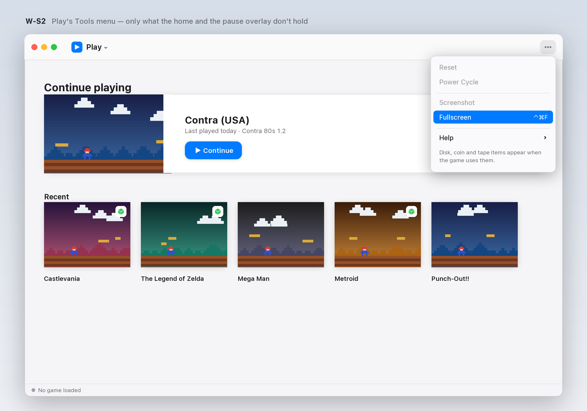

```
                                                       ┌──────────────────────┐
                                                       │ Reset                │
                                                       │ Power Cycle          │
                                                       │ ⟨FDS / VS / barcode /│
                                                       │  tape, if the game   │
                                                       │  uses them⟩          │
                                                       ├──────────────────────┤
                                                       │ Screenshot           │
                                                       │ Fullscreen      ⌃⌘F  │
                                                       ├──────────────────────┤
                                                       │ Help              ▸  │
                                                       └──────────────────────┘
```

**One place per door** (ADR-0250 Decision 1). The menu holds only what the
door's own screens don't: in Play, *Open a ROM…* and the recents live on the
home (W-P1/W-P2), and Pause, Save states, Pack, Enhancements, Cheats,
Settings and Quit game on the pause overlay (W-P4). Shortcuts work in every
door. On macOS *About*, *Settings…* ⌘, and *Quit* ⌘Q are in the system app
menu; elsewhere they end the menu. Classic is a door: it appears only in
the switcher (W-S3), never in a menu. Remaster's ⋯ is *Reload pack images*,
*Record Music*, Enhancement Packs and the log window (the project chip holds
the project items); Share's is *Play a Replay…*, *Record ▸*, Netplay and
Screenshot (the home holds *Record and share* and *Share a pack*).
`HdPackBuilderWindow`, the debugger, Lua and the rest of the classic menus
are in the Classic door. No task-door entry opens a classic window.

**W-S3 — Door switcher (the only place the other doors appear)**

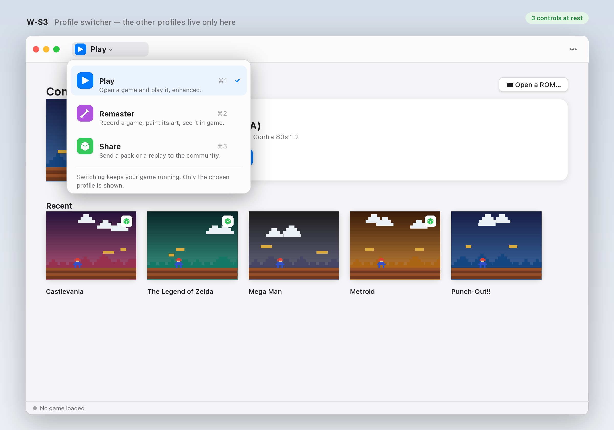

```
   [▶ Play ⌄]
   ┌──────────────────────────────────────────────┐
   │ ▶  Play                                ⌘1 ✔ │
   │    Open a game and play it, enhanced.        │
   │ ✎  Remaster                            ⌘2   │
   │ Record a game, paint its art, see it in game.│
   │ ▣  Share                               ⌘3   │
   │    Send a pack or a replay to the community. │
   │ ⚙  Classic                             ⌘4   │
   │    Every menu, debugger, Lua, HD Pack Builder.│
   ├──────────────────────────────────────────────┤
   │ Switching keeps your game running. Only the  │
   │ chosen door is shown.                        │
   └──────────────────────────────────────────────┘
```

- A popover anchored to the profile button, not a window. Picking a row
  replaces the window's content and the title bar's name; Esc or a click
  outside closes it with nothing changed.
- Each row's one-line description is the README door in the app's words, so
  the switcher teaches the model once and needs no onboarding screen.
- **Fixed order: 1. Play, 2. Remaster, 3. Share, 4. Classic** — the README's
  door order and the order a person usually meets them (plays, then repaints,
  then shares), with the full emulator last (ADR-0250). Play is the default
  door. The order never changes with the current profile, recent use or
  the loaded console; the check mark moves, the rows do not.
- Shortcuts ⌘1–⌘4 switch directly, in that order; they are printed grey
  on the rows as in a macOS menu (a hint, not a control — rule 2). Inside
  Classic, which has no shell bar, the switcher is a *Workspace* ▸ menu in
  the classic menu bar.
- Elements: 4 rows. ✔

##### 13.5.2 Play

**W-P1 — Play home, true first run (no recents)**

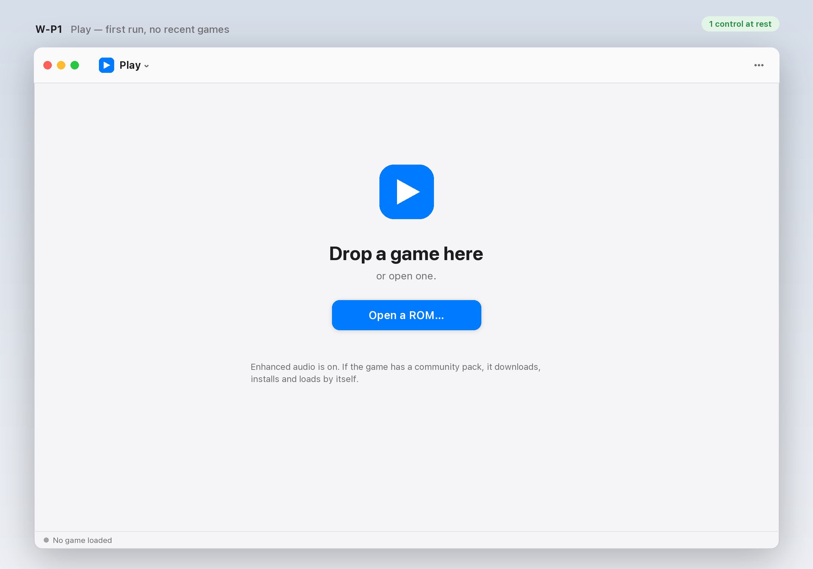

```
┌──────────────────────────────────────────────────────────────────────────────┐
│ [▶ Play ⌄]                                                               [⋯] │
├──────────────────────────────────────────────────────────────────────────────┤
│                                                                              │
│                                                                              │
│                          Drop a game here                                    │
│                          or open one.                                        │
│                     ┌────────────────────────────┐                           │
│                     │       [ Open a ROM… ]      │   ← primary               │
│                     └────────────────────────────┘                           │
│                                                                              │
│          Enhanced audio is on. If the game has a community pack,             │
│          it downloads, installs and loads by itself.                         │
│                                                                              │
│                                                                              │
├──────────────────────────────────────────────────────────────────────────────┤
│ No game loaded                                                               │
└──────────────────────────────────────────────────────────────────────────────┘
```

Replaces the Welcome card (§6.2). Elements: 1. ✔ Rule 10: the
sentence says what happens next.

**W-P2 — Play home with recents**

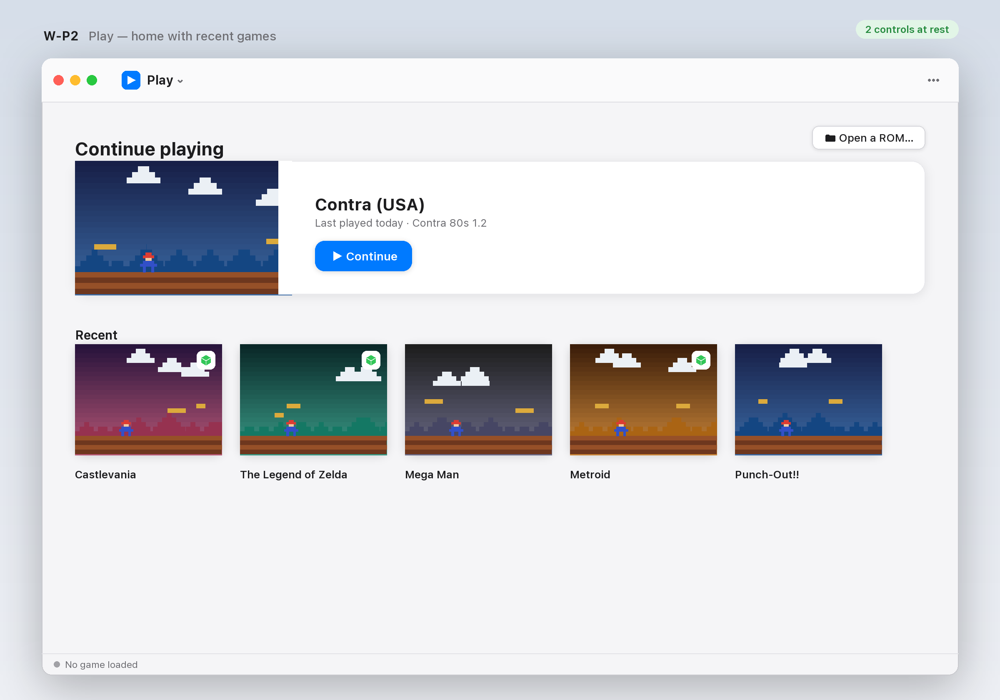

```
┌──────────────────────────────────────────────────────────────────────────────┐
│ [▶ Play ⌄]                                                               [⋯] │
├──────────────────────────────────────────────────────────────────────────────┤
│  Continue playing                                            [Open a ROM…]  │
│  ┌──────────────────────────────────────────────────────────┐                │
│  │ ░░░░░░  Contra (USA)                                     │                │
│  │ ░░░░░░  last played today · Contra 80s 1.2               │                │
│  │ ░░░░░░  [ ▶ Continue ]                                   │                │
│  └──────────────────────────────────────────────────────────┘                │
│                                                                              │
│  Recent                                                                      │
│  ┌──────────┐ ┌──────────┐ ┌──────────┐ ┌──────────┐ ┌──────────┐            │
│  │ ░░░░░░░░ │ │ ░░░░░░░░ │ │ ░░░░░░░░ │ │ ░░░░░░░░ │ │ ░░░░░░░░ │            │
│  │ ░░░░░░░░ │ │ ░░░░░░░░ │ │ ░░░░░░░░ │ │ ░░░░░░░░ │ │ ░░░░░░░░ │            │
│  │ Castlev… │ │ Zelda    │ │ Mega Man │ │ Metroid  │ │ Punch-O… │            │
│  │ 📦       │ │ 📦       │ │          │ │ 📦       │ │          │            │
│  └──────────┘ └──────────┘ └──────────┘ └──────────┘ └──────────┘            │
│                                                                              │
├──────────────────────────────────────────────────────────────────────────────┤
│ No game loaded                                                               │
└──────────────────────────────────────────────────────────────────────────────┘
```

- Continue is the primary action (today's Continue card, §6.2). 📦 on a tile
  means "a pack is installed for this game" — a glyph, no text.
  **Prerequisite (a data slice):** `RecentGameInfo` stores only `FileName`,
  `StateIndex`, `Name` and `SaveMode`, with no ROM hash and no pack lookup.
  The glyph needs the recent entry to carry the ROM's SHA1 and to be
  resolved through the same discovery the loader uses (sibling folder,
  installed catalog pack, bootstrap `auto/` — ADR-0049/0050, ADR-0146). The
  glyph is cut if that slice is not taken.
- Elements: 2 + tiles. ✔ Gamepad: tiles and the two buttons are focusable
  (today's `StateGrid` arrow navigation).

**W-P3 — Playing (bar hidden)**

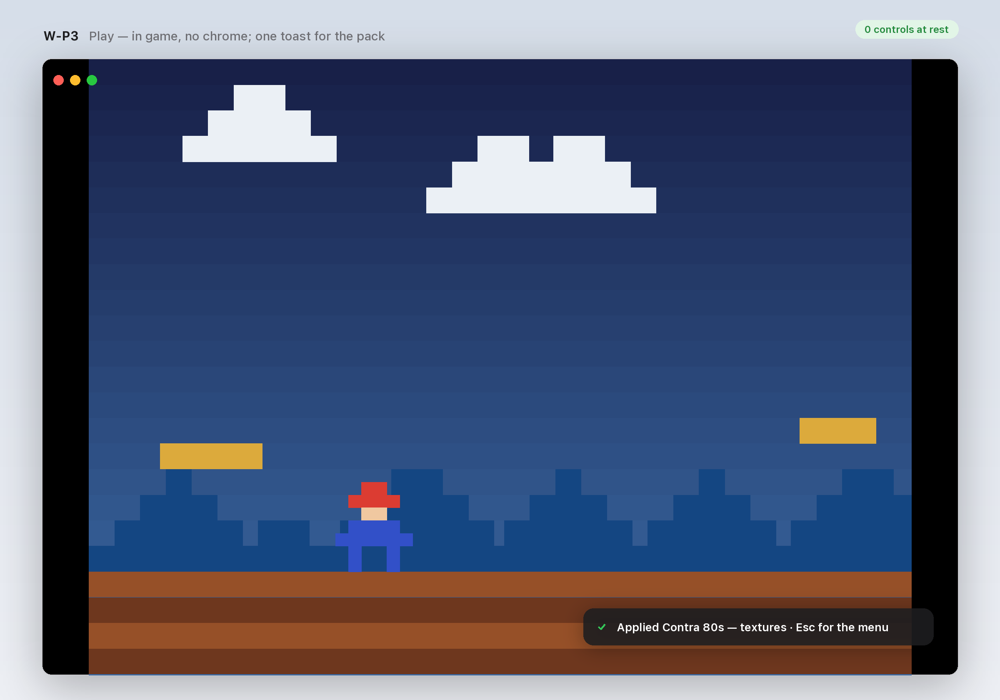

```
┌──────────────────────────────────────────────────────────────────────────────┐
│                                                                              │
│                                                                              │
│                                                                              │
│                              ⟨ game, letterboxed ⟩                           │
│                                                                              │
│                                                                              │
│                                                                              │
│                                                                              │
│                         ┌──────────────────────────────────────────────────┐ │
│                         │ Applied Contra 80s — textures · Esc for the menu │ │  ← toast, 3 s
│                         └──────────────────────────────────────────────────┘ │
└──────────────────────────────────────────────────────────────────────────────┘
```

The toast is the only pack feedback (§6). During the first three game starts
after install it ends with the way into W-P4 (ADR-0251): "· Esc for the menu"
from the keyboard, or the controller binding ("· Select+Start for the menu";
Home where the platform reports it) when a controller is connected. A game
without a pack gets the hint alone during those starts. The count is the
persisted `PlayMenuHintsShown`; a power-cycle reload is not a start. The rule
is `UI/Logic/PlayMenuHint.cs`.

**W-P4 — Pause overlay (Esc)**

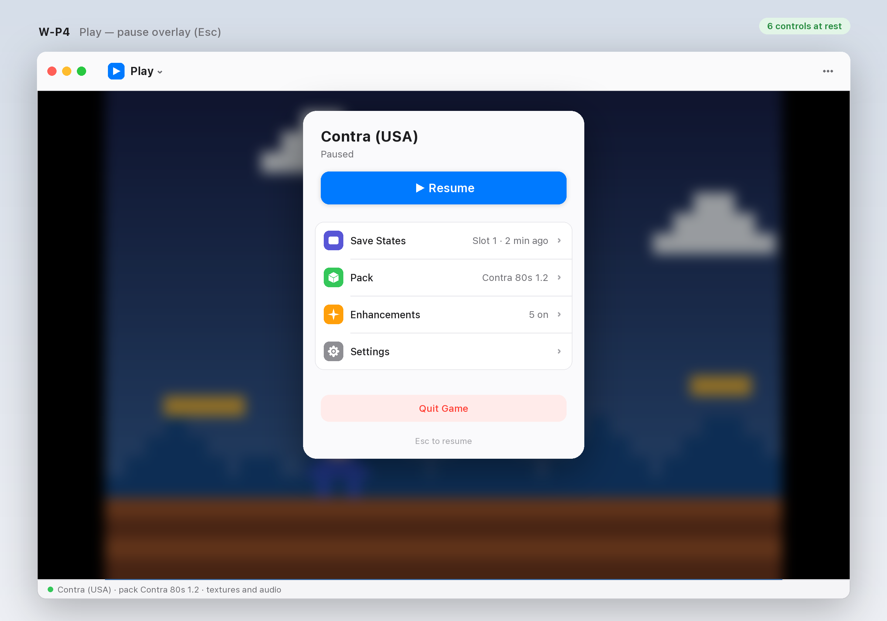

```
┌──────────────────────────────────────────────────────────────────────────────┐
│ [▶ Play ⌄]                                                               [⋯] │
├──────────────────────────────────────────────────────────────────────────────┤
│ ░░░░░░░░░░░░░░░░░░░░░░░░░░░░░ game, dimmed ░░░░░░░░░░░░░░░░░░░░░░░░░░░░░░░░ │
│ ░░░░░░░░░░░░░░░░░░░ ┌────────────────────────────────────┐ ░░░░░░░░░░░░░░░░ │
│ ░░░░░░░░░░░░░░░░░░░ │  Contra (USA)                      │ ░░░░░░░░░░░░░░░░ │
│ ░░░░░░░░░░░░░░░░░░░ │  Paused                            │ ░░░░░░░░░░░░░░░░ │
│ ░░░░░░░░░░░░░░░░░░░ │  [ ▶ Resume ]                      │ ░░░░░░░░░░░░░░░░ │
│ ░░░░░░░░░░░░░░░░░░░ │                                    │ ░░░░░░░░░░░░░░░░ │
│ ░░░░░░░░░░░░░░░░░░░ │  🎞 Save states  Slot 1 · 2 min ▸  │ ░░░░░░░░░░░░░░░░ │
│ ░░░░░░░░░░░░░░░░░░░ │  ▣ Pack          Contra 80s 1.2 ▸  │ ░░░░░░░░░░░░░░░░ │
│ ░░░░░░░░░░░░░░░░░░░ │  ✦ Enhancements           5 on ▸  │ ░░░░░░░░░░░░░░░░ │
│ ░░░░░░░░░░░░░░░░░░░ │  ★ Cheats                 2 on ▸  │ ░░░░░░░░░░░░░░░░ │
│ ░░░░░░░░░░░░░░░░░░░ │  ⚙  Settings                   ▸   │ ░░░░░░░░░░░░░░░░ │
│ ░░░░░░░░░░░░░░░░░░░ │                                    │ ░░░░░░░░░░░░░░░░ │
│ ░░░░░░░░░░░░░░░░░░░ │  [Quit game]                       │ ░░░░░░░░░░░░░░░░ │
│ ░░░░░░░░░░░░░░░░░░░ │        ⟨Esc to resume⟩             │ ░░░░░░░░░░░░░░░░ │
│ ░░░░░░░░░░░░░░░░░░░ └────────────────────────────────────┘ ░░░░░░░░░░░░░░░░ │
├──────────────────────────────────────────────────────────────────────────────┤
│ ● Contra (USA) · pack: Contra 80s 1.2 · textures+audio                       │
└──────────────────────────────────────────────────────────────────────────────┘
```

- Differences from today's overlay: *Advanced GUI* is gone (Tools ⋯ is in the
  bar, which the overlay reveals); *Exit fullscreen* moves into Settings.
  *Quit Game* changes meaning: today `OnOverlayQuit` closes the whole app;
  here it powers the game off (`PowerOff`) and lands on W-P1/W-P2 (§13.6).
  Quitting the app is Tools ⋯ › File › Exit and the OS's own ⌘Q / Alt+F4.
  Esc closes the overlay; a second Esc does nothing more (rule 8).
- Elements: Resume, Save states, Pack, Enhancements, Cheats, Settings,
  Quit = 7. ✔ (at the limit). *Cheats ▸* opens W-P11. It sits here, not
  in W-P7, because a cheat changes the game rather than the pack's
  presentation, it is reached mid-game when the player is stuck, and its
  "2 on" stays visible on every pause — the cheats that are on are recorded
  in a shared replay (W-H4). User's decision, 2026-10-02; the first draft
  had it as a W-P7 row. A new pause item now has to replace or merge one.
  Save and Load were merged into one *Save states ▸* row (user's decision,
  2026-10-02; the first draft had a slot popup plus Save and Load = 8, one
  over rule 2). The row opens today's state grid (`GameScreenMode.SaveState`
  / `LoadState`, thumbnails, 10 slots plus auto-save) as a sheet with *Save
  here* / *Load* per slot. The quick-save/quick-load shortcuts are
  unchanged, so a save is still one key; from the menu it costs one more
  click.
- The Pack row opens W-P5 when 2+ packs exist, or W-P6 to inspect the one pack.
- The Cheats row reads "none" when nothing is on. On GB/SMS it still opens
  W-P11, which offers manual entry only (rule 4: shown, with its reason).

**W-P5 — Pack picker (2+ packs for this ROM; also opens over an un-enhanced first start, §5)**

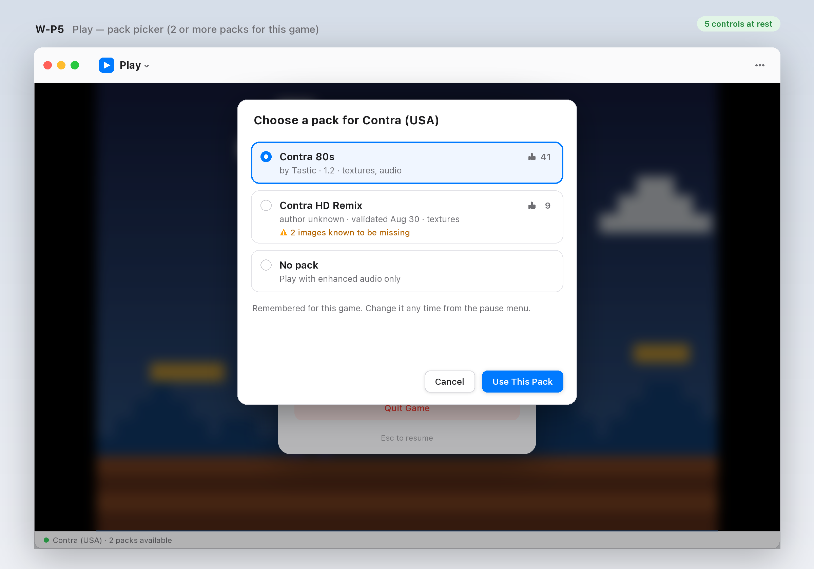

```
                     ┌──────────────────────────────────────────────┐
                     │  Choose a pack for Contra (USA)              │
                     │                                              │
                     │  (•) Contra 80s                     👍 41    │
                     │      by Tastic · 1.2 · textures, audio       │
                     │                                              │
                     │  ( ) Contra HD Remix                👍 9     │
                     │      author unknown · validated Aug 30 ·     │
                     │      textures                                │
                     │      ⚠ 2 images known to be missing          │
                     │                                              │
                     │  ( ) No pack                                 │
                     │      Play with enhanced audio only           │
                     │                                              │
                     │  Remembered for this game. Change it any     │
                     │  time from the pause menu.                   │
                     │                                              │
                     │              [Cancel]   [ Use This Pack ]    │
                     └──────────────────────────────────────────────┘
```

- Same data as §5 (name, author, version or validation date, layers, 👍 as
  sort key, known-missing note). A pack that names no author reads *author
  unknown* here; the catalog's `?` is a table convention, not a sentence. Dropped from the surface: license and the
  short `content_id` — both move to the ▸ detail in W-P6 (rule 3).
- What it does today versus here (`PlayerPackPicker.ShouldShow`): the picker
  opens only for 2+ distinct `pack_id`s with no stored choice and no sibling
  pack. *Cancel* and Esc keep today's dismissal — nothing is stored, the
  game plays un-enhanced this session and the picker asks again next
  launch. *No pack* (shipped 2026-10-03, user's go-ahead *"Implementar"*) is
  the last row whenever the picker lists a pack: it stores the explicit
  per-ROM preference `PackPreferenceResolver.NoPack` (`:none` — every
  ADR-0140 `pack_id` starts with `[a-z0-9]`, so it never names a pack). The
  next load applies it silently; the core renders no pack and applies no
  pack's ROM patch for that ROM, except a sibling-folder pack (ADR-0049, §4;
  `MepPackManager::PreferenceAllowsPack`); auto-install neither downloads nor
  raises the pill for it (ADR-0146: a user disable overrides —
  `CommunityPackAutoInstallGate`). W-P4's Pack row and the status line name
  no pack; W-P6 says "You chose to play this game without a pack" and keeps
  *Change Pack…* enabled while one pack is left to go back to. The second
  line reads the render's "Play with enhanced audio only" while enhanced
  audio is on, and "Play with the game's original art and sound" when it is
  off. Choosing a pack applies it through `ApplyPackChange` (in place where
  P.9 allows, else a power cycle).
- Elements: 3 radios + 2 buttons = 5. ✔ Gamepad: radios and buttons.

**W-P6 — Current pack detail**

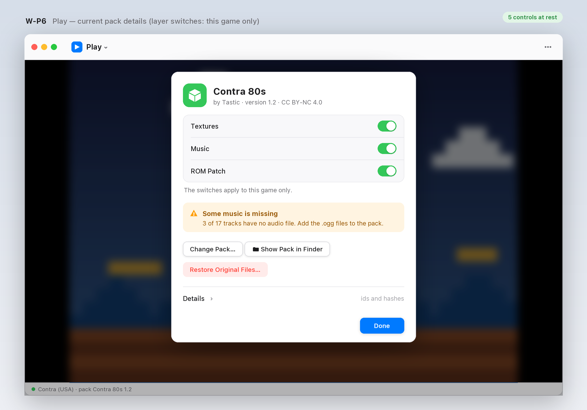

```
                     ┌──────────────────────────────────────────────┐
                     │  Contra 80s                                  │
                     │  by Tastic · version 1.2 · CC BY-NC 4.0      │
                     │  ┌────────────────────────────────────────┐  │
                     │  │ Textures                          (●)  │  │
                     │  │ Music                             (●)  │  │
                     │  │ ROM Patch                         (●)  │  │
                     │  └────────────────────────────────────────┘  │
                     │  The switches apply to this game only.       │
                     │                                              │
                     │  ⚠ Some music is missing                     │
                     │    3 of 17 tracks have no audio file. Add    │
                     │    the .ogg files to the pack.               │
                     │                                              │
                     │  [Change pack…]  [Show pack folder]          │
                     │  [Restore original files]                    │
                     │                                              │
                     │  Details ▸                ⟨ids and hashes⟩   │
                     │                                              │
                     │                                   [Done]     │
                     └──────────────────────────────────────────────┘
```

- The ⚠ line is `PackAudioNotice` (ADR-0240 Option 1) in plain words — the
  Core's string says "audio not generated", which reads as a step the user
  could run, and Option 2 (generation) is not accepted. Shown where it is
  useful, not only as a 3-second toast. No "Generate" button (Option 2 not
  accepted).
- The ⚠ line needs the notice to outlive the install: today
  `PackAudioNotice.Evaluate` runs once, at the end of an install
  (`CommunityPackInstallCoordinator`), and its text only reaches a toast.
  The slice either stores it with the install record or re-evaluates the
  pack folder when W-P6 opens (`Evaluate` is BCL-only and cheap).
- *Restore* is ADR-0147's Restore; it confirms once in place (rule 7). It is
  shown only for a pack installed from the catalog, because
  `RestoreInstalledPack` needs the install record's `SourceSha256` and
  re-downloads the archive (up to 300 MB). It therefore runs as a job with
  the W-P9 pill (rule 6). A local or sibling pack has nothing to restore
  from, so the button is absent there, not disabled.
- *Details ▸* reveals ids and hashes for the curious — the only place in Play
  they appear.
- **One place per switch** (2026-10-03, amends W-P6/W-P7; the user asked
  *"está confuso, tem como melhorar isso?"* and chose *"Pack = camadas do
  pack (Recomendado)"*): Textures and Music are **only** here, per game. W-P7
  no longer has them; its last row, *Pack: Contra 80s ›*, opens this sheet
  (W-P5 with 2+ packs, "No pack" with none). The global Textures/Music master
  switches left Player mode: they are the defaults for every game in Tools ⋯ ›
  Enhancement Packs ("Packs, every game"), and a layer whose default is off
  reads here "Off for every game — Tools ⋯ › Enhancement Packs". The UI word
  is *Music* (the OGG tracks), not *Audio*.
- **The automatic upscale** (the F5 bootstrap's `auto/rec-NNN` layer, the
  `isAutoOnly` column — the same rule as the status line's "automatic
  upscale"): nobody made it, so every surface that names the current pack
  (W-P4's Pack row, W-P7's Pack row, this title, the status line) says
  *Automatic upscale*, never the ROM's name as if it were a pack. This sheet
  shows the game's name and "Made on this computer from what you played"
  (plus the scaler, e.g. xBRZ 4×, when known) in place of the author/version
  byline, and no license. Its recorded audio (music fingerprints, MIDI) is not
  music: Music reads "Not in this pack" unless `<bgm>`/`<sfx>` tracks exist.
  A placeholder license ("unknown", "unspecified") is never shown.
- **Layer switches** (2026-10-03, the user's request: *"nessa tela tem que ter
  uma opção para desligar texturas, outra para o audio, outra para ips"*):
  the pack's Textures, Audio and ROM Patch are an inset list of switch rows
  that turn the layer off **for this game only** — stored per ROM sha1 beside
  the W-P5 pack choice (`EnhancementPackConfig.RomLayersOff`, rules in
  `UI/Logic/PackLayerSwitches.cs`) and pushed to the core
  (`MepPackManager::SetRomLayersOff`), which then serves neither the textures
  nor the audio section, drops an HDNes pack's `<bgm>`/`<sfx>` tracks, and
  applies no pack ROM patch (MEP `patches[]` or `<patch>`) on that ROM. Audio
  is present when the pack has an audio section or `<bgm>`/`<sfx>` tracks;
  ROM Patch when it wires a bundled `.ips`/`.bps`. A layer the pack lacks is
  a grey switch with "Not in this pack" (the former grey chip, rule 4); a
  layer whose global default (Tools ⋯ › Enhancement Packs: Textures, Music, ROM patch) is
  off is a grey switch with "Off for every game — Tools ⋯ › Enhancement Packs" — the global switch still
  wins. A flip applies at once through `LoadRomHelper.ApplyPackChange` (in
  place where P.9 allows: the sheet stays and the switches wait under a
  moving bar; elsewhere the game restarts, back to the game, like W-P7).
  Border keeps its global switch only (W-P7); Modern instruments (the synth)
  is W-P7's, global.
- Elements: 5 + the layer list (3 rows, each with its switch — counted as
  list rows under rule 2, like W-P11's cheat rows). ✔

**W-P7 — Enhancements panel (§6.1 minus *Hi-res filter*)**

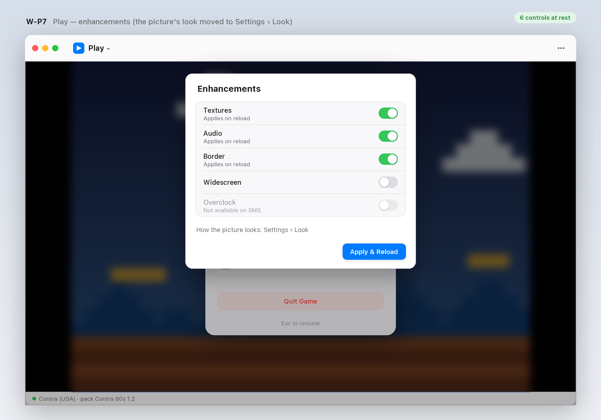

```
                     ┌──────────────────────────────────────────────┐
                     │  Enhancements                                │
                     │                                              │
                     │  [x] Modern instruments                      │
                     │  [x] Border          applies on reload       │
                     │  [ ] Widescreen                              │
                     │  [ ] Overclock       ⟨not available on SMS⟩  │
                     │  Pack: Contra 80s                          › │
                     │                                              │
                     │  How the picture looks: Settings › Look      │
                     │                                              │
                     │                            [Apply & Reload]  │
                     └──────────────────────────────────────────────┘
```

- *Hi-res filter* leaves this panel. It was a second switch for
  `VideoConfig.VideoFilter`, which already has a home in the picture
  settings; it now lives once, as Look › Pixels (W-P10, rule 12). The panel
  keeps what the *pack and the console* add — art, sound, frame, width,
  speed — and points at the place for the look of the picture.

Elements: 4 toggles + the Pack row + 1 = 6. ✔ (Cheats moved to W-P4,
2026-10-02. Textures and Audio left on 2026-10-03: one place per switch, the
pack's layers are W-P6's. *Modern instruments* is `AudioConfig.EnableEnhancedAudio`,
the same switch as Settings › Audio, and applies live with no reload; the
Pack row routes like W-P4's. Leaving by the Pack row keeps an unapplied draft
for the way back — only the one button applies it, so a look at the pack must
not throw the switches away: the switches the player flipped come back as they
set them, and the ones they left alone are re-read from what is applied, so a
switch turned elsewhere during the detour is never shown stale. Every other end
of the visit — Esc, the button, leaving the pause back to the game, another
game — reads them from what is applied.) The one
console-dependent element is shown
disabled with its reason (rule 4). The button replaces today's immediate
action on each toggle, so the player decides when the game restarts. Today
there are two different restarts: Border goes through
`ToggleLayer` → `ReloadRom`, and Overclock goes through `PowerCycle`. The
button names the bigger one that is pending: *Apply & Reload*, or *Apply &
Restart* when Overclock changed (a restart loses unsaved progress, so it
says so).
ADR-0244 (accepted, slice P.9) makes a pack change keep the player's place
(in-memory save state → reload → restore). Once P.9 passes, the button reads
*Apply*, and *Apply & Restart* only for Overclock, a pack with a ROM patch,
or while a movie, shared replay or netplay is on.

**W-P8 — Play settings (essentials)**

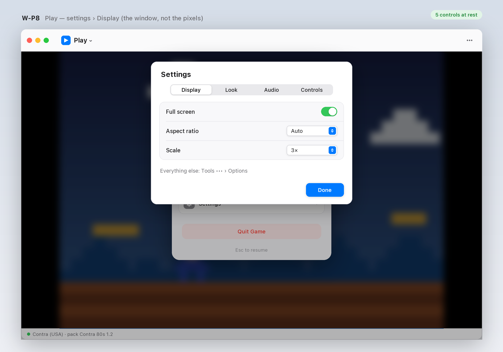

```
                     ┌──────────────────────────────────────────────┐
                     │  Settings                                    │
                     │                                              │
                     │  Display │ Look │ Audio │ Controls           │
                     │  ────────┘                                   │
                     │  Fullscreen           [x]                    │
                     │  Aspect ratio         [Auto        ▾]        │
                     │  Scale                [3×          ▾]        │
                     │                                              │
                     │  Everything else: Tools ⋯ › Options          │
                     │                                   [Done]     │
                     └──────────────────────────────────────────────┘
```

Today's `PlayerSettingsEssentials` tabs, with *Video* split in two:
**Display** is the window (size, shape, full screen) and **Look** (W-P10) is
what the pixels look like. The shader selector moves out of here into Look,
next to the filter it is usually confused with. The last line is rule 10
applied to settings. Elements: tab strip, 3 rows, Done = 5. ✔

**W-P8b / W-P8c — Settings › Audio and Controls (the same list, never the
classic pages)**

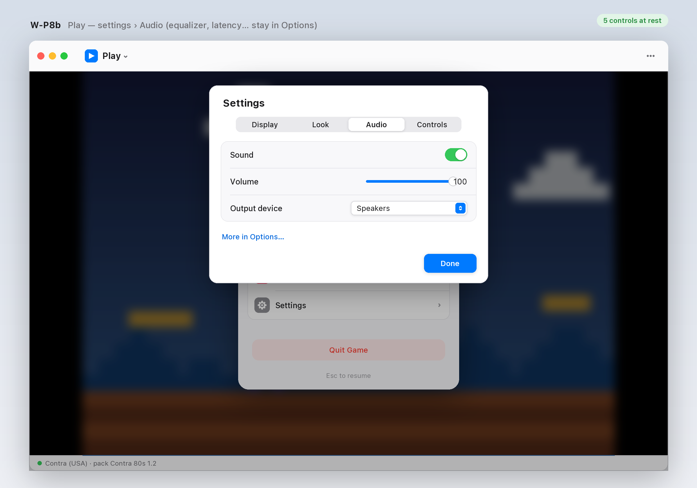


```
 Audio                                  Controls
 │  Sound            [x]            │   │  Controllers   2 controllers connected │
 │  Volume     ──────●──── 100      │   │  Rumble        ───●─────────  5        │
 │  Output device [Speakers   ▾]    │   │  Stick deadzone ──●────────  2         │
 │  More in Options…                │   │  More in Options…                      │
```

Audio and Controls follow Display's pattern exactly: one inset list of three
46 px rows in the same 340 px sheet, no scrollbars, no sub-tabs. They used to
embed the whole classic option pages (General/Equalizer/Advanced and
General/Display/Test sub-tabs, a per-console button row, two scrollbars),
which broke rule 2. **Audio** is Sound (the Enable Audio switch), Volume
(0–100) and Output device; equalizer, reverb, crossfeed, latency and sample
rate stay in Options. **Controls** is what is console-independent: which pads
are connected, Rumble strength (0 is off) and Stick deadzone; per-console
controller types and button mapping stay in Options. Every row is bound to the
same config the classic page edits, so a value set in Options (an output
device that is not enumerated now, a volume) shows as the current item and
opening the tab never rewrites it. The hint's line carries **More in
Options…**, which expands to that tab's classic page exactly as Look's
*More in Options…* does (Display keeps the hint, as it has nothing to expand
to). Elements: tab strip, 3 rows, More in Options…, Done = 6. ✔

**W-P9 — A pack installs while the game starts (a HUD pill, not a dialog)**

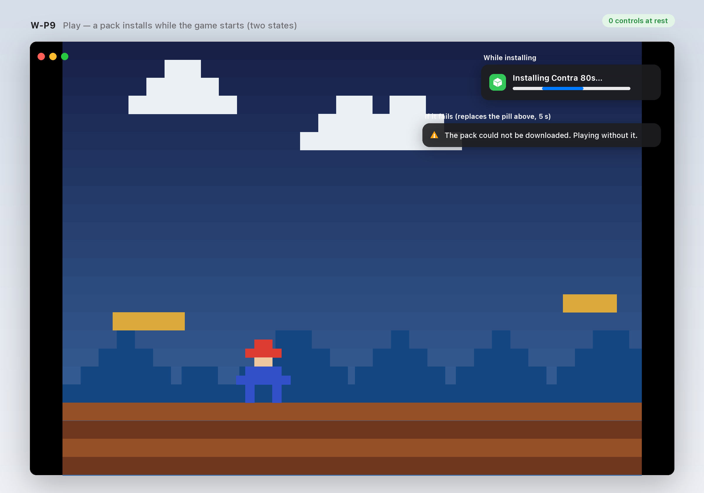

```
┌──────────────────────────────────────────────────────────────────────────────┐
│                                         ┌──────────────────────────────────┐ │
│                                         │ ▣ Installing Contra 80s…         │ │
│                                         │   ░░░░▁▁▁▁▁░░░░░░░░░░ ⟨moving⟩   │ │
│                                         └──────────────────────────────────┘ │
│                              ⟨ game, letterboxed ⟩                           │
└──────────────────────────────────────────────────────────────────────────────┘
   failure, same place, 5 s:
                     ⚠ The pack could not be downloaded. Playing without it.
```

Single-flight install (`CommunityPackInstallService`) runs while the game
plays. The bar is **indeterminate**: `RunAsync` takes no `IProgress` and
its only output today is the final `DisplayMessage`, so a percentage needs
a fetcher slice first; until then the pill never shows a number. In W-P3 the bar is hidden, so the status line is not visible; the
progress therefore rides in a HUD pill over the game and ends in the W-P3
toast. On failure: one pill sentence and nothing else; the log has the rest
(rule 6: never a window). With the overlay open the same text is in the
status line.

**W-P10 — Settings › Look: art, pixels, screen** — ADR-0246, accepted (P.13)

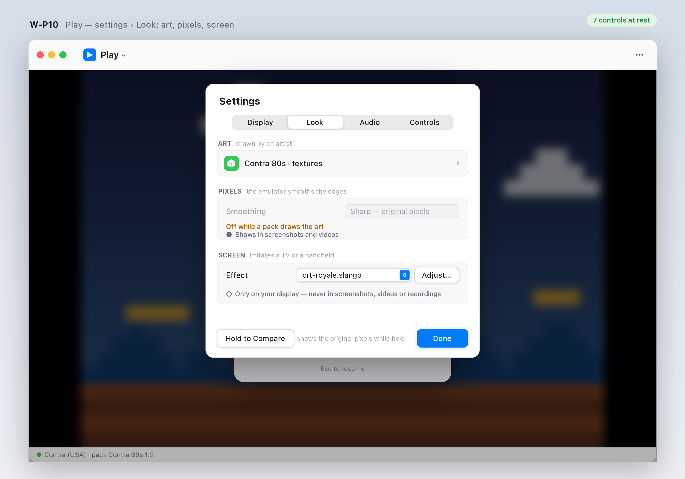

```
                     ┌──────────────────────────────────────────────┐
                     │  Settings                                    │
                     │  Display │ Look │ Audio │ Controls           │
                     │          └──────┘                            │
                     │  ART  ⟨drawn by an artist⟩                   │
                     │  ▣ Contra 80s · textures                ▸    │
                     │                                              │
                     │  PIXELS  ⟨the emulator smooths the edges⟩    │
                     │  Smoothing   [Sharp — original pixels   ▾]   │
                     │  ⟨ off while a pack draws the art ⟩          │
                     │  ⟨ ◉ shows in screenshots and videos ⟩       │
                     │                                              │
                     │  SCREEN  ⟨imitates a TV or a handheld⟩       │
                     │  Effect   [crt-royale.slangp ▾]   [Adjust…]  │
                     │  ⟨ ◌ only on your display — never in         │
                     │    screenshots, videos or recordings ⟩       │
                     │                                              │
                     │  [Hold to Compare]  ⟨shows the original      │
                     │   pixels while held⟩                 [Done]  │
                     └──────────────────────────────────────────────┘
```

Shaders and video filters are two different machines that today sit in two
places and look like one idea ("make it prettier"). Add the pack's art and
there are three things a player can mistake for each other. The tab names
them by **what they change**, in the order they are applied, and says on the
surface where each one's result goes:

| Layer | What it is, in the user's words | What it is in the code | Where the result shows |
|---|---|---|---|
| **Art** | a person repainted the game | the HD pack's textures (`HdVideoFilter`, NES; the GB/SMS equivalents) | everywhere — it *is* the frame |
| **Pixels** | the emulator smooths the blocky edges by itself | `VideoConfig.VideoFilter` scale family (HQx, xBRZ, Scale2x, 2xSaI, Prescale): CPU, in the Core's `VideoDecoder` after the console filter | screenshots and AVI/GIF videos (`VideoDecoder::TakeScreenshot` reads the filtered buffer) |
| **Screen** | imitates the glass it was played on — CRT, scanlines, handheld LCD | a RetroArch `.slangp` shader (librashader, GPU, in the renderer: ADR-0237 on macOS, upstream on Windows/Linux); also the built-in NTSC filters and `LcdGrid`, which are CPU filters | the shader: **your display only** — ADR-0237 non-goals keep it off screenshots, recordings, captures and the kit. NTSC/LcdGrid: screenshots and videos |

Rules the tab enforces, each from a measured fact rather than taste:

- **Pixels is disabled, with its reason, while a pack draws the art** — on
  every console with HD art: NES (`HdVideoFilter`) and the GB/SMS tile
  filters (the shared `HdTileVideoFilter`, `SmsHdTileVideoFilter` on SMS) alike. In the
  Core the scale filter still runs on top of `HdVideoFilter`'s output
  (`VideoDecoder.cpp` applies `_scaleFilter` after the console filter), so
  HQ4× over a 4× pack smooths the artist's work into mush and multiplies the
  frame size. Today nothing stops it. Rule 4's shape: shown, disabled,
  "Off while a pack draws the art". The Look tab never overrides it; Tools ⋯ ›
  Options still can, for the user who wants it (§13.8 Q9).
- **The NTSC choice says it does nothing over a pack.** `NesConsole::
  GetVideoFilter` returns `HdVideoFilter` whenever the pack has video
  content, so a chosen NTSC filter is silently ignored. The row shows
  "Not applied while a pack draws the art" instead of pretending.
- **A shader works over everything**, pack art included — it is the last
  step, on the GPU. That is why Screen is the layer to recommend to a player
  who wants "the TV look" on a remastered game.
- **Each choice carries its capture footnote** (◉ captured / ◌ display-only),
  because the difference that bites is "my screenshot doesn't look like my
  screen". The footnote changes with the selection: NTSC under Screen shows
  ◉, a shader shows ◌.
- **Pixels is one popup** — *Sharp — original pixels*, *Smooth — HQ4×*,
  *Smooth — xBRZ 4×*, then *More in Options…*. A value set in Options that is
  not in the short list is shown as the current item, never overwritten
  (§6.1's restore-not-clobber rule, kept).
- **Screen is one popup**, labelled *Effect* rather than *Shader* because it
  also holds the NTSC filter — *None*, *TV signal (NTSC)* (NES only, rule 4
  disabled elsewhere), two or three **named looks** bundled with the app
  (*CRT TV*, *Handheld LCD*: ADR-0237's non-goal amended 2026-10-02, license
  recorded per preset), recent shader files, *Choose a shader file…*. A
  named look is a `.slangp` like any other, so *Adjust…* works on it too.
- **Adjust…** opens the existing per-shader parameter list (`ShaderConfig`)
  as a sheet; it is disabled for *None*. Parameters never appear inline.
- **Shader not available** (librashader missing, `CheckShaderSupport()`
  false): the shader items are shown disabled with "Shaders are not
  available in this build" instead of today's hidden group (rule 4). On
  macOS with the software renderer the reason reads "Needs the Metal
  renderer — restart after changing it", because `CheckShaderSupport()` is
  cached for the process (`ConfigApi`) and `RendererPolicy` decides at
  startup.
- **Hold to Compare** shows the original pixels while held — Art stays, Pixels
  and Screen drop — so the difference is seen, not read. Feasibility item:
  swapping the shader chain may recompile it; the first slice measures the
  swap and, if it stutters, keeps the chain and bypasses it in the renderer
  for the held frames instead.

Elements: tab strip, Art row, Pixels, Screen, Adjust, Hold to Compare, Done
= 7. ✔ (at the limit)

**W-P11 — Cheats (W-P4 › Cheats)** — ADR-0245, accepted (P.10)

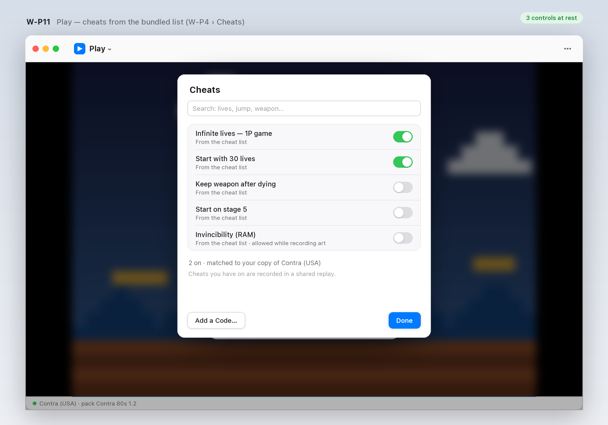

```
                     ┌──────────────────────────────────────────────┐
                     │  Cheats                                      │
                     │  [Search: lives, jump, weapon…            ]  │
                     │                                              │
                     │  Infinite lives — 1P game              [x]   │
                     │  Start with 30 lives                   [x]   │
                     │  Keep weapon after dying               [ ]   │
                     │  Start on stage 5                      [ ]   │
                     │  Invincibility (RAM)                   [ ]   │
                     │  ⟨allowed while recording art⟩               │
                     │                                              │
                     │  2 on · matched to your copy of Contra (USA) │
                     │  ⟨cheats you have on are recorded in a       │
                     │   shared replay⟩                             │
                     │  [Add a Code…]                       [Done]  │
                     └──────────────────────────────────────────────┘
```

- The list is `CheatDb.Nes.json` for the loaded ROM
  (`HashType.Sha1Cheat`). The toggles are stored in the same `CheatCodes`
  the classic cheat list uses, so both windows agree (rule 12). *Add a
  Code…* takes a code typed by hand; the full editor stays in Tools ⋯.
- Not in the list: "This copy of the game isn't in the cheat list", plus a
  search by game name. An entry picked that way is marked "made for another
  copy — may not work".
- In Remaster's game view, Game Genie entries (about 78 % of the list) show
  disabled with "Changes the game itself — not allowed while recording art"
  (ADR-0184). RAM entries (`XXXX:YY`, 22 %) stay on. As shipped (P.10):
  W-R2 has no overlay, so this applies to the sheet opened while a Remaster
  recording runs; *Record While I Play* refuses to start while a non-RAM code
  is on, naming it, and a non-RAM code turned on during the recording is held
  off the game until Stop, named on the W-R2 strip.
- GB/SMS: no list yet, so the sheet shows *Add a Code…* only, with the reason.
- An LLM never writes a code here. The later phases of ADR-0245 (search by
  intent, checked web lookup) only choose among listed or verified entries.
- Elements: search, Add a Code…, Done = 3 (+ list rows). ✔

**Edge flows (W-P12–W-P16).** Drawn 2026-10-02 after the review's group 3.
Each one replaces a modal window or a transient message that today is the
only way out of the case.

**W-P12 — First run, one sheet (replaces the setup wizard)**

**Retired 2026-10-04** by ADR-0256 Decision 8's pick (*"Tirar o wizard do caminho"*): the first run asks nothing before the main window, and the storage choice and keyboard preset are answered in Settings. The drawing stays as the design reference for the two choices and their captions.

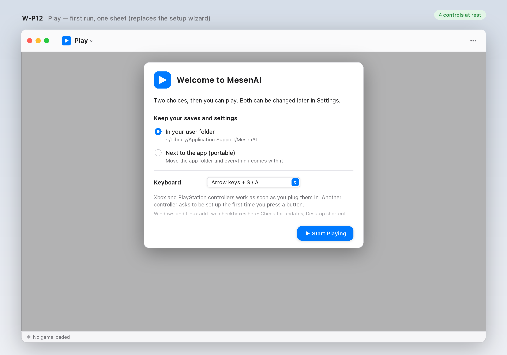

```
                     ┌──────────────────────────────────────────────┐
                     │  ▶  Welcome to MesenAI                       │
                     │  Two choices, then you can play. Both can be │
                     │  changed later in Settings.                  │
                     │                                              │
                     │  Keep your saves and settings                │
                     │  (•) In your user folder                     │
                     │      ⟨~/Library/Application Support/MesenAI⟩ │
                     │  ( ) Next to the app (portable)              │
                     │      ⟨move the app folder and everything     │
                     │       comes with it⟩                         │
                     │  ──────────────────────────────────────────  │
                     │  Keyboard   [Arrow keys + S / A        ⌄]    │
                     │  ⟨Xbox and PlayStation controllers work as   │
                     │   soon as you plug them in. Another          │
                     │   controller asks to be set up the first     │
                     │   time you press a button.⟩                  │
                     │                                              │
                     │                          [▶ Start Playing]   │
                     └──────────────────────────────────────────────┘
```

- **As delivered (2026-10-02)**, it was shown once, over W-P1, when there was
  no settings file. It replaced `SetupWizardWindow`: same choices, fewer words.
  The bullets below are the design record of that card.
  - Storage: `StoreInUserProfile`, default the user folder.
  - Keyboard: one popup over today's two exclusive checkboxes (*Arrow keys
    + S / A*, *WASD + K / J*, `KeyPresets`), default arrows as today.
  - Gamepads: today's Xbox and PlayStation presets are both applied, with
    no checkbox. They bind different devices, so turning one off only
    hides a pad the user may plug in later. A pad neither preset matches
    goes through W-P15.
- Windows and Linux added today's two checkboxes (*Check for updates*,
  *Desktop shortcut*), both on by default. The ASCII is the macOS form. Both
  went with the retirement: the update check was already inert (#672), and the
  desktop shortcut has no surface any more (ADR-0256 Decision 8).
- Esc and the close button kept the defaults and continued. There was no
  Cancel, because the app could not run without a storage choice.
- Elements: 2 radios, popup, Start Playing = 4 (6 on Windows/Linux). ✔
  Gamepad: radios, popup and button are focusable.

**W-P13 — A game needs a BIOS file**

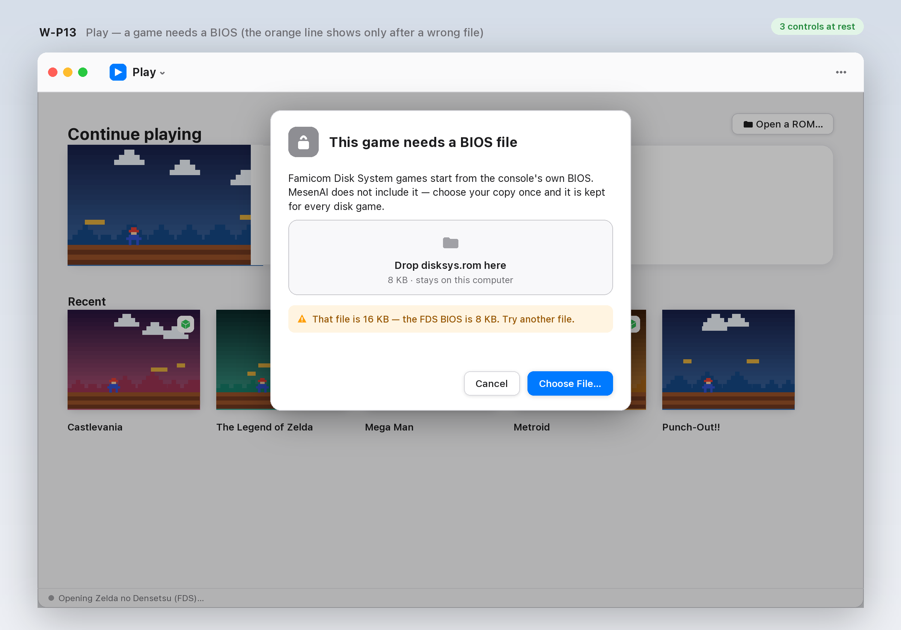

```
                     ┌──────────────────────────────────────────────┐
                     │  🔒 This game needs a BIOS file               │
                     │  Famicom Disk System games start from the    │
                     │  console's own BIOS. MesenAI does not        │
                     │  include it — choose your copy once and it   │
                     │  is kept for every disk game.                │
                     │  ┌────────────────────────────────────────┐  │
                     │  │         Drop disksys.rom here          │  │
                     │  │    ⟨8 KB · stays on this computer⟩     │  │
                     │  └────────────────────────────────────────┘  │
                     │  ⚠ That file is 16 KB — the FDS BIOS is 8 KB. │  ← only after a wrong file
                     │    Try another file.                         │
                     │                        [Cancel] [Choose File…]│
                     └──────────────────────────────────────────────┘
```

- Replaces today's `FirmwareNotFound` message box and file-dialog loop
  (`FirmwareHelper.RequestFirmwareFile`). The Core's `MissingFirmware`
  notification and `SelectFirmwareFile`'s copy into the Firmware folder are
  unchanged. Only the surface changes.
- The name, console and expected size come from `MissingFirmwareMessage`
  (`Filename`, `Firmware`, `Size`/`AltSize`). The sentence is per firmware
  type: FDS, GBA (`gba_bios.bin`, 16 KB), SMS/GG boot ROMs. A wrong size is
  an inline line (W-X2 shape), not a new dialog, and the drop zone stays.
- Cancel returns to the home with the status line "Zelda no Densetsu needs
  the FDS BIOS"; the game does not load. Nothing is downloaded or suggested
  from the web: MesenAI never points to a BIOS source.
- Elements: drop zone, Cancel, Choose File… = 3. ✔

**W-P14 — A file that does not open**

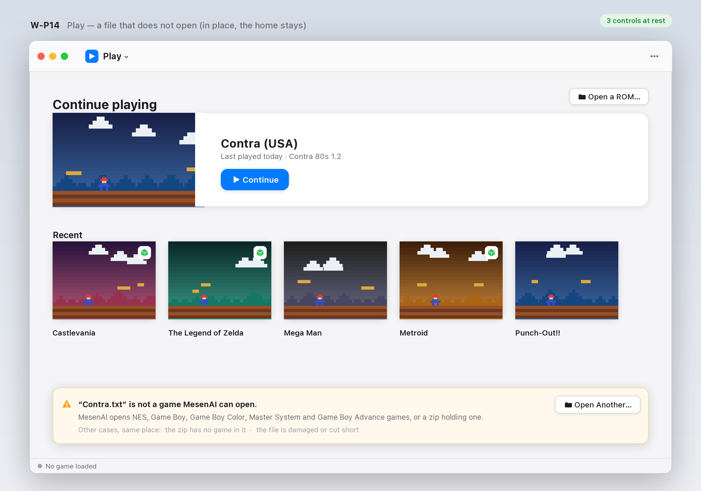

```
│  Continue playing                                            [Open a ROM…]  │
│  … (W-P2 unchanged) …                                                       │
│                                                                              │
│  ┌────────────────────────────────────────────────────────────────────────┐ │
│  │ ⚠ "Contra.txt" is not a game MesenAI can open.        [Open Another…]  │ │
│  │   MesenAI opens NES, Game Boy, Game Boy Color, Master System and       │ │
│  │   Game Boy Advance games, or a zip holding one.                        │ │
│  └────────────────────────────────────────────────────────────────────────┘ │
```

- Today the Core shows `CouldNotLoadFile` as an OSD message on the last
  frame and the UI stays where it was. The redesign puts one inline alert
  (W-X2 shape) on the home, and it stays until the next open or a click on
  ✕. The home is not replaced (rule 5).
- One sentence per cause, the same alert:
  - not a game file (`LoadRomResult::UnknownType`);
  - a zip with no game in it;
  - the file is damaged or cut short (a known console, but the loader
    failed).
  - a recent game (Continue, a recent card) whose file was moved, renamed
    or deleted (#676).
- **A zip with several games** keeps today's chooser (`SelectRomWindow`,
  which lists only game files and opens a one-game zip directly). It is
  not redrawn: the native file dialog cannot browse into a zip on macOS or
  Linux, and on Windows the files inside are not real paths, so a zip
  cannot be "a folder" without an in-app file browser. The game picked is
  stored as a recent entry with its inner file (`ResourcePath.InnerFile`),
  so it becomes an ordinary W-P2 card and is never asked again. If Play
  ever gains a game library (a ROM folder shown as cards), a zip joins it
  as a folder there — its own decision, with an ADR.
- Elements: W-P2's 2 + Open Another… = 3. ✔

**W-P15 — A controller nobody has set up**

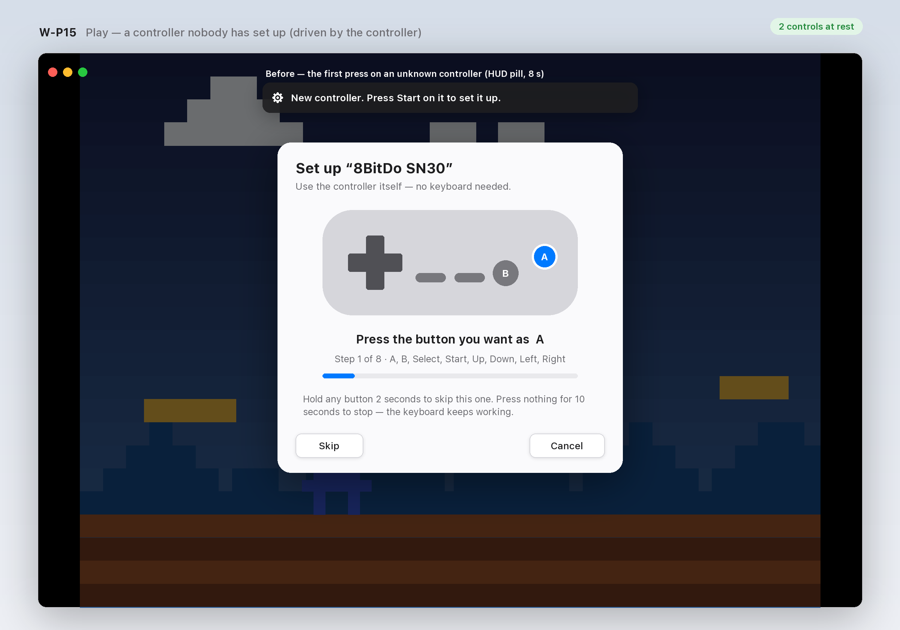

```
   ⟨first press on an unknown controller — HUD pill, 8 s⟩
   ┌──────────────────────────────────────────────────┐
   │ ⚙ New controller. Press Start on it to set it up. │
   └──────────────────────────────────────────────────┘

                     ┌──────────────────────────────────────────────┐
                     │  Set up "8BitDo SN30"                        │
                     │  Use the controller itself — no keyboard     │
                     │  needed.                                     │
                     │        ┌─────────────────────────────┐       │
                     │        │  ✚        ▬ ▬        (B) (A)│       │  ← the step's button lit
                     │        └─────────────────────────────┘       │
                     │        Press the button you want as  A       │
                     │  ⟨Step 1 of 8 · A, B, Select, Start, Up,     │
                     │   Down, Left, Right⟩                         │
                     │  ▁▁▁▁▁▁▁▁▁▁░░░░░░░░░░░░░░░░░░░░░░░░░░░░░░░   │
                     │  ⟨Hold any button 2 seconds to skip this     │
                     │   one. Press nothing for 10 seconds to stop  │
                     │   — the keyboard keeps working.⟩             │
                     │  [Skip]                            [Cancel]  │
                     └──────────────────────────────────────────────┘
```

- **The case.** A pad neither preset matches (DirectInput or generic HID on
  Windows/Linux; on macOS, a pad without `extendedGamepad`) sends keys that
  no port-1 mapping uses. Today it does nothing in game and in the menus,
  and fixing it needs the keyboard (Settings › Controls › bind each
  button). That breaks rule 9.
- **Detection rule.** The first press from a device none of whose keys
  appear in any port mapping shows the pill once per device per session.
  *Start* on that pad opens the sheet, pausing the game. Any other key
  dismisses the pill.
- **Driven by the pad being set up.** Each step lights the button on the
  picture. The first press becomes the binding, a 2-second hold skips, and
  10 seconds of silence cancel. Skip and Cancel are there for the mouse and
  keyboard too. On finish the mapping is written to port 1's
  `KeyMapping` (the first free mapping slot) and named after the device;
  the pause overlay, sheets and game take it at once.
- The picture is the NES pad for NES, the Game Boy for GB/GBC, the Master
  System pad for SMS (8 steps for NES and GB; SMS has 6, GBA 10 with L/R).
- **Prerequisite (a slice, not drawn as available):** the per-device
  "first key" event and the device name. macOS already observes
  `GCControllerDidConnectNotification`; Windows/Linux need a device id per
  key. It is checked on hardware in the input tester's pending physical-pad
  pass (Part A §4, *Host input tester*).
- Elements: Skip, Cancel = 2. ✔ Rule 9: the whole flow needs no keyboard.

**W-P16 — A pack waits for a file only you can add**

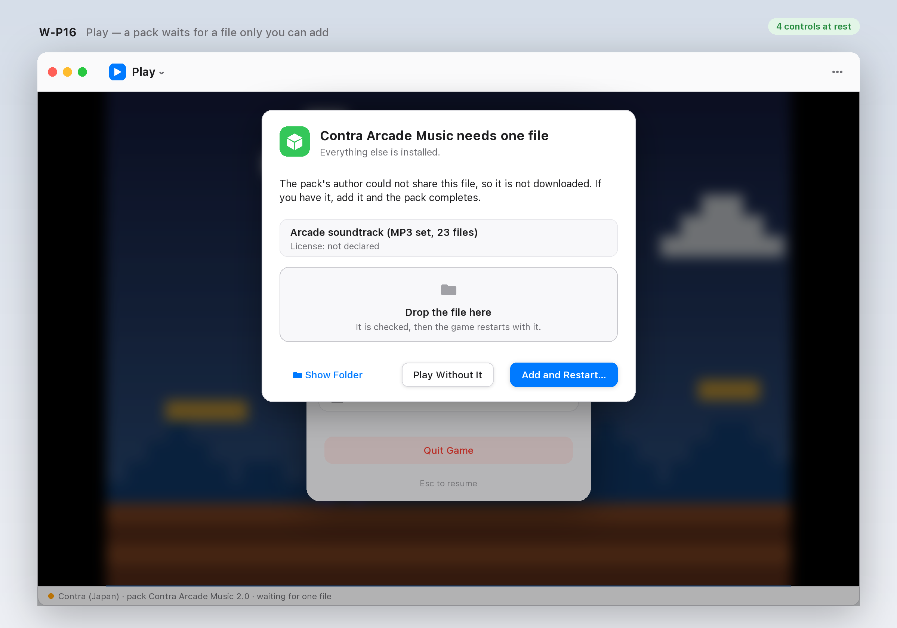

```
                     ┌──────────────────────────────────────────────┐
                     │  ▣ Contra Arcade Music needs one file        │
                     │    ⟨Everything else is installed.⟩           │
                     │  The pack's author could not share this      │
                     │  file, so it is not downloaded. If you have  │
                     │  it, add it and the pack completes.          │
                     │  ┌────────────────────────────────────────┐  │
                     │  │ Arcade soundtrack (MP3 set, 23 files)  │  │
                     │  │ ⟨License: not declared⟩                │  │
                     │  └────────────────────────────────────────┘  │
                     │  ┌────────────────────────────────────────┐  │
                     │  │          Drop the file here            │  │
                     │  │ ⟨It is checked, then the game         │  │
                     │  │  restarts with it.⟩                    │  │
                     │  └────────────────────────────────────────┘  │
                     │  [Show Folder] [Play Without It] [Add and Restart…]│
                     └──────────────────────────────────────────────┘
```

- Replaces today's OSD line "Missing file '<hints>' (licence: …) - drop it
  into <folder> and reload the ROM"
  (`CommunityPackInstallService.NotifyPendingDeps`). The data is the same
  `CommunityPackDepPrompt` (`Hints`, `License`, `DropFolder`). MEP-v1 §6
  and MEI-v1 §2.3 are unchanged: the app never fetches a `user_supplied`
  dep by itself.
- How it opens: W-P9's install pill reads "Contra Arcade Music needs one
  file · Esc", and the sheet opens from the pause overlay. W-P6 shows the
  same thing as its orange line, with *Add the File…*. The game is never
  interrupted.
- A file dropped or chosen is copied into `DropFolder` and the pack is
  re-resolved. With ADR-0244 (P.9) that applies in place; until then the
  button reads *Add and Restart*, because today only a ROM reload
  re-resolves deps (`OnGameLoaded` returns early on a power cycle, #156).
  A file whose sha256 does not match the catalog row is refused inline:
  "That is not the file this pack was made with".
- *Play Without It* closes the sheet. The pack stays partial, as today, and
  the status line says "waiting for one file".
- Elements: drop zone, Show Folder, Play Without It, Add and Restart… = 4. ✔

##### 13.5.3 Remaster

The artist's loop is three verbs. The workspace is one screen with three
zones in that order, and the screen never changes shape — zones fill in.

**W-R0 — Remaster, no project yet**

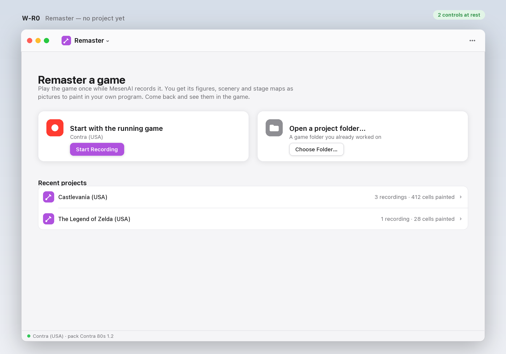

```
┌──────────────────────────────────────────────────────────────────────────────┐
│ [✎ Remaster ⌄]                                                           [⋯] │
├──────────────────────────────────────────────────────────────────────────────┤
│                                                                              │
│   Remaster a game                                                            │
│                                                                              │
│   Play the game once while MesenAI records it. You get its figures,          │
│   scenery and stage maps as pictures to paint in your own program.           │
│   Come back and see them in the game.                                        │
│                                                                              │
│   ┌──────────────────────────────────┐   ┌──────────────────────────────┐    │
│   │ ● Start with the running game    │   │ ▤ Open a project folder…     │    │
│   │   Contra (USA)                   │   │   ⟨a game folder you already │    │
│   │   [ Start Recording ]            │   │    worked on⟩                │    │
│   │                                  │   │   [Choose Folder…]           │    │
│   └──────────────────────────────────┘   └──────────────────────────────┘    │
│                                                                              │
│   Recent projects                                                            │
│   · Castlevania (USA)        3 recordings · 412 cells painted   ▸           │
│   · The Legend of Zelda (USA)  1 recording · 28 cells painted ▸             │
│                                                                              │
├──────────────────────────────────────────────────────────────────────────────┤
│ ● Contra (USA) · pack: Contra 80s 1.2                                        │
└──────────────────────────────────────────────────────────────────────────────┘
```

- *Start Recording* creates the project for the running game and starts
  recording in one click (W-R2). It is primary when a game is running; when
  none is, it reads `[ Open a ROM to Start ]` and goes to the file dialog
  (rule 10).
- "Project" = the ROM's enhancement folder (ADR-0243, accepted — slice F12.20): the
  ADR-0049 sibling `<Game>/` — or `EnhancementPacks/<Game>/` when the ROM
  folder is read-only — holding `auto/` (recordings), `mep/` (the artist's
  pack, ADR-0147), `kit/` (ADR-0183) and the `.bootstrap` stamp. No new
  format beyond ADR-0243's answers: one `auto/rec-NNN/` per recording and a
  machine-written `project.json` listing them (source: play, TAS, AI, script).
- Today the bootstrap refuses to record when anything dresses the ROM, the
  project's own `mep/` included, so a second recording would be silently
  refused. ADR-0243 Decision 3 makes the project's own layer an exception.
- Elements: 2 + rows. ✔

**W-R0b — Remaster, Python not found (feasibility state, §13.4)**

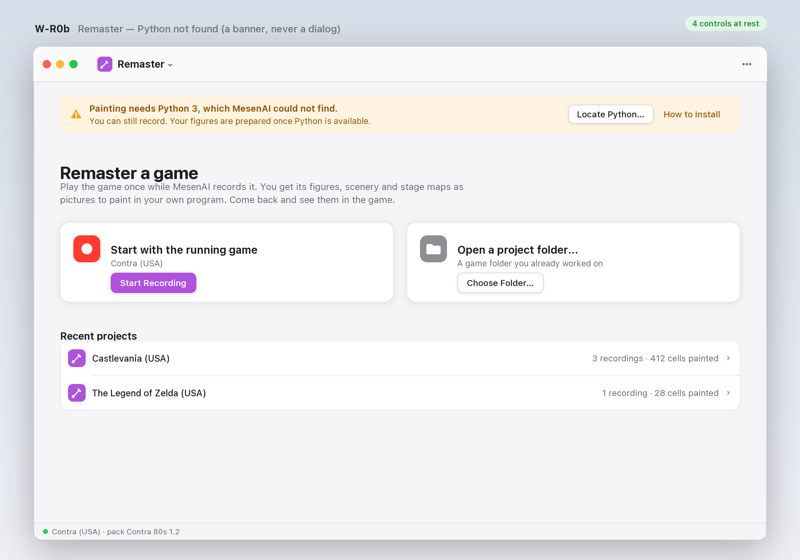

```
│  ⚠ Painting needs Python 3.10 or newer, which MesenAI could not find.        │
│    You can still record. Your figures are prepared once     [Locate Python…] │
│    Python is available.                                     [How to Install] │
```

Shown as a banner inside W-R0/W-R1 until resolved. Never a modal.
Elements: 2 in the banner + 2 of W-R0 = 4. ✔

**W-R1 — Project screen (the one Remaster screen)**

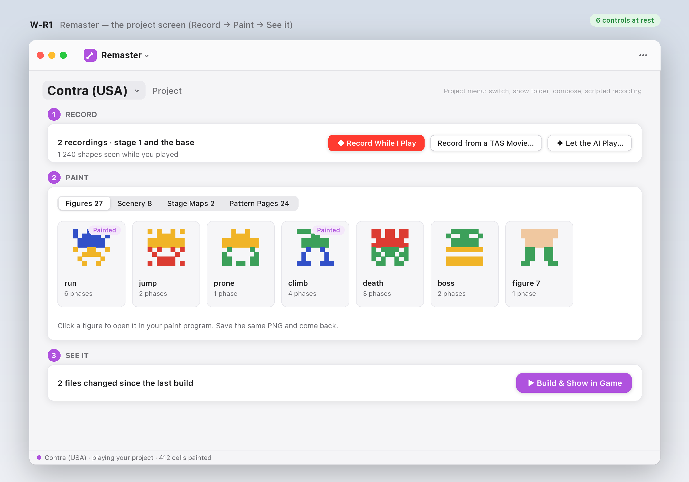

```
┌──────────────────────────────────────────────────────────────────────────────┐
│ [✎ Remaster ⌄]                                                           [⋯] │
├──────────────────────────────────────────────────────────────────────────────┤
│  [Contra (USA) ⌄]  Project                                                   │
│                                                                              │
│  ① RECORD                                                                    │
│  ┌────────────────────────────────────────────────────────────────────────┐  │
│  │ 2 recordings · stage 1 and the base · 1 240 shapes seen while you play │  │
│  │ [ ● Record while I play ]  [ Record from a TAS movie… ] [ Let the AI play… ]│  │
│  └────────────────────────────────────────────────────────────────────────┘  │
│                                                                              │
│  ② PAINT                                                                     │
│  ┌────────────────────────────────────────────────────────────────────────┐  │
│  │  Figures (27)   Scenery (8)   Stage maps (2)   Pattern pages (24)      │  │
│  │  ┌──────┐ ┌──────┐ ┌──────┐ ┌──────┐ ┌──────┐ ┌──────┐ ┌──────┐        │  │
│  │  │ ▓▓▓▓ │ │ ▓▓▓▓ │ │ ▓▓▓▓ │ │ ▓▓▓▓ │ │ ▓▓▓▓ │ │ ▓▓▓▓ │ │ ▓▓▓▓ │  …     │  │
│  │  │ ▓▓▓▓ │ │ ▓▓▓▓ │ │ ▓▓▓▓ │ │ ▓▓▓▓ │ │ ▓▓▓▓ │ │ ▓▓▓▓ │ │ ▓▓▓▓ │        │  │
│  │  │ run  │ │ jump │ │ prone│ │ climb│ │ death│ │ boss │ │fig 7 │        │  │
│  │  │ 6 ph │ │ 2 ph │ │ 1 ph │ │ 4 ph │ │ 3 ph │ │ 2 ph │ │ 1 ph │        │  │
│  │  │ ✎    │ │      │ │      │ │ ✎    │ │      │ │      │ │      │        │  │
│  │  └──────┘ └──────┘ └──────┘ └──────┘ └──────┘ └──────┘ └──────┘        │  │
│  │  Click a tile to open it in your paint program. Save it as the same    │  │
│  │  PNG and come back.                                                     │  │
│  └────────────────────────────────────────────────────────────────────────┘  │
│                                                                              │
│  ③ SEE IT                                                                    │
│  ┌────────────────────────────────────────────────────────────────────────┐  │
│  │ 2 files changed since the last build.          [ ▶ Build & show in game ]│ │
│  └────────────────────────────────────────────────────────────────────────┘  │
├──────────────────────────────────────────────────────────────────────────────┤
│ ● Contra (USA) · playing your project · 412 cells painted                    │
└──────────────────────────────────────────────────────────────────────────────┘
```

- Zone ① is the **bootstrap recorder** (ADR-0243, accepted — slice F12.20):
  `StartRecordHdPack` with screen capture on, the only path that writes the
  `sheets/`, `poses.json` and `adjacency.json` the kit reads. It is started
  and stopped by the user here, rather than running by itself on load. The
  HD Pack Builder window writes no sheets, and the live recorder only feeds
  `record_viewer.py`, so neither feeds this screen. TAS is
  `headless_record bootstrap movie=…` (ADR-0185) run as a job into the same
  project; `headless_record` ships only in the macOS arm64 zip today, so
  elsewhere the button is disabled with "Not in this build". *Let the AI play…* (W-R8, ADR-0242, slice F14.20) runs
  ADR-0238's search + Jev harness as a job under the user's own key; it is
  disabled with a reason when the game has no RAM map. Scripted route/cheat drivers stay in `scripts/`
  (they need authored files) — reachable from the project menu, not shown.
- The **project menu** is the title `Contra (USA) ⌄`: *Switch Project…*,
  *Show Project Folder*, *Compose a Scene…* (W-R7), *Scripted Recording…*.
  One button holds what would otherwise be four (rule 2).
- Zone ② is the ADR-0183 kit, in its reading order. A tile is a figure
  (`mep_figure.py export`), a scenery sheet, a stitched map or a page.
  Captions come from `names.json` › inferred `label` › id (ADR-0209 Q1) — the
  `figure 7` tile (`fig 7` in the ASCII, for width) has neither a name nor an
  inferred label, so it shows its id.
  `✎` = painted (the *Painted* badge in the PNG). Every figure was seen while
  recording; a cell completed from the ROM (`fill`, `seen: false`, ADR-0183
  §3 / ADR-0219) exists only on pattern pages and is shown dimmer there,
  never hidden (W-R5).
- Clicking a tile exports if needed and opens the PNG with the OS default
  (`open`/`xdg-open`/`ShellExecute` — ADR-0209 Consequences names this as
  the first user-configured launch; a slice records it). The `.ora` twin
  (ADR-0220) is **not** offered on this screen. While ADR-0220's stop
  condition 2 is open (GIMP and Krita open it with the base layer active),
  the flat PNG is the only path shown. The layered copy stays reachable
  from Tools ⋯ for the artist who wants it (user's decision, 2026-10-02).
- Zone ③ is one button that runs `mep_figure.py import` for changed figures,
  `mep_build.py build`, `mep_lint.py`, then `RequestMepImageReload`
  (ADR-0212) — or, when the build changed the manifest, reopens the ROM at
  the same save state (ADR-0209 constraint 3). The user sees one progress
  card (W-R3) and then the game.
- *The game* here is shown **inside Remaster** (rule 11): the project screen
  gives way to the running game full-window, with one HUD pill
  "✎ Remaster · Esc returns to the project". Esc goes back to W-R1, not to
  Play's pause overlay; Play's controls (slots, pack picker, Quit) are not
  on this screen. Recording (W-R2) uses the same game view.
- When the last build is clean, zone ③ adds a plain link
  *Share this project — opens Share*, the one cross-profile link in
  Remaster; it switches the profile to Share and lands on W-H3 (rule 11).
- Elements at rest: project menu, Record, Record from TAS, Let the AI
  play, the category strip, Build = 6. ✔ (5 before W-R8 was added.) (The first count, 8, took the strip as four elements
  and *Switch project* and the folder link as two; rule 2 now counts a strip
  once and the folder moved into the project menu.)

**W-R2 — Recording in progress (the game fills the window, inside Remaster)**

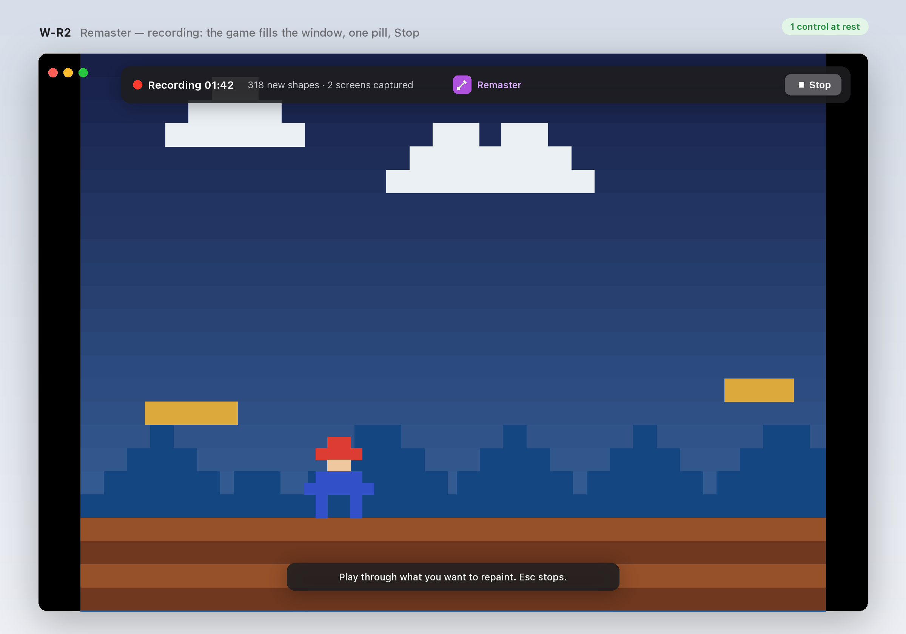

```
┌──────────────────────────────────────────────────────────────────────────────┐
│ ┌──────────────────────────────────────────────────────────┐                 │
│ │ ✎ Remaster ● 01:42 · 318 new shapes · 2 screens captured │        [■ Stop] │
│ └──────────────────────────────────────────────────────────┘                 │
│                                                                              │
│                              ⟨ game, letterboxed ⟩                           │
│                                                                              │
│              ⟨Play through what you want to repaint. Esc stops.⟩             │
└──────────────────────────────────────────────────────────────────────────────┘
```

The game fills the window — you cannot record what you cannot see — with
one HUD pill and Stop. This is Remaster's game view (W-R1 notes), not Play:
no pause overlay, no slots. Esc or Stop ends the recording, returns to W-R1
and runs the kit generators as a job (W-R3), which refreshes zone ②.
Switching profile does not stop the recording; the title-bar profile button
carries a red dot meanwhile (§13.6). Elements: Stop = 1. ✔

**W-R3 — Job card (shared by Stop, Build & show, TAS and AI recording)**

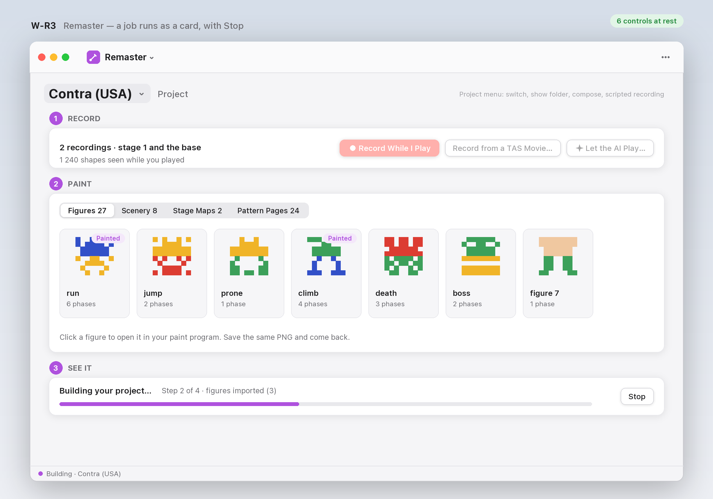

```
│  ┌────────────────────────────────────────────────────────────────────────┐  │
│  │ Building your project…  step 2 of 4 · figures imported (3)             │  │
│  │ ▁▁▁▁▁▁▁▁▁▁▁▁▁▁▁▁▁▁▁▁▁▁▁▁▁▁▁░░░░░░░░░░░░░░░░░░░░░░░░░░░░░░░░░░░░░░░░░░░ │  │
│  │                                                        [ Stop ]        │  │
│  └────────────────────────────────────────────────────────────────────────┘  │
```

Rule 6. The card replaces the Build button in zone ③; zones ① and ② stay
usable, but the three record buttons (*Record*, *Record from a TAS Movie…*,
*Let the AI Play…*) are disabled while a build runs. On success the card
collapses to one line (`Built · no problems · showing in game`) for 5 s. On
failure, W-R4. Elements: project menu, Record (disabled), TAS (disabled), AI (disabled),
strip, Stop = 6. ✔

**W-R4 — Build problems (inline, replaces the job card)**

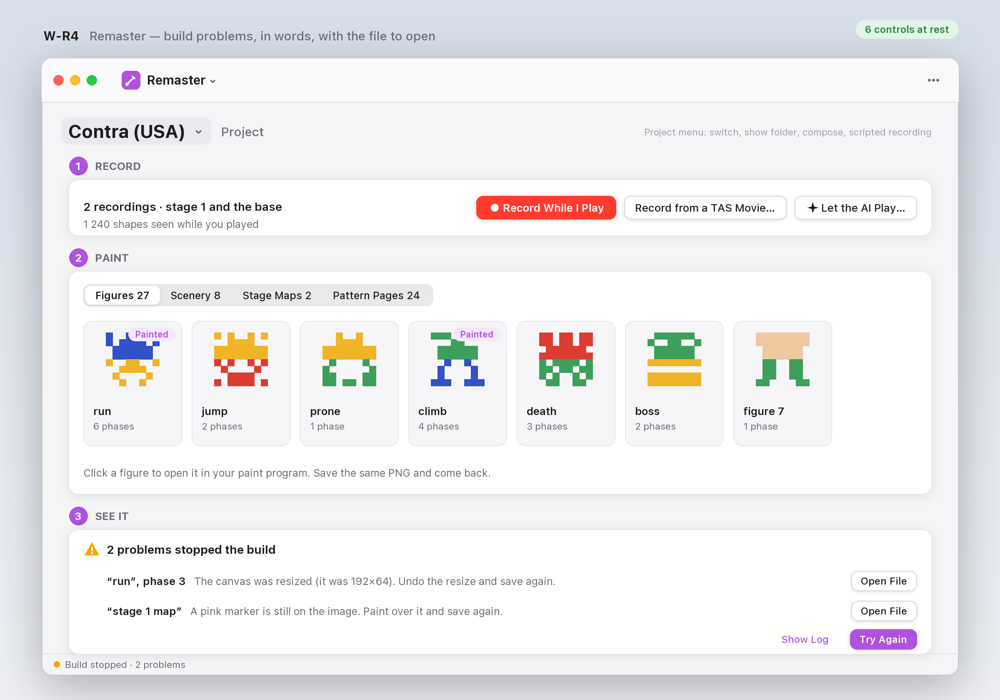

```
│  ┌────────────────────────────────────────────────────────────────────────┐  │
│  │ ⚠ 2 problems stopped the build.                                        │  │
│  │ · "run" phase 3 — the canvas was resized (was 192×64). Undo the        │  │
│  │   resize and save again.                                [Open file]    │  │
│  │ · "stage 1 map" — a pink marker is still on the image. Paint over it   │  │
│  │   and save again.                                       [Open file]    │  │
│  │                                           [Show log]  [ Try again ]    │  │
│  └────────────────────────────────────────────────────────────────────────┘  │
```

Each `mep_lint`/`mep_build` error is rewritten against the surface's
caption, in words, with the file to open. A problem without a translation
shows the raw line under *Show log* — never on the surface (rule 3).
Elements: project menu, Record, TAS, strip, Show log, Try again = 6 (each
problem's *Open file* is a row action). ✔

**W-R5 — Provenance badges (hover/▸ on a tile; the honesty surface)**

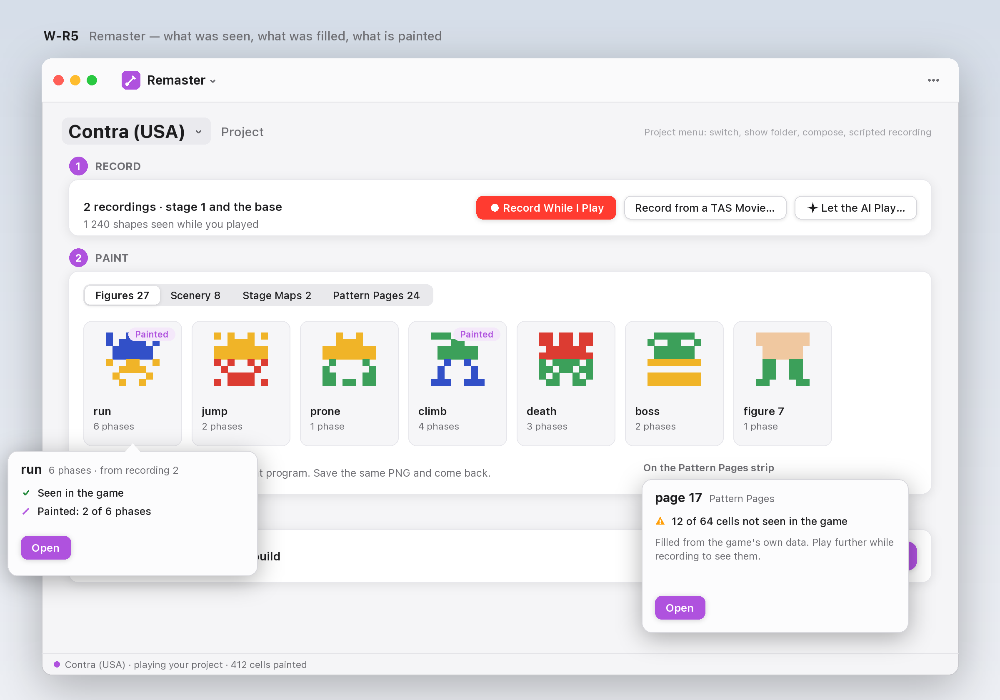

```
                 ┌──────────────────────────────────────┐
                 │ "run" · 6 phases · from recording 2  │
                 │ ✔ Seen in the game                    │
                 │ ✎ Painted: 2 of 6 phases              │
                 │ [Open]                                │
                 └──────────────────────────────────────┘

                 ┌──────────────────────────────────────┐
                 │ page 17 · Pattern Pages               │
                 │ ⚠ 12 of 64 cells not seen in the game │
                 │ Filled from the game's own data. Play │
                 │ further while recording to see them.  │
                 │ [Open]                                │
                 └──────────────────────────────────────┘
```

The first popover is on a figure (Figures strip), the second on a pattern
page (Pattern Pages strip); the PNG shows both side by side. Per-recording
provenance (ADR-0194), `seen`/`fill` (ADR-0219: only pages carry fill — a
static kit has no figures or maps), and — when
the project was imported against a patched ROM — a banner across zone ②:
`This project paints a patched version of the game. New recordings will not
connect to it.` (ADR-0198 §3).

**W-R6 — Import an existing pack as a project (from W-R0 *Open a project folder…* when the folder is a legacy pack)**

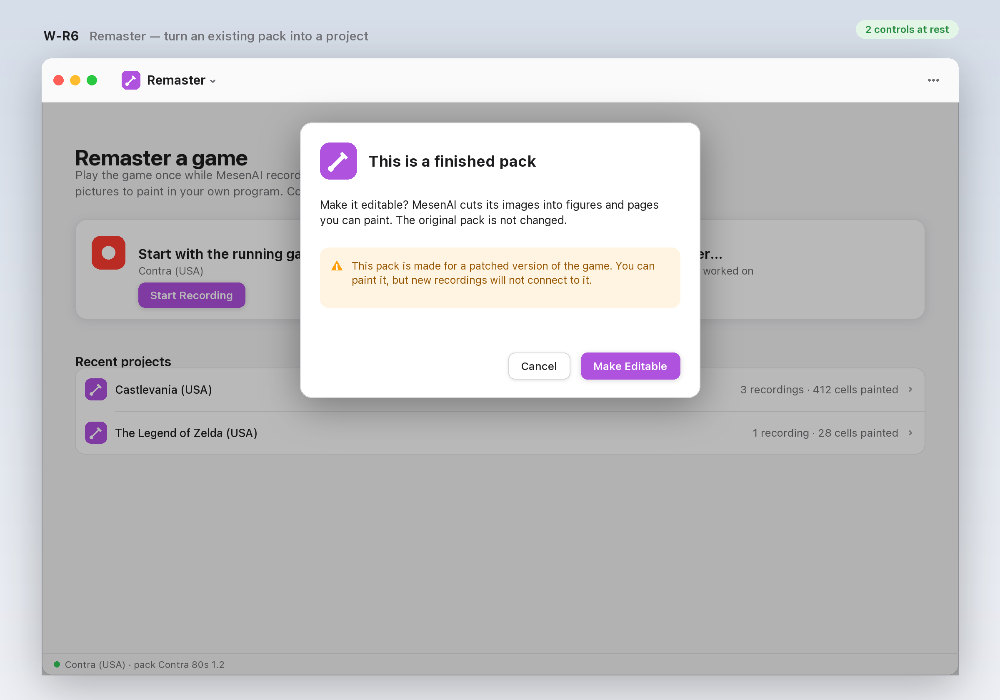

```
                     ┌──────────────────────────────────────────────┐
                     │  This is a finished pack                     │
                     │                                              │
                     │  Make it editable? MesenAI cuts its images   │
                     │  into figures and pages you can paint. The   │
                     │  original pack is not changed.               │
                     │                                              │
                     │  ⚠ This pack is made for a patched version   │
                     │    of the game. You can paint it, but new    │
                     │    recordings will not connect to it.        │
                     │                                              │
                     │              [Cancel]   [ Make editable ]    │
                     └──────────────────────────────────────────────┘
```

`mep_import.py` (ADR-0198 §1/§3) as a job; the ⚠ paragraph appears only in
the §3 case. Refusals are per rule, each citing the `hires.txt` line it
stopped at, so a refused import shows them as a list in the W-R4 shape
(one plain sentence per rule, *Show line* per row) and no *Make editable*
button. Elements: 2. ✔

**W-R7 — Composition editor hand-off (project menu › Compose a Scene…)**

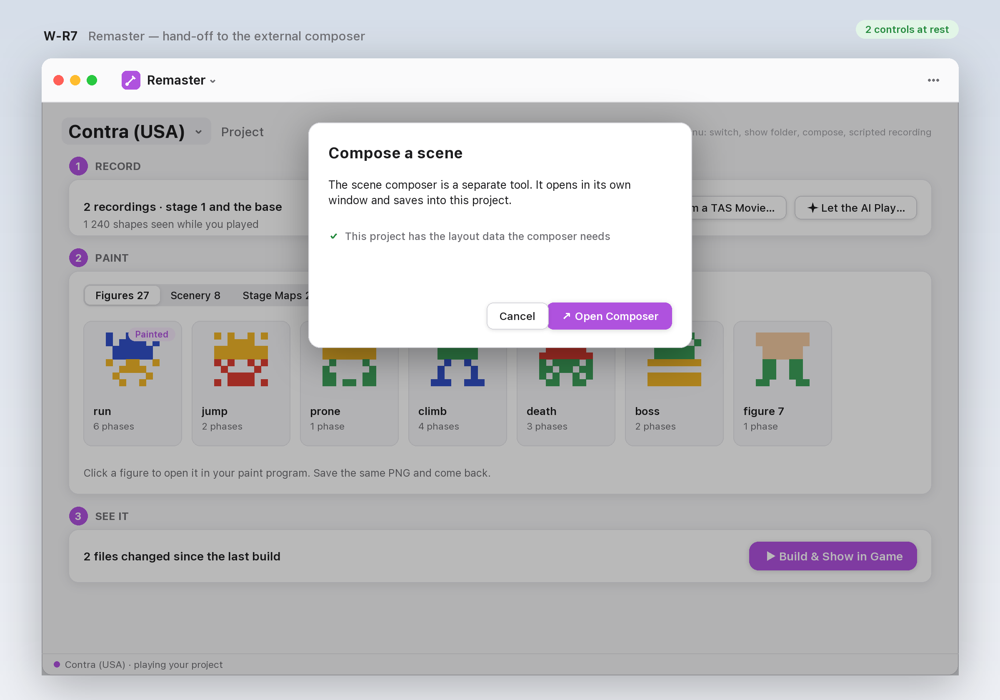

```
                     ┌──────────────────────────────────────────────┐
                     │  Compose a scene                             │
                     │                                              │
                     │  The scene composer is a separate tool. It   │
                     │  opens in its own window and saves into this │
                     │  project.                                    │
                     │                                              │
                     │  ✔ This project has the layout data the      │
                     │    composer needs                            │
                     │                                              │
                     │              [Cancel]   [ Open Composer ↗ ]  │
                     └──────────────────────────────────────────────┘
```

Launches `scripts/compose_editor.py <project>` as a child process. It is
**not** embedded (ADR-0165). When `adjacency.json` is missing the hint reads
"Record again to get the layout data", and the button is disabled (rule 4
by analogy). Elements: 2. ✔

**W-R8 — Let the AI play (W-R1 › Let the AI Play…)** — ADR-0242, accepted (slices F14.19, F14.20)

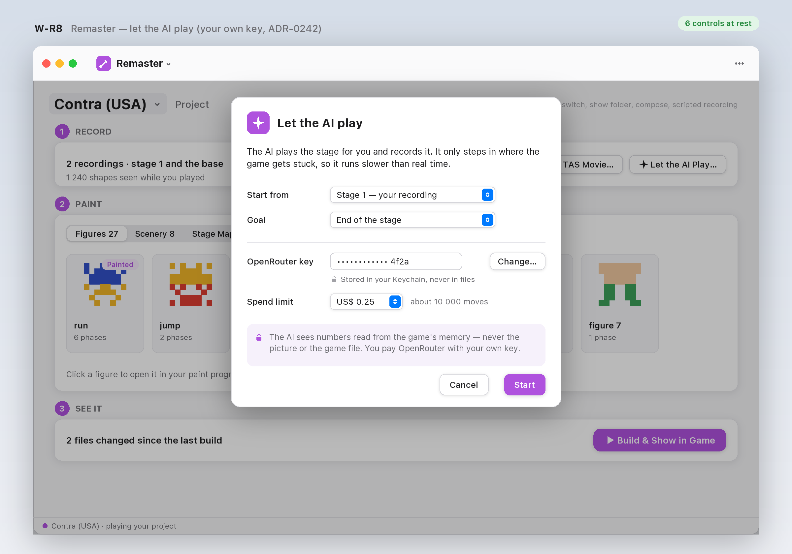

```
                     ┌──────────────────────────────────────────────┐
                     │  Let the AI play                             │
                     │                                              │
                     │  The AI plays the stage for you and records  │
                     │  it. It only steps in where the game gets    │
                     │  stuck, so it runs slower than real time.    │
                     │                                              │
                     │  Start from   [Stage 1 — your recording ▾]   │
                     │  Goal         [End of the stage ▾]           │
                     │                                              │
                     │  OpenRouter key  •••••••••••• 4f2a [Change…] │
                     │  ⟨stored in your Keychain, never in files⟩   │
                     │  Spend limit  [US$ 0.25 ▾] ⟨≈ 10 000 moves⟩  │
                     │                                              │
                     │  🔒 The AI sees numbers read from the game's  │
                     │     memory — never the picture or the game   │
                     │     file. You pay OpenRouter with your key.  │
                     │                                              │
                     │                       [Cancel]  [ Start ]    │
                     └──────────────────────────────────────────────┘
```

- Runs `jev_harness.py` (ADR-0238 §3) as a job on the W-R3 card:
  `AI playing · stage 1 · 2 stuck spots passed · US$ 0.004 · [Stop]`. The
  game is not shown live — the emulator pauses while the AI decides.
- On finish, the produced `<n>f <buttons>` script is replayed by the
  ordinary recorder (no AI call) and lands in zone ① as one more
  recording (ADR-0238 §4). A give-up reads "Stopped at stage 1, x 2 859 —
  record that part yourself", never as an error.
- No key yet: the key row is *[Paste Key…]* plus *Get a key at
  openrouter.ai ↗*, and *Start* is disabled until a key is saved. A
  402/429 reads "Your key is out of credit", never as a crash.
- Where the key lives is ADR-0242 Q1 (recommended: the OS credential
  store). It never reaches `settings.json`, logs, `runs/` or a command
  line.
- Elements: Start from, Goal, Change…, Spend limit, Cancel, Start = 6. ✔
- Drawn on the Contra project for continuity with W-R1. Today Contra has
  no `ram-map.json`, so on this project the button would be disabled with
  "No AI map for this game yet" — `mm3/`, `ninjagaiden/`, `castlevania/` and
  `megaman2/` have one, the last two from F14.19 (ADR-0242 Q2).

##### 13.5.4 Share

**W-H1 — Share home**

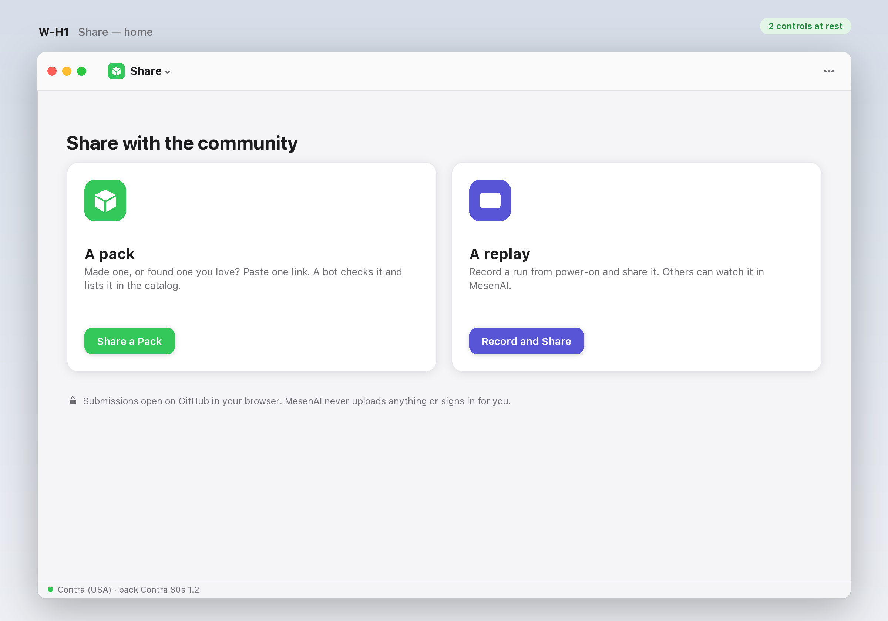

```
┌──────────────────────────────────────────────────────────────────────────────┐
│ [▣ Share ⌄]                                                              [⋯] │
├──────────────────────────────────────────────────────────────────────────────┤
│                                                                              │
│   Share with the community                                                   │
│                                                                              │
│   ┌──────────────────────────────────┐  ┌──────────────────────────────────┐ │
│   │ 📦 A pack                        │  │ 🎞 A replay                       │ │
│   │                                  │  │                                  │ │
│   │ Made one, or found one you love? │  │ Record a run from power-on and   │ │
│   │ Paste one link. A bot checks it  │  │ share it. Others can watch it in │ │
│   │ and lists it in the catalog.     │  │ MesenAI.                         │ │
│   │                                  │  │                                  │ │
│   │ [ Share a pack ]                 │  │ [ Record and share ]             │ │
│   └──────────────────────────────────┘  └──────────────────────────────────┘ │
│                                                                              │
│   Submissions open on GitHub in your browser. MesenAI never uploads          │
│   anything or signs in for you.                                              │
│                                                                              │
├──────────────────────────────────────────────────────────────────────────────┤
│ ● Contra (USA) · pack: Contra 80s 1.2                                        │
└──────────────────────────────────────────────────────────────────────────────┘
```

Two cards, two pipelines (ADR-0205 keeps them apart). Elements: 2. ✔ The
closing sentence is the trust boundary, stated once.

**W-H2 — Share a pack (one screen, three fields)**

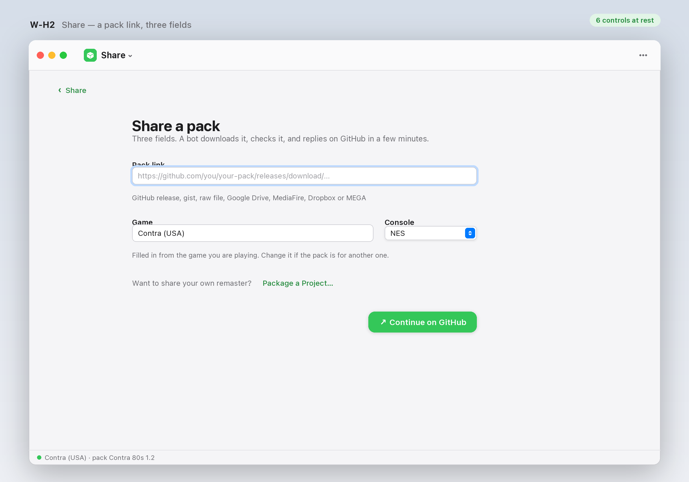

```
┌──────────────────────────────────────────────────────────────────────────────┐
│ [▣ Share ⌄]                                                              [⋯] │
├──────────────────────────────────────────────────────────────────────────────┤
│  ‹ Share                                                                     │
│                                                                              │
│   Share a pack                                                               │
│   ⟨Three fields. A bot downloads it, checks it, and replies on GitHub in a    │
│    few minutes.⟩                                                             │
│   Pack link                                                                  │
│   ┌────────────────────────────────────────────────────────────────────┐     │
│   │ https://github.com/<user>/<repo>/releases/download/…               │     │
│   └────────────────────────────────────────────────────────────────────┘     │
│   ⟨ GitHub release, gist, raw file, Google Drive, MediaFire, Dropbox, MEGA ⟩ │
│                                                                              │
│   Game                                     Console                           │
│   ┌──────────────────────────────┐         ┌──────────────┐                  │
│   │ Contra (USA)                 │         │ NES        ▾ │                  │
│   └──────────────────────────────┘         └──────────────┘                  │
│   ⟨ filled from the running game — change it if the pack is for another ⟩    │
│                                                                              │
│   Want to share your own remaster?  [Package a Project…]                     │
│                                                                              │
│                                              [ Continue on GitHub ↗ ]        │
├──────────────────────────────────────────────────────────────────────────────┤
│ ● Contra (USA) · pack: Contra 80s 1.2                                        │
└──────────────────────────────────────────────────────────────────────────────┘
```

- Exactly the Issue Form's three fields, same labels in spirit; the button
  builds the pre-filled `issues/new?template=community-pack.yml&…` URL (the
  `ReplayShare.BuildIssueUrl` pattern) and opens the browser. Confirmation is
  the click itself plus the ↗ glyph (rule 7).
- Host hint lists only `scripts/pack_host_allowlist.json` hosts; a link on
  another host shows an inline `⟨ this host isn't accepted — see the list ⟩`
  before the user leaves the app.
- No ROM required: Game/Console are plain text and a dropdown, prefilled when
  a game runs.
- "I found this pack" is the default framing; authorship is read off the pack
  by CI, never asked here.
- *Package a Project…* stays inside Share (rule 11): it lists the projects
  Remaster knows and opens W-H3 for the one picked. It never jumps to the
  Remaster profile.
- Elements: ‹ Share, 3 fields, *Package a Project…*, Continue = 6. ✔

**W-H3 — Share my project (from *Package a Project…*, or Remaster's "Share this project — opens Share")**

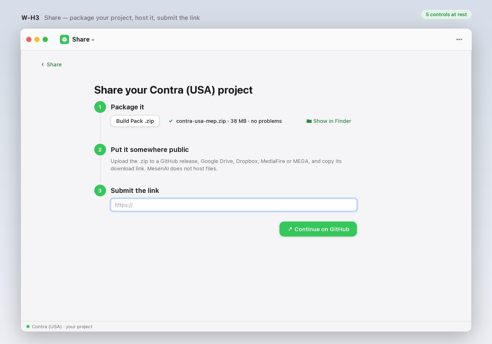

```
┌──────────────────────────────────────────────────────────────────────────────┐
│ [▣ Share ⌄]                                                              [⋯] │
├──────────────────────────────────────────────────────────────────────────────┤
│  ‹ Share                                                                     │
│                                                                              │
│   Share your Contra (USA) project                                            │
│                                                                              │
│   1  Package it            [ Build pack .zip ]                               │
│      ✔ contra-usa-mep.zip · 38 MB · no problems               [Show file]    │
│                                                                              │
│   2  Put it somewhere public                                                 │
│      Upload the .zip to a GitHub release, Google Drive, Dropbox, MediaFire   │
│      or MEGA, and copy its download link. MesenAI does not host files.       │
│      [ Open Google Drive ↗ ]  ⟨then drag the .zip from Finder into it⟩       │
│                                                                              │
│   3  Submit the link        ┌──────────────────────────────────────┐         │
│                             │ https://                             │         │
│                             └──────────────────────────────────────┘         │
│                                              [ Continue on GitHub ↗ ]        │
└──────────────────────────────────────────────────────────────────────────────┘
```

- Step 1 is `mep_build.py pack` as a job (W-R3 card); `mep_lint` must be
  clean or the step shows W-R4.
- Step 2 is the honest gap: MesenAI hosts nothing and uploads nothing
  (Part A §1 principles). The screen says so instead of hiding the step.
  *Open Google Drive ↗* opens `https://drive.google.com/drive/my-drive` in
  the browser, the most common of the accepted hosts; the user drags the
  zip from *Show in Finder* and copies the share link. No credential, no
  API and no upload by the app (user's decision, 2026-10-02: *"meio
  termo"*, instead of a direct Drive upload through OAuth). The click plus
  the ↗ glyph is the confirmation, as for *Continue on GitHub* (rule 7). A
  direct upload stays a later decision, worth an ADR only if a human trial
  (§13.9) shows this step still stops people.
- Step 3 is W-H2 with Game/Console taken from the project.
- Elements: ‹ Share, Build, Show file, Open Google Drive, link field,
  Continue = 6. ✔

**W-H4 — Record and share a replay (unchanged behaviour, new placement)**

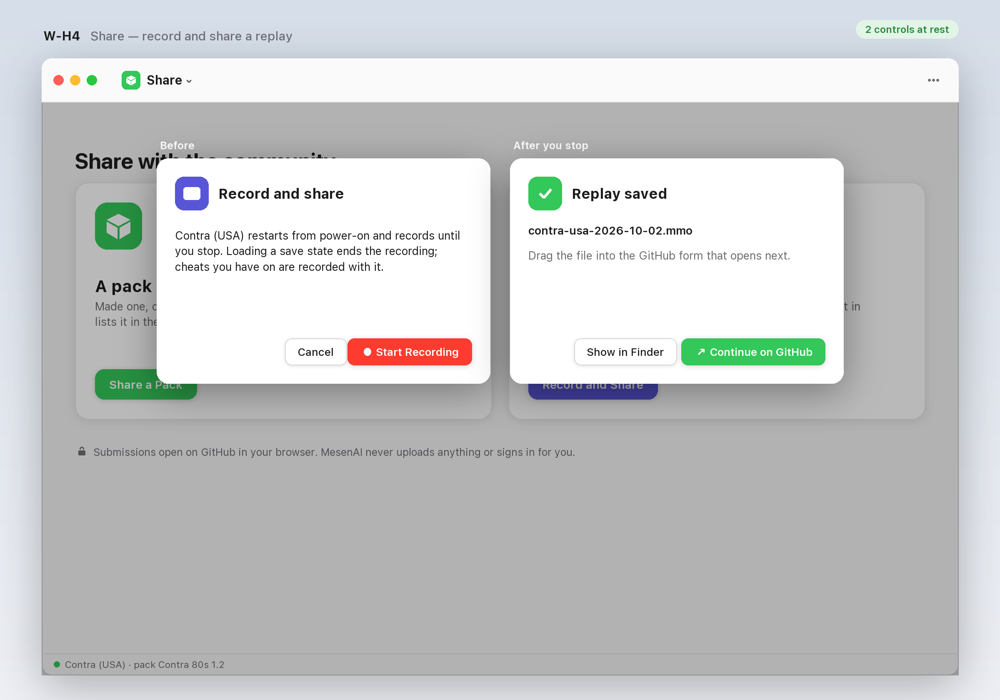

```
                     ┌──────────────────────────────────────────────┐
                     │  Record and share — Contra (USA)             │
                     │                                              │
                     │  The game restarts from power-on and         │
                     │  records until you stop. Loading a save      │
                     │  state ends the recording; cheats you have   │
                     │  on are recorded with it.                    │
                     │                                              │
                     │              [Cancel]   [ ● Start Recording ]│
                     └──────────────────────────────────────────────┘

   while recording, the game fills the window inside Share (as W-R2), one pill:
   ● Recording a replay 02:15 · Esc stops

   on stop:
                     ┌──────────────────────────────────────────────┐
                     │  ✔ Replay saved                              │
                     │  contra-usa-2026-10-02.mmo                   │
                     │  Drag the file into the GitHub form that     │
                     │  opens next.                                 │
                     │                                              │
                     │  [Show file]            [ Continue on GitHub ↗ ] │
                     └──────────────────────────────────────────────┘
```

`ShareRecordingSession` + `ReplayShare` as they are (ADR-0205 §2/§6, R.1).
A console the share settings do not support shows the dialog with Start
disabled and the one-line reason (rule 4). Elements: 2 per sheet. ✔ The PNG
shows the two sheets side by side.

##### 13.5.5 Cross-cutting states

**W-X1 — Confirmations (rule 7), all the same shape, inline where possible**

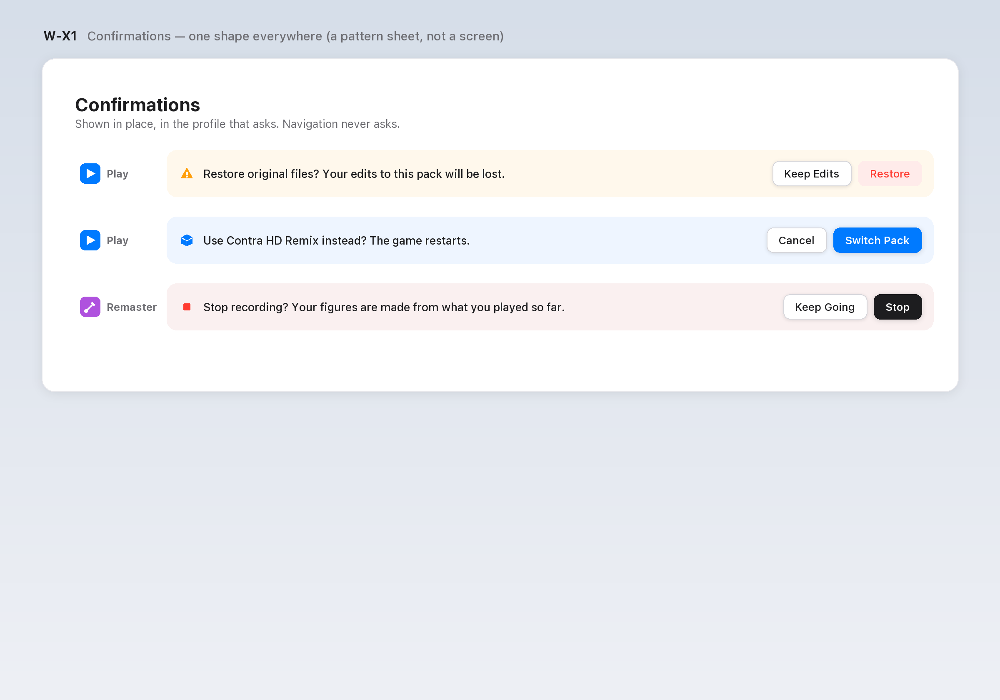

```
   Play      Restore original files? Your edits to this pack will be lost.   [Keep Edits] [Restore]
   Play      Use Contra HD Remix instead? The game restarts.                 [Cancel] [Switch Pack]
   Remaster  Stop recording? Your figures are made from what you played so far. [Keep Going] [Stop]
```

A pattern sheet, not a screen: each example is tagged with the profile it
appears in, and appears only there (rule 11). Switching packs restarts the
game, because textures need a ROM reload (§6.1).

**W-X2 — Errors are sentences with a next step, never codes**

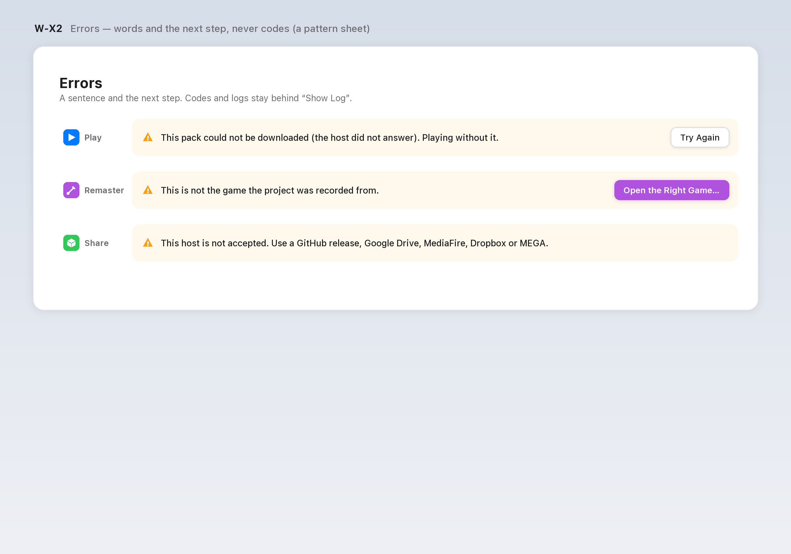

```
   Play      ⚠ This pack could not be downloaded (the host did not answer). Playing without it.  [Try Again]
   Remaster  ⚠ This is not the game the project was recorded from.        [Open the Right Game…]
   Share     ⚠ This host is not accepted. Use a GitHub release, Google Drive, MediaFire, Dropbox or MEGA.
```

Same pattern sheet as W-X1. *Try Again* appears where the user is looking at
the pack (W-P6); the transient HUD pill (W-P9) carries no button. A console
that cannot do something is never an error here — it is a disabled control
with its reason (rule 4).

**W-X3 — Interruptions: quitting or changing game while work runs**

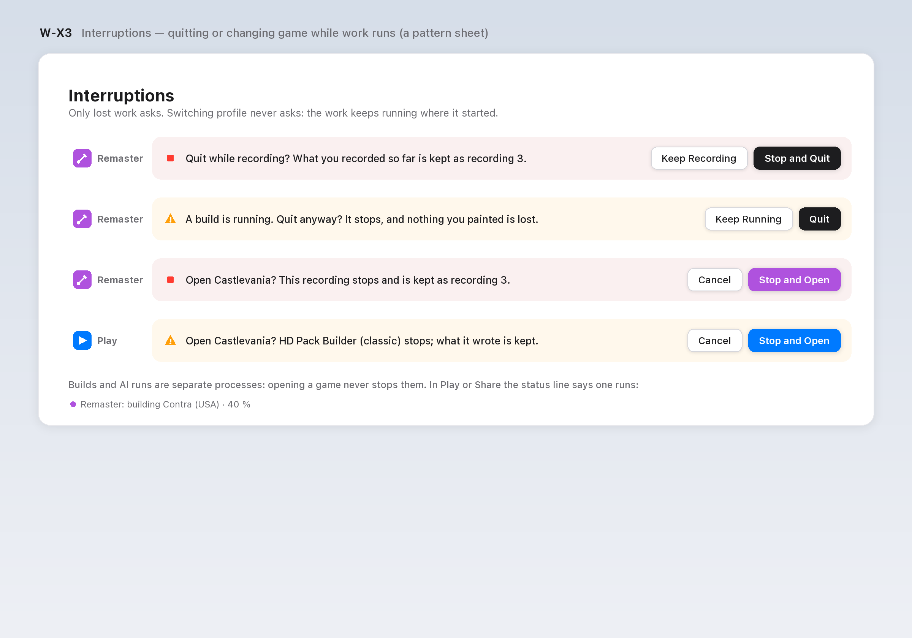

```
   Remaster  ■ Quit while recording? What you recorded so far is kept as recording 3.
                                                            [Keep Recording] [Stop and Quit]
   Remaster  ⚠ A build is running. Quit anyway? It stops, and nothing you painted is lost.
                                                            [Keep Running] [Quit]
   Remaster  ■ Open Castlevania? This recording stops and is kept as recording 3.
                                                            [Cancel] [Stop and Open]
   Play      ⚠ Open Castlevania? HD Pack Builder (classic) stops; what it wrote is kept.
                                                            [Cancel] [Stop and Open]

   Builds and AI runs are separate processes: opening a game never stops them.
   Status line in Play or Share while one runs:  ● Remaster: building Contra (USA) · 40 %
```

Same pattern sheet as W-X1. Only lost work asks; navigation never does
(rule 7).

- **Quit.** Today `MainWindow.OnClosing` closes every window and stops the
  emulator, with no question. A bootstrap recording is cut wherever it is.
  - A recording in progress asks first. The recording is closed cleanly and
    kept as the next `rec-NNN` (ADR-0243 Q1).
  - A job (W-R3: build, kit, AI run) asks once too. The child process is
    stopped; its partial output is discarded, because a job re-runs from
    the project.
  - With nothing running, quitting never asks.
- **Opening another game while recording.** W-R2 fills the window, so this
  only happens from outside: a file dropped on the window, or opened from
  the OS (which lands in Play, §13.6). The recording stops, is kept, and
  the new game opens in Play.
- **HD Pack Builder (classic).** Today `MainWindow` closes it on
  `BeforeGameLoad` without a word, which breaks rule 5. It now asks first,
  in the profile that is showing. The rule is the same for the live
  recorder in Tools ⋯ (ADR-0243 Decision 4).
- **Switching profile** never asks and never stops anything. A job keeps
  running in Remaster, and the other profiles' status line names it (W-S1:
  the status line is read-only). Clicking that line is not a control; the
  user switches with the profile button.

#### 13.6 Transitions

Each profile is its own graph; the only edges between graphs go through the
switcher (W-S3) or a link that names its destination (rule 11).

```
   PLAY        W-P1/W-P2 ──open ROM / Continue──► W-P3 ──Esc──► W-P4
                   ▲                              (W-P9 pill)       │
                   └──────────── Quit game ─────────────────────────┤
                                                 W-P5 / W-P6 / W-P7 / W-P8 ──► W-P10

   REMASTER    W-R0 ──► W-R1 ◄──────────────────────────────┐
                         │ ① Record ──► game view (W-R2) ───┤
                         │ ① Let the AI play ──► W-R8 ──► W-R3 ┘
                         │ ② click tile ──► OS paint program (external)
                         │ ③ Build & show ──► W-R3 ──► game view, or W-R4
                         │ project menu ──► W-R7 · W-R0 folder ──► W-R6
                         └ "Share this project — opens Share" ══╗
                                                                ║ profile switch
   SHARE       W-H1 ──► W-H2 ──► browser                        ║
                 │  └─► Package a Project… ──► W-H3 ◄═══════════╝
                 └────► W-H4 ──► browser

   ANY STATE   [profile ⌄] ──► W-S3 ──► the chosen profile, where it was left
```

- Switching is allowed in any state and never stops the game, a recording or
  a job. Each profile reopens where it was left.
- A ROM opened from the OS while in Remaster/Share switches to Play (W-P3),
  because that is what opening a ROM means — the one silent switch, and the
  title bar shows it.
- A recording or a build running in Remaster keeps running while another
  profile is shown; the title bar's profile button carries a small dot
  (red = recording, tint = job) so the work is not invisible, without
  showing Remaster's controls.

#### 13.7 Decisions this proposal makes, and why

1. **Tasks over expertise.** Sorting by Player/Advanced put the artist in the
   expert bucket and gave the contributor nothing. Sorting by task gives each
   door its own next step.
2. **The classic UI survives untouched, behind one button.** Removing it
   would strand current Mesen users and every debugger-based workflow; hiding
   it costs one click. Nothing in Tools ⋯ is redesigned here.
3. **Remaster is one screen, three zones, in loop order.** Wizards and
   multi-step pipelines were rejected: the artist repeats *Paint → See it*
   dozens of times, and a wizard makes every repeat start over.
4. **No embedded editor.** ADR-0209's constraint, and the right call: GIMP,
   Krita, Aseprite and Photoshop exist. The GUI owns selection and return.
5. **Jobs, not windows.** Every script becomes a progress card in place.
   Terminals are the wall the artist's door currently opens onto.
6. **Honesty on the surface.** `fill`/`seen`, recording provenance and the
   patched-ROM caveat are shown as badges and banners, because ADR-0183 §3
   and ADR-0219 make them part of the deliverable, not footnotes.
7. **Share never uploads.** The project's legal posture (Part A §1) says the
   channel carries links and hashes. The screen states the hosting step
   instead of pretending it away.
8. **Simplicity is enforced by count.** Rule 2's tally is on every wireframe
   so a reviewer can refuse one without arguing taste, and the PNG's caption
   pill repeats it. No wireframe is over: W-P4's 8 became 6 by merging Save
   and Load into one row (user's decision, 2026-10-02).
9. **One profile at a time.** The first draft had three always-visible tabs.
   Review rejected it (2026-10-02): every screen then carried two
   destinations its user did not come for. The title bar names the current
   profile and the switcher holds the others (W-S3, rule 11). The cost is one
   click more to change task, which happens a few times per session; the
   gain is on every screen.
10. **The picture is explained as three layers, in one place.** Art (the
   pack), Pixels (video filters) and Screen (shaders) are named by what they
   change and annotated with where their result goes (captured vs
   display-only), in one tab (W-P10, rule 12). The alternative — a shader in
   Settings, a filter switch in Enhancements and the full list in Options —
   is today's state and the source of the confusion. Combinations the Core
   makes wrong (a scale filter over pack art, NTSC ignored under a pack) are
   disabled with their reason instead of allowed silently.

#### 13.8 Open questions for the review

1. ~~W-P4~~ — merged Save/Load into one *Save states ▸* row (→ 6), 2026-10-02.
2. ~~W-R1 TAS~~ — stays visible in zone ① (2026-10-02).
3. ~~`.ora` in zone ②~~ — no; only in Tools ⋯ while ADR-0220 stop
   condition 2 is open (2026-10-02).
4. ~~`ShowClassicMenuBar` on upgrade~~ — `false`, with a one-time toast
   "your menus are under Tools ⋯" (2026-10-02). Superseded by ADR-0250
   (2026-10-03): the toggle and the toast go; an upgraded Advanced install
   opens in the Classic door, which has the classic menu bar.
5. ~~Remaster gamepad~~ — no; mouse/trackpad (rule 9 stands, 2026-10-02).
6. ~~Remaster consoles~~ — answered by ADR-0243 Decision 5: NES first. On
   GB/SMS *Record* is enabled and the paint zone is disabled with its reason;
   GBA is disabled.
7. ~~W-P10 named looks~~ — yes, two or three, license-compatible;
   ADR-0237's non-goal amended 2026-10-02.
8. ~~W-P10 comparison~~ — *Hold to Compare* (2026-10-02); no split view.
9. ~~Pixels over a pack~~ — Look keeps it disabled with its reason; Tools ⋯
   › Options still lets an advanced user set a scale filter over a pack, as
   today (2026-10-02).
10. ~~W-R8 / ADR-0242~~ — accepted 2026-10-02; slices F14.19 (RAM maps) and
    F14.20 (the recorder), Part A §4, Phase 14.
11. ~~ADR-0243~~ — accepted 2026-10-02; slice F12.20 (Part A Phase 12), delivered 2026-10-02 (Part A §3).
12. ~~ADR-0244~~ — accepted 2026-10-02; slice P.9 (Part A §4, Phase 7).

#### 13.9 Verification this proposal would need

- Rules in `UI/Logic/` (workspace switch, bar visibility, element enablement
  reasons, Issue URL builder, lint-error translation), tested in `UI.Tests`
  host-free; wiring (which card is visible when) in `UI.HeadlessTests`
  (ADR-0150). Pixel baselines stay out of scope.
- The §13.3 tally is a review step, not a test.
- Human trials, one per door, written up in `docs/validation/` with the
  binary hash — a passing headless suite is not product acceptance
  (`docs/roadmap/AGENTS.md`).
